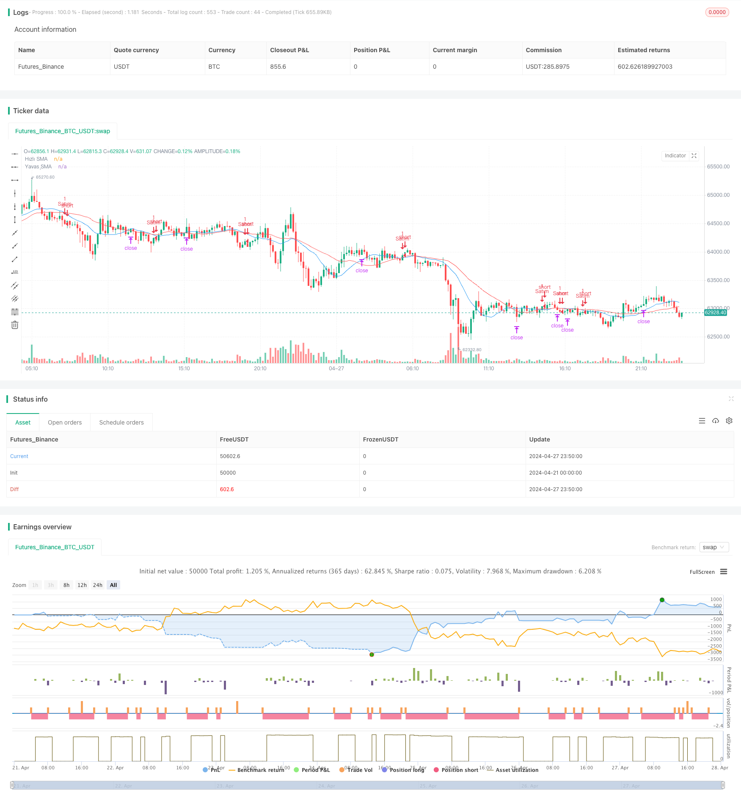

> Name

DCA Dual-Moving-Average-Turtle-Trading-Strategy
> Author

ChaoZhang

> Strategy Description



[trans]
#### Overview
The DCA double moving average turtle trading strategy is a quantitative trading strategy based on double moving average crossover and DCA (Dollar Cost Averaging, fixed cost averaging method). This strategy uses two simple moving averages (SMA) with different periods as buying and selling signals, and also uses the DCA method to reduce buying costs. When the fast SMA crosses above the slow SMA, a buy signal is generated, and vice versa, a sell signal is generated. This strategy aims to capture the mid- to long-term trends of the market and reduce the risks caused by market fluctuations through the DCA method.
#### Strategy Principle
1. Calculate fast SMA and slow SMA.
2. When the fast SMA crosses the slow SMA, a buy signal is generated, and the strategy buys with a fixed amount (DCA amount).
3. When the fast SMA crosses below the slow SMA, a sell signal is generated and the strategy sells all positions.
4. At each DCA interval (such as 14 days), the strategy will buy again with a fixed amount to reduce the cost of holding positions.
5. The strategy uses the DCA method to reduce buying costs, while using SMA crossover to capture market trends.
#### Strategic Advantages
1. Double moving average crossovers can effectively capture the mid- and long-term trends of the market.
2. The DCA method can reduce purchase costs and reduce risks caused by market fluctuations.
3. The strategy logic is simple and easy to implement and optimize.
4. Applicable to most markets and assets, with strong versatility.
#### Strategy Risk
1. When the market is volatile or the trend is unclear, frequent crossovers may lead to too many trading signals and increase transaction costs.
2. Although the DCA method can reduce the purchase cost, it may increase potential losses in a continuously declining market.
3. Strategies rely on historical data and may lose effectiveness when major changes occur in the market.
#### Strategy optimization direction
1. Optimize the SMA cycle parameters and find a parameter combination that is more suitable for specific markets and assets.
2. Introduce other technical indicators, such as RSI, MACD, etc., to assist in judging market trends and signal reliability.
3. Optimize the DCA amount and interval, and adjust DCA parameters according to market characteristics and risk preferences.
4. Add stop-loss and take-profit mechanisms to control the risks and benefits of a single transaction.
#### Summary
The DCA double moving average turtle trading strategy captures market trends through double moving average crossovers and uses the DCA method to reduce buying costs and risks. This strategy has simple logic and wide application range, but in practical application, attention needs to be paid to optimizing parameters and controlling risks. By introducing other technical indicators, optimizing DCA parameters, and adding a stop-loss and take-profit mechanism, the performance and stability of the strategy can be further improved.
|| 

#### Overview
The DCA Dual Moving Average Turtle Trading Strategy is a quantitative trading strategy based on the crossover of two moving averages and Dollar Cost Averaging (DCA). The strategy uses two Simple Moving Averages (SMAs) with different periods as buy and sell signals. When the fast SMA crosses above the slow SMA, a buy signal is generated, and when the fast SMA crosses below the slow SMA, a sell signal is generated. The strategy aims to capture medium to long-term market trends while reducing risks associated with market volatility through the use of DCA.

#### Strategy Principles
1. Calculate the fast SMA and slow SMA.
2. When the fast SMA crosses above the slow SMA, a buy signal is generated, and the strategy buys a fixed amount (DCA amount).
3. When the fast SMA crosses below the slow SMA, a sell signal is generated, and the strategy sells all holdings.
4. At each DCA interval (e.g., 14 days), the strategy buys an additional fixed amount to lower the average holding cost.
5. The strategy reduces the average buying cost through DCA while capturing market trends using SMA crossovers.

#### Strategy Advantages
1. Dual moving average crossovers can effectively capture medium to long-term market trends.
2. The DCA method can lower the average buying cost and reduce risks associated with market volatility.
3. The strategy logic is simple, easy to implement, and optimize.
4. Applicable to most markets and assets, with strong versatility.

#### Strategy Risks
1. During market fluctuations or unclear trends, frequent crossovers may lead to excessive trading signals, increasing trading costs.
2. Although the DCA method can lower the average buying cost, it may increase potential losses in a persistently declining market.
3. The strategy relies on historical data and may lose effectiveness when significant market changes occur.

#### Strategy Optimization Directions
1. Optimize the SMA period parameters to find the most suitable parameter combinations for specific markets and assets.
2. Introduce other technical indicators, such as RSI and MACD, to assist in judging market trends and signal reliability.
3. Optimize the DCA amount and interval based on market characteristics and risk preferences.
4. Incorporate stop-loss and take-profit mechanisms to control risks and returns for individual trades.

#### Summary
The DCA Dual Moving Average Turtle Trading Strategy captures market trends through dual moving average crossovers and reduces buying costs and risks using the DCA method. The strategy is simple, widely applicable, but requires attention to parameter optimization and risk control in practical applications. By introducing other technical indicators, optimizing DCA parameters, and incorporating stop-loss and take-profit mechanisms, the strategy's performance and stability can be further enhanced.
[/trans]

> Strategy Arguments


|Argument|Default|Description|
|----|----|----|
|v_input_1|14|Hızlı SMA Dönemi|
|v_input_2|28|Yavaş SMA Dönemi|
|v_input_3|100|DCA Miktarı|
|v_input_4|14|DCA Aralığı (Gün)|


> Source (PineScript)

``` pinescript
/*backtest
start: 2024-04-21 00:00:00
end: 2024-04-28 00:00:00
period: 10m
basePeriod: 1m
exchanges: [{"eid":"Futures_Binance","currency":"BTC_USDT"}]
*/

// This Pine Script™ code is subject to the terms of the Mozilla Public License 2.0 at https://mozilla.org/MPL/2.0/
// © loggolitasarim

//@version=5
strategy("DCA YSMA HSMA Stratejisi", overlay=true, calc_on_every_tick=true)

// Parametreler
sma_fast = input(14, "Hızlı SMA Dönemi")
sma_slow = input(28, "Yavaş SMA Dönemi")
dca_amount = input(100, "DCA Miktarı")
dca_interval = input(14, "DCA Aralığı (Gün)")

// Hızlı ve yavaş SMA hesaplamaları
fast_sma = ta.sma(close, sma_fast)
slow_sma = ta.sma(close, sma_slow)

// DCA hesaplamaları
var float dca_average_price = na
var int dca_count = na

if (bar_index % dca_interval == 0)
    dca_count := nz(dca_count, 0) + 1
    dca_average_price := nz(dca_average_price, close) * (dca_count - 1) + close
    dca_average_price /= dca_count

// Alım ve satım sinyalleri
longCondition = ta.crossover(fast_sma, slow_sma)
shortCondition = ta.crossunder(fast_sma, slow_sma)

if (longCondition)
    strategy.entry("Alım", strategy.long, qty=dca_amount)
if (shortCondition)
    strategy.entry("Satım", strategy.short)

// Grafik
plot(fast_sma, "Hızlı SMA", color=color.blue)
plot(slow_sma, "Yavaş SMA", color=color.red)

// Uyarılar
alertcondition(longCondition, "Alım Sinyali", "Alım Sinyali")
alertcondition(shortCondition, "Satım Sinyali", "Satım Sinyali")

```

> Detail

https://www.fmz.com/strategy/449814

> Last Modified

2024-04-29 14:26:59
