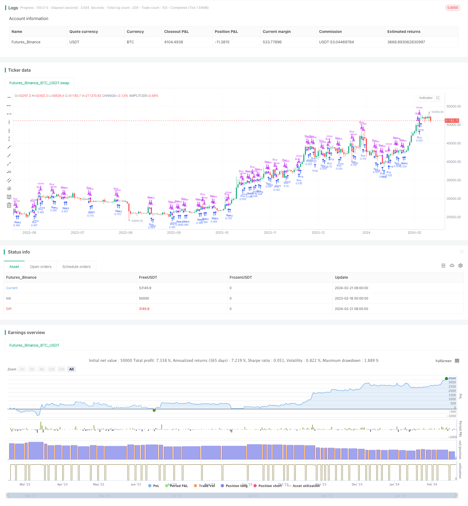

> Name

DCA fixed investment strategy with slippage stop loss DCA-Strategy-with-Trailing-Take-Profit
> Author

ChaoZhang

> Strategy Description


[trans]
#### Overview
The strategy combines Dollar Cost Averaging (DCA) with the Trailing Take Profit feature on the exchange platform. It sets a 1% price deviation for purchases and targets a 0.5% profit on each sale. The rationale for this small profit is to ensure that the trading robot runs smoothly and avoid the risk of getting stuck during slow market periods. According to the backtest results, the robot has proven to be adaptable enough to market fluctuations and manipulations. Although the Annual Percentage Rate (APR) may not be particularly high, it provides a satisfactory and safe long-term investment option that is often better than the traditional buy and hold (HODL) strategy.
#### Strategy Principle
This strategy first sets configurable parameters such as slippage stop loss percentage, maximum number of DCA orders, and price deviation percentage. It then tracks variables such as last buy price, number of buys, initial buy price, and slippage stop price. In terms of buying logic, if the current price is lower than (1 - price deviation percentage) of the last buying price, and the number of buying has not reached the maximum number of DCA orders, a buy signal will be issued and the current buying price will be recorded. In selling logic, if the current price is higher than (1 + take profit percentage) of the last buy price, a slippage stop price will be set. If the price continues to rise and exceeds the slippage stop price, the slippage stop price will be updated to (1 - slippage percentage) of the current price. If the price falls and breaks through the slippage stop price, a sell signal will be issued, and relevant variables will be reset at the same time, preparing to start a new round of DCA buying.
#### Strategic Advantages
1. Combining DCA fixed investment and slippage stop loss, it not only ensures the cost average effect of regular fixed amount buying, but also locks in part of the profit to avoid retracement.
2. The slippage stop-loss mechanism is flexible, and the profit-taking range and slippage ratio can be adjusted according to market conditions to reduce risks.
3. The backtest performance is better than the traditional buy and hold strategy, the annualized rate of return is stable, and it is suitable for long-term investment.
4. Simple implementation, flexible parameter setting, and easy to be applied on mainstream exchange platforms.
#### Strategy Risk
1. The number of DCA purchases is limited. If the market falls for a long time, losses may expand.
2. Improper setting of slippage stop loss may lead to frequent locking of profits or expansion of losses.
3. Transaction costs will have a certain impact on profits. High slippage stop loss settings will increase the number of trades.
4. Sufficient funds are needed to support frequent DCA purchases. Insufficient initial funds may result in insufficient number of purchases.
#### Strategy optimization
1. You can set a floating slippage stop loss, and gradually reduce the slippage when the profit reaches a certain proportion.
2. Combined with the moving average indicators, increase the buying share near the key support level.
3. Add a rebalancing mechanism to adjust the amount of each DCA purchase based on total assets.
4. Optimize parameter settings and test the rate of return under different holding periods.
#### Summarize
This strategy integrates DCA fixed investment and slippage stop loss methods to achieve quantitative trading with long-term stable returns. The backtest performance is good and it is suitable for investors who pursue steady growth. The code is concise and easy to understand and implement. By optimizing parameter settings and combining other indicators, better real-time results can be obtained. Overall, this strategy provides investors with a relatively safe and stable automated quantitative trading solution.
||

#### Overview

This strategy combines Dollar Cost Averaging (DCA) with the trailing take profit feature available on exchange platforms. It sets a 1% price deviation for purchases and targets 0.5% profit on each sale. The rationale for targeting small profits is to ensure smooth operations for the trading bot, avoiding getting stuck during slow market periods. Based on backtesting, this bot has proven to be adaptable enough to withstand market fluctuations and manipulation. While the Annual Percentage Rate (APR) may not be exceptionally high, it offers a satisfactory and secure option for long-term investment, often outperforming the traditional buy and hold (HODL) strategy.  

#### Principles  

The strategy first sets configurable parameters like trailing stop percentage, max DCA orders, price deviation percentage, etc. It then tracks variables like last buy price, number of buys, initial buy price, trailing stop price, etc. On the buy logic, if the current price is below the last buy price * (1 - price deviation percentage) and the number of buys has not reached max DCA orders, it will issue a buy signal and record the buy price. On the sell logic, if the current price is above the last buy price * (1 + take profit percentage), it will set a trailing stop price. If the price continues to rise above that trailing stop price, the trailing stop is updated to current price * (1 - trailing percentage). If the price drops below the trailing stop price, a sell signal is issued while resetting relevant variables, getting ready for the next round of DCA buys.   

#### Advantages

1. Combines DCA and trailing stop loss to ensure cost averaging while locking in partial profits to avoid drawdowns.  

2. Flexible trailing stop mechanism with adjustable profit taking and trailing percentage to minimize risk.

3. Backtested results outperform buying and holding, with steady annualized returns suitable for long-term investments.  

4. Simple to implement with adjustable parameters for easy application across major exchange platforms.

#### Risks 

1. Limited number of DCA buys means losses can compound if market trends down for extended periods.

2. Poor trailing stop loss settings may lead to premature profit taking or runaway losses.  

3. Trading costs can eat into profits. High trailing stop loss settings increase number of trades.

4. Requires sufficient capital to support frequent DCA buys. Insufficient initial capital limits number of buys.

#### Enhancements

1. Implement adaptive trailing stops, lowering trailing percentage as certain profit milestones are reached.  

2. Incorporate moving averages, increasing buy amounts around key support areas.

3. Add rebalancing mechanism to adjust DCA amounts based on total assets.

4. Optimize parameter settings and test profitability across various holding periods.  

#### Conclusion

This strategy combines DCA and trailing stops for steady algorithmic trading returns over long periods. Backtested results are strong and suitable for investors focused on stable growth. Simple and clean code makes it easy to understand and implement. Further performance gains can be achieved through parameter optimization and incorporating additional indicators. Overall it provides investors with a relatively safe and consistent quantified trading solution.

[/trans]

> Strategy Arguments


|Argument|Default|Description|
|----|----|----|
|v_input_float_1|0.6|Take Profit (%)|
|v_input_float_2|0.1|Trailing Stop (%)|
|v_input_int_1|10|Max DCA Orders|
|v_input_float_3|true|Price Deviation (%)|


> Source (PineScript)

``` pinescript
/*backtest
start: 2023-02-16 00:00:00
end: 2024-02-22 00:00:00
period: 1d
basePeriod: 1h
exchanges: [{"eid":"Futures_Binance","currency":"BTC_USDT"}]
*/

// This Pine Script™ code is subject to the terms of the Mozilla Public License 2.0 at https://mozilla.org/MPL/2.0/
// © Stavolt

//@version=5
strategy("DCA Strategy with Trailing Take Profit", overlay=true, initial_capital=1000, default_qty_type=strategy.percent_of_equity, default_qty_value=10)

// Correctly using input to define user-configurable parameters
takeProfitPercent = input.float(0.6, title="Take Profit (%)", minval=0.1, maxval=5)
trailingPercent = input.float(0.1, title="Trailing Stop (%)", minval=0.05, maxval=1)
maxDCAOrders = input.int(10, title="Max DCA Orders", minval=1, maxval=20)
priceDeviationPercent = input.float(1.0, title="Price Deviation (%)", minval=0.5, maxval=5)

var float lastBuyPrice = na
var int buyCount = 0
var float initialBuyPrice = na
var float trailingStopPrice = na

// Strategy logic here...
// Note: The detailed logic for buying and selling based on the DCA strategy
// needs to be tailored to your specific requirements and tested for correctness.

if (buyCount < maxDCAOrders)
    if (na(lastBuyPrice) or close < lastBuyPrice * (1 - priceDeviationPercent / 100))
        strategy.entry("Buy", strategy.long)
        lastBuyPrice := close
        buyCount += 1
        if (na(initialBuyPrice))
            initialBuyPrice := close

if (not na(lastBuyPrice) and close > lastBuyPrice * (1 + takeProfitPercent / 100))
    if (na(trailingStopPrice) or close > trailingStopPrice)
        trailingStopPrice := close * (1 - trailingPercent / 100)
    if (close < trailingStopPrice)
        strategy.close("Buy")
        lastBuyPrice := na
        trailingStopPrice := na
        buyCount := 0
        initialBuyPrice := na

```

> Detail

https://www.fmz.com/strategy/442635

> Last Modified

2024-02-23 14:01:20
