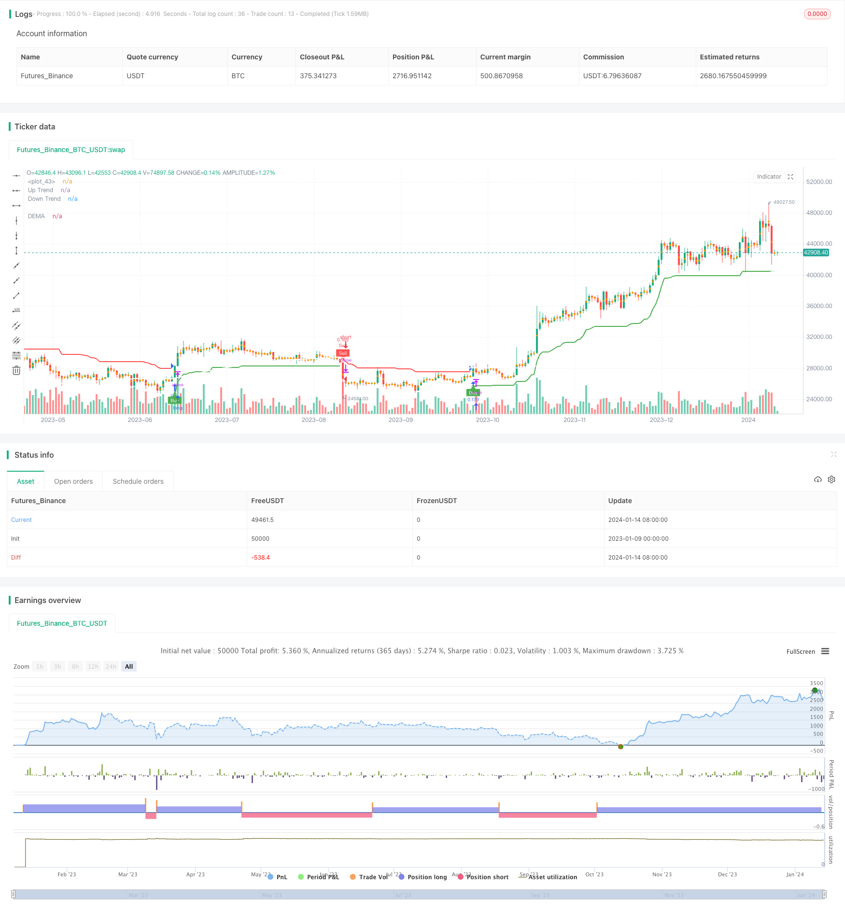

> Name

Super trend indicator DEMA dual trend tracking strategy Dual-Trend-Tracking-Strategy
> Author

ChaoZhang

> Strategy Description


 [trans]

## Overview
The Dual Trend Following Strategy is a composite strategy that combines the Super Trend Indicator, Dual Exponential Moving Average (DEMA) and Bollinger Bands. It aims to take advantage of a variety of technical indicators to capture buy and sell signals in a timely manner when the trend reverses.
## Strategy Principle
The strategy mainly consists of three parts:
1. Super trend indicator: Calculate the upward breakthrough line and downward breakthrough line to determine the current trend direction. A buy signal is generated when the price breaks through the super trend line from bottom to top; a sell signal is generated when the price breaks through from top to bottom.
2. Dual Exponential Moving Average (DEMA): A trend-following indicator that combines the characteristics of a simple moving average and an exponential moving average to respond to price changes more quickly. The 200-day DEMA is set in the strategy to determine the long-term trend direction.
3. Bollinger Bands: Indicates the range of price fluctuations. When Bollinger Bands contract or expand abnormally, it indicates a possible trend reversal.
When both the super trend indicator and DEMA send out buy/sell signals, the corresponding position is entered. In addition, the abnormality of Bollinger Bands can also be used as a signal to assist judgment.
## Strategic Advantages
1. Multi-indicator combination, comprehensive judgment, and reduction of false signals.
2. The super trend indicator is not sensitive to small price changes and only generates signals at trend turning points to avoid too frequent trading.
3. DEMA smoothes the curve and determines long-term trends accurately and reliably.
4. Bollinger Bands assist in determining trend reversal points.
## Risks and Solutions
1. The super trend indicator parameter setting is too sensitive and may produce more noise. ATR period and multiple parameters can be adjusted to achieve optimization. 
2. The DEMA cycle is too long and the ability to follow the trend is poor. Parameters such as shortening to 100 days can be tested.
3. The signals are inconsistent when judging by multiple indicator combinations. At this time, you can follow the super trend indicator as the main signal.
## Optimization direction
1. Test different ATR period and multiple parameter settings to find the best parameters of the super trend indicator.
2. Optimize DEMA cycle parameters.
3. Add other indicators to assist judgment, such as KDJ, MACD, etc.
4. Add a stop loss strategy.
## Summarize
The dual trend tracking strategy is a multi-indicator combination that comprehensively utilizes the advantages of super trends, DEMA and Bollinger Bands to capture trends while improving signal quality. Better strategy effects can be expected through parameter optimization. The addition of a stop-loss mechanism is also a focus of future optimization.
|| 

## Overview 

The Dual Trend Tracking Strategy is a composite strategy combining the Supertrend indicator, Double Exponential Moving Average (DEMA) and Bollinger Bands. It aims to timely capture buy and sell signals when trends reverse by leveraging the advantages of multiple technical indicators.

## Strategy Logic

The strategy consists of three main parts:

1. Supertrend Indicator: Calculates the up breakout line and down breakout line to determine the current trend direction. It generates buy signals when the price breaks out upwards from the supertrend line, and sell signals when the price breaks out downwards.

2. Double Exponential Moving Average (DEMA): A trend tracking indicator that combines the features of simple moving average and exponential moving average, which can respond to price changes faster. The strategy sets a 200-day DEMA to judge the long-term trend direction. 

3. Bollinger Bands: Represents the fluctuation range of prices. Abnormal contraction or expansion of Bollinger Bands signals potential trend reversals.

When the Supertrend indicator and DEMA both issue buy/sell signals, the strategy enters the corresponding position. In addition, anomalies of Bollinger Bands can serve as auxiliary judgment signals.

## Advantages

1. Combination of multiple indicators reduces false signals.

2. Supertrend indicator is insensitive to minor price changes and only generates signals at trend turning points, avoiding excessive frequency of trading.

3. DEMA smooth curve accurately and reliably judges long-term trends. 

4. Bollinger Bands assist in determining trend reversal points.

## Risks and Solutions

1. Overly sensitive supertrend parameters may generate more noise. Optimizing the ATR period and multiplier parameters can improve it.

2. Long DEMA period results in poor trend following capability. Can test shortened periods like 100-day. 

3. Inconsistent signals when combining judgment of multiple indicators. In this case, the supertrend indicator can be considered the primary signal.

## Optimization Directions 

1. Test different ATR periods and multiplier parameters to find the optimal combination for the supertrend indicator.

2. Optimize the DEMA period parameter.

3. Add other auxiliary indicators like KDJ, MACD etc. 

4. Introduce stop loss strategies.

## Summary

The Dual Trend Tracking Strategy combines the strengths of Supertrend, DEMA and Bollinger Bands by using multiple indicators, improving signal quality while capturing trends. Further performance improvements can be expected through parameter optimization and adding stop loss mechanisms.

[/trans]

> Strategy Arguments


|Argument|Default|Description|
|----|----|----|
|v_input_1|12|ATR Period|
|v_input_2_hl2|0|Source: hl2|high|low|open|close|hlc3|hlcc4|ohlc4|
|v_input_3|3|ATR Multiplier|
|v_input_4|true|Change ATR Calculation Method?|
|v_input_5|true|Show Supertrend Indicator?|
|v_input_6|200|DEMA Period|
|v_input_7|true|Show DEMA Indicator?|


> Source (PineScript)

``` pinescript
/*backtest
start: 2023-01-09 00:00:00
end: 2024-01-15 00:00:00
period: 1d
basePeriod: 1h
exchanges: [{"eid":"Futures_Binance","currency":"BTC_USDT"}]
*/

//@version=4
strategy("Supertrend + DEMA + Bollinger Bands", overlay=true, default_qty_type=strategy.percent_of_equity, default_qty_value=10, precision=2)

// Input parameters for Supertrend
atrLength = input(title="ATR Period", type=input.integer, defval=12)
src = input(hl2, title="Source")
multiplier = input(title="ATR Multiplier", type=input.float, step=0.1, defval=3.0)
changeATR = input(title="Change ATR Calculation Method?", type=input.bool, defval=true)
showSupertrend = input(title="Show Supertrend Indicator?", type=input.bool, defval=true)

// Input parameters for DEMA
demaLength = input(200, title="DEMA Period")
showDEMA = input(title="Show DEMA Indicator?", type=input.bool, defval=true)

// Calculate ATR for Supertrend
atr2 = sma(tr, atrLength)
atr = changeATR ? atr(atrLength) : atr2

// Calculate Supertrend
up = src - (multiplier * atr)
up1 = nz(up[1], up)
up := close[1] > up1 ? max(up, up1) : up

dn = src + (multiplier * atr)
dn1 = nz(dn[1], dn)
dn := close[1] < dn1 ? min(dn, dn1) : dn

trend = 1
trend := nz(trend[1], trend)
trend := trend == -1 and close > dn1 ? 1 : trend == 1 and close < up1 ? -1 : trend

// Plot Supertrend
upPlot = plot(showSupertrend ? (trend == 1 ? up : na) : na, title="Up Trend", style=plot.style_linebr, linewidth=2, color=color.new(color.green, 0))
buySignal = trend == 1 and trend[1] == -1
plotshape(buySignal ? up : na, title="UpTrend Begins", location=location.absolute, style=shape.circle, size=size.tiny, color=color.new(color.green, 0))
plotshape(buySignal ? up : na, title="Buy", text="Buy", location=location.absolute, style=shape.labelup, size=size.tiny, color=color.new(color.green, 0), textcolor=color.new(color.white, 0))

dnPlot = plot(showSupertrend ? (trend == 1 ? na : dn) : na, title="Down Trend", style=plot.style_linebr, linewidth=2, color=color.new(color.red, 0))
sellSignal = trend == -1 and trend[1] == 1
plotshape(sellSignal ? dn : na, title="DownTrend Begins", location=location.absolute, style=shape.circle, size=size.tiny, color=color.new(color.red, 0))
plotshape(sellSignal ? dn : na, title="Sell", text="Sell", location=location.absolute, style=shape.labeldown, size=size.tiny, color=color.new(color.red, 0), textcolor=color.new(color.white, 0))

mPlot = plot(ohlc4, title="", style=plot.style_circles, linewidth=0)

longFillColor = (trend == 1 ? color.new(color.green, 80) : color.new(color.white, 0))
shortFillColor = (trend == -1 ? color.new(color.red, 80) : color.new(color.white, 0))

fill(mPlot, upPlot, title="UpTrend Highlighter", color=longFillColor)
fill(mPlot, dnPlot, title="DownTrend Highlighter", color=shortFillColor)

// Alert conditions
alertcondition(buySignal, title="Custom Supertrend Buy", message="Custom Supertrend Buy!")
alertcondition(sellSignal, title="Custom Supertrend Sell", message="Custom Supertrend Sell!")

// Calculate DEMA
ema1 = ema(close, demaLength)
dema = 2 * ema1 - ema(ema1, demaLength)

// Plot DEMA with white color
plot(showDEMA ? dema : na, color=color.new(color.white, 0), title="DEMA", linewidth=2)

// Add push notification on mobile if buy and sell occurred
if (buySignal)
    strategy.entry("Buy", strategy.long)
    strategy.exit("Sell")
    alert("Buy Signal - Supertrend")

if (sellSignal)
    strategy.entry("Sell", strategy.short)
    strategy.exit("Cover")
    alert("Sell Signal - Supertrend")

```

> Detail

https://www.fmz.com/strategy/438938

> Last Modified

2024-01-16 15:03:55
