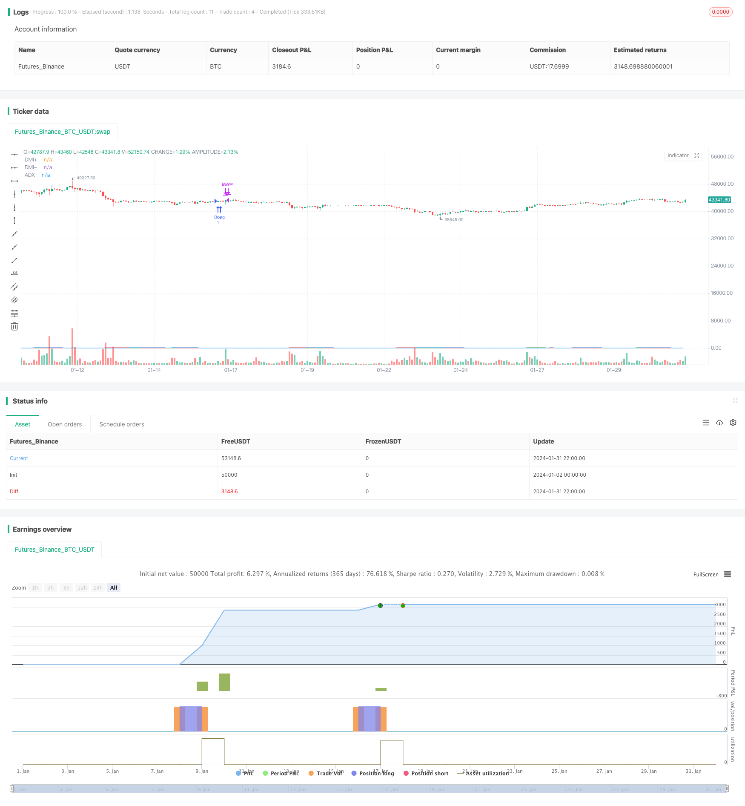

> Name

DMI-Balance-Buy-Sell-Strategy
> Author

ChaoZhang

> Strategy Description


[trans]

## Overview
This strategy is a strategy for generating buy and sell signals based on the long and short indicators of the Movement Index (DMI). It uses the intersection of the two indicators of DMI, DMI+ and DMI-, and the intersection with ADX to determine the long, short and trend of the market, thereby generating buy and sell signals.
## Strategy Principle
This strategy mainly uses three indicators in DMI: DMI+, DMI- and ADX. Among them, DMI+ reflects the power of the long market, DMI- reflects the power of the short market, and ADX reflects the strength of the market trend.
The buy signal of the strategy is: when DMI+ crosses DMI- and crosses ADX, a buy signal is generated, that is, the market is considered to have turned from short to long, and the trend has begun to form.
The sell signal of the strategy is: when DMI+ crosses DMI- or ADX, a sell signal is generated, which means that the bulls' power is weakened and losses should be stopped.
Therefore, this strategy uses the intersection of the DMI long and short indicators to determine the long and short positions and trend changes in the market, and dynamically adjust positions.
## Advantage Analysis
This strategy mainly has the following advantages:
1. Use the DMI indicator to judge long and short positions and trends, which has high reliability and avoids missing the opportunity of the main trend.
2. Combined with ADX to judge the strength of the trend, the turning point of the market can be more accurately judged.
3. Use the cross pattern of the DMI indicator as a trading signal, which is simple, clear and easy to implement.
4. Run according to the trend, better control risks, and suitable for medium and long-term holdings.
## Risk Analysis
There are also some risks with this strategy:
1. There is a lag in the DMI indicator, which may cause the buying point to be later and the selling point to be earlier.
2. The ADX indicator has a mediocre effect in judging trends and consolidation, and may miss short-term opportunities.
3. There is a certain risk of short positions, and the market may continue to rise or fall.
4. There may be a risk of over-optimization in the parameter settings, and the actual operating effect will be discounted.
## Optimization direction
This strategy can also be optimized from the following aspects:
1. Combine with other indicators to judge deviations and improve the accuracy of buying and selling point selection.
2. Add a stop-loss mechanism to avoid the risk of loss expansion.
3. Adjust parameters or introduce adaptive parameter settings to reduce the risk of over-optimization.
4. Add position management and dynamically adjust positions according to trend stages.
## Summarize
This strategy is based on the DMI indicator to determine long and short positions and trends. It is simple and practical, and has good results in capturing the main trends in the medium and long term. However, there are also certain risks of hysteresis, short positions and parameter optimization. It can be optimized through multi-index combinations, stop-loss mechanisms, adaptive parameters and other means to obtain better real-time results.
||

## Overview

This strategy generates buy and sell signals based on the Direction Movement Index (DMI) indicators for trend direction. It utilizes the crossover of DMI's two indicators, DMI+ and DMI-, as well as their crossover with ADX to determine the bullish/bearish state and trend of the market, thereby producing entry and exit signals.

## Strategy Logic

The strategy mainly uses three indicators from DMI: DMI+, DMI- and ADX. DMI+ reflects the strength of an uptrend, DMI- reflects the strength of a downtrend, while ADX reflects the trend intensity.  

The buy signal is triggered when DMI+ crosses over DMI- and also crosses over ADX, indicating a switch from a bearish to bullish state and an emerging trend.

The sell signal is triggered when DMI+ crosses below either DMI- or ADX, indicating weakening bullish momentum and a need to take profit.

Therefore, the strategy dynamically adjusts positions by judging market sentiment and trend changes using the crossover patterns of the DMI indicators.

## Advantage Analysis 

The main advantages of this strategy are:

1. Using DMI for trend and sentiment analysis provides reliability in capturing major trends.

2. Incorporating ADX to gauge trend strength allows more accurate identification of inflection points.

3. The simple, clear crossover signals of DMI indicators make this strategy easy to implement.  

4. Running with the trend provides good risk control, suitable for medium- to long-term holding periods.

## Risk Analysis

Several risks to note:

1. DMI indicators have some lag, which may result in late buys and premature sells.  

2. ADX has mediocre performance in distinguishing between trends and consolidations, thus some short-term opportunities may be missed.

3. There is some risk of holding no positions, in case persistent uptrend or downtrend occurs.  

4. Parameter optimization risks exist, which may lead to deteriorated performance in live trading.

## Improvement Areas

Some ways to improve this strategy:

1. Incorporate other indicators to spot momentum divergence, enhancing accuracy of entries and exits.  

2. Add stop-loss mechanisms to limit loss in adverse moves.

3. Adjust parameters or introduce adaptive settings to mitigate optimization bias.  

4. Implement position sizing to dynamically adjust stakes according to trend stages.

## Conclusion

This DMI trend-following strategy is simple and practical for catching major trends over medium- to long-term horizons. However, lags, empty positions, and parameter optimization risks exist. Enhancements through combining indicators, stop losses, adaptive parameters etc. can improve live performance.

[/trans]

> Strategy Arguments


|Argument|Default|Description|
|----|----|----|
|v_input_1|14|DMI Length|


> Source (PineScript)

``` pinescript
//@version=5
strategy("DMI Buy/Sell Strategy", overlay=true)

// Input for DMI
length = input(14, title="DMI Length")
adxsmoothing =14

// Calculate DMI
[diPlus, diMinus, adx] = ta.dmi(length,adxsmoothing)

// Condition for Buy Entry
buyCondition = ta.crossover(diPlus, diMinus) and ta.crossover(diPlus, adx)

// Condition for Sell Exit
sellCondition = ta.crossunder(diPlus,diMinus) or ta.crossunder(diPlus,adx)

// Execute Buy Entry on the next day's open
if buyCondition
    strategy.entry("Buy", strategy.long)

// Execute Sell Exit on the next day's open
if sellCondition
    strategy.close("Buy")

// Plotting DMI components
plot(diPlus, title="DMI+", color=color.green)
plot(diMinus, title="DMI-", color=color.red)

// Plotting ADX
plot(adx, title="ADX", color=color.blue)

```

> Detail

https://www.fmz.com/strategy/440853

> Last Modified

2024-02-02 17:07:03
