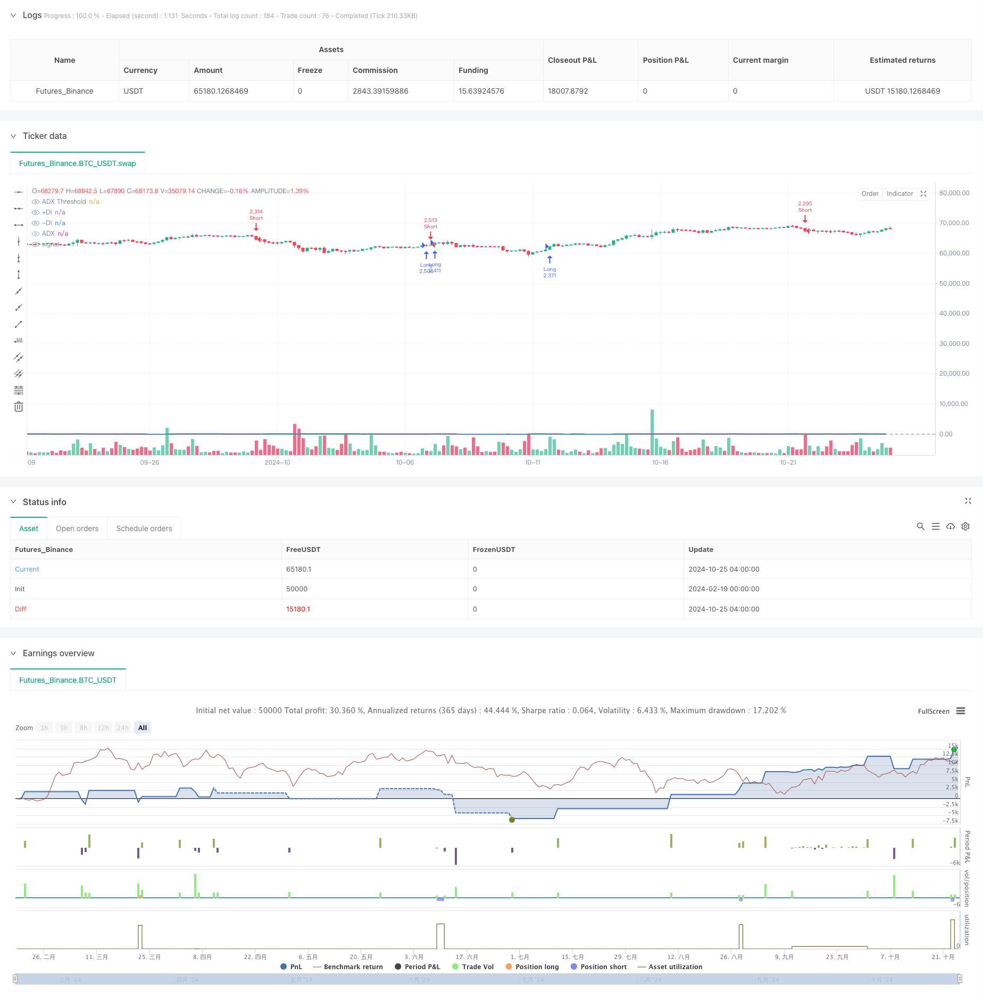

> Name

Momentum Trend Following Indicator DMIADX Crossover Strategy-Momentum-Trend-Following-DMIADX-Crossover-Strategy
> Author

ChaoZhang

> Strategy Description



[trans]
#### Overview
This strategy combines the trend indicators DMI (Directional Momentum Index) and ADX (Average Trend Index) to identify strong market trends and capture trading opportunities. The strategy determines the trend direction through the intersection of DMI's +DI and -DI lines, and uses the ADX indicator to measure the strength of the trend, and only enters the market when the trend is clear. This is a complete trend following trading system, including entry signals, stop loss and take profit and other risk management functions.
#### Strategy Principles
The core logic of the strategy includes the following key elements:
1. Use the +DI and -DI lines in the DMI indicator to determine the trend direction. When +DI crosses above -DI, a long signal is generated, and when +DI crosses below -DI, a short signal is generated.
2. Use the ADX indicator to judge the strength of the trend. The default ADX threshold is set to 25. Trading is only allowed when ADX is greater than the threshold to avoid false signals in a volatile market.
3. Use percentage stop loss and take profit to control risks. The default stop loss is 1% of the entry price and the take profit is 2% of the entry price.
4. The strategy parameters are adjustable, including DMI cycle, ADX cycle and smoothing parameters, ADX threshold, stop loss and take profit percentage, etc.
#### Strategic Advantages
1. Combined with judgment of trend direction and strength, trading signals are more reliable
2. Only trade in strong trends and avoid frequent trading that may shock the market.
3. Complete risk control system with clear stop loss and profit
4. Parameters are flexible and adjustable to adapt to different market environments
5. The strategy logic is clear and simple, easy to understand and implement
6. Suitable for mid- to long-term trend tracking and short-term trading.
#### Strategy Risk
1. A large retracement may occur when the trend reverses
2. DMI and ADX are lagging indicators, and the signals may be relatively lagging.
3. Improper parameter settings may affect strategy performance
4. Continuous stop losses may occur in a volatile market
5. The impact of transaction costs on strategy returns needs to be considered
Countermeasures:
- Optimize parameter settings to balance signal lag and accuracy
- Confirm signals in conjunction with other technical indicators
- Reasonably control position size
- Regular backtesting to verify the effectiveness of the strategy
#### Strategy optimization direction
1. Signal optimization:
- Added trend confirmation indicators, such as moving averages, etc.
- Optimize the dynamic adjustment mechanism of ADX threshold
- Consider adding trading volume indicators as auxiliary judgments
2. Risk control optimization:
- Introduce dynamic stop loss mechanism
- Optimize warehouse management methods
-Add maximum retracement control
3. Parameter optimization:
- Develop adaptive parameter adjustment mechanism
- Set parameter combinations for different market environments
- Optimize stop loss and take profit ratio settings
#### Summary
The DMI+ADX crossover strategy is a classic trend following strategy that combines direction and strength indicators to find trading opportunities in strong trending markets. The strategy logic is clear, risk control is perfect, and it has good practicality and scalability. Through continuous optimization and improvement, strategies can better adapt to different market environments and improve trading results. ||
#### Overview
This strategy combines the DMI (Directional Movement Index) and ADX (Average Directional Index) indicators to identify strong market trends and capture trading opportunities. The strategy uses DMI's +DI and -DI line crossovers to determine trend direction while utilizing the ADX indicator to measure trend strength, only entering trades when trends are clearly established. This is a complete trend following trading system that includes entry signals and risk management features like stop-loss and take-profit levels.

#### Strategy Principles
The core logic includes several key elements:
1. Uses DMI indicator's +DI and -DI lines to judge trend direction, generating long signals when +DI crosses above -DI and short signals when +DI crosses below -DI
2. Uses ADX indicator to assess trend strength, with a default threshold of 25, only allowing trades when ADX exceeds the threshold to avoid false signals in choppy markets
3. Employs percentage-based stop-loss and take-profit levels for risk control, with default settings of 1% stop-loss and 2% take-profit from entry price
4. Strategy parameters are adjustable, including DMI period, ADX period and smoothing parameters, ADX threshold, and stop-loss/take-profit percentages

#### Strategy Advantages
1. Combines trend direction and strength assessment for more reliable trading signals
2. Only trades in strong trends, avoiding frequent trading in choppy markets
3. Complete risk control system with clear stop-loss and take-profit levels
4. Flexible parameters that can adapt to different market conditions
5. Clear and simple strategy logic that's easy to understand and execute
6. Suitable for medium to long-term trend following and short-term trading

#### Strategy Risks
1. Potential for significant drawdowns during trend reversals
2. DMI and ADX are lagging indicators, signals may be relatively delayed
3. Improper parameter settings can affect strategy performance
4. Consecutive stops possible in choppy markets
5. Need to consider impact of trading costs on strategy returns

Mitigation measures:
- Optimize parameter settings to balance signal lag and accuracy
- Combine with other technical indicators for signal confirmation
- Implement proper position sizing
- Regular backtesting to verify strategy effectiveness

#### Strategy Optimization Directions
1. Signal Optimization:
- Add trend confirmation indicators like moving averages
- Optimize dynamic adjustment mechanism for ADX threshold
- Consider incorporating volume indicators for auxiliary judgment

2. Risk Control Optimization:
- Introduce dynamic stop-loss mechanisms
- Optimize position management methods
- Add maximum drawdown controls

3. Parameter Optimization:
- Develop adaptive parameter adjustment mechanisms
- Set parameter combinations for different market environments
- Optimize stop-loss and take-profit ratio settings

#### Summary
The DMI+ADX crossover strategy is a classic trend following strategy that combines directional and strength indicators to find trading opportunities in strong trend markets. The strategy features clear logic, comprehensive risk control, and good practicality and scalability. Through continuous optimization and improvement, the strategy can better adapt to different market environments and enhance trading performance.[/trans]


> Source (PineScript)

``` pinescript
/*backtest
start: 2024-02-19 00:00:00
end: 2024-10-25 08:00:00
period: 4h
basePeriod: 4h
exchanges: [{"eid":"Futures_Binance","currency":"BTC_USDT"}]
*/

//@version=6
strategy("DMI + ADX Strategy", overlay=true, default_qty_type=strategy.percent_of_equity, default_qty_value=250)

// Nastavenie parametrov
adxLength = input.int(14, title="ADX Length")
adxSmoothing = input.int(14, title="ADX Smoothing")
dmiLength = input.int(14, title="DMI Length")
adxThreshold = input.float(25.0, title="ADX Threshold")
stopLossPerc = input.float(1.0, title="Stop Loss (%)")
takeProfitPerc = input.float(2.0, title="Take Profit (%)")

// Výpočet DMI a ADX pomocou ta.dmi
[plusDI, minusDI, adxValue] = ta.dmi(dmiLength, adxSmoothing)

// Nákupné podmienky
longCondition = ta.crossover(plusDI, minusDI) and adxValue > adxThreshold
if (longCondition)
    strategy.entry("Long", strategy.long)

// Predajné podmienky
shortCondition = ta.crossunder(plusDI, minusDI) and adxValue > adxThreshold
if (shortCondition)
    strategy.entry("Short", strategy.short)

// Definovanie Stop a Limit pre Long pozíciu
longStop = strategy.position_avg_price * (1 - stopLossPerc / 100)
longLimit = strategy.position_avg_price * (1 + takeProfitPerc / 100)
if (strategy.position_size > 0)
    strategy.exit("Long Exit", "Long", stop=longStop, limit=longLimit)

// Definovanie Stop a Limit pre Short pozíciu
shortStop = strategy.position_avg_price * (1 + stopLossPerc / 100)
shortLimit = strategy.position_avg_price * (1 - takeProfitPerc / 100)
if (strategy.position_size < 0)
    strategy.exit("Short Exit", "Short", stop=shortStop, limit=shortLimit)

// Vizualizácia indikátorov na grafe
plot(adxValue, title="ADX", color=color.blue)
hline(adxThreshold, "ADX Threshold", color=color.gray)
plot(plusDI, title="+DI", color=color.green)
plot(minusDI, title="-DI", color=color.red)

```

> Detail

https://www.fmz.com/strategy/482424

> Last Modified

2025-02-18 13:47:09
