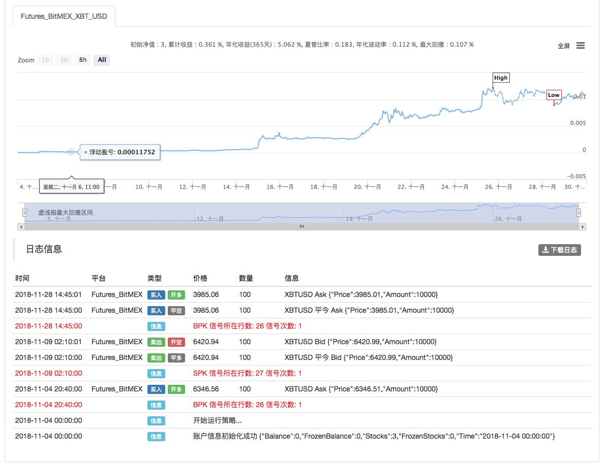
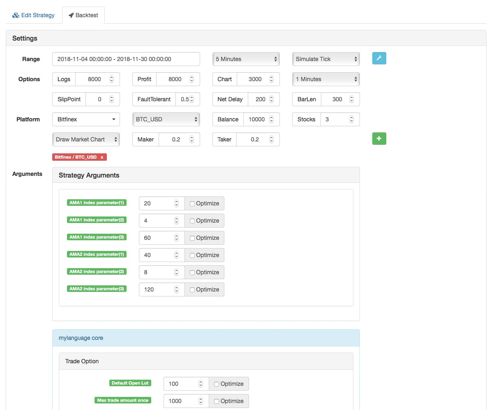
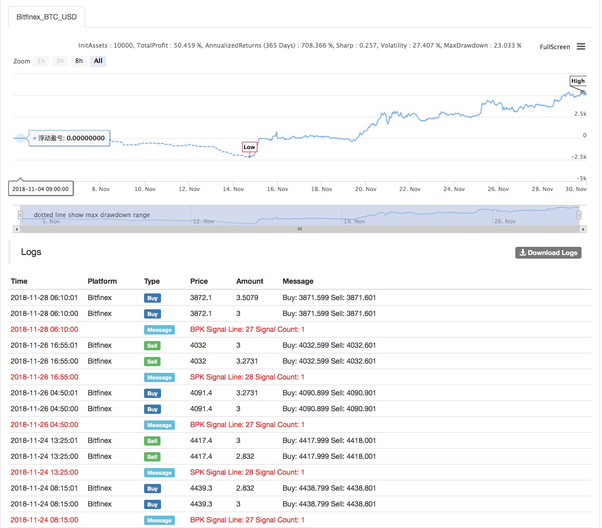

> Name

DMI-and-High-Low-Strategy
> Author

Archimedes' bathtub
> Strategy Description

[trans]
- Strategy name: Movement Index (DMI) and High and Low Points Strategy
- Data cycle: 5M
- Support: commodity futures, digital currency
- Official website: www.quantinfo.com




- Main picture:
  AMA1 indicator, formula: AMA1^^EMA(DMA(CLOSE,CQ1),2);
AMA2 indicator, formula: AMA2^^EMA(DMA(CLOSE,CQ2),2);
||

- Strategy Name: DMI and High-Low Strategy
- Data Cycle: 5M
- Support: Commodity Futures

    
   

- Main chart:
  AMA1 index, formula: AMA1 ^ ^ EMA (DMA (CLOSE, CQ1), 2);
  AMA2 index, formula: AMA2 ^ ^ EMA (DMA (CLOSE, CQ2), 2);

[/trans]

> Strategy Arguments


|Argument|Default|Description|
|----|----|----|
|N|20|AMA1 index parameter(1)|AMA1 index parameter(1)|
|N1|4|AMA1 index parameter(2)|AMA1 index parameter(2)|
|N2|60|AMA1 index parameter(3)|AMA1 index parameter(3)|
|M|40|AMA2 index parameter(1)|AMA2 index parameter(1)|
|M1|8|AMA2 index parameter(2)|AMA2 index parameter(2)|
|M2|120|AMA2 index parameter(3)|AMA2 index parameter(3)|

> Source (MyLanguage)

``` pascal
(*backtest
start: 2018-11-04 00:00:00
end: 2018-11-30 00:00:00
period: 5m
exchanges: [{"eid":"Futures_BitMEX","currency":"XBT_USD"}]
args: [["TradeAmount",100,126961],["ContractType","XBTUSD",126961]]
*)


DIR1:=ABS(CLOSE-REF(CLOSE,N));
VIR1:=SUM(ABS(CLOSE-REF(CLOSE,1)),N);
ER1:=DIR1/VIR1;
CS1:=ER1*(2/(N1+1)-2/(N2+1))+2/(N2+1);
CQ1:=CS1*CS1;
AMA1^^EMA(DMA(CLOSE,CQ1),2);

DIR2:=ABS(CLOSE-REF(CLOSE,M));
VIR2:=SUM(ABS(CLOSE-REF(CLOSE,1)),M);
ER2:=DIR2/VIR2;
CS2:=ER2*(2/(M1+1)-2/(M2+1))+2/(M2+1);
CQ2:=CS2*CS2;
AMA2^^EMA(DMA(CLOSE,CQ2),2);

cq22:CQ2;
aa:DMA(CLOSE,CQ2);

BKVOL=0  AND  REF(AMA1,1)<REF(AMA2,1)  AND  AMA2<AMA1,BPK;
SKVOL=0  AND  REF(AMA1,1)>REF(AMA2,1)  AND  AMA2>AMA1,SPK;
```

> Detail

https://www.fmz.com/strategy/128418

> Last Modified

2019-08-20 10:24:43
