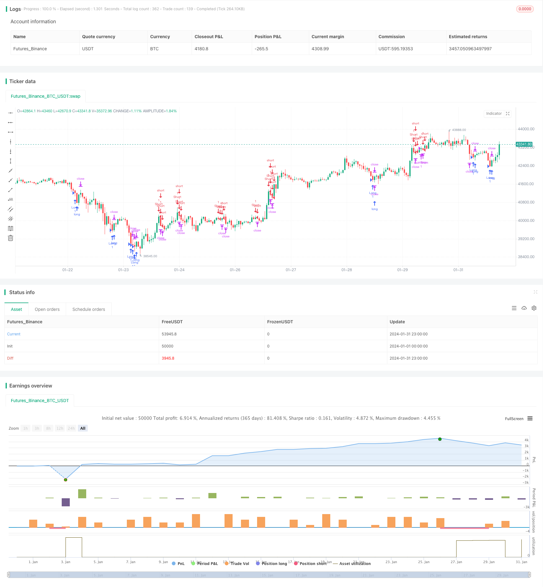

> Name

DYNAMIC-MOMENTUM-OSCILLATOR-TRAILING-STOP-STRATEGY
> Author

ChaoZhang

> Strategy Description


[trans]
### Overview
This strategy comprehensively uses the Bollinger Bands indicator and the stochastic indicator to identify overbought and oversold conditions in the market and find trading opportunities near the upper and lower rails of the Bollinger Bands. At the same time, the average true fluctuation range indicator is used for tracking stop loss. DYNAMIC TRAILING STOP adopts a dynamic stop loss method, which can flexibly adjust the stop loss position according to the market fluctuation range, thereby ensuring the stop loss effect while avoiding being too sensitive to being stopped out.
### Strategy Principles
This strategy uses Bollinger Bands with a length of 20 and a standard deviation of 2 to identify whether the price touches the upper or lower band. Touching the lower band may indicate oversold, while touching the upper band may indicate overbought. In addition, this strategy uses a stochastic indicator with a K-line period of 14 and a D value smoothing period of 3 to determine overbought and oversold. When the closing price is lower than the upper Bollinger Band and the K value of the stochastic indicator is lower than 20, it means oversold and long; when the closing price is higher than the upper Bollinger Band and the K value of the stochastic indicator is higher than 80, it means overbought and short.
After entering the market, this strategy uses the average true range indicator to trail the stop loss. The stop loss point is 1.5 times the average true fluctuation range. The stop loss range can be set according to the degree of market volatility to avoid the stop loss point being too close or too loose.
### Advantage Analysis
This strategy has the following advantages:
1. Comprehensive use of Bollinger Bands and stochastic indicators to determine overbought and oversold conditions to improve the accuracy of determining trading timing.
2. Dynamically adjust the stop loss point and set a reasonable stop loss distance according to the degree of market fluctuations.
3. The trailing stop loss method prevents the stop loss from being too close and avoids being stopped too easily.
4. The policy rules are clear and simple, easy to understand and implement
### Risk Analysis
This strategy also has some risks:
1. The upper and lower rails of the Bollinger Bands cannot be 100% certain of price reversal. There may be a situation where the price breaks through and continues to run.
2. Improper setting of stochastic indicator parameters may result in erroneous signals.
3. Stopping tracking may cause the stop loss distance to be too large and exceed the reasonable fluctuation range of the market.
4. AddDynamic trailing stop may be better, fine-tuning the stop loss distance according to market fluctuations
### Optimization direction
This strategy can also be optimized from the following directions:
1. Test the impact of different Bollinger Band parameters on the results and find the best parameter combination
2. Test different random indicator parameters to improve indicator effects
3. Dynamically adjust the stop loss distance based on the number of times the stop loss is triggered and the profit situation.
4. Combine with other indicators to filter entry signals and improve operation success rate
5. Add a stop-loss re-entry mechanism to fully capture market trend opportunities
### Summarize
This strategy is based on Bollinger Bands to identify overbought and oversold conditions, and stochastic indicators provide auxiliary confirmation. It has the advantages of clear strategy rules and reasonable and flexible stop loss methods. At the same time, there are also risks such as inaccurate judgment standards and unreasonable stop loss distance settings. Strategy performance can be further enhanced through parameter optimization, adding signal filtering, and dynamically adjusting stop losses.
||

### Overview

This strategy combines Bollinger Bands and Stochastic oscillator to identify overbought and oversold opportunities in the market. It aims to capitalize on price rebounds from the extremes defined by Bollinger Bands, with confirmation from Stochastic to maximize the probability of successful operations. DYNAMIC TRAILING STOP adopts dynamic stop loss methodology to flexibly adjust stop loss position based on market volatility, ensuring stop loss effect while avoiding being stopped out too easily.

### Strategy Logic  

The strategy uses 20-period, 2 standard deviation Bollinger Bands to identify if price touches or breaks through the upper or lower band. Touching the lower band indicates a possible oversold condition while breaking through the upper band overbought. In addition, a Stochastic oscillator with K line cycle of 14 and D value smoothing cycle of 3 determines overbought and oversold. When close price is below the Bollinger lower band and Stochastic K value is below 20, it signals oversold for long entry. When close goes above the Bollinger upper band and Stochastic K is above 80, it signals overbought for short entry.

After entry, the strategy uses Average True Range indicator for trailing stop loss. The stop loss point is set at 1.5 times of ATR, which could define stop loss range based on market volatility, avoiding too tight or too loose stop loss.

### Advantage Analysis 

The strategy has the following advantages:

1. Combining Bollinger Bands and Stochastic oscillator to determine overbought/oversold provides higher accuracy in capturing trading opportunities.  

2. Dynamic adjustment of stop loss points based on market volatility results in reasonable stop distance.

3. Trailing stop loss mechanism prevents stop distance from being too close to avoid premature stop out.  

4. Simple and clear strategy rules make it easy to understand and execute.

### Risk Analysis

There are some risks in this strategy:

1. Bollinger Bands upper/lower band cannot guarantee price reversal, there could be breakout continuation.  

2. Improper parameter tuning of Stochastic may generate inaccurate signals.

3. Stop trailing might lead to too wide stop loss exceeding reasonable market fluctuation.  

4. A dynamic trailing stop may work better with micro-adjustments of stop distance based on market volatility.

### Optimization Directions   

The strategy can be further optimized in the following aspects:

1. Test impact of different Bollinger parameters to find optimal parameter combination.

2. Test different Stochastic parameters to improve indicator performance.   

3. Dynamically adjust stop distance based on stop loss trigger times and profitability.  

4. Add other indicators to filter entry signals and improve success rate.

5. Add stop loss re-entry mechanism to fully capture market trends.  

### Conclusion

The strategy identifies overbought/oversold based on Bollinger Bands, with confirmation from the Stochastic indicator. It has the advantage of clear rules and flexible trailing stop loss. It also has risks like inaccurate judgement criteria and improper stop distance configuration. Performance can be further improved through parameter optimization, additional signal filtering, dynamic adjustment of stop loss etc.

[/trans]

> Strategy Arguments


|Argument|Default|Description|
|----|----|----|
|v_input_1|20|Longitud BB|
|v_input_2|2|Desviación Estándar BB|
|v_input_3|14|Longitud K Estocástico|
|v_input_4|3|Longitud D Estocástico|
|v_input_5|3|Suavizado Estocástico|
|v_input_6|14|Longitud ATR|
|v_input_7|1.5|Multiplicador ATR para Trailing Stop|


> Source (PineScript)

``` pinescript
/*backtest
start: 2024-01-01 00:00:00
end: 2024-01-31 23:59:59
period: 1h
basePeriod: 15m
exchanges: [{"eid":"Futures_Binance","currency":"BTC_USDT"}]
*/

//@version=5
strategy("Bollinger y Estocástico con Trailing Stop", overlay=true)

// Parámetros de entrada
lengthBB = input(20, title="Longitud BB")
stdDevBB = input(2, title="Desviación Estándar BB")
kLength = input(14, title="Longitud K Estocástico")
dLength = input(3, title="Longitud D Estocástico")
smooth = input(3, title="Suavizado Estocástico")
atrLength = input(14, title="Longitud ATR")
trailStopATRMultiple = input(1.5, title="Multiplicador ATR para Trailing Stop")

// Cálculos
[upperBB, basisBB, lowerBB] = ta.bb(close, lengthBB, stdDevBB)
stochK = ta.sma(ta.stoch(close, high, low, kLength), smooth)
atr = ta.atr(atrLength)

// Condiciones de trading
longCondition = close < lowerBB and stochK < 20
shortCondition = close > upperBB and stochK > 80

// Ejecutar operaciones
if (longCondition)
    strategy.entry("Long", strategy.long)
if (shortCondition)
    strategy.entry("Short", strategy.short)

// Trailing Stop
strategy.exit("Exit Long", from_entry="Long", trail_points=atr * trailStopATRMultiple, trail_offset=atr * trailStopATRMultiple)
strategy.exit("Exit Short", from_entry="Short", trail_points=atr * trailStopATRMultiple, trail_offset=atr * trailStopATRMultiple)

```

> Detail

https://www.fmz.com/strategy/442115

> Last Modified

2024-02-19 14:39:51
