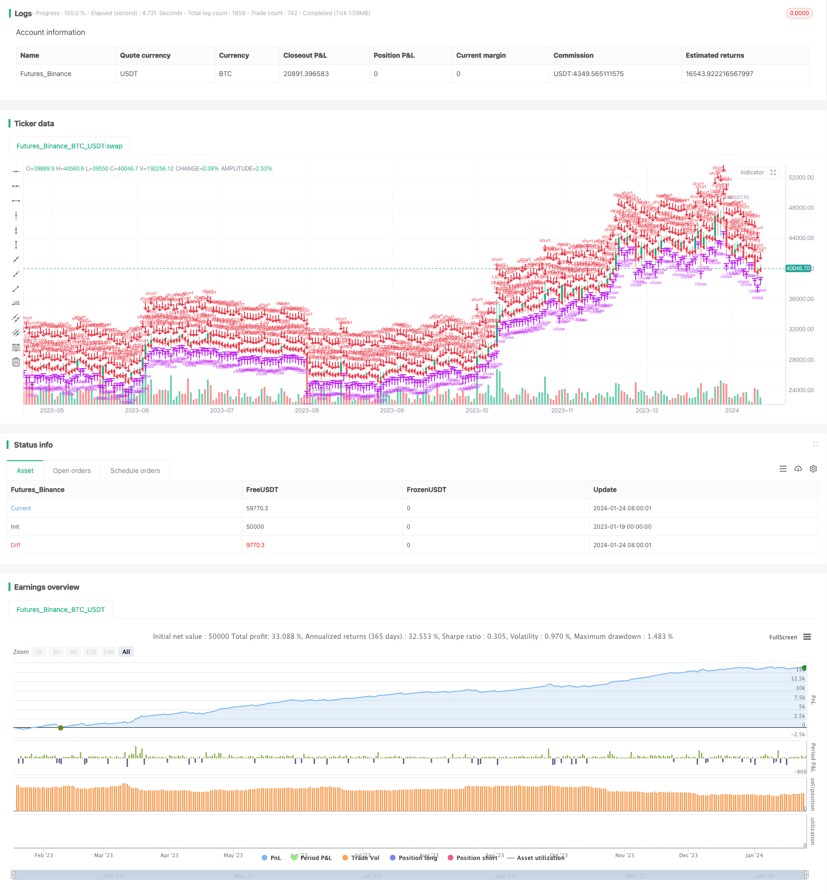

> Name

Daily-Open-Reversal-Strategy
> Author

ChaoZhang

> Strategy Description


 [trans]
### Overview
The Daily Open Reversal Strategy is an intraday trading strategy based on mean reversal. It determines the reversal opportunity of the current K line based on the physical size of the previous K line. If there is a clear gap between the opening price of the current K line and the previous K line, and the size of the entity exceeds the range set by the parameters, then a long or short trading signal will be triggered.
The best trading varieties for this strategy are the daily charts of GBP and AUD, but it can also be tested and optimized on other varieties and time periods. Strategy parameters include start and end dates, previous K-line entity size, stop loss level and take profit level.
### Strategy Principles
The core logic of the intraday opening reversal strategy is to capture short-term overbought and oversold phenomena. When the market experiences excessive market conditions, prices tend to rebound and pull back. This strategy takes advantage of this mean reversal characteristic to profit.
Specifically, the strategy will determine whether there is an obvious price gap between the opening price of the current K line and the closing price of the previous K line. If it satisfies the realbody (previous K-line) > parameter setting range, and the current K-line is a gap opening, then a buy or sell signal will be generated. The triggering condition for the long signal is that the opening price rises beyond the range compared with the closing price of the previous K line and forms a falling gap; the triggering condition for the short signal is that the opening price falls beyond the range compared with the closing price of the previous K line and forms a rising gap.
After entering a position, the strategy will set stop loss and take profit levels. As long as the price reaches the stop loss level, the position will be exited to control losses; if the price reaches the stop profit level, the position will be exited to lock in profits.
### Advantage Analysis
The intraday opening reversal strategy has the following advantages:
1. Capture short-term market reversals and enhance profit probability
This strategy makes full use of the short-term reversal characteristics of prices, opening positions when overbought and oversold phenomena occur, and increasing the probability of profit.
2. Risks are controllable, and the stop-loss mechanism effectively controls losses.
The strategy sets a stop loss position, and the position will be exited as long as the loss reaches the preset maximum value. This can effectively limit the risk of loss in trading.
3. Suitable for a variety of varieties and highly flexible
The strategy is suitable for a variety of foreign exchange varieties, especially currencies such as British Pound and Australian Dollar that are volatile. At the same time, parameters can be adjusted and optimized, providing high flexibility.
4. Simple and easy to implement, suitable for day trading
This strategy focuses on intraday operations and has the characteristics of high transaction frequency and short time span. The rules are simple and clear, and are very suitable for short-term intraday trading.
### Risk Analysis
The intraday opening reversal strategy also has certain risks, mainly reflected in:
1. The continuation of the market may lead to losses
The market may have a unilateral trend with strong continuity. At this time, the reversal signal will cause wrong transactions. If the reversal is unsuccessful, you will face the risk of loss.
2. Frequent transactions increase transaction fees
Intraday short-term strategies will increase the number of transactions. Increased transaction fees will also offset some of the profits.
3. Parameter settings require testing and optimization
Parameters such as the size of the previous K-line entity and stop-loss and take-profit levels are key influencing factors and need to be fully tested to achieve the best parameter combination.
4. The position holding period is short and requires timely monitoring.
Since it is an intraday strategy, the position holding time is very short. The market needs to be monitored in real time for timely entry and stop loss.
### Optimization direction
The intraday opening reversal strategy can be optimized from the following aspects:
1. Optimize parameters and find the best parameter combination
Through backtesting and simulated trading, you can test different previous K-line entity sizes, stop loss levels, and take profit level parameters to find the optimal parameters to improve strategy efficiency.
2. Combine multiple time periods for analysis
The direction of the trend can be determined in a higher time period to avoid counter-trend trading. Specific buying and selling points can also be optimized at a lower time period.
3. Optimize the stop loss mechanism
The stop-loss strategy can be improved by combining volatility indicators to stop losses promptly when the market fluctuates abnormally. Or trailing stop gradually tracking stop loss, etc.
4. Add filter conditions
Add filters such as volume, volatility, etc. to ensure you only trade when sufficient signs of a reversal occur. Avoid unnecessary reversal trades.
5. Enhance position management
Optimize the number and proportion of positions to prevent excessive single losses. At the same time, try the strategy of gradual entry and gradual exit to reduce risks.

### Summarize
The intraday opening reversal strategy is a typical short-term mean reversal strategy. It captures overbought and oversold conditions in price and trades in the opposite direction. It has the advantages of controllable risk, simplicity and ease of implementation. But you also need to pay attention to the risks of market continuation and frequent trading. Strategy stability and profitability can be further improved through parameter optimization, stop loss optimization, filtering conditions, and position management. It is suitable for investors who like day trading.
||

### Overview  

The Daily Open Reversal Strategy is an intraday mean-reversion strategy based on the real body size of the previous candlestick to determine reversal opportunities in the current candlestick. It will trigger long or short trade signals if there is a significant gap between the open price of the current candlestick and the close price of the previous one, provided the real body size exceeds the threshold set in the parameters.

The best trading assets for this strategy are GBP and AUD daily charts, but other assets and timeframes can also be tested. The parameters include start and end dates, real body size of the previous candle, stop loss (in pips), and take profit (in pips).

### Strategy Logic

The core logic behind Daily Open Reversal Strategy is to capture short-term overbought and oversold scenarios. Prices tend to retrace and correct after excessive movements in the market. This strategy aims to capitalize on such mean reversion tendency for profits.  

Specifically, the strategy checks if there is a significant gap between the open price of the current candlestick and the close price of the previous one. If the real body size of the previous candle exceeds the threshold set in parameters, and the current candle shows an opening gap, long or short signals will be triggered. The long signal triggers when open > previous close with a down gap. The short signal triggers when open < previous close with an up gap.
  
Once entered into a position, stop loss and take profit levels are set. The position will be closed if hitting the stop loss level to control losses or take profit level to lock in gains.


### Advantage Analysis   

The Daily Open Reversal Strategy has the following key advantages:

1. Capture market short-term reversals, higher profitability

   It takes full advantage of short-term price reversals, opening positions after overbought/oversold scenarios for higher chance of gains.
   
2. Controllable risk, effective stop loss to limit losses

   The stop loss mechanism can effectively limit trading losses once they hit the preset maximum value.
   
3. Flexibility across assets  

   It is applicable to various FX pairs, especially those volatile ones like GBP and AUD. Parameters can also be adjusted for optimization flexibility.
   
4. Simplicity, suits intraday trading   

   With high trading frequency and short timeframe, it has simple and clear rules that fit intraday or day trading very well.


### Risk Analysis

There are also some inherent risks in Daily Open Reversal Strategy:

1. Trend continuation risks losses
    
   Persistent one-sided trends increase the chance of failed reversals and thus losses.

2. Higher trading costs
   
   Increased number of trades can eat up gains due to more trading costs.

3. Parameter optimization needed
    
   Parameters like previous candle real body size, stop loss and take profit levels require sufficient optimization for best results.

4. Close monitoring required

   The short holding period requires close tracking of the markets for timely entries and stop losses.


### Optimization Directions  

The Daily Open Reversal Strategy can be optimized in the following aspects:

1. Optimize parameters for best combination

   Run backtests and demo trading to determine the optimal previous candle real body size, stop loss level, take profit level for higher efficiency.

2. Incorporate multiple time frame analysis

   Establish overall trend direction in higher timeframes to avoid counter-trend trades. Optimize specific entry and exit levels in lower timeframes.
   
3. Enhance stop loss mechanisms 

   Employ volatility indicators to improve stop loss strategy for better protection in volatile markets, or trailing stop order etc.

4. Add filters 
    
   Add filters like volume, volatility to ensure reversal signals are reliable enough to trade. Avoid unnecessary reverse trades.  

5. Improve position sizing

   Optimize trade size and allocation to prevent oversized position leading to large losses. Experiment with gradual entries and exits to reduce risks.


### Conclusion   

The Daily Open Reversal is a typical short-term mean-reverting strategy that captures overbought and oversold scenarios for reverse trading. It has the advantage of controllable risks and simplicity. But trend continuation risk and high trading frequency should be noted. Further improvements can be made through parameter optimization, stop loss enhancement, adding filters and position sizing to boost its stability and profitability. It suits investors who prefer intraday trading.

[/trans]

> Strategy Arguments


|Argument|Default|Description|
|----|----|----|
|v_input_1|0.01|Previous Candle Range|
|v_input_2|200|Take Profit in pips|
|v_input_3|1000|Stop Loss in pips|
|v_input_4|true|Start Date|
|v_input_5|true|Start Month|
|v_input_6|2015|Start Year|
|v_input_7|31|End Date|
|v_input_8|12|End Month|
|v_input_9|2020|End Year|


> Source (PineScript)

``` pinescript
/*backtest
start: 2023-01-19 00:00:00
end: 2024-01-25 00:00:00
period: 1d
basePeriod: 1h
exchanges: [{"eid":"Futures_Binance","currency":"BTC_USDT"}]
*/

// This source code is subject to the terms of the Mozilla Public License 2.0 at https://mozilla.org/MPL/2.0/
// @version=4
strategy("Daily Open Strategy", overlay=true, default_qty_type = strategy.percent_of_equity, default_qty_value = 100, initial_capital = 10000)

PrevRange = input(0.0100, type=input.float, title="Previous Candle Range")
TP = input(200, title="Take Profit in pips")
SL = input(1000, title="Stop Loss in pips")

startDate = input(title="Start Date", type=input.integer,
     defval=1, minval=1, maxval=31)
startMonth = input(title="Start Month", type=input.integer,
     defval=1, minval=1, maxval=12)
startYear = input(title="Start Year", type=input.integer,
     defval=2015, minval=1800, maxval=2100)

endDate = input(title="End Date", type=input.integer,
     defval=31, minval=1, maxval=31)
endMonth = input(title="End Month", type=input.integer,
     defval=12, minval=1, maxval=12)
endYear = input(title="End Year", type=input.integer,
     defval=2020, minval=1800, maxval=2100)


isLong = strategy.position_size > 0
isShort = strategy.position_size < 0

longTrigger = (open-close) > PrevRange and close<open 
shortTrigger = (close-open) > PrevRange and close>open

inDateRange = true


strategy.entry(id = "Long", long = true, when = (longTrigger and not isShort and inDateRange))
strategy.exit("Exit Long", "Long", loss=SL, profit=TP) 

strategy.entry(id = "Short", long = false, when = (shortTrigger and not isLong and inDateRange))
strategy.exit("Exit Short", "Short", loss=SL, profit=TP)

```

> Detail

https://www.fmz.com/strategy/440076

> Last Modified

2024-01-26 14:35:22
