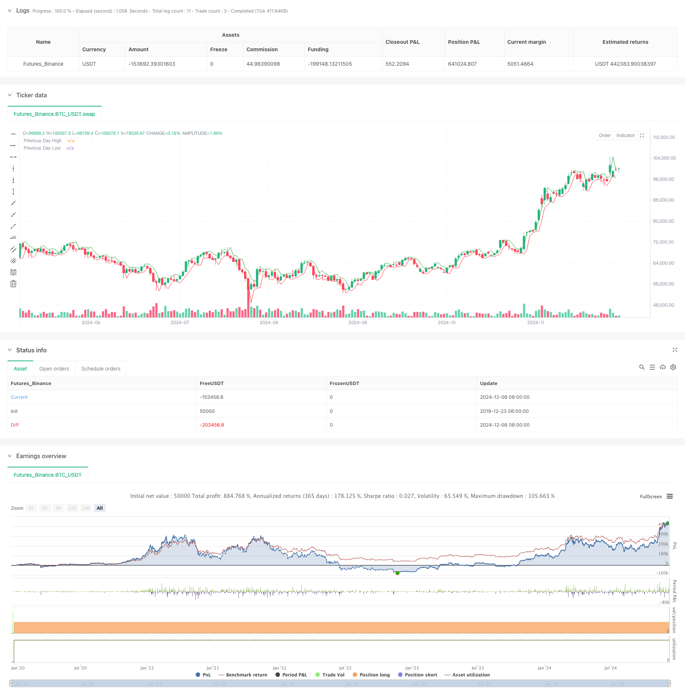

> Name

Daily-Range-Breakout-Single-Direction-Trading-Strategy
> Author

ChaoZhang

> Strategy Description



[trans]
#### Overview
This is a range breakout trading strategy based on the previous day's high and low. The strategy looks for trading opportunities by identifying price breaks above or below the previous day's high or low, executing only one trade per direction. The strategy uses a fixed 50-point take-profit and stop-loss setting, and resets the trading mark at the beginning of each trading day to ensure orderly trading. The core of this strategy is to capture one-way breakthroughs in intraday prices and control risks through strict transaction management.
#### Strategy Principle
The core logic of the strategy includes the following aspects:
1. Trading signal generation: The system determines the trading direction by judging whether the current closing price breaks through the high or low of the previous trading day. When the price closes above the previous day's high, the system will send a long signal; when the price closes below the previous day's low, the system will send a short signal.
2. Transaction frequency control: The strategy uses flags to ensure that only one transaction is executed per day in each direction. This design can avoid repeated transactions in the same price area and reduce transaction costs.
3. Risk management: Each transaction is set with a fixed 50-point stop-profit and stop-loss. This symmetrical risk management method can effectively control the risk of a single transaction.
4. Intraday reset mechanism: At the beginning of each trading day, the system will reset the trading mark to prepare for the new trading day. This mechanism ensures that the strategy can capture new trading opportunities.
#### Strategic Advantages
1. Clear trading logic: The strategy is based on a simple price breakthrough theory, and the trading rules are clear and easy to understand and execute.
2. Strict risk control: Through fixed stop-profit and stop-loss points and one-way transaction limits, the risk of each transaction is effectively controlled.
3. Avoid excessive trading: Only one transaction is allowed per day in each direction, which can avoid losses caused by frequent trading in volatile markets.
4. High degree of automation: The strategy can be fully automated and does not require manual intervention.
5. Strong adaptability: The strategy can be applied to different market environments, especially in markets with obvious trends, which perform better.
#### Risk Analysis
1. False breakthrough risk: The market may have a false breakthrough, resulting in trading losses. It is recommended to confirm with other technical indicators.
2. Risk of volatile markets: In a volatile market, frequent breakthroughs and falls may lead to continuous stop losses. This can be improved by adding filter conditions.
3. Fixed stop loss risk: Fixed stop loss points may not be suitable for all market environments, and may stop loss too early in volatile markets.
4. Slippage risk: When the market fluctuates violently, the actual stop loss point may deviate from expectations due to slippage.
#### Optimization direction
1. Dynamic stop-loss setting: The stop-profit and stop-loss points can be dynamically adjusted according to market volatility (such as ATR indicator).
2. Add trend filtering: Combine with trend indicators (such as moving average or ADX) to filter trading signals.
3. Optimize breakthrough confirmation: Volume confirmation or other technical indicators can be added to improve the reliability of breakthroughs.
4. Time filtering: You can add time filtering conditions to avoid trading during periods of large fluctuations.
5. Position management optimization: Position sizes can be dynamically adjusted based on market volatility and account risk tolerance.
#### Summary
This strategy is a classic trading system based on daily range breakthroughs. Through strict transaction management and risk control, it is suitable for tracking the unidirectional trend of the market. Although there are some inherent risks, the stability and profitability of the strategy can be improved through reasonable optimization and improvement. The key to the success of the strategy lies in correctly handling the risk of false breakthroughs, reasonably setting take-profit and stop-loss, and maintaining the adaptability of the strategy in different market environments. ||
#### Overview
This is a range breakout trading strategy based on the previous day's high and low points. The strategy seeks trading opportunities by identifying price breakouts or breakdowns beyond the previous day's high or low points, executing only one trade per breakout or breakdown direction. The strategy employs fixed 50-point take-profit and stop-loss settings and resets trade flags at the beginning of each trading day to ensure orderly trading. The core of this strategy is to capture single-direction price breakout movements within the day while controlling risk through strict trade management.

#### Strategy Principles
The core logic of the strategy includes the following aspects:
1. Trade Signal Generation: The system determines the trading direction by checking whether the current closing price breaks through the previous day's high or low. When the price closes above the previous day's high, the system generates a long signal; when the price closes below the previous day's low, the system generates a short signal.
2. Trade Frequency Control: The strategy uses flags to ensure only one trade per direction per day. This design prevents repeated trading in the same price area and reduces trading costs.
3. Risk Management: Each trade has a fixed 50-point take-profit and stop-loss, providing symmetrical risk management that effectively controls single-trade risk.
4. Daily Reset Mechanism: The system resets trade flags at the beginning of each trading day, preparing for new trading opportunities. This mechanism ensures the strategy can capture new trading opportunities.

#### Strategy Advantages
1. Clear Trading Logic: The strategy is based on simple price breakout theory with clear trading rules that are easy to understand and execute.
2. Strict Risk Control: Effectively controls risk for each trade through fixed take-profit and stop-loss points and single-direction trading limits.
3. Prevents Overtrading: Allowing only one trade per direction per day helps avoid losses from frequent trading in choppy markets.
4. High Automation: The strategy can be fully automated without human intervention.
5. High Adaptability: The strategy can be applied to different market environments, performing particularly well in trending markets.

#### Risk Analysis
1. False Breakout Risk: Markets may exhibit false breakouts leading to trading losses. Consider confirming with other technical indicators.
2. Choppy Market Risk: Frequent breakouts and breakdowns in ranging markets may lead to consecutive stops. Can be improved by adding filtering conditions.
3. Fixed Stop-Loss Risk: Fixed stop-loss points may not suit all market conditions and might trigger too early in highly volatile markets.
4. Slippage Risk: During intense market volatility, actual stop-loss points may deviate from expected levels due to slippage.

#### Optimization Directions
1. Dynamic Stop-Loss Setting: Adjust take-profit and stop-loss points dynamically based on market volatility (e.g., ATR indicator).
2. Add Trend Filters: Incorporate trend indicators (such as moving averages or ADX) to filter trade signals.
3. Optimize Breakout Confirmation: Add volume confirmation or other technical indicators to improve breakout reliability.
4. Time Filtering: Add time filtering conditions to avoid trading during highly volatile periods.
5. Position Management Optimization: Dynamically adjust position sizes based on market volatility and account risk tolerance.

#### Conclusion
This strategy is a classic trading system based on daily range breakouts, suitable for tracking single-direction market trends through strict trade management and risk control. While there are some inherent risks, the strategy's stability and profitability can be improved through reasonable optimization and enhancement. The key to success lies in properly handling false breakout risks, setting appropriate take-profit and stop-loss levels, and maintaining strategy adaptability across different market conditions.
[/trans]


> Source (PineScript)

``` pinescript
/*backtest
start: 2019-12-23 08:00:00
end: 2024-12-09 08:00:00
period: 1d
basePeriod: 1d
exchanges: [{"eid":"Futures_Binance","currency":"BTC_USDT"}]
*/

//@version=5
strategy("US 30 Daily Breakout Strategy (Single Trade Per Breakout/Breakdown, New York Time)", overlay=true, default_qty_type=strategy.percent_of_equity, default_qty_value=100, trim_orders = true)

// Set pip size for US 30 (1 pip = 1 point)
var float pip = 1.0

// Set take profit and stop loss in points (1 pip = 1 point)
take_profit_pips = 50
stop_loss_pips = 50

// Calculate the previous day's high and low (assumes chart timezone is set to New York)
prevDayHigh = request.security(syminfo.tickerid, "D", high[1])
prevDayLow = request.security(syminfo.tickerid, "D", low[1])

// Initialize flags to track if a breakout/breakdown trade has been taken
var bool breakout_traded = false
var bool breakdown_traded = false

// Reset flags at the start of a new day in New York timezone (as per chart setting)
if (ta.change(time("D")))
    breakout_traded := false
    breakdown_traded := false

// Condition for a long entry: candle closes above the previous day's high and no breakout trade has been taken
longCondition = close > prevDayHigh and strategy.opentrades == 0 and not breakout_traded

// Condition for a short entry: candle closes below the previous day's low and no breakdown trade has been taken
shortCondition = close < prevDayLow and strategy.opentrades == 0 and not breakdown_traded

// Execute long trade if the condition is met, and set the breakout flag
if (longCondition)
    strategy.entry("Long", strategy.long)
    strategy.exit("Take Profit/Stop Loss", "Long", limit=close + take_profit_pips * pip, stop=close - stop_loss_pips * pip)
    breakout_traded := true  // Set breakout flag

// Execute short trade if the condition is met, and set the breakdown flag
if (shortCondition)
    strategy.entry("Short", strategy.short)
    strategy.exit("Take Profit/Stop Loss", "Short", limit=close - take_profit_pips * pip, stop=close + stop_loss_pips * pip)
    breakdown_traded := true  // Set breakdown flag

// Plotting the previous day's high and low for visualization
plot(prevDayHigh, color=color.green, linewidth=1, title="Previous Day High")
plot(prevDayLow, color=color.red, linewidth=1, title="Previous Day Low")

```

> Detail

https://www.fmz.com/strategy/474679

> Last Modified

2024-12-11 15:23:37
