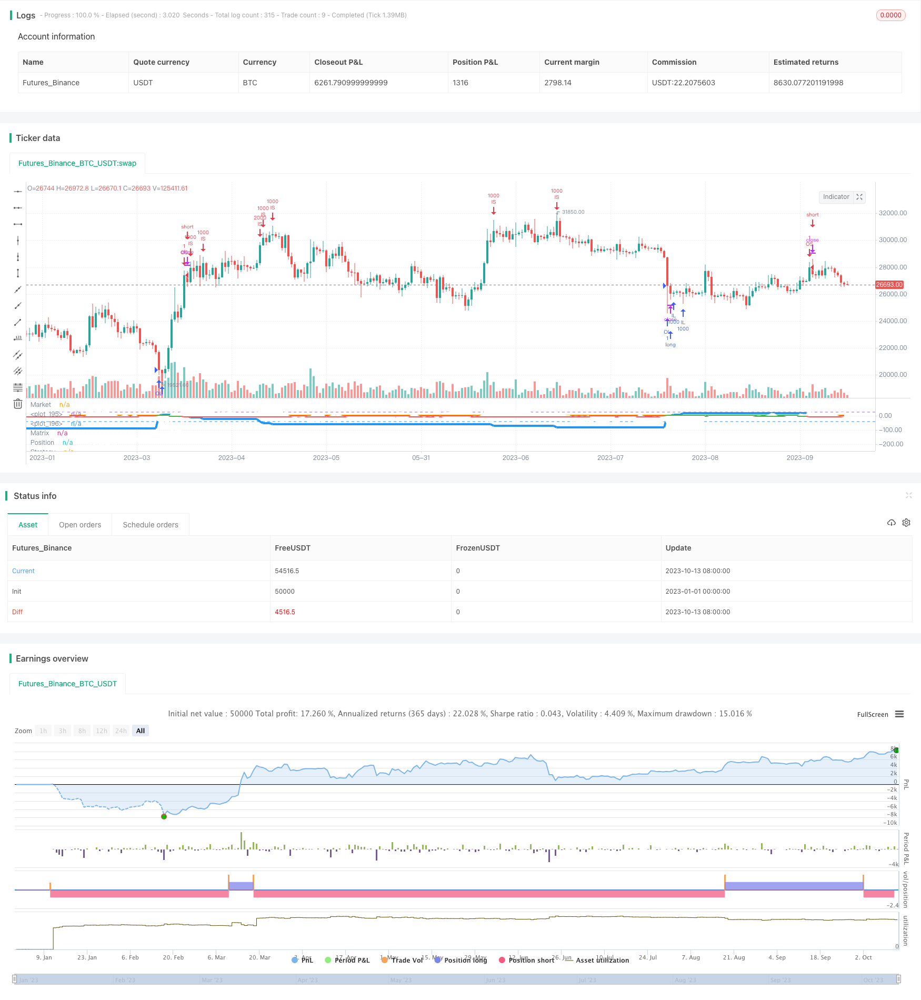

> Name

Divergence-Matrix-Trend-Following-Strategy
> Author

ChaoZhang

> Strategy Description


[trans]

## Overview
The deviation matrix trend following strategy is a quantitative trading strategy that combines trends, deviations and moving averages. This strategy uses the dual RSI indicator to determine the market trend direction and combines it with the matrix moving average to set entry signals. The matrix moving average will adjust the position size according to the degree of price deviation. Overall, the advantage of this strategy is that it uses multiple indicators to confirm trading signals, which can effectively avoid false breakthroughs, and at the same time, the matrix moving average mechanism can lock in higher returns.
## Strategy Principle
The deviation matrix trend following strategy mainly consists of the following parts:
1. Double RSI to determine the trend
Use fast RSI and slow RSI to determine the market trend direction. When the fast RSI appears overbought or oversold, combine it with the slow RSI to determine the trend direction.
2. Matrix moving average generates trading signals
Set a set of matrix moving averages based on the entry price. When the price touches a certain moving average, adjust the position accordingly. This way you can make more profits in the trend.
3. Two-way transactions
The default is two-way transactions. You can choose to only go long but not short.
The specific transaction logic is:
1. Use fast RSI to determine temporary overbought and oversold conditions in the market.
2. Use slow RSI to determine the medium and long-term trend direction of the market.
3. When the fast RSI appears overbought or oversold, and the slow RSI shows a trend turning point, take a position in the corresponding direction based on the long and short judgment of the slow RSI.
4. After opening a position, set a set of matrix moving averages. This set of matrix moving averages is set around the entry price, and the spacing is set by the "Matrix Interval Percentage" parameter.
5. When the price touches the matrix moving average, adjust the position accordingly. If it breaks above the moving average upwards, long orders will be added; if it falls below the moving average, short orders will be reduced.
6. When there is a large price adjustment, the position will be reset to the initial level.
The above is the main trading logic of this strategy. Through matrix moving average, you can lock in more profits in the trend.
## Strategic Advantages
The deviation matrix trend following strategy has the following advantages:
1. Double RSI judgment signal is more reliable. Fast RSI avoids false breakthroughs, and slow RSI ensures that the general trend is correct.
2. Matrix moving average follows the trend to make profits. Adjust positions according to the degree of price deviation, and you can continue to make profits.
3. Support two-way transactions. The default is two-way trading, or you can only do long. Can adapt to more market environments.
4. The position reset mechanism controls risks. When there is a significant price adjustment, the position can be reset and the loss can be stopped in time.
5. Flexible parameter setting. Users can choose the best parameter combination based on historical data, trading varieties, etc.
6. The code structure is clear. The responsibilities of each part are clearly divided, making it easy to understand, optimize and expand.
In general, the biggest advantage of this strategy is to use multiple mechanisms to improve signal quality and pursue higher returns while controlling risks. This is a trading strategy that balances risk and return.
## Strategy Risk
There are also some risks in the deviation matrix trend following strategy, which are mainly concentrated in the following points:
1. Double RSI determines the risk of failure. When the market is in a volatile adjustment, RSI often sends out false signals. At this time, you need to assess the situation and adjust parameters appropriately or suspend trading.
2. Risk of improper matrix moving average method. If the matrix parameters are set improperly, position adjustments may be too aggressive, thereby increasing losses. Parameters need to be tested with caution.
3. Positions that excessively magnify risks. Adjusting positions too much will also lead to expanded losses. The maximum position parameter needs to be set carefully.
4. Trend reversal risk. When the trend reverses, if you do not close your position in time, you will face a large loss. This requires focusing on longer period trend indicators.
5. The risk of limited space for code optimization. This strategy is already relatively mature, and there is limited room for further optimization. If the market environment changes significantly, the overall trading logic needs to be re-evaluated.
Evaluating and optimizing strategies is key to reducing these risks. For example, adjusting parameter combinations and monitoring longer-term indicators can avoid risks to a certain extent.
## Strategy optimization direction
There is room for further optimization of the deviation matrix trend following strategy:
1. Optimize dual RSI parameters. You can test more parameter combinations and choose the most accurate RSI cycle value.
2. Customize matrix moving average settings. Allows users to parameterize the matrix moving average parameters according to different varieties to make them more consistent with the characteristics of the varieties.
3. Add a stop loss mechanism. If the off-market moving average is set, the loss will be stopped when the price falls below the moving average.
4. Add position proportion rules. Adjust the position size and speed more scientifically and rationally to prevent excessive position enlargement.
5. Combine with other indicators. Other indicators such as MACD and KD can be introduced to assist judgment and improve signal accuracy.
6. Optimize code structure. Continue to improve the scalability, maintainability and execution efficiency of the code.
## Summarize
The deviation matrix trend following strategy is a multi-mechanism comprehensive quantitative trading strategy. It mainly uses double RSI to determine the trend direction and the matrix moving average to track the trend and make profits. Compared with a single indicator strategy, this strategy can provide more stable and efficient trading signals. Through parameter adjustment and optimization expansion, this strategy can adapt to more different market environments and has strong applicability. Overall, this strategy has a good risk-return balance and is worthy of investors' active application and continuous optimization.
|| 

## Overview  

The Divergence Matrix Trend Following Strategy is a quantitative trading strategy that combines trend, divergence, and moving average analysis. This strategy uses dual RSI indicators to judge market trend direction and matrix moving averages to generate entry signals. The matrix moving averages adjust position sizing based on the degree of price divergence. Overall, the advantage of this strategy is to confirm trading signals with multiple indicators, which can effectively avoid false breakouts. Meanwhile, the matrix mechanism can lock in higher returns.

## Strategy Logic  

The Divergence Matrix Trend Following Strategy consists of the following main parts:

1. Dual RSI for trend judging

   Use fast RSI and slow RSI to determine market trend direction. When the fast RSI shows overbought or oversold levels, check the slow RSI for trend direction.  

2. Matrix moving average for trading signals

   Set up a group of matrix moving averages based on the entry price. When the price touches a moving average line, adjust the position accordingly. This allows more profits to be captured in trends.

3. Bi-directional trading

   Default is bi-directional trading. Can choose to only go long.

The specific trading logic is:

1. Use fast RSI to spot temporary overbought/oversold levels in the market.

2. Use slow RSI to determine the mid-to-long term trend direction of the market.  

3. When fast RSI shows extremes and slow RSI signals trend reversal, take positions based on the long/short trend by slow RSI.

4. After entering positions, set up a group of matrix moving averages. These matrix lines are based around the entry price, with interval size defined in the "Matrix Interval %" parameter.
   
5. When price touches a matrix line, adjust position size accordingly. For example, increase longs on upward breakouts, reduce shorts on downward breakdowns.  

6. When price sees large adjustments, positions will be reset to initial levels.  

The above describes the main trading logic of this strategy. The matrix mechanism allows more trend profits to be locked in.  

## Advantages

The Divergence Matrix Trend Following Strategy has the following advantages:

1. Dual RSI signals are more reliable. Fast RSI avoids false breakouts and slow RSI ensures the major trend is correct.
   
2. Matrix moving averages profit from trends. Adjusting position size based on price divergence allows sustained profits to be captured.
   
3. Supports bi-directional trading. Default is dual directional trading, but can also go long only. This adapts to more market environments.  

4. Position reset mechanism controls risks. Resetting positions when price sees large adjustments allows timely stop losses.

5. Flexible parameter settings. Users can select optimal parameter combinations based on historical data, trading instruments etc.  

6. Clean code structure. Clear separation of responsibilities makes the code easy to understand, optimize and extend.

In summary, the biggest edge of this strategy is to improve signal quality through multiple mechanisms while pursuing higher returns under controlled risks. This is a strategy balancing risk and reward.

## Risks

The Divergence Matrix Trend Following Strategy also has some risks, mainly in the following areas:

1. Failure risk of dual RSI signals. When the market is range-bound, RSI often gives false signals. Manual intervention is needed to adjust parameters or suspend trading.

2. Improper matrix moving average risk. If matrix parameters are not set properly, position adjustments can be too aggressive, thus magnifying losses. Conservative parameter testing is a must. 

3. Risk of over-leveraged positions. Excessive position size adjustments will also expand losses. The maximum position size parameter needs to be set prudently.  

4. Trend reversal risk. If failing to close positions promptly when trend reverses, large losses may be incurred. This calls for monitoring longer-term trend indicators.  

5. Limited optimization space risk. This strategy is already quite mature. Continued optimization potential is limited. Major upgrades may be needed if market regimes change drastically.   

Assessing and optimizing the strategy is key to mitigating these risks - adjusting parameters, monitoring longer-term indicators etc, can alleviate risks to some extent.

## Enhancement Opportunities  

There is room for further enhancement of the Divergence Matrix Trend Following Strategy:  

1. Optimize dual RSI parameters. Test more parameter combinations and select RSI periods with highest accuracy.

2. Customizable matrix lines. Allow users to parameterize matrix settings based on different instruments to better suit their characteristics.  

3. Add stop loss mechanisms. For example, set up exit lines to stop out positions if price breaks those lines.

4. Add more scientific position sizing rules. Manage position size adjustments in a more gradual fashion to prevent over-leveraging. 

5. Incorporate other indicators. Introduce additional indicators like MACD, KD etc. to improve signal accuracy.

6. Optimize code structure. Further improve extensibility, maintainability and execution efficiency of the code.

## Conclusion  

The Divergence Matrix Trend Following Strategy is a sophisticated quantitative trading strategy combining multiple mechanisms - using dual RSI for trend direction and matrix lines to profit from trends. Compared to single-indicator strategies, it provides more stable and efficient trading signals. With parameter tuning and optimization extensions, this strategy can adapt to more market conditions and regimes, making it highly versatile. Overall, this strategy strikes a good balance between risk and return, and deserves active application and continued enhancement by investors.

[/trans]

> Strategy Arguments


|Argument|Default|Description|
|----|----|----|
|v_input_1|true|Entry Size|
|v_input_2|10000|Max Size|
|v_input_3|2|Matrix Interval %|
|v_input_4|false|Matrix Overwrite $|
|v_input_5|1000|Adjustment Size|
|v_input_6|true|Trade Short|
|v_input_7|14|RSI Periods|
|v_input_8|65|RSI Overbought|
|v_input_9|30|RSI Oversold|
|v_input_10|D|Resolution Trend|
|v_input_11|14|RSI Trend Periods|
|v_input_12|64|RSI Trend Overbought|
|v_input_13|30|RSI Trend Oversold|


> Source (PineScript)

``` pinescript
/*backtest
start: 2023-01-01 00:00:00
end: 2023-10-14 00:00:00
period: 1d
basePeriod: 1h
exchanges: [{"eid":"Futures_Binance","currency":"BTC_USDT"}]
*/

//@version=3
strategy("The Matrix 7.0 Strategy", overlay=false)

//Matrix Settings 
entry_size = input(title="Entry Size", defval = 1)
max_size = input(title="Max Size", defval = 10000)
matrix = input(title="Matrix Interval %", defval = 2)
matrix_price_overwrite = input(title="Matrix Overwrite $", defval = 0.0)
adjustment = input(title="Adjustment Size", defval = 1000)
trade_short = input(title="Trade Short", type=bool, defval = true)

//RSI Settings
periods = input(title="RSI Periods", defval = 14)
overbought_short = input(title="RSI Overbought", defval = 65)
oversold_short = input(title="RSI Oversold", defval = 30)

//RSI Trend Settings
resolution_long = input(title="Resolution Trend", defval = "D")
periods_long = input(title="RSI Trend Periods", defval = 14)
overbought_long = input(title="RSI Trend Overbought", defval = 64)
oversold_long = input(title="RSI Trend Oversold", defval = 30)

//Round Off to 2 decimals
round2(x) =>
    a = x * 10 * 10
    a := floor(a + 0.5)
    a := a / 10 / 10
    a

//RSI Function
RSI = rsi(close, periods)

//RSI Market Function
rsi_oversold = RSI < oversold_short
rsi_overbought = RSI > overbought_short

market_rsi = 0.0
market_rsi := if (rsi_oversold)
    RSI - oversold_short
else
    if (rsi_overbought)
        RSI - overbought_short
    else
        0

//RSI Trend Function
rsi_long = request.security(syminfo.tickerid,resolution_long,rsi(close,periods_long))
trend_rsi_long = rsi_long < oversold_long
trend_rsi_short = rsi_long > overbought_long
trend_rsi = 0
trend_rsi := if (trend_rsi_short)
    -1
else
    if (trend_rsi_long)
        1
    else
        trend_rsi[1] 

// // Shorter time resolution to make "close" crosses give faster positives.
// short_resolution = security(tickerid, "1", close)
// quick = round2(short_resolution) //ROUND OFF TO 2 DECIMAL PLACES.

//Declare Other Variables
entry_price = 0.0
entry_price := nz(entry_price[1])

position_size = 0.0
position_size := nz(position_size[1])

last_traded_price = 0.0
last_traded_price := nz(last_traded_price[1])


matrix_price = 0.0
if matrix_price_overwrite > 0.0
    matrix_price := matrix_price_overwrite
else
    matrix_price := round2((matrix/100) * entry_price)

level = 0
level := nz(level[1])

level_price = entry_price
if not na(level_price[1])
    level_price := level_price[1]

// Calculate Level
if close > level_price 
    level_change = floor((high - level_price)/matrix_price)
    level := level + level_change
else
    if close < level_price 
        level_change = ceil((low - level_price)/matrix_price)
        level := level + level_change
        
// Calculate Level Price   
level_price := (level * matrix_price) + entry_price

// Calculate Matrix Position
matrix_position = 0.0

if position_size > 0
    matrix_position :=  ((-1 * level) * adjustment) + entry_size
else
    if position_size < 0
        matrix_position :=  ((-1 * level) * adjustment) - entry_size
    
//Trend Entry or Reversal Conditions
trend_reversal_up = trend_rsi == 1 and (trend_rsi[1] == -1 or trend_rsi == 0) and position_size <= 0
trend_reversal_down = trend_rsi == -1 and (trend_rsi[1] == 1 or trend_rsi == 0) and position_size >= 0 and trade_short == true
flatten_position = trend_rsi == -1 and (trend_rsi[1] == 1 or trend_rsi == 0) and position_size >= 0 and trade_short == false

//Reset Conditions
reset_long = (position_size > 0) and (close - entry_price > matrix_price) and (market_rsi < 0) and (position_size != entry_size) 
reset_short = (position_size < 0) and (entry_price - close > matrix_price) and (market_rsi > 0) and (position_size != (-1 * entry_size)) 

//Adjustment Conditions
increase_long = (position_size > 0) and (matrix_position > position_size) and (market_rsi < 0) and (matrix_position <= max_size) 
decrease_long = (position_size > 0) and (matrix_position < position_size) and (market_rsi > 0) 
increase_short = (position_size < 0) and (matrix_position < position_size) and (market_rsi > 0) and (matrix_position >= (-1 * max_size)) 
decrease_short = (position_size < 0) and (matrix_position > position_size) and (market_rsi < 0)  

//Transactions
//Trend Reversals
if trend_reversal_up
    strategy.entry("OL", strategy.long, qty=entry_size)
    position_size := entry_size
    matrix_position := entry_size
    level := 0
else
    if trend_reversal_down 
        strategy.entry("OS", strategy.short, qty=entry_size)
        position_size := -1 * entry_size
        matrix_position := -1 * entry_size   
        level := 0
        
    //Reset Positions    
    else
        if reset_long
            order = entry_size - position_size[1]
            strategy.order("RL", strategy.long, qty=order)
            position_size := entry_size
            matrix_position := entry_size
            level := 0
        else
            if reset_short
                order = position_size[1] - (-1* entry_size)
                strategy.order("RS", strategy.short, qty=order)
                position_size := -1 * entry_size
                matrix_position := -1 * entry_size
                level := 0

    //Position Adjustments
            else    
                if increase_long
                    order = matrix_position - position_size[1]
                    strategy.order("IL", strategy.long, qty=order)
                    position_size := position_size[1] + order
                else
                    if decrease_long
                        order = position_size[1] - matrix_position
                        strategy.order("DL", strategy.short, qty=order)
                        position_size := position_size[1] - order
                    else
                        if increase_short
                            order = position_size[1] - matrix_position
                            strategy.order("IS", strategy.short, qty=order)
                            position_size := position_size[1] - order
                        else
                            if decrease_short
                                order = matrix_position - position_size[1]
                                strategy.order("DS", strategy.long, qty=order)
                                position_size := position_size[1] + order
                            else 
                                if flatten_position
                                    strategy.close_all()
                                    position_size := 0.0
                                    matrix_position := 0.0
                                    level := 0

//Grouped Actions
if trend_reversal_up or trend_reversal_down or reset_short or reset_long
    entry_price := round2(close)
    last_traded_price := round2(close)

if increase_long or decrease_long or increase_short or decrease_short
    last_traded_price := round2(close)

// //RSI Trend & Adjustment Moments. (strategy)
p1 = plot(market_rsi, color = trend_rsi > 0 ? green : red, linewidth = 4, title='Market', transp =0)
p2 = plot(trend_rsi, color = trend_rsi > 0 ? green : red, linewidth = 4, title='Trend', transp = 0)
fill(p1,p2, color=trend_rsi > 0 ? green : red, transp=0)
p3 = plot((rsi_long - 50) *2, color = white, title="Trend Index")
fill(p2,p3, color=white)
hline((overbought_long -50) * 2)
hline((oversold_long -50) * 2)

//Position Plots (strategy)
plot(matrix_position / 100, title='Matrix', color=white, linewidth = 4)
plot(position_size / 100, title='Position', color=blue, linewidth = 4)
plot(strategy.position_size / 100, title='Strategy', color=orange, linewidth = 4)

// //Price Plots (study)
// plot(level_price, title="Matrix Level Price", linewidth=4)
// plot(last_traded_price, title="Last Traded Price", linewidth=2, color=orange)
// plot(entry_price + (4 * matrix_price), title='Adjustment 4', color=white, linewidth = 1)
// plot(entry_price + (3 * matrix_price), title='Adjustment 3', color=white, linewidth = 1)
// plot(entry_price + (2 * matrix_price), title='Adjustment 2', color=white, linewidth = 1)
// plot(entry_price + matrix_price, title='Adjustment 1', color=white, linewidth = 1)
// plot(entry_price, title='Entry Price', color=white, linewidth = 3)
// plot(entry_price - matrix_price, title='Adjustment -1', color=white, linewidth = 1)
// plot(entry_price - (2 * matrix_price), title='Adjustment -2', color=white, linewidth = 1)
// plot(entry_price - (3 * matrix_price), title='Adjustment -3', color=white, linewidth = 1)
// plot(entry_price - (4 * matrix_price), title='Adjustment -4', color=white, linewidth = 1)


// //Alerts (study only)
// alertcondition(trend_reversal_up, title='Trend Reversal Up', message='Market Oversold, Lets Buy')
// alertcondition(trend_reversal_down, title='Trend Reversal Down', message='Market Overbought, Lets Sell')
// alertcondition(reset_long, title='Reset Long', message='Higher Bottom, Lets Buy')
// alertcondition(reset_short, title='Reset Short', message='Lower Top, Lets Sell')
// alertcondition(increase_long, title='Increase Long', message='Price Dropped, Lets Buy')
// alertcondition(decrease_long, title='Decrease Long', message='Price Spiked, Lets Sell')
// alertcondition(increase_short, title='Increase Short', message='Price Spiked, Lets Sell')
// alertcondition(decrease_short, title='Decrease Short', message='Price Dropped, Lets Buy')

// //Grouped Conditions
// condition_buy = trend_reversal_up or increase_long or decrease_short or reset_long
// condition_sell = trend_reversal_down or decrease_long or increase_short or reset_short
// adjustment_matrix = trend_reversal_up or increase_long or decrease_short or trend_reversal_down or decrease_long or increase_short or reset_long or reset_short

// //Grouped Alerts
// alertcondition(condition_buy, title='Condition Buy', message='You Need to Buy')
// alertcondition(condition_sell, title='Condition Sell', message='You Need to Sell!')
// alertcondition(adjustment_matrix, title='Adjustment Matrix', message='You Need to Adjust')


```

> Detail

https://www.fmz.com/strategy/435153

> Last Modified

2023-12-12 17:05:27
