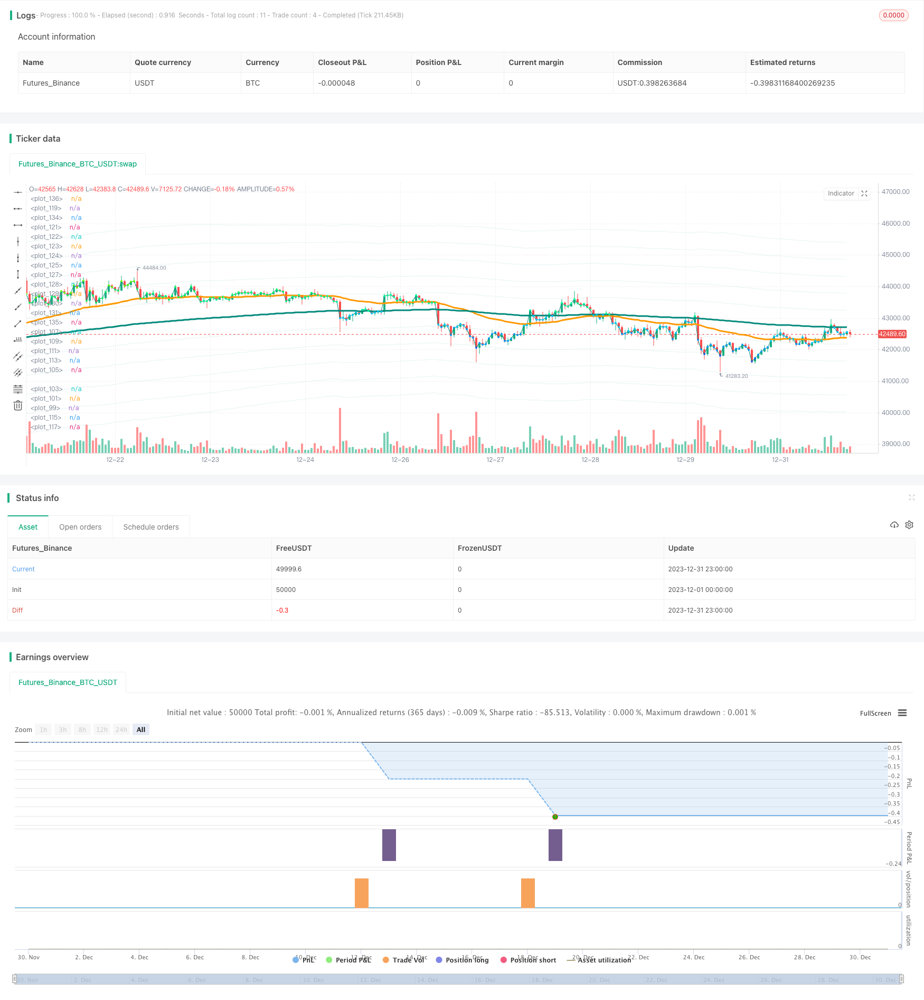

> Name

Regularly track the Dollar-Cost-Averaging-After-Downtrend-Strategy
> Author

ChaoZhang

> Strategy Description


 [trans]

### Overview
The main idea of ​​this strategy is to regularly track the low average price after the short-term decline has ended. Specifically, the strategy will identify the timing of the end of the short-term decline at the end of each month, and then regularly add positions; at the same time, the position will be cleared when the last K-line closes.
### Strategy Principles
1. Periodic tracking signal determination: After every 24*30 K lines (representing one month), it is determined that the periodic tracking point has been reached, and the first signal is output.
2. Determination of the end of the short-term decline: Use the MACD indicator to determine the trend. When the MACD deviates from and crosses the signal line, the short-term decline is considered to have ended.
3. Entry rules: When both the regular tracking signal and the short-term decline end signal are met, release the tracking signal and open a long position.
4. Exit rules: When the last K-line closes, clear all positions.
The above is the basic trading process and principles of the strategy. It’s worth noting that the strategy defaults to tracking each month using $1,000 in capital, which will be extended to 33 months in backtest, for a total investment of $33,000.
### Advantage Analysis
The biggest advantage of this strategy is that it can regularly build positions at low levels, and in the long run it can obtain a more favorable purchase cost and generate a relatively high rate of return. In addition, using the MACD indicator to identify short-term buying points is more reliable and clear, and will not lead to a dead end, which can also avoid losses to a certain extent.
In general, this is a cost-average strategy, which is more suitable for medium and long-term holders to buy in batches on a regular basis, and can obtain relatively satisfactory returns.
### Risks and Solutions
The main risk of the strategy is that it cannot accurately judge the end point of the short-term decline. The MACD indicator may lag in judging the end of the decline, which will result in the inability to buy at the optimal point. In addition, scattered capital investment also increases operating costs.
You can consider adding more indicators to determine the trend, such as Bollinger Bands, KDJ, etc. These indicators can determine the timing of reversal in advance. At the same time, the amount of monthly investment funds can be optimized to reduce the impact of operating costs on earnings.
### Optimization direction
This strategy can be further optimized from the following directions:
1. Optimize the time period of regular tracking, such as changing to regular tracking every two months, etc., to reduce the problem of too frequent transactions.
2. Combine with more indicators to determine the timing of the end of the short-term decline, so that the buying point is closer to the lowest point.
3. Optimize the amount of funds invested each month and find the optimal allocation.
4. Try to incorporate a stop-loss strategy to avoid losses caused by falling too deep.
5. Test the impact of different holding periods on returns and find the optimal number of holding days.
### Summarize
The overall idea of ​​the regular tracking low average price strategy is clear and easy to understand. Through the combination of regular additions and short-term judgment, a more favorable cost price can be obtained. Holding this strategy in the medium and long term can yield stable returns and is suitable for investors who pursue long-term investment value. At the same time, there are also some directions that can be optimized, so focus on further improving the strategy and taking its performance to a higher level.
||

### Overview

The main idea of this strategy is to regularly track low average prices after short-term declines end. Specifically, the strategy will identify the end of a short-term decline at the end of each month, so as to regularly add positions; at the same time, clear positions when the last K-line closes.

### Strategy Principle  

1. Regular tracking signal judgment: after 24*30 K-lines (representing one month), it is determined that the regular tracking point has been reached and the first signal is output.

2. End of short-term decline judgment: use the MACD indicator to determine the trend. When MACD divergence occurs and MACD goes below the signal line, it is determined that the short-term decline has ended.

3. Entry rules: when the regular tracking signal and the end of the short-term decline signal are triggered at the same time, a tracking signal is released and long positions are opened.

4. Exit rules: when the last K-line closes, clear all positions.

The above is the basic trading flow and principles of the strategy. It is worth noting that the strategy defaults to tracking $1,000 per month in backtests, which will be expanded to 33 months, that is, a total investment of $33,000.

### Advantage Analysis

The biggest advantage of this strategy is that it can regularly build positions at low levels. From a long-term perspective, it can obtain a relatively affordable average cost price to generate high returns. In addition, using the MACD indicator to identify short-term buying points is also quite reliable and clear, which can avoid getting into a dead end to some extent, and this can also avoid losses to some extent.

In general, this is a cost averaging strategy that is more suitable for medium and long term holders to regularly purchase batches to obtain satisfactory returns.

### Risks and Solutions

The main risk of the strategy is the inability to accurately determine the end of the short-term decline. The MACD indicator's judgment of the end of the decline may lag, which will lead to the failure to enter at the optimal point. In addition, the dispersed investment of funds also increases operating costs.

Consider adding more indicators to determine trends, such as Bollinger Bands, KDJ, etc. These indicators can anticipate reversal timing in advance. At the same time, the amount of funds invested each month can be optimized to reduce the impact of operating costs on returns.

### Optimization Directions

The strategy can be further optimized in the following directions:

1. Optimize the regular tracking cycle, such as tracking once every two months, to reduce the problem of excessive frequent trading.

2. Incorporate more indicators to determine the end of a short-term decline, making the entry point closer to the lowest point.  

3. Optimize the amount of funds invested each month to find the optimal configuration.

4. Try to incorporate stop loss strategies to avoid excessive losses when prices fall too deep.

5. Test the impact of different holding periods on returns to find the optimal holding days.

### Summary  

The overall idea of this dollar cost averaging after downtrend strategy is clear and easy to understand. By combining regular replenishment and short-term judgment, it can obtain a more affordable average cost price. Medium and long-term holdings of this strategy can generate stable returns and is suitable for investors pursuing long-term investment value. At the same time, there are some directions that can be optimized to further improve the strategy so that its performance can move up one level.

[/trans]

> Strategy Arguments


|Argument|Default|Description|
|----|----|----|
|v_input_1|2017|Start year|
|v_input_2|true|Start month|
|v_input_3|true|Start day|
|v_input_4|2050|end year|
|v_input_5|true|end month|
|v_input_6|true|end day|


> Source (PineScript)

``` pinescript
/*backtest
start: 2023-12-01 00:00:00
end: 2023-12-31 23:59:59
period: 1h
basePeriod: 15m
exchanges: [{"eid":"Futures_Binance","currency":"BTC_USDT"}]
*/

// This source code is subject to the terms of the Mozilla Public License 2.0 at https://mozilla.org/MPL/2.0/
// © BHD_Trade_Bot

// @version=5
strategy(
 shorttitle            = 'DCA After Downtrend v2',
 title                 = 'DCA After Downtrend v2 (by BHD_Trade_Bot)',
 overlay               = true,
 calc_on_every_tick    = false,
 calc_on_order_fills   = false,
 use_bar_magnifier     = false,
 pyramiding            = 1000,
 initial_capital       = 0,
 default_qty_type      = strategy.cash,
 default_qty_value     = 1000,
 commission_type       = strategy.commission.percent,
 commission_value      = 1.1)


// Backtest Time Period
start_year   = input(title='Start year'   ,defval=2017)
start_month  = input(title='Start month'  ,defval=1)
start_day    = input(title='Start day'    ,defval=1)
start_time   = timestamp(start_year, start_month, start_day, 00, 00)

end_year     = input(title='end year'     ,defval=2050)
end_month    = input(title='end month'    ,defval=1)
end_day      = input(title='end day'      ,defval=1)
end_time     = timestamp(end_year, end_month, end_day, 23, 59)

window() => time >= start_time and time <= end_time ? true : false
h1_last_bar = (math.min(end_time, timenow) - time)/1000/60/60 < 2


// EMA
ema50 = ta.ema(close, 50)
ema200 = ta.ema(close, 200)

// EMA_CD
emacd = ema50 - ema200
emacd_signal = ta.ema(emacd, 20)
hist = emacd - emacd_signal

// BHD Unit
bhd_unit = ta.rma(high - low, 200) * 2
bhd_upper = ema200 + bhd_unit
bhd_upper2 = ema200 + bhd_unit * 2
bhd_upper3 = ema200 + bhd_unit * 3
bhd_upper4 = ema200 + bhd_unit * 4
bhd_upper5 = ema200 + bhd_unit * 5

bhd_lower = ema200 - bhd_unit
bhd_lower2 = ema200 - bhd_unit * 2
bhd_lower3 = ema200 - bhd_unit * 3
bhd_lower4 = ema200 - bhd_unit * 4
bhd_lower5 = ema200 - bhd_unit * 5

// Count n candles after x long entries
var int nPastCandles = 0
var int entryNumber = 0
if window()
    nPastCandles := nPastCandles + 1


// ENTRY CONDITIONS

// 24 * 30 per month
entry_condition1 = nPastCandles > entryNumber * 24 * 30

// End of downtrend
entry_condition2 = emacd < 0 and hist < 0 and hist > hist[2]

ENTRY_CONDITIONS = entry_condition1 and entry_condition2


if ENTRY_CONDITIONS
    entryNumber := entryNumber + 1
    entryId = 'Long ' + str.tostring(entryNumber)
    strategy.entry(entryId, strategy.long)
    
    

// CLOSE CONDITIONS

// Last bar
CLOSE_CONDITIONS = barstate.islast or h1_last_bar

if CLOSE_CONDITIONS
    strategy.close_all()


// Draw
colorRange(src) =>
    if src > bhd_upper5
        color.rgb(255,0,0)
    else if src > bhd_upper4
        color.rgb(255,150,0)
    else if src > bhd_upper3
        color.rgb(255,200,0)
    else if src > bhd_upper2
        color.rgb(100,255,0)
    else if src > bhd_upper
        color.rgb(0,255,100)
    else if src > ema200
        color.rgb(0,255,150)
    else if src > bhd_lower
        color.rgb(0,200,255)
    else if src > bhd_lower2
        color.rgb(0,150,255)
    else if src > bhd_lower3
        color.rgb(0,100,255)
    else if src > bhd_lower4
        color.rgb(0,50,255)
    else
        color.rgb(0,0,255)
        
bhd_upper_line = plot(bhd_upper, color=color.new(color.teal, 90))
bhd_upper_line2 = plot(bhd_upper2, color=color.new(color.teal, 90))
bhd_upper_line3 = plot(bhd_upper3, color=color.new(color.teal, 90))
bhd_upper_line4 = plot(bhd_upper4, color=color.new(color.teal, 90))
bhd_upper_line5 = plot(bhd_upper5, color=color.new(color.teal, 90))

bhd_lower_line = plot(bhd_lower, color=color.new(color.teal, 90))
bhd_lower_line2 = plot(bhd_lower2, color=color.new(color.teal, 90))
bhd_lower_line3 = plot(bhd_lower3, color=color.new(color.teal, 90))
bhd_lower_line4 = plot(bhd_lower4, color=color.new(color.teal, 90))
bhd_lower_line5 = plot(bhd_lower5, color=color.new(color.teal, 90))
// fill(bhd_upper_line5, bhd_lower_line5, color=color.new(color.teal, 95))

plot(ema50, color=color.orange, linewidth=3)
plot(ema200, color=color.teal, linewidth=3)
plot(close, color=color.teal, linewidth=1)
plot(close, color=colorRange(close), linewidth=3, style=plot.style_circles)

```

> Detail

https://www.fmz.com/strategy/439111

> Last Modified

2024-01-17 17:57:58
