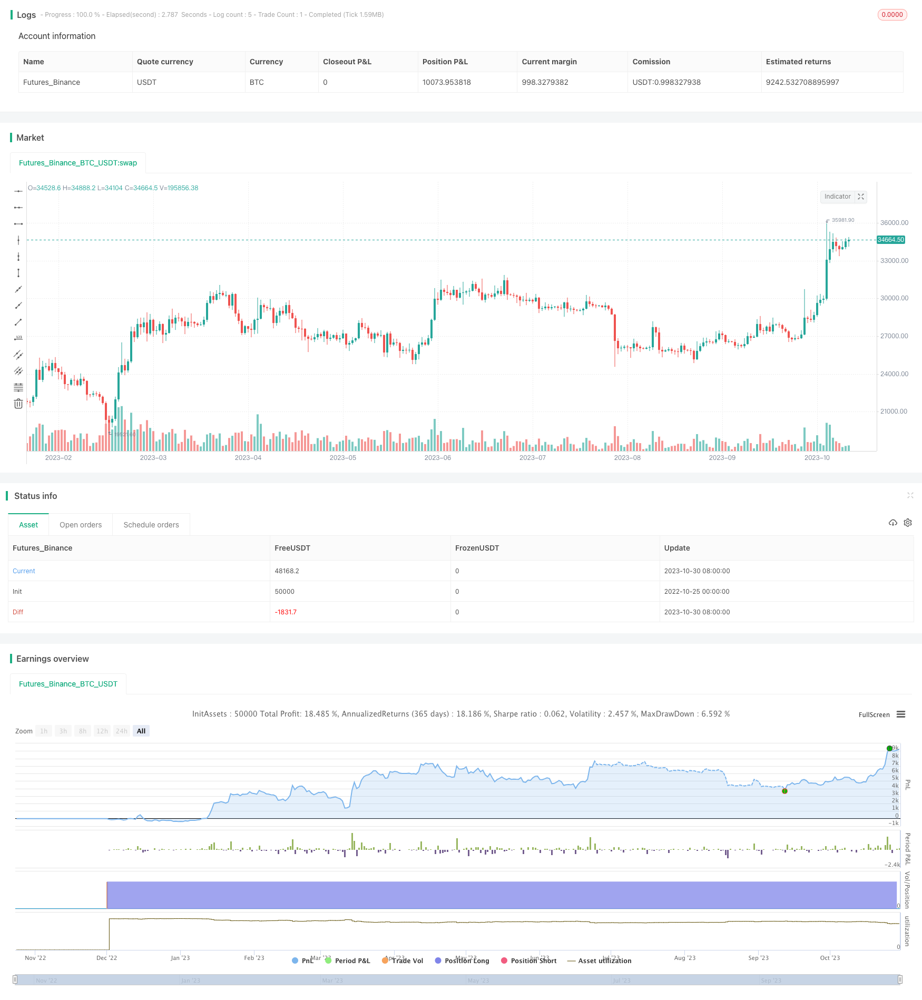

> Name

Regular Fixed Amount Investment Strategy Dollar-Cost-Averaging-Investment-Strategy
> Author

ChaoZhang

> Strategy Description



[trans]


### Overview
The regular fixed amount investment strategy is a very simple investment strategy, especially suitable for investment beginners. The core idea of ​​this strategy is that regardless of how the market price changes, investors regularly purchase an asset at a fixed amount at predetermined intervals (such as once a year). This strategy is also known as DCA (Dollar Cost Averaging) strategy. Taking fixed investment in the U.S. S&P 500 Index (SPY) as an example, you can buy $10,000 of SPY every year, regardless of the current stock market price. Assuming that the macroeconomic environment for investment remains good, in the long term (for example, 10 years), fixed investment strategies can achieve good capital gains. Fixed investment is the safest strategy that entry-level investors can adopt. All other types of strategies should be compared with fixed investment strategies; if a strategy cannot beat the returns of a fixed investment strategy, then the strategy is useless.
### Strategy Principles
The core logic of this strategy is very simple and straightforward. Investors only need to set two input parameters, namely the amount contribution of each investment and the investment interval frequency. The strategy will use these two parameters to determine whether the current bar meets the investment range in different time periods (hours, days, weeks, months). If it is consistent, calculate the number of units to be purchased based on the contribution parameter, and then perform the buy and open operation.
Taking the monthly time period as an example, the judgment logic is that the index of the current bar is % frequency == 0. The strategy.equity curve shows the cumulative return of using this strategy.
It should be noted that this strategy assumes that investors have a long-term holding period of at least 5-10 years. The longer the holding period, the better the returns. The only thing investors need to pay attention to is the macroeconomic environment mentioned above. If you are unsure, please choose to buy ETFs instead of buying individual stocks or cryptocurrencies.
### Advantage Analysis
The biggest advantage of fixed investment strategy is that it is simple and easy to implement. This makes it easy to use for anyone new to investing and does not require complex numerical skills or market forecasting. Fixed investment can help investors buy at low points and reduce purchases at high points, thus reducing cost prices in the long run. Fixed investment can also reduce attention to short-term market fluctuations and cultivate investors' long-term holding habits. The fixed investment strategy is easy to stick to and will not change the strategy temporarily due to significant market adjustments.
### Risk Analysis
The main risk of a fixed investment strategy is that the price of the assets held declines for a long time, resulting in losses. This usually occurs when the overall economy is depressed, or when the specific assets held become less competitive. Another risk is that the holding period is not long enough to see long-term gains materialize. These risks can be reduced by selecting high-quality assets with long-term growth potential, while extending the holding period to at least 5-10 years.
### Optimization direction
The fixed investment strategy can be optimized in the following aspects: 1) Adjust the time period of the purchase, such as changing the interval to weekly or every two weeks to smooth the cost price; 2) Dynamically adjust the purchase amount, increase the purchase amount when the market is down, and reduce the purchase amount when the market is bullish; 3) Purchase different assets with negative correlation to reduce the overall volatility; 4) Select high-quality targets based on fundamentals instead of consolidating the purchase index.
### Summarize
The regular fixed-amount investment strategy is known for its simplicity and is suitable for any novice investor. It can help investors smoothly enter the market and develop long-term holding habits. Although it can be optimized by adjusting the purchase time, amount, and target, keeping the core idea simple and fixed investment is the biggest advantage of the fixed investment strategy. All investment strategies should be benchmarked against the long-term performance of fixed investment strategies. As long as you choose high-quality assets and insist on a longer holding period, fixed investment strategies can bring stable long-term growth to investors.
||

### Overview

The dollar cost averaging investment strategy is a very simple investment approach, especially suitable for beginning investors. The core idea of this strategy is to invest a fixed amount of money at preset intervals (e.g. annually), regardless of market price fluctuations. This strategy is also known as DCA (dollar cost averaging). For example, one can invest $10,000 in SPY (S&P 500 ETF) every year, no matter the market prices. Assuming favorable macroeconomic conditions, DCA strategies can result in good capital gains over long periods, e.g. 10 years. DCA is the safest strategy for novice investors, and all other strategies should be benchmarked against DCA - if a strategy cannot beat DCA, it is useless.

### Strategy Logic

The core logic of this strategy is very straightforward. The investor only needs to set two input parameters - contribution amount and frequency. The strategy will check the current bar against these intervals (hourly, daily, weekly, monthly) to determine if investment should occur. If yes, it calculates the # of units to buy based on contribution, and opens a long position. 

For example on monthly timeframe, the logic checks if current bar index % frequency == 0. The equity curve shows the cumulative returns from this strategy.

It is important to note this strategy assumes a long holding period of at least 5-10 years. The longer the holding period, the better the returns. The only thing for investors to watch out for are the macroeconomic conditions mentioned earlier. When in doubt, buy ETFs rather than individual stocks or crypto.

### Advantage Analysis

The biggest advantage of dollar cost averaging is its simplicity, which allows any beginning investor to easily implement it without complex quantitative skills or market forecasts. DCA helps investors buy lows and reduce buys at highs, lowering cost basis over time. It also reduces short term market noise, helping to cultivate long term holding habits. DCA is easy to stick to without strategy changes due to market gyrations.

### Risk Analysis

The main risk of DCA is that the asset prices decrease for long periods, leading to losses. This usually happens when the overall economy is depressed, or the competitiveness of the specific asset held falls. Another risk is not holding for long enough periods to realize the long term gains. These risks can be mitigated by selecting quality assets with long term growth potential, and holding for at least 5-10 years.

### Improvement Areas

DCA strategies can be enhanced by: 1) Adjusting the buying frequency, e.g. weekly or biweekly to smooth cost basis; 2) Dynamically changing buy amounts, increasing during market troughs and decreasing during peaks; 3) Buying negatively correlated assets to lower overall volatility; 4) Fundamental stock picking rather than broad index funds.

### Conclusion

Dollar cost averaging strategies excel in their simplicity, making them suitable for any beginning investor. They help smooth into the markets and cultivate long term holding habits. While optimizations can be made around buying intervals, amounts, and targets, the core benefit remains the fixed investing approach. All investment strategies should be benchmarked against DCA's long term returns. By picking quality assets and holding for extended periods, DCA can provide stable long term growth for investors.

[/trans]

> Strategy Arguments


|Argument|Default|Description|
|----|----|----|
|v_input_1|10000|Contribution (USD)|
|v_input_2|12|Frequency (Months)|


> Source (PineScript)

``` pinescript
/*backtest
start: 2022-10-25 00:00:00
end: 2023-10-31 00:00:00
period: 1d
basePeriod: 1h
exchanges: [{"eid":"Futures_Binance","currency":"BTC_USDT"}]
*/

// To simplify matters for newbies, this script only computes DCA on H1, D1, W1 and M1 timeframes
// If you want a script that DCAs per x-bars, let me know in the comments.
// © TsangYouJun

//@version=4
strategy("DCA Strategy v1", overlay=false)

//user inputs
contribution = input(title="Contribution (USD)",type=input.integer,minval=1,maxval=1000000,step=1,defval=10000,confirm=false)
frequency = input(title="Frequency (Months)",type=input.integer,minval=1,maxval=1000000,step=1,defval=12,confirm=false)

//units to buy
units = contribution / close

//when to dca
hourDca = bar_index[0] % (frequency * 28 * 24)
dayDca = bar_index[0] % (frequency * 28)
weekDca = bar_index[0] % (frequency * 4)
monthDca = bar_index[0] % frequency

//when to dca
if(timeframe.period == "60" and hourDca == 0)
    strategy.order("DCA", strategy.long, units)
    
if(timeframe.period == "D" and dayDca == 0)
    strategy.order("DCA", strategy.long, units)
    
if(timeframe.period == "W" and weekDca == 0)
    strategy.order("DCA", strategy.long, units)
    
if(timeframe.period == "M" and monthDca == 0)
    strategy.order("DCA", strategy.long, units)

//plot strategy equity
// plot(strategy.equity - strategy.initial_capital, color=color.blue, linewidth=2, title="Net Profit")
```

> Detail

https://www.fmz.com/strategy/430762

> Last Modified

2023-11-01 16:24:56
