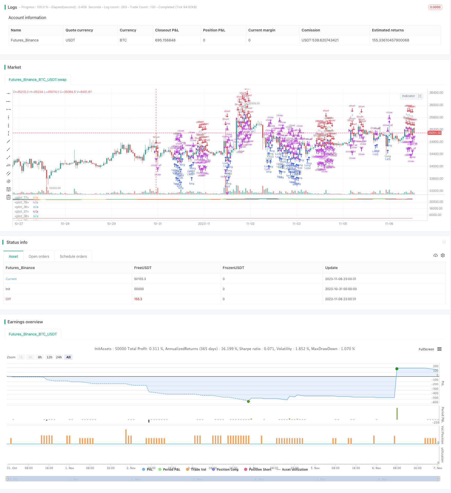

> Name

Donchian-Channel-Breakout-Trading-Strategy Donchian-Channel-Breakout-Trading-Strategy
> Author

ChaoZhang

> Strategy Description

 

 [trans]


## Overview
Tang Qian's volatility channel trading strategy determines the current price trend by calculating the highest and lowest price channels within a certain period, and combines the breakthrough channels for long and short trading. This strategy is suitable for trading high volatility stocks and digital currencies.
## Strategy Principle
This strategy builds a channel by calculating the highest price pcmax and the lowest price pcmin in the last (history) period. The calculation method for the upper rail and lower rail of the channel is:
Upper rail yh = pcmax - (pcmax - pcmin) * (100 - percentDev)/100
Lower rail yl = pcmin + (pcmax - pcmin) * percentDev/100
The default value of percentDev is 13.
When the price breaks through the upper band, a long signal is generated; when the price breaks through the lower band, a short signal is generated.
The specific judgment method for generating trading signals is as follows:
1. boundup = high > yh determines whether it breaks through the upper track
2. bounddn = low < yl to determine whether it breaks through the lower track
3. upsign = sma(bounddn, 2) == 1 Judging from the moving average of bounddn, it continues to break through the lower track.
4. dnsign = sma(boundup, 2) == 1 Judging from the moving average of boundup, it continues to break through the upper track.
5. exitup = dnsign breaks through the upper track to generate a closing signal
6. exitdn = upsign breaks through the lower track to generate a closing signal
7. if upsign breaks through the lower track to generate a long signal
8. if dnsign breaks through the upper rail to generate a short signal
This strategy also sets the start and end trading times to avoid unnecessary overnight positions.
## Strategic Advantages
1. Use Tang Qian channel to judge the trend, and the backtesting effect is better
2. Set long and short signals at the same time, allowing two-way trading
3. Judge signals through moving average filtering to avoid wrong transactions
4. Stop-loss setting is optional to control risks
5. Set start and end trading times to avoid overnight position risks
## Strategy Risk
1. Tang Qian’s channel is sensitive to the parameters history and percentDev, and parameters need to be optimized to adapt to different varieties.
2. Wrong signals may occur during volatile market conditions
3. Order management factors are not taken into account, and actual orders may have an impact on profits.
4. Without considering position management factors, there may be risks of excessive positions in the real offer.
5. Fund management factors are not considered, and trading funds need to be reasonably set up in real transactions.
## Strategy optimization direction
1. Optimize the parameters history and percentDev to better adapt to different varieties
2. Add filters to avoid false signals in volatile market conditions
3. Add a position management module to control the proportion of funds occupied by a single position
4. Add the fund management module to limit the proportion of funds occupied by the total position
5. Add order management function and optimize order placing method
## Summarize
Tang Qian's volatility channel trading strategy uses channel breakthroughs to determine trends and trading signals. It has good backtesting results and has two-way trading capabilities. However, this strategy also has some risks, and parameters, filters, position management, fund management, order management, etc. need to be optimized in order to achieve stable profits in the real market. Generally speaking, this strategy is a more traditional trend following strategy. After optimization and improvement, it can become a reliable quantitative trading strategy.
||

## Overview

The Donchian channel breakout trading strategy judges current price trends by calculating the channel of highest and lowest prices over a certain period and trades long and short based on channel breakouts. This strategy is suitable for highly volatile stocks and cryptocurrencies.

## Strategy Logic

This strategy constructs a channel by calculating the highest price pcmax and lowest price pcmin over the last history periods. The calculation methods for the upper and lower rail of the channel are:

Upper rail yh = pcmax - (pcmax - pcmin) * (100 - percentDev)/100

Lower rail yl = pcmin + (pcmax - pcmin) * percentDev/100

where percentDev defaults to 13.

A long signal is generated when the price breaks through the upper rail. A short signal is generated when the price breaks through the lower rail. 

The specific logic to generate trading signals is:

1. boundup = high > yh to determine if the upper rail is broken

2. bounddn = low < yl to determine if the lower rail is broken 

3. upsign = sma(bounddn, 2) == 1 uses sma of bounddn to determine persistent breakout of lower rail

4. dnsign = sma(boundup, 2) == 1 uses sma of boundup to determine persistent breakout of upper rail

5. exitup = dnsign breakout of upper rail generates exit signal

6. exitdn = upsign breakout of lower rail generates exit signal  

7. if upsign breakout of lower rail generates long signal

8. if dnsign breakout of upper rail generates short signal

The strategy also sets start and end trading times to avoid unnecessary overnight positions.

## Advantages of the Strategy

1. Uses Donchian channel to determine trends, good backtest results

2. Has both long and short signals, allows two-way trading

3. Uses SMA to filter signals and avoid bad trades

4. Optional stop loss to control risks

5. Sets start and end trading times to avoid overnight risks

## Risks of the Strategy

1. Sensitive to history and percentDev parameters, needs optimization for different products 

2. May generate false signals in range-bound markets

3. Does not consider order management, may impact profitability in live trading

4. Does not consider position sizing, risks of oversized positions

5. Does not consider money management, needs reasonable trading capital

## Enhancement Ideas

1. Optimize history and percentDev parameters for different products

2. Add filters to avoid false signals in ranging markets

3. Add position sizing module to control single position size

4. Add money management module to limit total position size

5. Add order management for optimal order execution 

## Conclusion

The Donchian channel breakout strategy uses channel breakouts to determine trends and trading signals, with good backtest results and ability to trade both long and short. However, risks exist regarding parameter optimization, filters, position sizing, money management, order management etc. Proper enhancements in these areas are needed before stable live trading. Overall, it is a traditional trend following strategy, and with optimizations can become a reliable quantitative trading strategy.

[/trans]

> Strategy Arguments


|Argument|Default|Description|
|----|----|----|
|v_input_1|20|history|
|v_input_2|13|percentDev|
|v_input_3|100|capital|
|v_input_4|true|Long|
|v_input_5|true|Short|
|v_input_6|true|Stop Loss|
|v_input_7|3.8|Stop loss multiplicator|
|v_input_8|2018|From Year|
|v_input_9|2100|To Year|
|v_input_10|true|From Month|
|v_input_11|12|To Month|
|v_input_12|true|From day|
|v_input_13|31|To day|


> Source (PineScript)

``` pinescript
/*backtest
start: 2023-10-31 00:00:00
end: 2023-11-07 00:00:00
period: 1h
basePeriod: 15m
exchanges: [{"eid":"Futures_Binance","currency":"BTC_USDT"}]
*/

////////////////////////////////////////////////////////////
//  Copyright by AlexInc v1.0 02/07/2018  @aav_1980
// PriceChannel strategy
// If you find this script helpful, you can also help me by sending donation to 
// BTC 16d9vgFvCmXpLf8FiKY6zsy6pauaCyFnzS
// LTC LQ5emyqNRjdRMqHPHEqREgryUJqmvYhffM
////////////////////////////////////////////////////////////
//@version=3
strategy("AlexInc PriceChannel Str", overlay=false)
history = input(20)
percentDev = input(13)
capital = input(100)

needlong = input(true, defval = true, title = "Long")
needshort = input(true, defval = true, title = "Short")
usestoploss = input(true, defval = true, title = "Stop Loss")
stoplossmult = input(3.8, defval = 3.8, minval = 1, maxval = 10, title = "Stop loss multiplicator")


fromyear = input(2018, defval = 2018, minval = 1900, maxval = 2100, title = "From Year")
toyear = input(2100, defval = 2100, minval = 1900, maxval = 2100, title = "To Year")
frommonth = input(01, defval = 01, minval = 01, maxval = 12, title = "From Month")
tomonth = input(12, defval = 12, minval = 01, maxval = 12, title = "To Month")
fromday = input(01, defval = 01, minval = 01, maxval = 31, title = "From day")
today = input(31, defval = 31, minval = 01, maxval = 31, title = "To day")

bodymin = min( open, close)
bodymax = max(open, close)

pcmax = highest(bodymax, history)
pcmin = lowest(bodymin, history)

yh = ((pcmax - pcmin) / 100 * (100 - percentDev)) + pcmin
yl = ((pcmax - pcmin) / 100 * percentDev) + pcmin

plot(pcmax)
plot(pcmin)
plot(yh)
plot(yl)

//1
bounddn = low < yl ? 1 : 0
boundup = high > yh ? 1 : 0
upsign = sma(bounddn, 2) == 1
dnsign = sma(boundup, 2) == 1
//2
//upsign = crossover(bodymin, yl)
//dnsign = crossunder(bodymax , yh)


exitup = dnsign
exitdn = upsign

lot = strategy.equity / close * capital / 100


xATR = atr(history)
nLoss = usestoploss ? stoplossmult * xATR : na

stop_level_long = 0.0
stop_level_long := nz(stop_level_long[1])

stop_level_short = 0.0
stop_level_short := nz(stop_level_short[1])

pos = strategy.position_size
if pos >0 and pos[1] <= 0 //crossover(pos, 0.5)
    stop_level_long = strategy.position_avg_price - nLoss
if pos < 0 and pos[1] >= 0 //crossunder(pos, -0.5)
    stop_level_short = strategy.position_avg_price + nLoss
if pos == 0    
    stop_level_long = bodymin - nLoss
    stop_level_short = bodymax + nLoss

//plot(bodymax + nLoss, color=red)
//plot(bodymin - nLoss, color=red)
plot(stop_level_long, color=red)
plot(stop_level_short, color=red)

if upsign
    strategy.entry("Long", strategy.long, needlong == false ? 0 : lot)

if dnsign
    strategy.entry("Short", strategy.short, needshort == false ? 0 : na)

if true
    strategy.close_all()


//if strategy.position_size != 0
//    strategy.exit("Exit Long", from_entry = "Long", stop = stop_level_long)
//    strategy.exit("Exit Short", from_entry = "Short", stop = stop_level_short)
```

> Detail

https://www.fmz.com/strategy/431502

> Last Modified

2023-11-08 12:31:56
