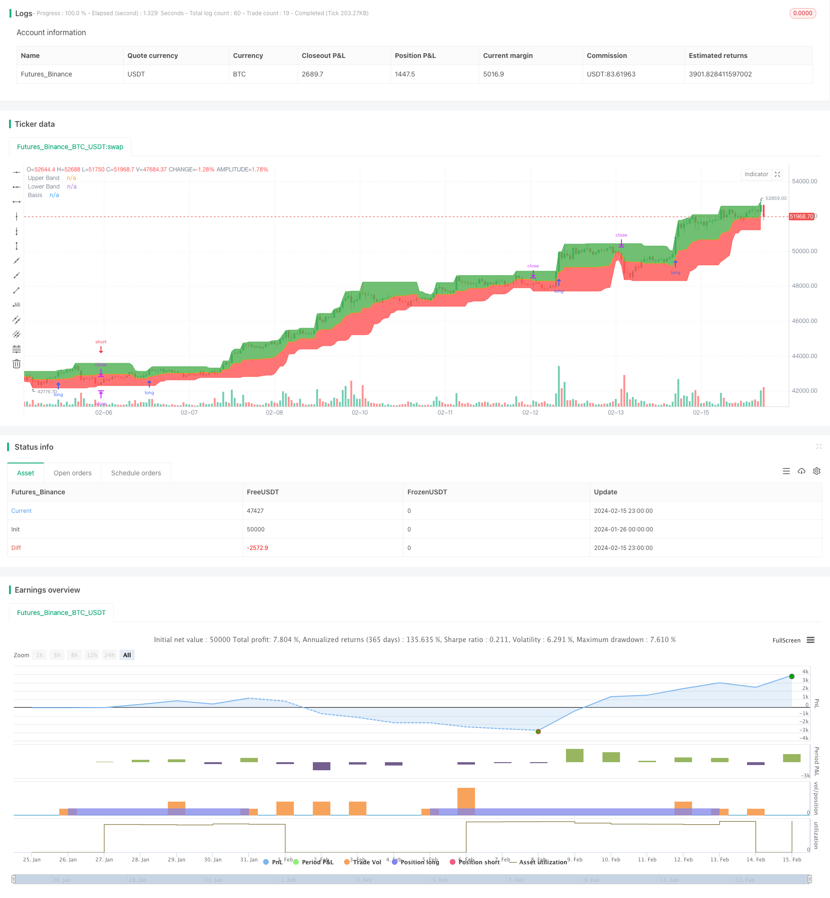

> Name

Donchian-Channel-Trend-Riding-Strategy
> Author

ChaoZhang

> Strategy Description


[trans]
## Overview
The Donchian Channel Riding Strategy is a trend following strategy. It uses the Donchian Channel to identify market trends, enter the market when a signal is generated in the direction of the trend, and then try to capture all the trends. At the same time, it combines long-period moving averages to filter to avoid generating false signals. Stop loss is set at the lower band of the channel, which can effectively control risks.
## Strategy Principle
This strategy is mainly based on Donchian Channel. The Donchian Channel consists of an upper rail, a lower rail and a middle rail. The upper track is the highest price in the past n days, the lower track is the lowest price in the past n days, and the middle track is the average of the upper track and the lower track. When the price breaks through the upper band, it is a long signal, and when it breaks through the lower band, it is a short signal.
The strategy first calculates the upper track, lower track and middle track of the Donchian Channel with a length of 20 days. Then determine whether the price breaks out of the channel. If the closing price breaks through the 200-day moving average AND the closing price breaks through the upper band, a long signal is generated; if the closing price falls below the 200-day moving average AND the closing price falls below the lower band, a short signal is generated.
After entering a long position, the stop loss line is set to the lower rail; after entering a short position, the stop loss line is set to the upper rail.
## Advantage Analysis
This strategy has the following advantages:
1. Ability to effectively identify market trend direction. The Donchian Channel clearly identifies a trend that is forming.
2. By combining with long-period moving averages, false signals can be effectively filtered. Long-term moving averages ensure that signals are generated only in the direction of the general trend.
3. The stop loss is set at the channel boundary, which can quickly stop the loss and effectively control risks.
4. The strategy logic is simple and clear, easy to understand and implement.
## Risk Analysis
This strategy also has certain risks:
1. Trend reversal risk. When the market trend suddenly reverses, it may cause large losses.
2. Parameter optimization risks. The parameters of Tang Qian Channel such as cycle length need to be continuously tested and optimized, otherwise the strategy performance may be affected.
3. Risk of excessive transaction frequency. Tang Qian channel is prone to generate more trading signals, which may lead to too frequent trading.
## Optimization direction
This strategy can be optimized from the following aspects:
1. Combine more indicators for signal filtering. For example, K-line patterns, volatility indicators, etc. to avoid false signals.
2. Parameter optimization. Optimize the length parameters of the Tang Qian channel and find the best parameter combination.
3. Use adaptive stop loss. Based on market volatility and risk control requirements, an adaptive stop loss method is adopted.
4. Signal classification processing. Classify signals and use different stop loss levels to differentiate between strong and weak signals.

## Summarize
Generally speaking, Tang Qian's channel riding strategy is a relatively simple and practical trend following strategy. It can effectively identify the market trend direction and capture the trend market to the greatest extent. At the same time, combine long-term moving averages and channel boundary stop losses to control risks. This strategy has a large space for optimization, and improvements can be made in parameter optimization, signal filtering, stop loss methods, etc., so as to obtain better strategy performance.
||

## Overview

The Donchian Channel Trend Riding Strategy is a trend following strategy. It uses Donchian Channel to identify market trend direction and enters the market when a trend signal is generated to capture as much of the trend movement as possible. Meanwhile, it incorporates long period moving average to filter out false signals. Stop loss is set at the lower band of the channel to effectively control risks.

## Strategy Logic

The strategy is mainly based on the Donchian Channel. The Donchian Channel consists of an upper band, a lower band and a middle band. The upper band is the highest high over the past n days, the lower band is the lowest low over the past n days, and the middle band is the average of the upper and lower bands. A buy signal is generated when price breaks above the upper band. A sell signal is generated when price breaks below the lower band.

The strategy first calculates the 20-day Donchian Channel, including the upper band, lower band and middle band. It then checks if price breaks through the channel bands. If close price breaks above 200-day moving average AND close price breaks above upper band, a long signal is generated. If close price breaks below 200-day moving average AND close price breaks below lower band, a short signal is generated.

After entering long positions, stop loss is set at the lower band. After entering short positions, stop loss is set at the upper band.

## Advantage Analysis 

The strategy has the following advantages:

1. It can effectively identify market trend directions. Donchian Channel makes trend identification clear.

2. Combining with long period moving average helps filtering out false signals effectively. The long period MA ensures that signals are only generated along the major trend direction.  

3. Stop loss set at channel bands allows quick exit and effective risk control.

4. The strategy logic is simple and clear, easy to understand and implement.

## Risk Analysis

The strategy also has some risks:

1. Trend reversal risk. Sudden trend reversal may cause huge loss.  

2. Parameter optimization risk. Parameters of Donchian Channel need constant testing and optimization, otherwise it may affect strategy performance.

3. Excessive trading frequency risk. Donchian Channel tends to generate more frequent trading signals.  

## Optimization Directions

The strategy can be optimized in the following aspects:

1. Add more indicators for signal filtering, e.g. candlestick patterns, volatility indicators etc, to avoid false signals.

2. Parameter optimization. Optimize parameters like channel length to find the optimal parameter combination.  

3. Adopt adaptive stop loss method according to market volatility and risk control needs.  

4. Classify signals and adopt different stop loss levels to differentiate strong and weak signals.

## Conclusion

In general, the Donchian Channel Trend Riding Strategy is a relatively simple and practical trend following strategy. It can effectively identify market trend directions and capture most of the trend movements. Meanwhile, long period moving average and channel bands stop loss help control risks. The strategy has large room for optimization in aspects like parameter tuning, signal filtering and stop loss methods etc, in order to achieve better performance.

[/trans]

> Strategy Arguments


|Argument|Default|Description|
|----|----|----|
|v_input_1|20|length|
|v_input_2|0|Long Entry: Higher High|Basis|
|v_input_3|0|Short Entry: Lower Low|Basis|


> Source (PineScript)

``` pinescript
/*backtest
start: 2024-01-26 00:00:00
end: 2024-02-16 00:00:00
period: 1h
basePeriod: 15m
exchanges: [{"eid":"Futures_Binance","currency":"BTC_USDT"}]
*/

// This source code is subject to the terms of the Mozilla Public License 2.0 at https://mozilla.org/MPL/2.0/
// © pratyush_trades

//@version=4
strategy("Donchian Channel Strategy", overlay=true)

length = input(20)
longRule = input("Higher High", "Long Entry", options=["Higher High", "Basis"])
shortRule = input("Lower Low", "Short Entry", options=["Lower Low", "Basis"])

hh = highest(high, length)
ll = lowest(low, length)

up = plot(hh, 'Upper Band', color = color.green)
dw = plot(ll, 'Lower Band', color = color.red)
mid = (hh + ll) / 2
midPlot = plot(mid, 'Basis', color = color.orange)
fill(up, midPlot, color=color.green, transp = 95)
fill(dw, midPlot, color=color.red, transp = 95)

if (close>ema(close,200))
    if (not na(close[length]))
        strategy.entry("Long", strategy.long, stop=longRule=='Basis' ? mid : hh)

if (close<ema(close,200))
    if (not na(close[length]))
        strategy.entry("Short", strategy.short, stop=shortRule=='Basis' ? mid : ll)

if (strategy.position_size>0)
    strategy.exit(id="Longs Exit",stop=ll)

if (strategy.position_size<0)
    strategy.exit(id="Shorts Exit",stop=hh)
```

> Detail

https://www.fmz.com/strategy/442870

> Last Modified

2024-02-26 17:31:45
