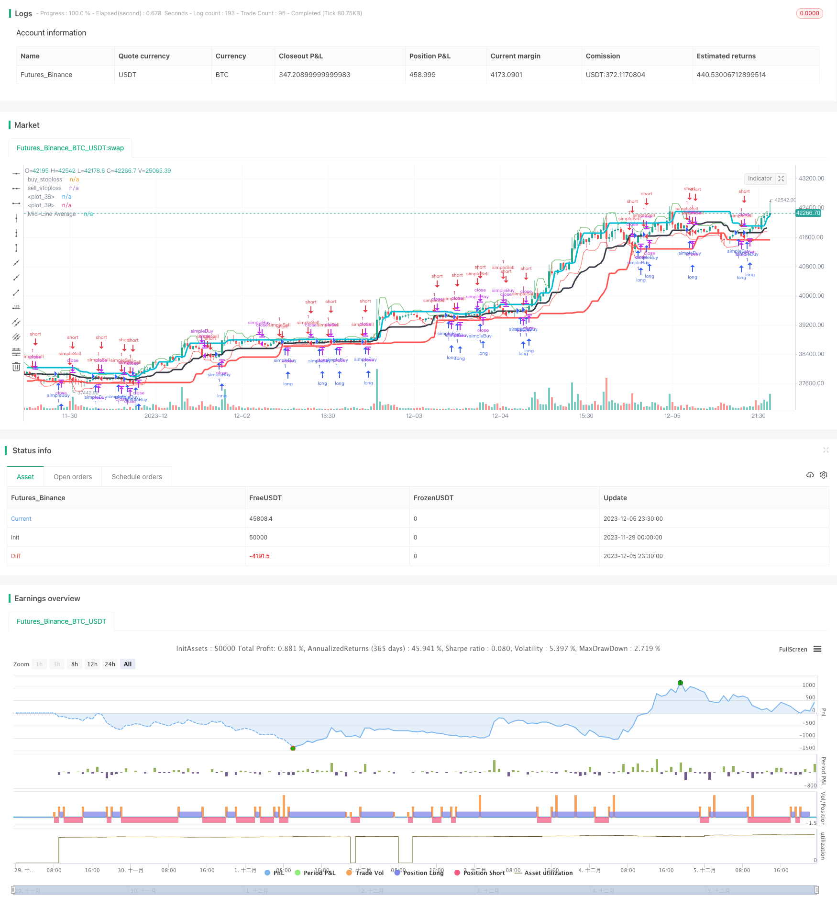

> Name

Donchian-Channel-With-Trailing-Stop-Loss-Strategy Donchian-Channel-With-Trailing-Stop-Loss-Strategy
> Author

ChaoZhang

> Strategy Description



[trans]

## Overview
This strategy is a trend following strategy based on the Donchian Channel indicator, combined with the dynamic stop loss of the ATR indicator to lock in profits, and is a trend following strategy.
## Strategy Principle
This strategy uses the Donchian Channel indicator with a length of 20 periods. The center line of the channel is the average of the highest and lowest prices. Go long when the price crosses the midline of the channel, and go short when the price crosses the midline of the channel below. The condition for closing the position is that the price touches the dynamic stop loss line. The calculation of the stop loss line is the lowest price of the last three K lines minus one-third of the ATR indicator value as a long stop loss. The highest price of the last three K lines plus one third of the ATR indicator value is used as a short stop loss.
## Advantage Analysis
This strategy mainly has the following advantages:
1. Use Tang Qian Channel to determine the market trend direction and effectively capture the trend.
2. Combined with ATR dynamic tracking stop loss, it can effectively control risks while ensuring profits.
3. Add the ATR factor when calculating the stop loss line to take market volatility into account and make the stop loss more reasonable.
4. The calculation method of the stop loss line is relatively stable and reliable, which avoids the stop loss being too close and reduces the probability of the stop loss being held accountable.
## Risk Analysis
This strategy mainly involves the following risks:
1. The Tang Qian channel has a certain hysteresis and may miss short-term opportunities.
2. Improper setting of ATR parameters may cause the stop loss to be too loose or too close
3. The trend judgment mechanism is relatively simple, and there may be many false signals in a consolidating market.
4. Lack of effective support and resistance judgment mechanism, the timing of entering the market may be inappropriate.
## Optimization direction
This strategy can be optimized from the following aspects:
1. Add other indicators to judge and avoid frequent trading in markets without clear trends.
2. Increase the judgment of support and resistance levels and optimize the timing of entry.
3. Try other dynamic stop loss calculation methods to further optimize the stop loss strategy
4. Test the impact of different Tang Qian channel period parameters on the strategy effect
5. Add filtering conditions such as transaction volume or increment to reduce the risk of entering wrong signals.
## Summarize
Overall, this strategy is a simple and practical trend following strategy. It uses the Donchian channel to determine the trend direction and uses dynamic stop loss to lock in profits, which can effectively track trend capturing. The strategy is highly practical, but can be further optimized in a variety of ways so that the strategy can still maintain stable returns in a more complex market environment.
||


## Overview

This is a trend following strategy based on the Donchian Channel indicator, combined with dynamic stop loss based on the ATR indicator to lock in profits. It belongs to the trend following strategy category.  

## Strategy Logic

The strategy uses a 20-period Donchian Channel, where the channel midline is the average of the highest high and lowest low. It goes long when price crosses above the channel midline and goes short when price crosses below the midline. The exit rule is when price touches the dynamic stop loss line, which is calculated as the lowest low of the recent 3 bars minus one third of the ATR value for long positions, and highest high of recent 3 bars plus one third of the ATR value for short positions.

## Advantage Analysis 

The main advantages of this strategy are:

1. Donchian Channel is effective in identifying market trend directions and catching trends.  
2. The dynamic trailing stop loss based on ATR locks in profits while controlling risks.
3. Incorporating ATR factor into stop loss calculation takes market volatility into consideration, making the stop more reasonable.  
4. The stop loss calculation method is stable and reliable, avoiding stops being too close and getting stopped out prematurely.

## Risk Analysis

The main risks of this strategy include:

1. Donchian Channel has some lagging effect, which may miss short-term opportunities.  
2. Improper ATR parameter setting may lead to stop loss being too wide or too close.
3. Trend determination mechanism is relatively simple, which may generate more false signals during market consolidations.  
4. Lack of effective support/resistance judgment, resulting in improper market entry timing.

## Optimization Directions

Some optimization directions for this strategy:

1. Add other indicators to avoid frequent trading when there is no clear trend.
2. Add support/resistance judgment to optimize entry timing.  
3. Test other dynamic stop loss calculation methods to further optimize the stop loss strategy.
4. Test the effects of different Donchian Channel period parameters on strategy performance. 
5. Add filters on volume or increments to reduce false signals.  

## Conclusion

In summary, this is a simple and practical trend following strategy. It identifies trend direction via Donchian Channel and locks in profits with dynamic trailing stop loss, which can effectively follow trends. The strategy is quite practical to use, but can be further optimized in various ways for better performance in more complex market environments.

[/trans]

> Strategy Arguments


|Argument|Default|Description|
|----|----|----|
|v_input_1|20|ATR Length:|
|v_input_2|2017|Backtest Start Year|
|v_input_3|true|Backtest Start Month|
|v_input_4|true|Backtest Start Day|
|v_input_5|2018|Backtest Start Year|
|v_input_6|12|testEndMonth|
|v_input_7|31|Backtest Start Day|
|v_input_8|20|Period|


> Source (PineScript)

``` pinescript
/*backtest
start: 2023-11-29 00:00:00
end: 2023-12-06 00:00:00
period: 30m
basePeriod: 15m
exchanges: [{"eid":"Futures_Binance","currency":"BTC_USDT"}]
*/

//@version=4
strategy(title = "dc",  overlay = true)
atrLength = input(title="ATR Length:", defval=20, minval=1)

testStartYear = input(2017, "Backtest Start Year")
testStartMonth = input(1, "Backtest Start Month")
testStartDay = input(1, "Backtest Start Day")
testPeriodStart = timestamp(testStartYear,testStartMonth,testStartDay,0,0)

testEndYear = input(2018, "Backtest Start Year")
testEndMonth = input(12)
testEndDay = input(31, "Backtest Start Day")
testPeriodEnd = timestamp(testEndYear,testEndMonth,testEndDay,0,0)


testPeriod() =>
    true
    //time >= testPeriodStart  ? true : false

dcPeriod = input(20, "Period")

dcUpper = highest(close, dcPeriod)[1]
dcLower = lowest(close, dcPeriod)[1]
dcAverage = (dcUpper + dcLower) / 2
atrValue=atr(atrLength)


useTakeProfit   = na
useStopLoss     = na
useTrailStop    = na
useTrailOffset  = na
//@version=1
Buy_stop = lowest(low[1],3) - atr(20)[1] / 3
plot(Buy_stop, color=red, title="buy_stoploss")
Sell_stop = highest(high[1],3) + atr(20)[1] / 3
plot(Sell_stop, color=green, title="sell_stoploss")

plot(dcLower, style=line, linewidth=3, color=red, offset=1)
plot(dcUpper, style=line, linewidth=3, color=aqua, offset=1)

plot(dcAverage, color=black, style=line, linewidth=3, title="Mid-Line Average")

strategy.entry("simpleBuy", strategy.long, when=(close > dcAverage) and cross(close,dcAverage))
strategy.close("simpleBuy",when= ( close< Buy_stop))
    
strategy.entry("simpleSell", strategy.short,when=(close < dcAverage) and cross(close,dcAverage) )
strategy.close("simpleSell",when=( close > Sell_stop))
    
//strategy.exit("Exit simpleBuy", from_entry = "simpleBuy", profit = useTakeProfit, loss = useStopLoss, trail_points = useTrailStop, trail_offset = useTrailOffset)
//strategy.exit("Exit simpleSell", from_entry = "simpleSell", profit = useTakeProfit, loss = useStopLoss, trail_points = useTrailStop, trail_offset = useTrailOffset)


```

> Detail

https://www.fmz.com/strategy/434585

> Last Modified

2023-12-07 16:53:10
