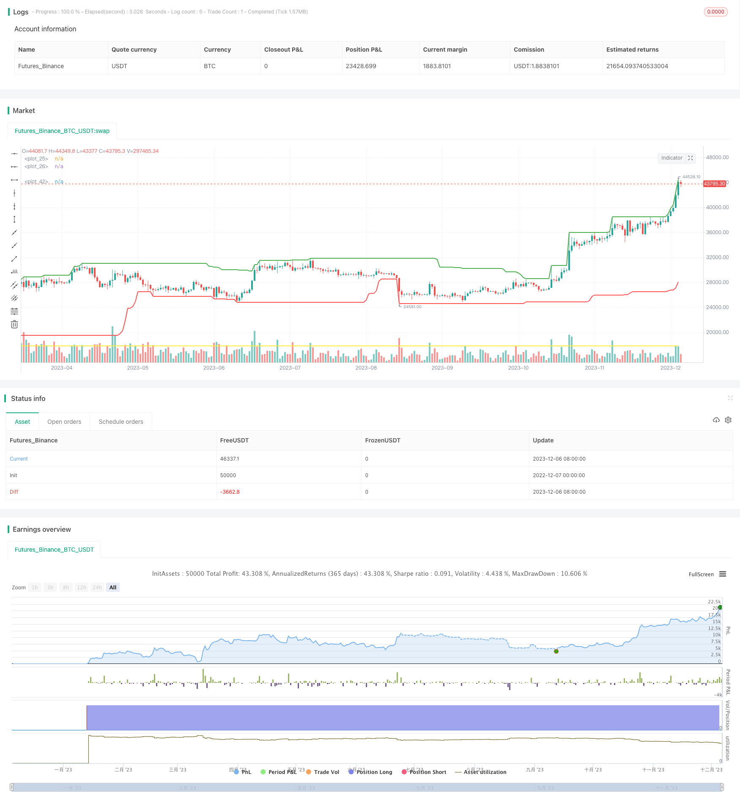

> Name

Donchian's quantitative trading strategy based on price channel breakoutDonchian-Channels-Breakout-Quantitative-Trading-Strategy
> Author

ChaoZhang

> Strategy Description


[trans]

## Overview
The core idea of ​​this strategy is to conduct buying and selling operations based on the price breakthrough of the Tang Qian Channel, which is a trend-following quantitative strategy. It can automatically identify the price channel, open a long position when the price breaks through the upper edge of the channel, and close the position when the price falls back to near the lower edge of the channel or the stop loss point. This strategy aims to capture medium and long-term price trends and is suitable for algorithmic trading of financial derivatives such as stock index futures.
## Principle
The strategy is based on the Donchian Channel indicator, which is a channel area drawn through the highest and lowest prices in a given period. The calculation method is:
Upper rail = the highest price in the past n periods
Lower track = the lowest price in the past n periods
When the price breaks through the upper band, it is considered to be a bullish trend; when the price falls below the lower band, it is considered to be a bearish trend. This strategy only considers breakouts from the upper rail.
The specific transaction logic is:
1. Use the highest price in n periods to draw the upper track of Donchian Channel
2. When the closing price breaks through the upper track, go long and enter the market
3. The take-profit method is when the closing price falls back to near the lower track of the channel or the set stop-loss point
## Advantages
This strategy has the following advantages:
1. The strategy is clear and easy to understand and implement.
2. The Tang Qian Channel indicator is mature and reliable, making it easy to determine the trend direction.
3. Automatically identify channels, eliminating the need for manual judgment of trends.
4. Configurable parameters, strong adaptability
5. Contains a stop-loss mechanism that can limit losses
## Risk
There are also some risks with this strategy:
1. The Tang Qian channel may be flat or false, resulting in unnecessary losses.
2. Improper setting of stop loss position may increase losses.
3. Pay attention to the reversal risk when approaching the channel
4. Improper parameter settings (period length, etc.) will affect the strategy effect
Corresponding solutions:
1. Combine with other indicators to filter out flat, false and broken results
2. Optimize stop loss position and smooth exit
3. Consider increasing trading volume near the channel or expanding the take-profit range
4. Test different parameters and find the optimal parameters
## Optimization direction
This strategy can also be optimized from the following aspects:
1. Add other indicators to judge to avoid flat and false breaks, such as MACD, KD, etc.
2. Optimize the stop loss mechanism, such as trailing stop loss with price fluctuations
3. Optimize participation control, such as only trading when volatility increases
4. Parameter optimization, finding the optimal parameter combination
## Summarize
The overall idea of ​​this strategy is clear, easy to understand and implement, and it uses the mature Donchian Channel indicator to automatically identify the trend direction. At the same time, the configuration is more flexible and can be adjusted according to actual needs. Through stop loss and parameter optimization, better results can be achieved. Generally speaking, this strategy is easy to use and has a certain degree of efficiency, making it suitable as one of the introductory strategies for quantitative trading.
||

## Overview

The core idea of this strategy is to make trading decisions based on price breakouts of Donchian Channels. It belongs to the trend following type of quantitative strategies. It can automatically identify price channels. When prices break through the upper rail of the channel, long positions will be opened. When prices fall back near the lower rail of the channel or the stop loss point, positions will be closed. This strategy aims to capture medium to long term price trends and is suitable for algorithmic trading of financial derivatives such as index futures.

## Principles 

This strategy is based on the Donchian Channels indicator. Donchian Channels are channels drawn by the highest and lowest prices over a given period. Its calculation method is:

Upper Rail = Highest price over last n periods
Lower Rail = Lowest price over last n periods

When prices break through the upper rail, it is considered that a long trend has started. When prices break through the lower rail, it is considered that a short trend has started. This strategy only considers cases when the upper rail is broken.

The specific trading logic is:

1. Plot the upper rail of Donchian Channels using highest price over last n periods 
2. When closing price breaks through the upper rail, go long
3. Profit taking by trailing stop when closing price falls back near lower rail or to a preset stop loss point

## Advantages

The advantages of this strategy include:

1. The strategy idea is clear and easy to understand and implement
2. Donchian Channels is a mature and reliable indicator for judging trend direction  
3. It automatically identifies channels without manual interference  
4. Customizable parameters make it highly adaptable
5. It contains stop loss mechanisms to limit losses

## Risks

There are also some risks:

1. Donchian Channels could have false breakouts, causing unnecessary losses
2. Improper stop loss positioning could increase losses
3. Pay attention to reversal risks when price is near the channel rails
4. Inadequate parameter settings could negatively impact strategy performance

Solutions:

1. Add filters by incorporating other indicators to avoid false breakouts
2. Optimize stop loss positioning for smooth exits
3. Consider increasing position size or widening profit range when price is near channel rails
4. Test different parameters to find optimum values

## Optimization Directions

This strategy can be further optimized in the following areas:

1. Add other indicators like MACD, KD to avoid false breakouts
2. Optimize stop loss mechanisms, e.g. moving stop loss
3. Optimize participate rate control, e.g. only trade when volatility rises
4. Parameter optimization to find optimum combination

## Summary 

The overall idea of this strategy is clear and easy to understand and implement. It utilizes mature Donchian Channels to automatically identify trend direction. The configuration is also highly flexible to cater for different needs. With proper stop loss and parameter optimization, good results can be achieved. In conclusion, this strategy has a low learning curve yet reasonable efficiency. It is suitable as a starter quantitative trading strategy.

[/trans]

> Strategy Arguments


|Argument|Default|Description|
|----|----|----|
|v_input_1|true|Select 1: Stock/Forex, 2: Future|
|v_input_2|10000|Money for each trade|
|v_input_3|2000|Insert first year to backtest|
|v_input_4|50|Period in bars of Donchian Channel|
|v_input_5|1000|Monetary Stop Loss|


> Source (PineScript)

``` pinescript
/*backtest
start: 2022-12-07 00:00:00
end: 2023-12-07 00:00:00
period: 1d
basePeriod: 1h
exchanges: [{"eid":"Futures_Binance","currency":"BTC_USDT"}]
*/

// This source code is subject to the terms of the Mozilla Public License 2.0 at https://mozilla.org/MPL/2.0/
// © Giovanni_Trombetta

// Strategy to capture price channel breakouts

//@version=4
strategy("ChannelsBreakout", max_bars_back=50, overlay=true)

instrument = input(1, title = "Select 1: Stock/Forex, 2: Future")
money = input(10000, title = "Money for each trade")
backtest_start = input(2000, "Insert first year to backtest")
period = input(50, title = "Period in bars of Donchian Channel")
monetary_stoploss = input(1000, title = "Monetary Stop Loss")

quantity = if instrument != 1 
    1
else
    int(money / close)
    
upBarrier = highest(high,period)
downBarrier = lowest(low,period)
up = highest(high,period / 4)
down = lowest(low,period / 4)

plot(upBarrier, color=color.green, linewidth=2)
plot(downBarrier, color=color.red, linewidth=2)
plot(up, color=color.lime, linewidth=1)
plot(down, color=color.orange, linewidth=2)

longCondition = crossover(close, upBarrier[1]) and year >= backtest_start

if (longCondition)
    strategy.entry("Long", strategy.long, quantity, when = strategy.position_size == 0)

closeCondition = crossunder(close, down[1]) or down < down[1]

if (closeCondition)
    strategy.close("Long", comment = "Trailing")
    
stop_level = strategy.position_avg_price - monetary_stoploss / strategy.position_size
strategy.exit("StopLoss", from_entry = "Long", stop = stop_level)
plot(stop_level, color=color.yellow, linewidth=2)

// l = label.new(bar_index, na,
//   text="PineScript Code", color= color.lime, textcolor = color.white,
//   style=label.style_labelup, yloc=yloc.belowbar, size=size.normal)
// label.delete(l[1])
```

> Detail

https://www.fmz.com/strategy/434675

> Last Modified

2023-12-08 11:00:05
