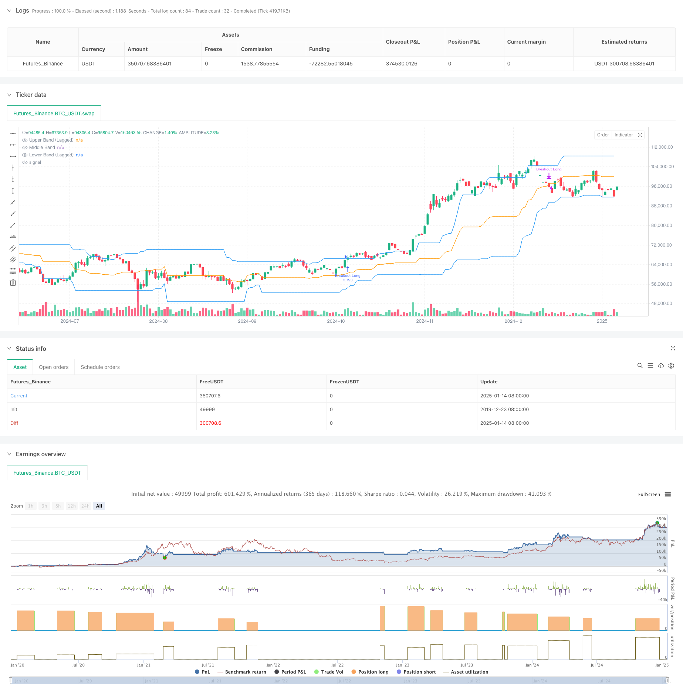

> Name

Donchian Channel Momentum Breakout Strategy Based on Multiple Conditions-Multi-Condition-Donchian-Channel-Momentum-Breakout-Strategy
> Author

ChaoZhang

> Strategy Description



[trans]
#### Overview
This is a momentum breakout trading strategy based on the Donchian Channel, which combines the two key conditions of price breakout and volume confirmation. This strategy captures the market's upward trend by observing whether prices break out of a predefined price range and calling for volume support. The strategy uses hysteresis parameters to improve the stability of the channel and provides flexible exit condition selection.
#### Strategy Principle
The core logic of the strategy includes the following key parts:
1. Use the lagging Donchian Channel as the main technical indicator to construct the upper, middle and lower rails by calculating the highest and lowest prices in the past 27 periods.
2. Admission conditions must be met at the same time:
   - The closing price broke through the upper track of Tang Qian Channel
   - The current trading volume is greater than 1.4 times the average trading volume in the past 27 periods
3. Entry conditions are flexible and optional:
   - You can choose to exit when the price falls below the upper track, middle track or lower track
   - Use the middle track as the exit signal by default
4. Improve the stability of the channel and reduce false breakthroughs through the lag parameter of 10 periods.
#### Strategic Advantages
1. Multiple confirmation mechanism: Combined with price breakthrough and volume confirmation, the risk of false signals is greatly reduced.
2. Strong adaptability: Through parametric design, the strategy can adapt to different market environments.
3. Improved risk control: Provides a variety of exit condition options to facilitate adjustments according to different risk preferences.
4. Clear execution: The entry and exit conditions are clear and there is no ambiguity.
5. Easy to implement: The strategy logic is simple and direct, making it easy to operate in real time.
#### Strategy Risk
1. Market fluctuation risk: Frequent false breakthrough signals may occur in volatile markets.
2. Slippage risk: The trading volume at the breakthrough moment is often larger, and you may face larger slippage.
3. Trend reversal risk: If the market suddenly reverses, it may be too late to exit the market in time.
4. Parameter sensitivity: The strategy effect is more sensitive to parameter settings and requires careful optimization.
#### Strategy optimization direction
1. Add trend filter: Additional trend judgment indicators can be added, such as moving average system.
2. Optimize trading volume indicators: You can consider using more complex trading volume analysis methods, such as OBV or capital flow indicators.
3. Improve the stop loss mechanism: add trailing stop loss or fixed stop loss function.
4. Add time filtering: You can add intraday time filtering to avoid trading during the opening and closing periods with large fluctuations.
5. Introduce volatility adaptation: automatically adjust parameters according to market volatility to improve the adaptability of the strategy.
#### Summary
This is a well designed and logical trend following strategy. By combining price breakthroughs and volume confirmations, the strategy maintains good flexibility while ensuring reliability. The parametric design of the strategy makes it highly adaptable, but it also requires investors to optimize and adjust according to specific market conditions. Overall, this is a strategic framework worthy of further optimization and practice.
|| 

#### Overview
This is a momentum breakout trading strategy based on the Donchian Channel, combining price breakout and volume confirmation as key conditions. The strategy captures upward market trends by observing price breakouts beyond a predefined range while requiring volume support. It incorporates a lag parameter to enhance channel stability and offers flexible exit conditions.

#### Strategy Principles
The core logic includes the following key components:
1. Uses a lagged Donchian Channel as the primary technical indicator, constructed using the highest and lowest prices over 27 periods.
2. Entry conditions require both:
   - Closing price breaks above the upper Donchian Channel band
   - Current volume exceeds 1.4 times the 27-period average volume
3. Flexible exit conditions:
   - Can exit when price falls below upper, middle, or lower band
   - Middle band is used as default exit signal
4. Implements a 10-period lag parameter to enhance channel stability and reduce false breakouts.

#### Strategy Advantages
1. Multiple confirmation mechanism: Combines price breakout and volume confirmation, significantly reducing false signals.
2. High adaptability: Parameterized design allows adaptation to different market conditions.
3. Comprehensive risk control: Offers multiple exit condition choices for different risk preferences.
4. Clear execution: Entry and exit conditions are well-defined without ambiguity.
5. Easy implementation: Simple and straightforward logic suitable for live trading.

#### Strategy Risks
1. Market volatility risk: May generate frequent false breakout signals in ranging markets.
2. Slippage risk: High trading volume during breakouts may lead to significant slippage.
3. Trend reversal risk: Sudden market reversals may not allow timely exits.
4. Parameter sensitivity: Strategy performance is sensitive to parameter settings, requiring careful optimization.

#### Optimization Directions
1. Add trend filters: Can incorporate additional trend indicators like moving average systems.
2. Enhance volume indicators: Consider using more sophisticated volume analysis methods like OBV or money flow indicators.
3. Improve stop-loss mechanism: Add trailing stop or fixed stop-loss functionality.
4. Implement time filters: Add intraday time filters to avoid trading during volatile opening and closing periods.
5. Introduce volatility adaptation: Automatically adjust parameters based on market volatility to improve strategy adaptability.

#### Summary
This is a well-designed trend-following strategy with clear logic. By combining price breakout and volume confirmation, the strategy maintains reliability while preserving flexibility. The parameterized design provides good adaptability, though investors need to optimize parameters based on specific market conditions. Overall, this represents a strategic framework worthy of further optimization and practical implementation.[/trans]


> Source (PineScript)

``` pinescript
/*backtest
start: 2019-12-23 08:00:00
end: 2025-01-15 08:00:00
period: 1d
basePeriod: 1d
exchanges: [{"eid":"Futures_Binance","currency":"BTC_USDT","balance":49999}]
*/

//@version=6

strategy("Breakout Strategy", overlay=true, calc_on_every_tick=false, initial_capital=10000, default_qty_type=strategy.percent_of_equity, default_qty_value=100, commission_type=strategy.commission.percent, commission_value=0.1, pyramiding=1, fill_orders_on_standard_ohlc=true)

// Input Parameters
start_date = input(timestamp("2018-01-01 00:00"), "Start Date")
end_date = input(timestamp("2060-01-01 00:00"), "End Date")
in_time_range = true
length = input.int(27, title="Donchian Channel Length", minval=1, tooltip="Number of bars used to calculate the Donchian channel.")
lag = input.int(10, title="Donchian Channel Offset", minval=1, tooltip = "Offset to delay the Donchian channel, enhancing stability.")
volume_mult = input.float(1.4, title="Volume Multiplier", minval=0.1, step=0.1, tooltip="Multiplier for the average volume to filter breakout conditions.")
closing_condition = input.string("Mid", title="Trade Closing Band", options= ["Upper","Lower","Mid"], tooltip = "Donchian Channel Band to use for exiting trades: Upper, Lower, or Middle.") //

// Donchian Channel (Lagged for Stability)
upper_band = ta.highest(high[lag], length)
lower_band = ta.lowest(low[lag], length)
middle_band = (upper_band + lower_band) / 2
plot(upper_band, color=color.blue, title="Upper Band (Lagged)")
plot(middle_band, color=color.orange, title="Middle Band")
plot(lower_band, color=color.blue, title="Lower Band (Lagged)")

// Volume Filter
avg_volume = ta.sma(volume, length)
volume_condition = volume > avg_volume * volume_mult

// Long Breakout Condition
long_condition = close > upper_band and volume_condition

bool reverse_exit_condition = false
// Exit Condition (Close below the middle line)
if closing_condition == "Lower"
    reverse_exit_condition := close < lower_band
else if closing_condition == "Upper"
    reverse_exit_condition := close < upper_band
else
    reverse_exit_condition := close < middle_band

// Long Strategy: Entry and Exit
if in_time_range and long_condition
    strategy.entry("Breakout Long", strategy.long)

// Exit on Reverse Signal
if in_time_range and reverse_exit_condition
    strategy.close("Breakout Long", comment="Reverse Exit")

```

> Detail

https://www.fmz.com/strategy/478689

> Last Modified

2025-01-17 14:28:22
