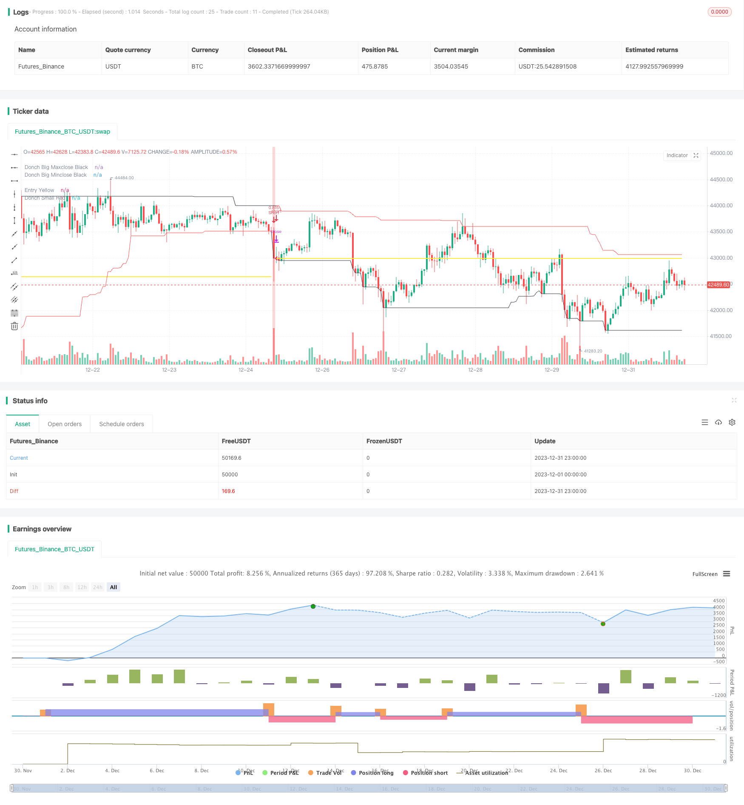

> Name

Donchian Trend Following StrategyDonchian-Trend-Following-Strategy
> Author

ChaoZhang

> Strategy Description


 [trans]
## Overview
The Donic Trend Following strategy is a trend following strategy developed based on the Donic Channel principles described in the article “Black Box Trend Following – Lifting the Veil”. This strategy uses the Donic Channel to determine the price trend and build long or short positions based on the price's new high or new low.
## Strategy Principle
The strategy determines the trend direction based on the Donichan Channel indicator. The Donichan channel consists of a longer period channel and a shorter period channel. When the price breaks through the channel with a longer period, it is judged that the trend has begun; when the price breaks through the channel with a shorter period, the trend is judged to have ended.
Specifically, the longer period channel length is 50 days or 20 days, and the shorter period channel length is 50 days, 20 days, or 10 days. If the price is equal to the highest price within 50 days, a long order is opened; if the price is equal to the lowest price within 50 days, a short order is opened. If the price is equal to the lowest price within 20 days or 10 days, the long order will be closed; if the price is equal to the highest price within 20 days or 10 days, the short order will be closed.
In this way, through the combination of two different periods of the Donic Channel, you can determine the direction to open a position when the trend begins, and stop the loss in time when the trend ends.
## Advantage Analysis
This strategy mainly has the following advantages:
1. Strong ability to capture trends. By breaking through the Donic Channel to determine the start and end of the trend, you can effectively track the trend.
2. Risk control is in place. Use trailing stop loss to control single losses.
3. Flexible parameter adjustment. You can freely choose the cycle combination of channels to adapt to different varieties and market environments.
4. Simple and clear transaction logic. Easy to understand and implement.
## Risk Analysis
This strategy also has the following risks:
1. Unable to adapt to the volatile market. When the trend is not obvious, there will be multiple small adjustments, resulting in stop loss losses.
2. Risk of breakthrough failure. After the price breaks through the channel, it may pull back again, causing a stop loss.
3. Cycle selection risk. If the channel period is set improperly, trading in noise will result.
4. Risk of Sharpe ratio decline. If you increase your position without adjusting the stop loss range, you will face the risk of a decline in the Sharpe ratio.
Corresponding solutions:
1. Optimize parameters and select the appropriate channel cycle combination.
2. Appropriately adjust positions and stop loss ranges to control risks.
3. Use this strategy in varieties and markets with obvious trends.
## Optimization direction
This strategy can be optimized from the following directions:
1. Add filter conditions to avoid whipsaws. For example, combining volume and energy indicators to determine the real breakthrough.
2. Optimize the combination of channel cycles and position control to improve the profit-loss ratio. An adaptive stop loss mechanism can be introduced.
3. Try breakpoint optimization to find the best parameter combination.
4. Add machine learning algorithms to achieve dynamic optimization and adjustment of parameters.
## Summarize
Donichang's trend following strategy uses dual channels to determine the beginning and end of the price trend, and adopts a trend following trading method to effectively control single losses. The parameters of this strategy are flexible to adjust and easy to implement. It is a very practical trend following strategy. However, we also need to pay attention to the lack of profitability under volatile market conditions and the risks brought by parameter selection. Through further optimization, better strategic effects can be obtained.
||

## Overview

The Donchian Trend Following strategy is developed based on the Donchian Channel principle described in the article "Black Box Trend Following – Lifting the Veil". This strategy uses the Donchian Channel to determine the trend direction and establishes long or short positions when prices hit new highs or lows.  

## Strategy Logic  

The strategy is based on the Donchian Channel indicator to judge the trend direction. The Donchian Channel consists of a longer period channel and a shorter period channel. When the price breaks through the longer period channel, it signals the start of a trend. When the price breaks through the shorter period channel, it signals the end of the trend.   

Specifically, the longer period channel length is 50 days or 20 days, and the shorter period channel length is 50 days, 20 days or 10 days. If the price equals the highest price in 50 days, a long position is opened. If the price equals the lowest price in 50 days, a short position is opened. If the price equals the lowest price in 20 or 10 days, long positions are closed. If the price equals the highest price in 20 or 10 days, short positions are closed.  

By combining two Donchian Channels of different periods, it can determine the direction to establish positions when a trend starts, and realize timely stop loss when the trend ends.  

## Advantage Analysis   

The main advantages of this strategy are:  

1. Strong ability to capture trends. It can track trends effectively by identifying the start and end of trends using Donchian Channel breakouts.   

2. Proper risk control. It uses a moving stop loss to control single trade loss.  

3. Flexible parameter adjustment. The combination of channel periods can be freely selected to adapt to different products and market environments.  

4. Simple and clear trading logic. It is easy to understand and implement.

## Risk Analysis

The risks of this strategy include:

1. Inability to adapt to range-bound markets. It will suffer consecutive small stop loss when the trend is unclear.  

2. Breakout failure risk. Prices may pullback after breaching the channel, causing stop loss. 

3. Period selection risk. Inappropriate channel period settings may lead to trading in noise.  

4. Sharpe ratio decline risk. Increasing position size without adjusting stop loss may lead to declining Sharpe ratio.

The solutions are:
1. Optimize parameters to select suitable channel period combinations.  
2. Adjust position size and stop loss properly to control risk.
3. Use this strategy for products and markets with obvious trends.  

## Optimization Directions

The optimization directions for this strategy:  

1. Adding filter conditions to avoid whipsaws, e.g. combining volume to judge true breakouts.

2. Optimizing channel period combination and position sizing to increase profit ratio. Adaptive stop loss can be introduced.  

3. Trying breakpoint optimization to find optimal parameter sets. 

4. Increasing machine learning algorithms for dynamic optimization and adjustment of parameters.

## Conclusion  

The Donchian Trend Following Strategy identifies the start and end of price trends using dual channels, and adopts trend following trading style with effective single trade loss control. This strategy has flexible parameter adjustment and easy implementation, making itself a very practical trend following strategy. But the insufficient profitability in range-bound markets and risks from parameter selection should be noted. Further optimizations can lead to better strategy performance.

[/trans]

> Strategy Arguments


|Argument|Default|Description|
|----|----|----|
|v_input_string_1|0|Length: 50/50|50/20|20/10|20/20|100/100|
|v_input_bool_1|true|Permit long|
|v_input_bool_2|true|Permit short|
|v_input_float_1|0.5|Position Risk %|
|v_input_float_2|2|ATR mult|
|v_input_int_1|20|ATR Length|
|v_input_bool_3|true|Close in end|
|v_input_bool_4|false|Permit stop|


> Source (PineScript)

``` pinescript
/*backtest
start: 2023-12-01 00:00:00
end: 2023-12-31 23:59:59
period: 1h
basePeriod: 15m
exchanges: [{"eid":"Futures_Binance","currency":"BTC_USDT"}]
*/

//@version=5
strategy(title="Donchian", overlay=true,
     pyramiding=0, initial_capital=1000,
     commission_type=strategy.commission.cash_per_order,
     commission_value=2, slippage=2)

// =============================================================================
// VARIABLES
// =============================================================================

donch_string = input.string(title="Length", options = ['20/10','50/20', '50/50', '20/20', '100/100'], defval='50/50')
permit_long  = input.bool(title = 'Permit long', defval = true)
permit_short  = input.bool(title = 'Permit short', defval = true)
risk_percent = input.float(title="Position Risk %", defval=0.5, step=0.25)
stopOffset = input.float(title="ATR mult", defval=2.0, step=0.5)
atrLen = input.int(title="ATR Length", defval=20)
close_in_end  = input.bool(title = 'Close in end', defval = true)
permit_stop  = input.bool(title = 'Permit stop', defval = false)

// =============================================================================
// CALCULATIONS
// =============================================================================

donch_len_big = 
 donch_string == '50/20' ? 50 : 
 donch_string == '50/50' ? 50 : 
 donch_string == '20/20' ? 20 : 
 donch_string == '20/10' ? 20 : 
 donch_string == '100/100' ? 100 : 
 na
donch_len_small = 
 donch_string == '50/20' ? 20 : 
 donch_string == '50/50' ? 50 : 
 donch_string == '20/20' ? 20 : 
 donch_string == '20/10' ? 10 : 
 donch_string == '100/100' ? 100 : 
 na

big_maxclose = ta.highest(close, donch_len_big)
big_minclose = ta.lowest(close, donch_len_big)
small_maxclose = ta.highest(close, donch_len_small)
small_minclose = ta.lowest(close, donch_len_small)

atrValue = ta.atr(atrLen)[1]

tradeWindow  = true

// =============================================================================
// NOTOPEN QTY
// =============================================================================

risk_usd = (risk_percent / 100) * strategy.equity
atr_currency = (atrValue * syminfo.pointvalue)
notopen_qty = risk_usd / (stopOffset * atr_currency)

// =============================================================================
// LONG STOP
// =============================================================================

long_stop_price = 0.0
long_stop_price := 
 strategy.position_size > 0 and na(long_stop_price[1]) ? strategy.position_avg_price - stopOffset * atrValue : 
 strategy.position_size > 0 and strategy.openprofit > risk_usd ? strategy.position_avg_price:
 strategy.position_size > 0 ? long_stop_price[1] : 
 na

// =============================================================================
// SHORT STOP
// =============================================================================

short_stop_price = 0.0
short_stop_price := 
 strategy.position_size < 0 and na(short_stop_price[1]) ? strategy.position_avg_price + stopOffset * atrValue : 
 strategy.position_size < 0 and strategy.openprofit > risk_usd ? strategy.position_avg_price :
 strategy.position_size < 0 ? short_stop_price[1] : 
 na

// =============================================================================
// PLOT VERTICAL COLOR BAR
// =============================================================================

cross_up = strategy.position_size <= 0 and close == big_maxclose and close >= syminfo.mintick and tradeWindow and permit_long
cross_dn =  strategy.position_size >= 0 and close == big_minclose and close >= syminfo.mintick and tradeWindow and permit_short
bg_color = cross_up ? color.green : cross_dn ? color.red : na
bg_color := color.new(bg_color, 70)
bgcolor(bg_color)

// =============================================================================
// PLOT DONCHIAN LINES
// =============================================================================

s1 = cross_up ? na : cross_dn ? na : strategy.position_size != 0 ? strategy.position_avg_price : na
s2 = cross_up ? na : cross_dn ? na : strategy.position_size > 0 ? small_minclose : strategy.position_size < 0 ? small_maxclose : na
s3 = cross_up ? na : cross_dn ? na : not permit_stop ? na : 
 strategy.position_size > 0 ? long_stop_price : strategy.position_size < 0 ? short_stop_price : na

plot(series=big_maxclose, style=plot.style_linebr, color=color.black, linewidth=1, title="Donch Big Maxclose Black")
plot(series=big_minclose, style=plot.style_linebr, color=color.black, linewidth=1, title="Donch Big Minclose Black")

plot(series=s1, style=plot.style_linebr, color=color.yellow, linewidth=2, title="Entry Yellow")
plot(series=s2, style=plot.style_linebr, color=color.red, linewidth=1, title="Donch Small Red")
plot(series=s3, style=plot.style_linebr, color=color.fuchsia, linewidth=2, title="Stop Fuchsia")

// =============================================================================
// ENTRY ORDERS
// =============================================================================

if strategy.position_size <= 0 and close == big_maxclose and close >= syminfo.mintick and tradeWindow and permit_long
    strategy.entry("Long", strategy.long, qty=notopen_qty)

if strategy.position_size >= 0 and close == big_minclose and close >= syminfo.mintick and tradeWindow and permit_short
    strategy.entry("Short", strategy.short, qty=notopen_qty)

// =============================================================================
// EXIT ORDERS
// =============================================================================

if strategy.position_size > 0 and permit_stop
    strategy.exit(id="Stop", from_entry="Long", stop=long_stop_price)

if strategy.position_size < 0 and permit_stop
    strategy.exit(id="Stop", from_entry="Short", stop=short_stop_price)

// ==========

if strategy.position_size > 0 and close == small_minclose and not barstate.islast
    strategy.close(id="Long", comment='Donch')

if strategy.position_size < 0 and close == small_maxclose and not barstate.islast
    strategy.close(id="Short", comment='Donch')

// ==========

if close_in_end
    if not tradeWindow
        strategy.close_all(comment='Close in end')

// =============================================================================
// END
// =============================================================================
```

> Detail

https://www.fmz.com/strategy/440557

> Last Modified

2024-01-31 16:53:31
