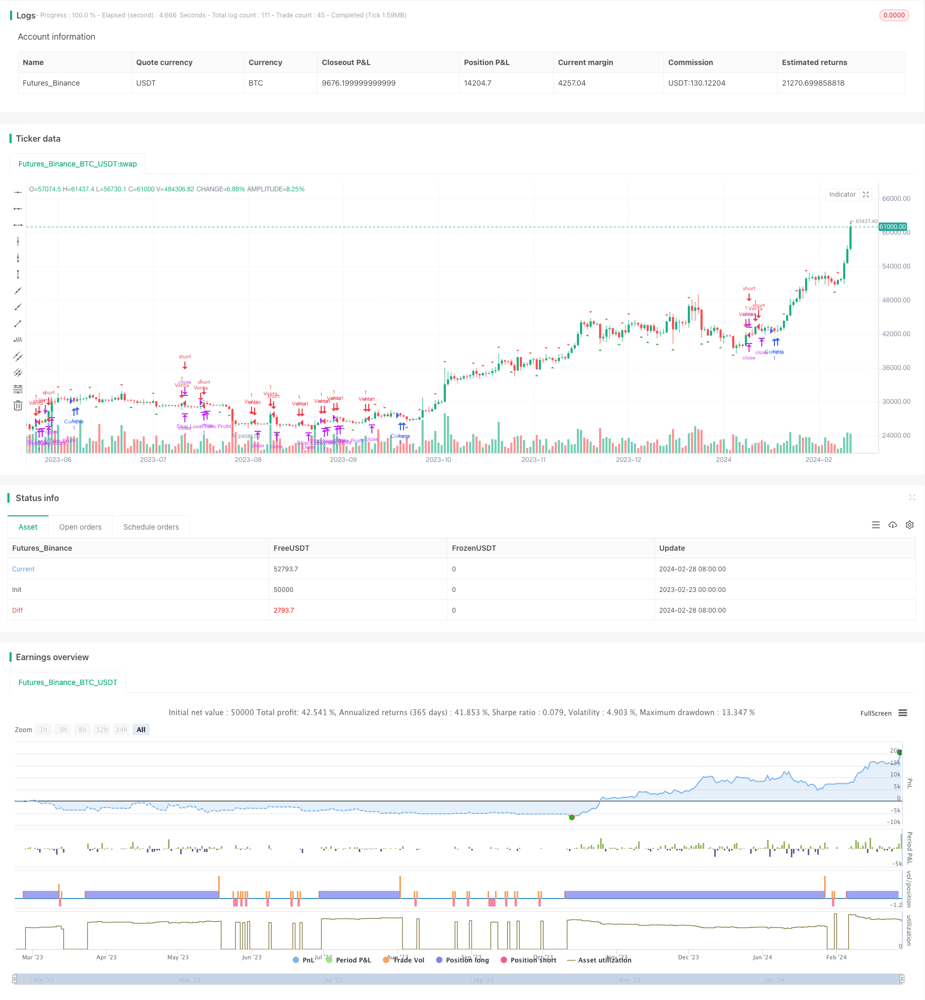

> Name

Double-Confirmation-Breakthrough-Strategy
> Author

ChaoZhang

> Strategy Description


[trans]

## Overview
The double confirmation breakout strategy is a trading strategy that combines a breakout strategy and a moving average strategy. This strategy uses the highest price and lowest price of the previous day as the key price levels, and then cooperates with the golden cross signal of the fast and slow moving average to carry out buying and selling operations.
## Strategy Principle
The core logic of the double confirmation breakout strategy is:
1. Check whether the price breaks through the highest or lowest price of the previous day. If the price exceeds the previous day's highest price, it is considered a bullish signal; if the price exceeds the previous day's lowest price, it is regarded as a bearish signal.
2. When a breakthrough occurs, check whether the fast line (10-day line) breaks upward through the slow line (30-day line). If so, perform a buying operation; if the fast line breaks below the slow line, sell.
3. Set a fixed stop-loss and take-profit ratio, and calculate the stop-loss price and take-profit price. For example, if the stop-loss and take-profit ratio set by the strategy is 1:4, then 4 times the stop-loss width is the take-profit width.
4. After opening a position, if the price triggers the stop-loss line, stop the loss and exit; if the take-profit target is reached, stop the profit and exit.
It can be seen that the double confirmation breakthrough strategy uses both the trend judgment indicator (moving average) and the breakthrough of important price levels (the previous day's high and low points) to confirm trading signals, and it is a relatively stable and reliable breakthrough system.
## Advantage Analysis
The double confirmation breakout strategy offers the following advantages:
1. Entering after breaking through the previous day's high or low can effectively reduce the probability of false breakthroughs, thereby improving the accuracy of entry.
2. The auxiliary judgment of the moving average is superimposed on it to avoid frequent opening of positions in volatile market conditions.
3. Using fixed take-profit and stop-loss ratios to manage funds can control risks and returns within an acceptable range.
4. The strategy rules are simple and clear, easy to understand and implement, and are suitable for quantitative trading.
## Risk Analysis
The double confirmation breakout strategy also has the following risks:
1. After a breakthrough, it is easy to form a short accumulation, thus triggering a reversal. To prevent this risk, you can confirm on the second K line after the breakthrough before entering the market.
2. In volatile market conditions, stop loss points are easily triggered. You can appropriately relax the stop loss range or increase the number of transactions to spread the risk.
3. The fixed take-profit and stop-loss ratio is not suitable for all varieties and market conditions, and parameters need to be adjusted for different markets.
4. Improper setting of moving average parameters will also lead to missing good opportunities or increasing unnecessary transactions. Parameters should be backtested and optimized regularly.
## Optimization direction
The double confirmation breakout strategy can be optimized from the following directions:
1. Increase the number of confirmed K lines. For example, after a breakthrough, observe whether the closing prices of 1-2 K lines also break through the important price level.
2. Use different parameter combinations for different varieties and market environments, such as fast and slow moving average cycles, take-profit and stop-loss ratios, etc., to perform backtest optimization.
3. Use it in conjunction with other auxiliary indicators, such as a surge in volume to confirm entry signals.
4. Increase the probability of machine learning models predicting market trends, and adjust strategy parameters based on probability signals.
## Summarize
The double confirmation breakthrough strategy comprehensively uses breakthrough signals at important price levels and moving average judgment indicators to effectively improve the quality of trading signals. At the same time, fixed stop-profit and stop-loss are used to manage capital risks so that it can operate stably. This is a quantitative strategy that integrates trend tracking and breakthroughs, and is suitable for traders who pursue stable returns.
Although this strategy also has some risks, the risks can be controlled and the rate of return of the strategy can be improved through continuous backtesting and optimization. This is a quantitative strategy worthy of in-depth study and application.
||

## Overview

The double confirmation breakthrough strategy is a trading strategy that combines breakout strategies and moving average strategies. This strategy uses the previous day's highest price and lowest price as key price levels, combined with golden cross and death cross signals of fast and slow moving averages, to make buy and sell operations.

## Strategy Principle  

The core logic of the double confirmation breakthrough strategy is:

1. Detect whether the price breaks through the highest price or lowest price of the previous day. If the price breaks through the highest price of the previous day, it is seen as a bullish signal; if the price breaks through the lowest price of the previous day, it is seen as a bearish signal.

2. When a breakthrough occurs, check if the fast line (10-day line) breaks up the slow line (30-day line). If so, a buy order is made; if the fast line breaks through the slow line downward, then sell.

3. Set a fixed stop loss and take profit ratio to calculate the stop loss price and take profit price. For example, if the strategy sets a stop loss and take profit ratio of 1:4, then the take profit range is 4 times the stop loss range.  

4. After opening a position, if the price triggers the stop loss line, stop loss to exit; if the take profit target is reached, take profit to exit.

It can be seen that the double confirmation breakthrough strategy utilizes the breakthrough of both trend judgment indicators (moving averages) and important price levels (previous day's highs and lows) to confirm trading signals, making it a relatively stable and reliable breakout system.

## Advantage Analysis

The double confirmation breakthrough strategy has the following advantages:

1. Entering after breaking through the previous day's high or low point can effectively reduce the probability of false breakouts, thereby improving the accuracy of entry.

2. The auxiliary judgment of the moving average is superimposed on it to avoid frequent opening positions in shock markets.

3. Adopting fixed stop loss and take profit ratio to manage capital risk can keep risks and returns within an affordable range. 

4. The strategy rules are simple and clear, easy to understand and implement, and suitable for quantitative trading.

## Risk Analysis  

The double confirmation breakthrough strategy also has the following risks:

1. It is easy to form short accumulations after breaking through, thus inducing reversals. To guard against this risk, confirmation can be made on the 2nd K-line after breaking through before entering the market.  

2. In oscillating markets, stop loss points are easily triggered. Stop loss range can be appropriately relaxed or trading frequency can be increased to diversify risks.

3. Fixed stop loss and take profit ratios are not suitable for all products and market conditions, and parameters need to be adjusted according to different markets.  

4. Inappropriate setting of moving average parameters can also miss better opportunities or increase unnecessary trading. Parameters should be backtested and optimized regularly.

## Optimization Directions

The double confirmation breakthrough strategy can be optimized in the following directions:

1. Increase the number of confirmation K-lines, for example, observe whether the closing price of 1-2 K-lines after the breakthrough has also broken through that important price level.

2. Adopt different parameter combinations for different products and market environments, such as moving average cycles, stop loss and take profit ratios, etc., for backtesting and optimization.

3. Combine it with other auxiliary indicators, such as a surge in trading volume, to confirm entry signals. 

4. Increase machine learning models to predict market trend probabilities and combine probability signals to adjust strategy parameters.

## Summary  

The double confirmation breakthrough strategy makes comprehensive use of breakthrough signals from important price levels and judgment indicators from moving averages, which can effectively improve the quality of trading signals. At the same time, the use of fixed stop loss and take profit to manage capital risk enables it to operate steadily. This is a quantitative strategy that combines trend tracking and breakouts, suitable for traders seeking stable returns.

Although there are some risks with this strategy, risks can be controlled and the strategy's returns improved through continuous backtesting and optimization. This is a quantitative strategy that is worth in-depth research and application.

[/trans]


> Source (PineScript)

``` pinescript
/*backtest
start: 2023-02-23 00:00:00
end: 2024-02-29 00:00:00
period: 1d
basePeriod: 1h
exchanges: [{"eid":"Futures_Binance","currency":"BTC_USDT"}]
*/

//@version=5
strategy("Estrategia de Trading con Señales de Máximo/Mínimo Diario", overlay=true)

// Obtenemos el alto y el bajo del día anterior
previousDailyHigh = request.security(syminfo.tickerid, "D", high[1], lookahead=barmerge.lookahead_on)
previousDailyLow = request.security(syminfo.tickerid, "D", low[1], lookahead=barmerge.lookahead_on)

// Detectamos si el precio cruza por encima del máximo o por debajo del mínimo del día anterior
priceCrossesPreviousHigh = ta.crossover(close, previousDailyHigh)
priceCrossesPreviousLow = ta.crossunder(close, previousDailyLow)

// Marcamos las señales en el gráfico con flechas bajistas y alcistas según corresponda
plotshape(priceCrossesPreviousHigh, style=shape.triangledown, location=location.abovebar, color=color.red, size=size.small, title="Price crosses above previous daily high")
plotshape(priceCrossesPreviousLow, style=shape.triangleup, location=location.belowbar, color=color.green, size=size.small, title="Price crosses below previous daily low")

// EMA rápida
fast_ema = ta.ema(close, 10)
// EMA lenta
slow_ema = ta.ema(close, 30)

// Riesgo beneficio fijo de 1-4
risk_reward_ratio = 4

// Calculamos el tamaño del stop loss basado en el riesgo asumido
risk = close - strategy.position_avg_price
stop_loss = close - (risk / risk_reward_ratio)

// Condiciones de compra y venta
buy_condition = priceCrossesPreviousLow and fast_ema > slow_ema
sell_condition = priceCrossesPreviousHigh and fast_ema < slow_ema

// Marcar entradas
strategy.entry("Compra", strategy.long, when=buy_condition)
strategy.entry("Venta", strategy.short, when=sell_condition)

// Definir objetivo de beneficio basado en el tamaño del stop loss y el riesgo beneficio fijo
target_profit = close + (risk * risk_reward_ratio)

// Definir stop loss y objetivo de beneficio
strategy.exit("Stop Loss/Take Profit", "Compra", stop=stop_loss, limit=target_profit)
strategy.exit("Stop Loss/Take Profit", "Venta", stop=stop_loss, limit=target_profit)

// Señales de compra y venta
plotshape(series=buy_condition, title="Compra", location=location.belowbar, color=color.green, style=shape.triangleup)
plotshape(series=sell_condition, title="Venta", location=location.abovebar, color=color.red, style=shape.triangledown)

```

> Detail

https://www.fmz.com/strategy/443229

> Last Modified

2024-03-01 10:55:27
