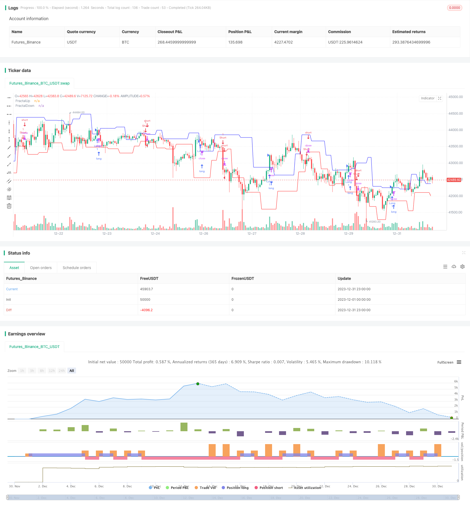

> Name

Double-Fractal-Breakout-Strategy
> Author

ChaoZhang

> Strategy Description


[trans]

## Overview
The double fractal breakthrough strategy is a quantitative trading strategy based on technical forms. This strategy works by identifying the formation of double bottom fractals and double top fractals and issuing buy and sell signals when price breaks through these fractals.
## Strategy Principle
The core idea of ​​this strategy is based on fractal theory. When a short-term turning point similar to an M or W shape occurs, it indicates that the current trend may be reversing. Specifically, when five consecutive K lines form a specific combination of higher height or lower low, a bottom fractal or a top fractal will be formed. For example, if in the K-line chart, the highest price of the first two K lines is higher than the highest price of the following three K lines, then a top fractal is formed.
When the price falls below the bottom fractal or rises above the top fractal, this indicates that a reversal is more likely, so the strategy generates buy and sell signals respectively.
## Strategic Advantages
The main advantage of this strategy is the ability to identify potential trend reversal points, which is very useful for trend-following type trading strategies. In addition, compared to strategies that only rely on a single K-line pattern, the recognition of dual fractals makes trading signals more reliable.
## Strategy Risk
The main risk with this strategy is that fractal identification does not guarantee a 100% price reversal. Sometimes prices may only adjust for a short period of time without a trend change occurring. At this time, if the strategy generates wrong signals, unnecessary losses will result. To reduce this risk, you can combine it with other indicators such as trading volume to verify the possibility of price reversal.
## Strategy optimization
This strategy can be further optimized by:
1. Add filtering conditions, such as trading volume indicators, etc., to avoid being misled by false reversals.
2. Adjust parameters to identify dual fractals over larger time periods in order to capture the reversal of the general trend.
3. Combine with the trailing stop loss strategy to reduce the loss of losing orders.
## Summarize
The double fractal breakout strategy is a common technical indicator-driven strategy by identifying specific K-line patterns to determine potential price reversals. It can effectively track the short-term and medium-term trends of the market and has a high profit-loss ratio, making it a reliable and practical trading strategy.
||

## Overview

The double fractal breakout strategy is a quantitative trading strategy based on technical pattern recognition. It identifies potential trend reversals by detecting double bottom and double top fractal formations, and generates buy and sell signals when prices break out of these fractals.

## Strategy Logic

The core idea behind this strategy lies in fractal theory. The emergence of M-shaped or W-shaped short term turning points suggests a possible reversal of the prevailing trend. Specifically, bottom or top fractals form when 5 consecutive bars create particular high/low combinations of relative greater/lower highs/lows. For example, a top fractal forms when the highest prices of the former 2 bars are above those of the latter 3 bars.  

The strategy generates long and short signals when prices break below bottom fractals and above top fractals respectively, as such breakouts indicate a higher likelihood of trend reversal.

## Advantages

The main advantage of this strategy is its ability to detect potential trend reversal points, which can be very useful for trend-following trading systems. Additionally, the double fractal pattern provides more reliable trading signals compared to strategies relying solely on single bar patterns. 

## Risks

The major risk is that fractal detection does not guarantee price reversals with full certainty. Sometimes prices may just be making short-term corrections without real trend changes. Incorrect signals can lead to unnecessary losses in such cases. To mitigate this risk, other indicators like trading volumes can be used to verify the validity of reversal signals.

## Enhancement

Possible ways to enhance this strategy include:

1. Adding filters like volume to avoid false reversals. 

2. Tuning parameters to detect larger-degree double fractals and capture big trend turns.

3. Incorporating moving stop loss to reduce losses from bad trades.

## Conclusion

The double fractal breakout strategy identifies potential price reversals by detecting specific technical patterns. As a technical indicator-driven approach, it can effectively track short and medium-term trends in the market and provide respectable risk-reward outcomes. It is a reliable and practical trading system overall.

[/trans]


> Source (PineScript)

``` pinescript
/*backtest
start: 2023-12-01 00:00:00
end: 2023-12-31 23:59:59
period: 1h
basePeriod: 15m
exchanges: [{"eid":"Futures_Binance","currency":"BTC_USDT"}]
*/

//@version=4
// This source code is subject to the terms of the Mozilla Public License 2.0 at https://mozilla.org/MPL/2.0/
// © ceyhun

strategy("Fractal Breakout Strategy", overlay=true)

FUp = high[4] < high[2] and high[3] < high[2] and high[1] < high[2] and high < high[2] or 
   high[5] < high[2] and high[4] < high[2] and high[3] <= high[2] and 
   high[1] < high[2] and high < high[2] or 
   high[6] < high[2] and high[5] < high[2] and high[4] <= high[2] and 
   high[3] <= high[2] and high[1] < high[2] and high < high[2] or 
   high[7] < high[2] and high[6] < high[2] and high[5] <= high[2] and 
   high[4] <= high[2] and high[3] <= high[2] and high[1] < high[2] and 
   high < high[2] or 
   high[8] < high[2] and high[7] < high[2] and high[6] <= high[2] and 
   high[5] <= high[2] and high[4] <= high[2] and high[3] <= high[2] and 
   high[1] < high[2] and high < high[2]
FractalUp = valuewhen(FUp, high[2], 1)
plot(FractalUp, color=#0000FF,title="FractalUp")

FDown = low[4] > low[2] and low[3] > low[2] and low[1] > low[2] and low > low[2] or 
   low[5] > low[2] and low[4] > low[2] and low[3] >= low[2] and low[1] > low[2] and 
   low > low[2] or 
   low[6] > low[2] and low[5] > low[2] and low[4] >= low[2] and low[3] >= low[2] and 
   low[1] > low[2] and low > low[2] or 
   low[7] > low[2] and low[6] > low[2] and low[5] >= low[2] and low[4] >= low[2] and 
   low[3] >= low[2] and low[1] > low[2] and low > low[2] or 
   low[8] > low[2] and low[7] > low[2] and low[6] >= low[2] and low[5] >= low[2] and 
   low[4] >= low[2] and low[3] >= low[2] and low[1] > low[2] and low > low[2]
FractalDown = valuewhen(FDown, low[2], 1)
plot(FractalDown, color=#FF0000,title="FractalDown")

if crossover(close, FractalUp)
    strategy.entry("Long", strategy.long, comment="Long")

if crossunder(close, FractalDown)
    strategy.entry("Short", strategy.short, comment="Short")

```

> Detail

https://www.fmz.com/strategy/440439

> Last Modified

2024-01-30 15:53:27
