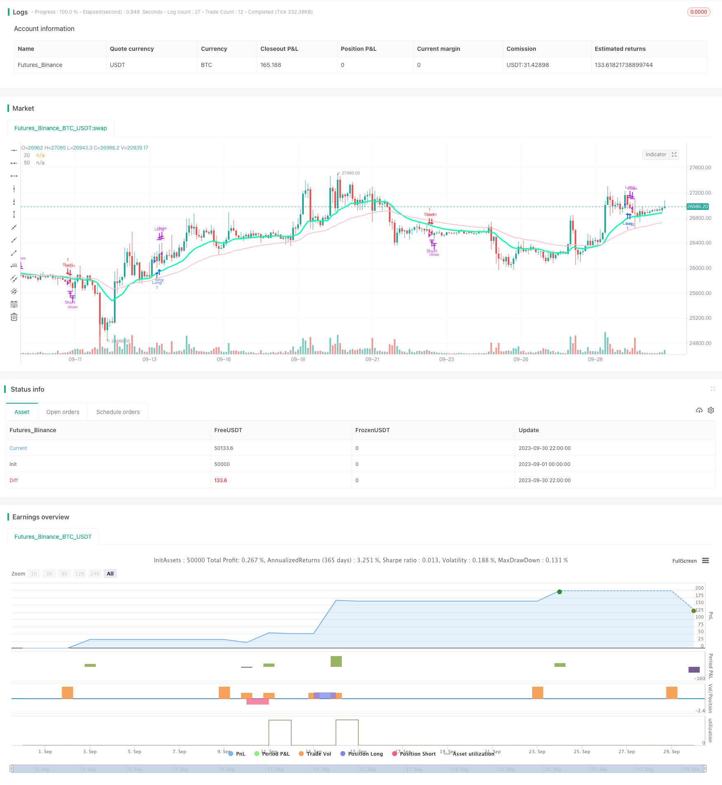

> Name

Double-Moving-Average-Crossover-Strategy
> Author

ChaoZhang

> Strategy Description



[trans]


## Overview
The dual-track tracking moving average strategy is a typical moving average crossover strategy. It determines market trends by calculating moving averages of different periods, and uses moving average crossovers to perform buying and selling operations. This strategy is simple and practical, suitable for medium and long-term position trading.
## Strategy Principle
This strategy mainly uses the 20-period and 50-period exponential moving averages (EMA) to determine market trends. The specific logic is:
1. Calculate 20-period EMA and 50-period EMA.
2. When the 20-period EMA crosses the 50-period EMA, it is considered that the market is in an upward trend and you can buy.
3. When the 20-period EMA crosses below the 50-period EMA, the market is considered to be in a downward trend and you can sell. 
4. Once bought, if the 20-period EMA falls below the 50-period EMA again, sell immediately and stop the loss.
5. Once sold, if the 20-period EMA crosses the 50-period EMA again, you should buy immediately to ensure that you do not miss the buying point.
Through this logic, the dual-track moving average strategy can track changes in market trends, dynamically adjust positions, and achieve the purpose of tracking the market and earning profits.
## Strategic advantage analysis
The dual-track moving average strategy has the following advantages:
1. Simple operation and easy to implement. It is only necessary to calculate and compare the size relationship between the two moving averages, and no complex prediction and modeling is required.
2. Follow the market trend and avoid forced operations against the market. Utilize the trend following characteristics of moving averages and only enter the market when the trend is clear.
3. Automatic stop loss and risk control. When the market suddenly reverses, you can quickly stop losses and protect funds.
4. Cover losses and do not miss buying points. When the market turns bullish again after the stop loss, you can also catch up and cover the increase in time.
5. Flexible parameters and strong applicability. The moving average parameters are adjustable and suitable for different market environments.
6. High capital utilization efficiency. Follow the trend and switch positions to maximize the efficiency of funds.
## Risk Analysis
The dual-track moving average strategy also has some risks:
1. Frequent transactions are easily consumed by transaction fees. Frequent crossing of double moving averages may lead to too frequent trading.
2. There are many false signals in the volatile market. In a volatile market, the moving average may produce multiple false crossovers, leading to losses.
3. Setting reasonable parameters is critical. Improper parameter setting, too large or too small stop loss range may cause losses.
4. It is difficult to deal with emergencies. When a major black swan event occurs, technical indicators are difficult to deal with and may cause greater losses.
5. Miss key market points. The dual moving average strategy cannot determine the key support and key resistance points of the market.
In response to the above risks, we can control risks by optimizing parameter settings, filtering signals in combination with other indicators, setting stop loss and profit, and using fund management.
## Optimization direction
The dual-track moving average strategy can be optimized from the following aspects:
1. Optimize the moving average parameters to adapt to different market environments. You can test different combinations of short-term and long-term moving averages to find a set of Parameters suitable for the current market.
2. Add trading volume indicators for signal filtering. For example, when a breakthrough occurs, trading volume is required to increase to avoid unlimited breakthroughs.
3. Combine with other indicators for signal verification. For example, when indicators such as MACD and Stochastic are in the same direction as the moving average, the Entry signal is more reliable.
4. Dynamically adjust the stop loss range. When volatility increases, the stop loss range can be appropriately relaxed to reduce the probability of virtual stop loss being triggered.
5. Optimize fund management strategies. For example, after risk assessment, set a reasonable position size to avoid excessive losses in a single transaction.
6. Use different Entry logic to distinguish trending markets from oscillating markets. In a volatile market, you can tighten the entry conditions and wait for more reliable entry opportunities.
## Summarize
The double-track moving average strategy is a very typical and practical trend following strategy. It has the advantages of simple operation, following the trend, automatic stop loss, covering losses, etc., and is very suitable for medium and long-term position trading. We should also pay attention to its frequent transactions and the tendency to generate false signals. It can be improved through parameter optimization, adding filters, fund management and other methods to make the strategy more stable and reliable. If you want to trade based on trends and follow the market, the double moving average strategy is a good choice.
|| 

## Overview

The double moving average crossover strategy is a typical trend following strategy using moving averages. It identifies market trend by comparing two moving averages of different periods and generates buy and sell signals when the averages cross over. This simple and practical strategy is suitable for medium to long term position trading.

## Strategy Logic

The strategy mainly utilizes 20-period and 50-period exponential moving averages (EMA) to determine market trend. The logic is:

1. Calculate 20-period EMA and 50-period EMA. 
2. When 20-period EMA crosses above 50-period EMA, market is considered in uptrend and long position can be taken.
3. When 20-period EMA crosses below 50-period EMA, market is considered in downtrend and short position can be taken.
4. If already long, close long when 20-period EMA crosses below 50-period EMA. This stop loss avoids further loss.
5. If already short, close short when 20-period EMA crosses above 50-period EMA. This catches upside movements.

With this logic, the double EMA strategy is able to follow trend changes dynamically, adjusting position to maximize profit during the trend.

## Advantage Analysis 

The double moving average crossover strategy has the following advantages:

1. Simple to implement. Only comparison between two averages is needed, without complex prediction or modeling.

2. Follows market trend, avoids trading against trend. Utilizes trend tracking ability of moving averages to only enter market when trend is clear.

3. Automatic stop loss for risk control. Quickly exits losing trades when trend suddenly reverses.

4. Makeup losing trades, catches upside. Re-enters after stop loss when trend turns bullish again.

5. Flexible parameters, adaptable. MA periods can be adjusted for different market environments. 

6. High capital utilization. Frequently adjusts position based on trend, keeping capital fully utilized.

## Risk Analysis

There are also some risks with this strategy:

1. Frequent trading costs. Frequent crosses may lead to excessive transactions.

2. False signals in range-bound markets. Moving averages may cross over multiple times in choppy markets, causing losses.

3. Parameter tuning critical. Inadequate stop loss or take profit setting can lead to losses. 

4. Unable to respond to black swan events. Technical indicators have limited ability to capture extreme events.

5. Misses key support/resistance. Double MA strategy does not identify critical points.

To manage the risks, methods like parameter optimization, adding filters, stop loss, position sizing based on risk assessment can be applied.

## Improvement Directions

The double moving average strategy can be enhanced in several aspects:

1. Optimize MA parameters for changing markets. Test different short and long term MA combinations to find best fit for current environment.

2. Add volume filter to avoid false breakouts. Require confirming volume when breakout happens.

3. Incorporate other indicators for signal validation. Higher reliability when indicators like MACD, Stochastic etc. align with MA crossover. 

4. Dynamically adjust stop loss width. Widen stop loss when volatility increases to avoid premature exit.

5. Optimize capital management. Determine position size based on risk to limit loss on single trades.

6. Use different entry logic for trending vs. range-bound markets. Tighten entry rules in choppy markets, waiting for high conviction signals.

## Conclusion

The double moving average crossover is a very typical and practical trend following strategy. It has the advantages of easy implementation, following trends, automatic stop loss, makeup losing trades etc., making it very suitable for medium/long-term position trading. We should also pay attention to the risks like over-trading and false signals. These can be improved via parameter tuning, adding filters and proper capital management. For traders looking to ride the trend, this is a simple yet solid strategy.

[/trans]


> Source (PineScript)

``` pinescript
/*backtest
start: 2023-09-01 00:00:00
end: 2023-09-30 23:59:59
period: 2h
basePeriod: 15m
exchanges: [{"eid":"Futures_Binance","currency":"BTC_USDT"}]
*/

//@version =4
strategy("Moving Average Cross", overlay=true)

ema20 =  ema(close, 20)
ema50 =ema(close, 50)

long = ema20 > ema50
short = ema20 < ema50

longcondition = long and long[10] and not long[11]
shortcondition = short and short[10] and not short[11]

closelong = ema20 < ema50 and not long[11]
closeshort = ema20 > ema50 and not short[11]


plot(ema20, title="20", color=#00ffaa, linewidth=3)
plot(ema50, title="50", color=#FFC1CC, linewidth=2)

start = timestamp(2015,6,1,0,0)

end = timestamp(2019,6,1,0,0)

if true
    strategy.entry("Long" ,strategy.long,  when = longcondition)
    strategy.entry("Short" ,strategy.short, when = shortcondition)


strategy.close("Long", when = closeshort)
strategy.close("Short", when = closelong)
```

> Detail

https://www.fmz.com/strategy/430152

> Last Modified

2023-10-25 15:14:35
