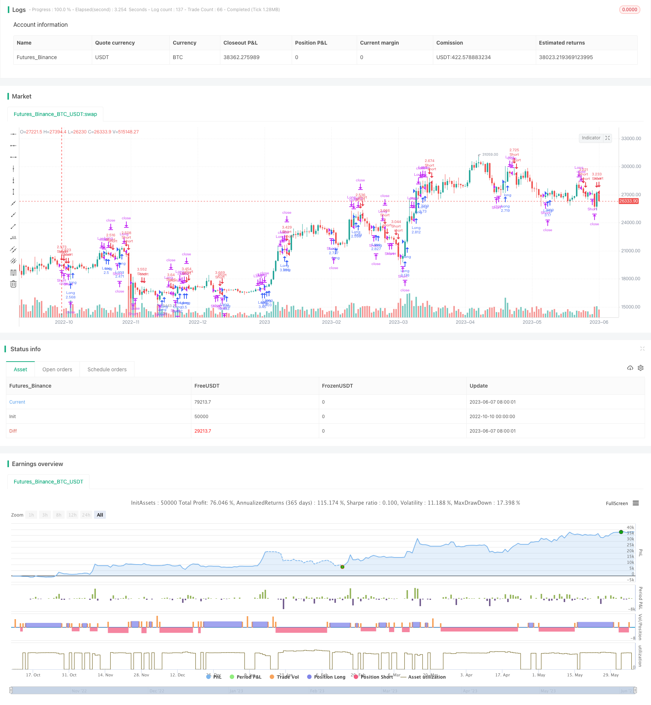

> Name

Double-Moving-Average-Reversal-Strategy
> Author

ChaoZhang

> Strategy Description



[trans]


The Double Moving Average Mean Reversal Strategy is a trend following strategy. It calculates the moving averages of different periods to determine whether the price trend has reversed, so as to capture the trend reversal point and realize buying low and selling high.
This strategy first calculates two sets of moving averages with different periods, one is a longer period moving average, used to judge the overall trend; the other is a shorter period moving average, used to judge the local trend. The strategy determines whether the overall trend has reversed by comparing the relationship between the two sets of moving averages.
Specifically, the strategy first calculates a set of two moving averages with a longer period (such as the 60-day moving average), namely the 60-day simple moving average and the 60-day weighted moving average. This set of moving averages is used to determine the overall trend. In addition, the strategy calculates a set of two moving averages with a shorter period (such as the 5-day moving average), namely the 5-day simple moving average and the 5-day weighted moving average. This set of moving averages is used to determine local trends.
When the short-term moving average crosses the long-term moving average, it means that the price reverses, from falling to rising, and this strategy will open a long position; when the short-term moving average crosses below the long-term moving average, it means that the price reverses, from rising to falling, and this strategy will open a short position.
The specific operations are as follows:
1. Calculate the 60-day simple moving average nma and the 60-day weighted moving average n2ma
2. Calculate the 5-day simple moving average nma1 and the 5-day weighted moving average n2ma1
3. Compare n2ma1 and nma1: If n2ma1 crosses nma1 above, open a long position; if n2ma1 crosses nma1 below, open a short position
4. Compare n2ma and nma: If n2ma crosses nma above and a long position has been opened, continue to hold a long position; if n2ma crosses below nma and a short position has been opened, continue to hold a short position
5. When the price exceeds the stop loss point or reaches the take profit point, close the position
6. Repeat the above process to catch trend reversals and buy low and sell high
The advantage of this strategy is that the double moving average combination can more sensitively capture the reversal of the price trend. The double moving average reversal is a classic technical indicator signal. At the same time, the combination of moving averages of different periods can judge the overall trend and local trends, and realize trend tracking.
The risk of this strategy is that the double moving average reversal signal may appear as a false signal, leading to random entry or U-turn exit, increasing trading risks. In addition, the moving average system is prone to produce false signals for markets with a large consolidation range. Finally, the dual moving average system requires a longer backtest period to verify the stability of the parameter settings.
This strategy can be optimized from the following aspects:
1. Optimize the period parameters of the moving average and find the best parameter combination
2. Add other technical indicator filters to avoid false breakthroughs
3. Add stop-loss and stop-profit strategies to control single profit and loss
4. Combine trend trading timing to avoid erroneous transactions that shake the market
5. Dynamically adjust position size to adapt to changes in market fluctuations
To sum up, the dual moving average mean reversal strategy captures the price trend reversal point by comparing the relationship between moving averages of different periods, so as to achieve the purpose of buying low and selling high. Optimizing parameter settings, adding filtering conditions, and controlling risks are the directions in which this strategy can be improved. Used properly, it can become an effective tool for quantitatively capturing trend turning points.
|| 


The Double Moving Average Reversal strategy is a trend following strategy. It calculates moving averages of different periods to determine if the price trend reverses, in order to capture turning points and achieve buying low and selling high.

This strategy first calculates two sets of moving averages with different periods. One set is long-period moving averages, which is used to determine the overall trend. The other set is short-period moving averages, which is used to determine the local trend. By comparing the relationship between the two sets of moving averages, the strategy judges whether the overall trend has reversed.

Specifically, the strategy first calculates two long-period (e.g. 60-day) moving averages, which are the 60-day simple moving average and the 60-day weighted moving average. This set of moving averages is used to determine the overall trend. In addition, the strategy calculates two short-period (e.g. 5-day) moving averages, which are the 5-day simple moving average and the 5-day weighted moving average. This set of moving averages is used to determine the local trend.

When the short-term moving average crosses above the long-term moving average, it indicates the price has reversed from downtrend to uptrend. The strategy will open long positions. When the short-term moving average crosses below the long-term moving average, it indicates the price has reversed from uptrend to downtrend. The strategy will open short positions. 

The specific steps are:

1. Calculate the 60-day simple moving average nma and 60-day weighted moving average n2ma

2. Calculate the 5-day simple moving average nma1 and 5-day weighted moving average n2ma1

3. Compare n2ma1 and nma1: if n2ma1 crosses above nma1, open long positions; if n2ma1 crosses below nma1, open short positions

4. Compare n2ma and nma: if n2ma crosses above nma and long position is opened, continue holding long; if n2ma crosses below nma and short position is opened, continue holding short 

5. Close positions when price exceeds stop loss or reaches take profit

6. Repeat the above process to capture trend reversal and achieve buying low and selling high

The advantage of this strategy is that the double moving average combination can sensitively capture the reversal of price trend. The double moving average crossover is a classic technical indicator signal. Also, the combination of different period moving averages can judge both overall and local trends, achieving trend following.

The risk of this strategy is that the double moving average crossover may have false signals, causing mistiming entering or exiting positions, thus increasing trading risk. In addition, moving average systems are prone to wrong signals in range-bound markets. Finally, the double moving average system requires relatively long backtesting period to verify the stability of parameter settings.

The strategy can be optimized in the following aspects:

1. Optimize the moving average periods to find the best parameter combination

2. Add other technical indicator filters to avoid false breakouts 

3. Add stop loss and take profit to control single trade risk

4. Combine with trend trading timing to avoid erroneous trades in sideways markets

5. Dynamically adjust position sizing to adapt to changing market volatility

In conclusion, the Double Moving Average Reversal strategy captures price trend turning points by comparing different period moving averages, in order to achieve buying low and selling high. Optimizing parameter settings, adding filters, and controlling risks are directions for improving the strategy. When used properly, it can be an effective tool to quantitatively capture trend reversals.

[/trans]

> Strategy Arguments


|Argument|Default|Description|
|----|----|----|
|v_input_1|0.001|Decision Threshold|
|v_input_2|true|Post Signal Bar Delay|
|v_input_3|5|Close Position Bar Delay|
|v_input_4|7|Double HullMA Cross|


> Source (PineScript)

``` pinescript
/*backtest
start: 2022-10-10 00:00:00
end: 2023-06-08 00:00:00
period: 1d
basePeriod: 1h
exchanges: [{"eid":"Futures_Binance","currency":"BTC_USDT"}]
*/

//@version=2
//                   //////////////// Attempt to Reduced ReDraw version /////////////////////
//
//                         Microcana.com strategy by pilotgsms - version 4.20b <<<< Edited by Seaside420 >>>> special thanks to 55cosmicpineapple
//                            Hull_MA_cross added to script
strategy("M&H_v420b", overlay=true, default_qty_type=strategy.percent_of_equity, default_qty_value=100, calc_on_order_fills= true, calc_on_every_tick=true, pyramiding=0)
dt = input(defval=0.0010, title="Decision Threshold", type=float, step=0.0001)
dd = input(defval=1, title="Post Signal Bar Delay", type=float, step=1)
df = input(defval=5, title="Close Position Bar Delay", type=float, step=1)
keh=input(title="Double HullMA Cross",defval=7, minval=1)
confidence=(request.security(syminfo.tickerid, 'D', close)-request.security(syminfo.tickerid, 'D', close[1]))/request.security(syminfo.tickerid, 'D', close[1])
prediction = confidence > dt ? true : confidence < -dt ? false : prediction[1]
n2ma=2*wma(close,round(keh/2))
nma=wma(close,keh)
diff=n2ma-nma,sqn=round(sqrt(keh))
n2ma1=2*wma(close[2],round(keh/2))
nma1=wma(close[2],keh)
diff1=n2ma1-nma1,sqn1=round(sqrt(keh))
n1=wma(diff,sqn)
n2=wma(diff1,sqn)
openlong=prediction[dd] and n1>n2 and strategy.opentrades<1
if (openlong)
    strategy.entry("Long", strategy.long)
openshort=not prediction[dd] and n2>n1 and strategy.opentrades<1
if (openshort)
    strategy.entry("Short", strategy.short)
closeshort=prediction and close<low[df]
if (closeshort)
    strategy.close("Short")
closelong=not prediction and close>high[df]  
if (closelong)
    strategy.close("Long")
```

> Detail

https://www.fmz.com/strategy/429473

> Last Modified

2023-10-17 14:38:55
