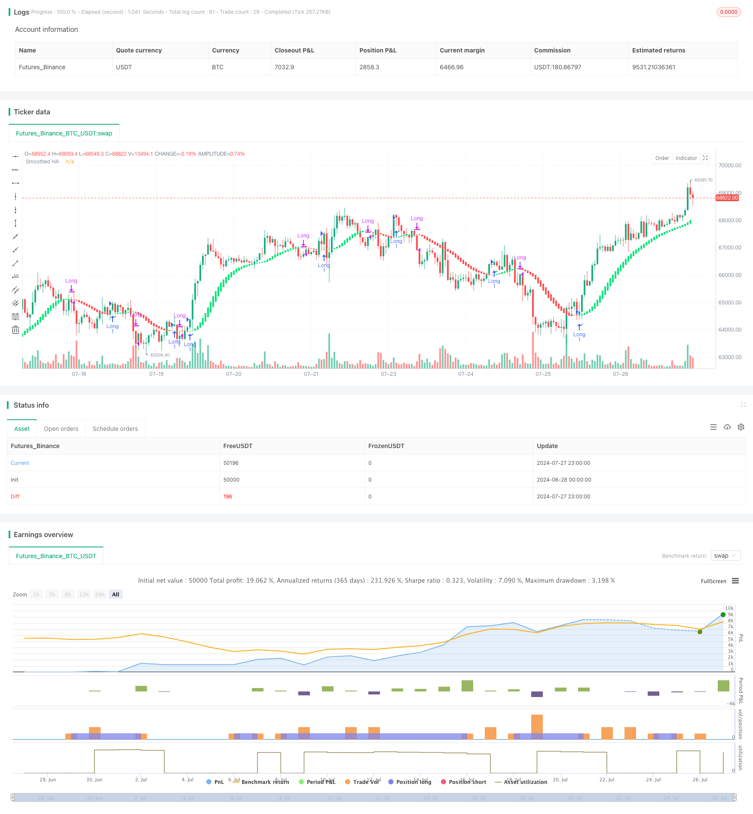

> Name

Double-Smoothed-Heiken-Ashi-Trend-Following-Strategy
> Author

ChaoZhang

> Strategy Description



[trans]
#### Overview
The double-smoothed Heiken-Asch trend following strategy is a quantitative trading method that focuses on capturing the rising market trend. This strategy combines a modified version of the Heiken-Asch candlestick technique with double smoothing of the exponential moving average (EMA) to provide clearer trend signals while reducing the impact of market noise. This method is particularly suitable for market environments with sustained and strong trends, and can help traders better grasp long-term rising prices.
#### Strategy Principle
1. Heiken Achy Improved: The strategy first calculates the Heiken Achy candle chart, but unlike the traditional method, it uses the exponential moving average (EMA) of the opening, high, low, and closing prices to construct a modified Heiken Achy candle.
2. Double smoothing: The strategy applies two layers of smoothing. The first level is to use the EMA when calculating the Heiken Ach value, and the second level is to apply the EMA again to the Heiken Ach opening and closing prices. This double smoothing is designed to further reduce market noise and provide clearer trend signals.
3. Long-only strategy: This strategy focuses on capturing the upward trend and only conducts long transactions. In a downtrend, the strategy will close existing long positions without going short.
4. Entry and exit conditions:
   - Entry (Buy): When the color of the smoothed Heiken Asch candle changes from red to green (indicating the start of a potential uptrend).
   - Exit (Sell): When the color of the smoothed Heiken Asch candle changes from green to red (indicating the end of a potential uptrend).
5. Visual aid: The strategy draws modified Heiken-Asch candles on the chart, with downtrends represented in red and uptrends in green. At the same time, the strategy will also display triangle markers on the chart to indicate buy and sell signals. These markers will appear after the candle closes to ensure the reliability of the signal.
6. Position management: The strategy adopts a position management method based on the percentage of account equity. By default, each transaction uses 100% of the available equity.
#### Strategic Advantages
1. Strong trend following ability: By using an improved version of Heiken-Asch candlestick chart and double smoothing processing, this strategy can effectively identify and follow strong market trends, and is particularly suitable for trending markets.
2. Reduce the impact of noise: Double smoothing helps filter out short-term market fluctuations and false breakthroughs, making trend signals clearer and more reliable.
3. Visually intuitive: The strategy provides clear visual instructions, including color-coded candlesticks and buy and sell signal markers, allowing traders to quickly judge market status and potential trading opportunities.
4. High flexibility: The strategy allows users to adjust the EMA length parameters and can be optimized according to different trading varieties and time periods.
5. Risk management: Through the long-only strategy and position management based on equity percentage, the strategy has a certain risk control mechanism built into it.
6. Automated trading: Strategies can easily realize automated trading, reduce human emotional interference, and improve execution efficiency.
#### Strategy Risk
1. Hysteresis: Due to the use of double smoothing, the strategy may respond slowly at trend turning points, resulting in a slight lag in entry and exit timing.
2. Poor performance in volatile markets: In a market environment that is sideways or lacks a clear trend, the strategy may produce frequent false signals, leading to over-trading and unnecessary losses.
3. Single direction risk: As a long-only strategy, potential short-selling opportunities may be missed in a continuously declining market, affecting overall returns.
4. Over-reliance on a single indicator: The strategy mainly relies on the Heiken Ashe candle chart and EMA, lacking the supplement of other technical indicators or fundamental analysis, and may ignore other important information of the market.
5. Parameter sensitivity: Strategy performance may be more sensitive to the selection of EMA length parameters, and frequent adjustments may be required under different market conditions.
6. Retracement risk: In a sharp retracement after a strong rise, the strategy may not be able to stop losses in time, resulting in a larger retracement.
#### Strategy optimization direction
1. Introduce additional indicators: Consider adding other technical indicators, such as the relative strength index (RSI) or the moving average convergence divergence indicator (MACD), to provide additional trend confirmation and potential overbought and oversold signals.
2. Optimize entry and exit logic: You can try to introduce more complex conditions, such as requiring several consecutive candle lines to confirm trend changes, or combining trading volume information to enhance the reliability of the signal.
3. Dynamic parameter adjustment: Implement adaptive EMA length and automatically adjust smoothing parameters according to market volatility to adapt to different market environments.
4. Add stop-loss and take-profit mechanisms: Introduce trailing stop-loss or volatility-based dynamic stop-loss to better control risks and lock in profits.
5. Add market status filtering: Develop a market status recognition module to automatically reduce trading frequency or suspend trading in volatile markets to reduce false signals.
6. Multi-time period analysis: Combine longer and shorter time period information to improve the accuracy and timeliness of trend judgment.
7. Integrate fundamental data: Consider introducing relevant fundamental indicators or event drivers to enhance the comprehensiveness of the strategy.
8. Optimize position management: Implement more flexible position management strategies, such as position size adjustment based on risk value or batch opening technology.
#### Summarize
The double-smoothed Heiken-Asch trend following strategy is an innovative quantitative trading method that provides traders with a unique trend-following tool by combining the improved Heiken-Asch candle chart technology with double EMA smoothing. The main advantage of this strategy lies in its powerful trend capturing ability and noise reduction effect, which is particularly suitable for market environments with clear trends.
However, the strategy also has some inherent risks and limitations, such as signal lag and poor performance in volatile markets. In order to fully realize the potential of the strategy and manage related risks, traders should consider further optimizing and improving the strategy, such as introducing additional technical indicators, optimizing entry and exit logic, and implementing dynamic parameter adjustments.
In summary, the double-smoothed Heiken-Asch trend following strategy provides a valuable research direction in the field of quantitative trading. Through continuous backtesting, optimization and real-time verification, this strategy has the potential to become a reliable trading system component. However, traders still need to carefully consider market conditions, personal risk tolerance when using this strategy, and use it in conjunction with other analytical tools and risk management techniques to build a comprehensive and robust trading strategy.
|| 

#### Overview

The Double-Smoothed Heiken Ashi Trend Following Strategy is a quantitative trading approach focused on capturing upward market trends. This strategy combines a modified version of Heiken Ashi candlestick technique with double smoothing using Exponential Moving Averages (EMAs), aiming to provide clearer trend signals while reducing market noise. This method is particularly suitable for market environments with strong, sustained trends, helping traders better capture long-term bullish movements.

#### Strategy Principles

1. Heiken Ashi Modification: The strategy begins by calculating Heiken Ashi candlesticks, but unlike the traditional method, it uses Exponential Moving Averages (EMAs) of open, high, low, and close prices to construct the modified Heiken Ashi candles.

2. Double Smoothing Process: The strategy applies two layers of smoothing. The first layer uses EMAs in calculating Heiken Ashi values, and the second layer applies another EMA to the Heiken Ashi open and close prices. This double smoothing aims to further reduce market noise and provide clearer trend signals.

3. Long-Only Strategy: The strategy focuses on capturing upward trends, only engaging in long trades. During downward trends, the strategy closes existing long positions rather than taking short positions.

4. Entry and Exit Conditions:
   - Entry (Buy): When the color of the smoothed Heiken Ashi candlestick changes from red to green (indicating the potential start of an uptrend).
   - Exit (Sell): When the color of the smoothed Heiken Ashi candlestick changes from green to red (indicating the potential end of an uptrend).

5. Visual Aids: The strategy plots modified Heiken Ashi candlesticks on the chart, with red representing downtrends and green representing uptrends. Additionally, the strategy displays triangle-shaped markers on the chart to indicate buy and sell signals, appearing after the candle closes to ensure signal reliability.

6. Position Management: The strategy employs a position sizing method based on account equity percentage, defaulting to 100% of available equity per trade.

#### Strategy Advantages

1. Strong Trend Following Capability: By using modified Heiken Ashi candlesticks and double smoothing, the strategy can effectively identify and follow strong market trends, especially suitable for trending markets.

2. Reduced Noise Impact: The double smoothing process helps filter out short-term market fluctuations and false breakouts, making trend signals clearer and more reliable.

3. Visual Intuitiveness: The strategy provides clear visual indications, including color-coded candlesticks and buy/sell signal markers, allowing traders to quickly assess market conditions and potential trading opportunities.

4. High Flexibility: The strategy allows users to adjust EMA length parameters, enabling optimization for different trading instruments and time frames.

5. Risk Management: Through its long-only approach and equity percentage-based position sizing, the strategy incorporates certain risk control mechanisms.

6. Automated Trading: The strategy can be easily implemented for automated trading, reducing emotional interference and improving execution efficiency.

#### Strategy Risks

1. Lag: Due to the use of double smoothing, the strategy may react slowly at trend reversal points, leading to slightly delayed entries and exits.

2. Poor Performance in Ranging Markets: In sideways or trendless market environments, the strategy may generate frequent false signals, resulting in overtrading and unnecessary losses.

3. Single Direction Risk: As a long-only strategy, it may miss potential short-selling opportunities in consistently declining markets, affecting overall returns.

4. Over-reliance on Single Indicator: The strategy primarily relies on Heiken Ashi candlesticks and EMAs, lacking supplementary technical indicators or fundamental analysis, which may overlook other important market information.

5. Parameter Sensitivity: Strategy performance may be sensitive to the choice of EMA length parameters, potentially requiring frequent adjustments under different market conditions.

6. Drawdown Risk: In sharp corrections following strong uptrends, the strategy may not be able to cut losses in time, leading to significant drawdowns.

#### Strategy Optimization Directions

1. Introduce Additional Indicators: Consider adding other technical indicators such as Relative Strength Index (RSI) or Moving Average Convergence Divergence (MACD) to provide additional trend confirmation and potential overbought/oversold signals.

2. Optimize Entry and Exit Logic: Experiment with more complex conditions, such as requiring several consecutive candles to confirm trend changes, or incorporating volume information to enhance signal reliability.

3. Dynamic Parameter Adjustment: Implement adaptive EMA lengths that automatically adjust smoothing parameters based on market volatility to adapt to different market environments.

4. Add Stop Loss and Take Profit Mechanisms: Introduce trailing stops or volatility-based dynamic stop losses to better control risk and lock in profits.

5. Incorporate Market State Filtering: Develop a market state identification module to automatically reduce trading frequency or pause trading in ranging markets to minimize false signals.

6. Multi-Timeframe Analysis: Combine information from longer and shorter time frames to improve the accuracy and timeliness of trend judgments.

7. Integrate Fundamental Data: Consider incorporating relevant fundamental indicators or event-driven factors to enhance the strategy's comprehensiveness.

8. Optimize Position Management: Implement more flexible position management strategies, such as risk-based position sizing adjustments or scaling-in techniques.

#### Conclusion

The Double-Smoothed Heiken Ashi Trend Following Strategy is an innovative quantitative trading method that provides traders with a unique trend-following tool by combining modified Heiken Ashi candlestick technique with double EMA smoothing. The strategy's main advantages lie in its powerful trend capture capability and noise reduction effect, particularly suitable for market environments with clear trends.

However, the strategy also has inherent risks and limitations, such as signal lag and poor performance in ranging markets. To fully leverage the strategy's potential and manage associated risks, traders should consider further optimizing and refining the strategy, such as introducing additional technical indicators, optimizing entry and exit logic, and implementing dynamic parameter adjustments.

Overall, the Double-Smoothed Heiken Ashi Trend Following Strategy offers a valuable research direction in the field of quantitative trading. Through continuous backtesting, optimization, and live trading verification, this strategy has the potential to become a reliable component of a trading system. However, when using this strategy, traders should still carefully consider market conditions, personal risk tolerance, and combine it with other analytical tools and risk management techniques to build a comprehensive and robust trading strategy.

[/trans]


> Source (PineScript)

``` pinescript
/*backtest
start: 2024-06-28 00:00:00
end: 2024-07-28 00:00:00
period: 1h
basePeriod: 15m
exchanges: [{"eid":"Futures_Binance","currency":"BTC_USDT"}]
*/

//@version=5
strategy("Smoothed Heiken Ashi Strategy Long Only", overlay=true)

len = input.int(10, title="EMA Length")
len2 = input.int(10, title="Smoothing Length")

o = ta.ema(open, len)
c = ta.ema(close, len)
h = ta.ema(high, len)
l = ta.ema(low, len)
haclose = (o + h + l + c) / 4

var float haopen = 0.0
haopen := na(haopen[1]) ? (o + c) / 2 : (haopen[1] + haclose[1]) / 2
hahigh = math.max(h, math.max(haopen, haclose))
halow = math.min(l, math.min(haopen, haclose))

o2 = ta.ema(haopen, len2)
c2 = ta.ema(haclose, len2)
col = o2 > c2 ? 0 : 1 // 0 for red, 1 for lime

// Plotting candles without wicks
plotcandle(o2, o2, c2, c2, title="Smoothed HA", color=col == 0 ? color.red : color.lime)

// Strategy logic
longEntryCondition = col == 1 and col[1] == 0
longExitCondition = col == 0 and col[1] == 1

if (longEntryCondition)
    strategy.entry("Long", strategy.long)

if (longExitCondition)
    strategy.close("Long")

// Plotting signals after the close of the candle
plotshape(longEntryCondition, title="Buy Signal", location=location.belowbar, color=color.green, style=shape.triangleup, size=size.small, offset=1)
plotshape(longExitCondition, title="Sell Signal", location=location.abovebar, color=color.red, style=shape.triangledown, size=size.small, offset=1)
```

> Detail

https://www.fmz.com/strategy/458058

> Last Modified

2024-07-29 16:02:27
