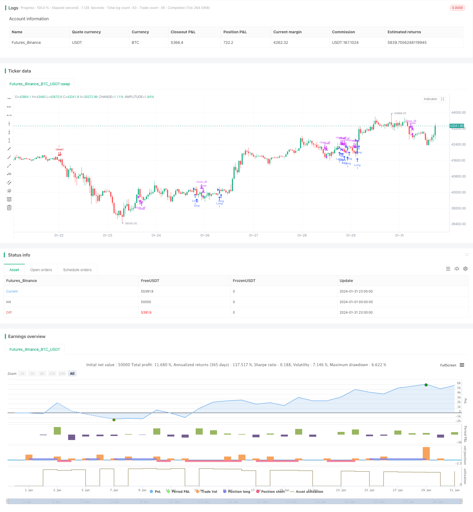

> Name

Doubly-Confident-Price-Oscillation-Quant-Strategy
> Author

ChaoZhang

> Strategy Description


[trans]
## Overview
The main idea of ​​this strategy is to combine two different types of strategies, the 123 Reversal Strategy and the Absolute Price Volatility Indicator, to obtain a comprehensive signal. Specifically, if both strategies send out long signals, the final strategy signal is 1 (go long); if both strategies send out short signals, the final strategy signal is -1 (short); if the signals of the two strategies are inconsistent, the final strategy signal is 0 (do nothing).
## Strategy Principle
First of all, the principle of the 123 reversal strategy is: if the closing price is lower than the closing price of the previous day for two consecutive days, and the stochastic indicator is below the overbought line, go long; if the closing price is higher than the closing price of the previous day for two consecutive days, and the stochastic indicator is above the oversold line, go short.
Secondly, the Absolute Price Volatility indicator shows the difference between two exponential moving averages. When the fast moving average is higher than the slow moving average, it is positive, indicating an upward trend; otherwise, it is negative, indicating a downward trend.
Finally, this strategy will combine the signals of the two sub-strategies, that is, if the two send consistent signals, then operate according to this signal; otherwise, no operation will be performed.
## Advantage Analysis
This strategy comprehensively considers short-term reversal signals and mid- and long-term price trends, and can effectively identify turning points in the market. Compared with using 123 reversal or APO indicator alone, this strategy can greatly improve the reliability of signals and reduce the generation of false signals.
In addition, this strategy uses a variety of technical indicators to comprehensively judge market conditions and will not rely solely on one indicator. This can avoid the overall judgment error caused by the failure of one indicator.
## Risk Analysis
The biggest risk of this strategy lies in the situation where the 123 reversal strategy and the APO indicator produce divergent signals. In this case, the operator needs to judge which signal is more reliable based on his or her own experience. If your judgment is biased, you may miss trading opportunities or suffer losses.
In addition, if the market changes drastically, resulting in the failure of short-term reversal signals and medium- and long-term trend signals at the same time, then the strategy's signals will also be wrong. Operators need to pay attention to the impact of major political and economic events on the market, and can suspend strategy operation if necessary.
## Optimization direction
This strategy can be optimized from the following directions:
1. Optimize the parameters of the sub-strategy to make the sub-strategy signal more reliable. For example, adjust the moving average period parameters.
2. Add other auxiliary judgment indicators to form a voting mechanism. When multiple indicators send consistent signals, the signals are more reliable.
3. Add a stop loss strategy. When the price trend does not meet the expectations of technical indicators, timely stop loss can avoid further expansion of losses.
4. Optimize position opening and stop loss positions. Combined with historical backtest data, set more appropriate specific values.
## Summarize
This strategy comprehensively uses a variety of technical indicators to judge the market, which to a certain extent avoids the risk of relying on a single indicator and improves the accuracy of signal judgment. At the same time, this strategy also has some room for optimization, and investors can adjust parameters according to their own needs. In general, the double-confidence price shock quantification strategy is a trading strategy with high signal reliability and is worthy of further research and application.
||

## Overview

The main idea of this strategy is to combine the 123 Reversal strategy and the Absolute Price Oscillator indicator to obtain an integrated signal. Specifically, if both sub-strategies emit long signals, the final strategy signal is 1 (long); if both emit short signals, the final signal is -1 (short); if the signals are inconsistent, the final signal is 0 (no operation).  

## Principles  

Firstly, the principle of the 123 Reversal strategy is: if the close price is lower than the previous day's close for two consecutive days, and the Stochastic Oscillator is below the overbought line, go long; if the close price is higher than the previous day's close for two consecutive days, and the Stochastic Oscillator is above the oversold line, go short.  

Secondly, the Absolute Price Oscillator displays the difference between two exponential moving averages. A positive value indicates an upward trend, while a negative value indicates a downward trend.

Finally, this strategy combines the signals of the two sub-strategies, i.e. follow the signal if they are consistent; otherwise, do not operate.

## Advantage Analysis

This strategy comprehensively considers short-term reversal signals and medium-to-long term trend signals, which can effectively identify turning points. Compared to using 123 Reversals or APO alone, this strategy can greatly improve the reliability of signals and reduce erroneous signals.  

In addition, this strategy employs multiple technical indicators to judge the market comprehensively instead of relying on any single one. This avoids wrong judgments due to failure of one indicator.

## Risk Analysis  

The biggest risk is when the 123 Reversal and APO emit conflicting signals. In such cases, the operator needs to judge based on experience which signal is more reliable. Wrong judgements may lead to missing trading opportunities or losses.  

In addition, drastic market changes may invalidate signals from both sub-strategies simultaneously. Traders need to monitor events that significantly impact markets, and pause the strategy if necessary.

## Optimization  

Possible optimization directions:

1. Optimize sub-strategy parameters for more reliable signals, e.g. moving average periods. 

2. Add other auxiliary indicators to form a voting mechanism. Consistent signals from multiple indicators are more reliable.  

3. Add stop loss strategies. Timely stop loss on adverse price moves avoids further losses.

4. Optimize entry and stop loss levels based on historical backtesting.  

## Conclusion

This strategy combines multiple technical indicators to judge the market, avoiding single indicator dependency risks to some extent and improving signal accuracy. There is also room for optimization based on investor requirements. Overall, the Doubly Confident Price Oscillation Quant Strategy provides reliable trade signals and is worth researching further.

[/trans]

> Strategy Arguments


|Argument|Default|Description|
|----|----|----|
|v_input_1|14|Length|
|v_input_2|true|KSmoothing|
|v_input_3|3|DLength|
|v_input_4|50|Level|
|v_input_5|10|LengthShortEMA|
|v_input_6|20|LengthLongEMA|
|v_input_7|false|Trade reverse|


> Source (PineScript)

``` pinescript
/*backtest
start: 2024-01-01 00:00:00
end: 2024-01-31 23:59:59
period: 1h
basePeriod: 15m
exchanges: [{"eid":"Futures_Binance","currency":"BTC_USDT"}]
*/

//@version=3
////////////////////////////////////////////////////////////
//  Copyright by HPotter v1.0 22/04/2019
// This is combo strategies for get 
// a cumulative signal. Result signal will return 1 if two strategies 
// is long, -1 if all strategies is short and 0 if signals of strategies is not equal.
//
// First strategy
// This System was created from the Book "How I Tripled My Money In The 
// Futures Market" by Ulf Jensen, Page 183. This is reverse type of strategies.
// The strategy buys at market, if close price is higher than the previous close 
// during 2 days and the meaning of 9-days Stochastic Slow Oscillator is lower than 50. 
// The strategy sells at market, if close price is lower than the previous close price 
// during 2 days and the meaning of 9-days Stochastic Fast Oscillator is higher than 50.
//
// Secon strategy
// The Absolute Price Oscillator displays the difference between two exponential 
// moving averages of a security's price and is expressed as an absolute value.
// How this indicator works
//    APO crossing above zero is considered bullish, while crossing below zero is bearish.
//    A positive indicator value indicates an upward movement, while negative readings 
//      signal a downward trend.
//    Divergences form when a new high or low in price is not confirmed by the Absolute Price 
//      Oscillator (APO). A bullish divergence forms when price make a lower low, but the APO 
//      forms a higher low. This indicates less downward momentum that could foreshadow a bullish 
//      reversal. A bearish divergence forms when price makes a higher high, but the APO forms a 
//      lower high. This shows less upward momentum that could foreshadow a bearish reversal.
//
// WARNING:
// - For purpose educate only
// - This script to change bars colors.
////////////////////////////////////////////////////////////
Reversal123(Length, KSmoothing, DLength, Level) =>
    vFast = sma(stoch(close, high, low, Length), KSmoothing) 
    vSlow = sma(vFast, DLength)
    pos = 0.0
    pos := iff(close[2] < close[1] and close > close[1] and vFast < vSlow and vFast > Level, 1,
	         iff(close[2] > close[1] and close < close[1] and vFast > vSlow and vFast < Level, -1, nz(pos[1], 0))) 
	pos

AbsolutePriceOscillator(LengthShortEMA, LengthLongEMA) =>
    xPrice = close
    xShortEMA = ema(xPrice, LengthShortEMA)
    xLongEMA = ema(xPrice, LengthLongEMA)
    xAPO = xShortEMA - xLongEMA
    pos = 0.0    
    pos := iff(xAPO > 0, 1,
           iff(xAPO < 0, -1, nz(pos[1], 0))) 
    pos

strategy(title="Combo Backtest 123 Reversal and Absolute Price Oscillator (APO)", shorttitle="Combo", overlay = true)
Length = input(14, minval=1)
KSmoothing = input(1, minval=1)
DLength = input(3, minval=1)
Level = input(50, minval=1)
LengthShortEMA = input(10, minval=1)
LengthLongEMA = input(20, minval=1)
reverse = input(false, title="Trade reverse")
posReversal123 = Reversal123(Length, KSmoothing, DLength, Level)
posAbsolutePriceOscillator = AbsolutePriceOscillator(LengthShortEMA, LengthLongEMA)
pos = iff(posReversal123 == 1 and posAbsolutePriceOscillator == 1 , 1,
	   iff(posReversal123 == -1 and posAbsolutePriceOscillator == -1, -1, 0)) 
possig = iff(reverse and pos == 1, -1,
          iff(reverse and pos == -1, 1, pos))	   
if (possig == 1) 
    strategy.entry("Long", strategy.long)
if (possig == -1)
    strategy.entry("Short", strategy.short)	 
if (possig == 0) 
    strategy.close_all()
barcolor(possig == -1 ? red: possig == 1 ? green : blue ) 
```

> Detail

https://www.fmz.com/strategy/441961

> Last Modified

2024-02-18 10:10:16
