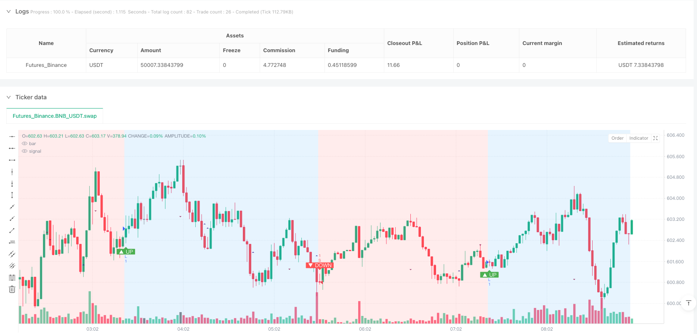
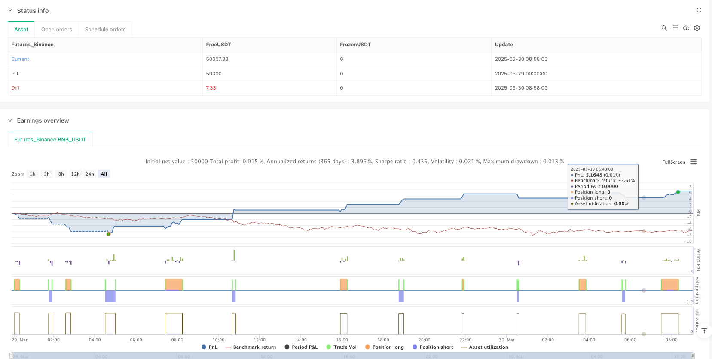

> Name

Dow-Theory-Trend-Adaptive-Momentum-Strategy
> Author

ianzeng123

> Strategy Description





[trans]

#### Overview
The Dow Theory Trend Adaptive Momentum Strategy is an advanced trading method based on classic Dow Theory principles that guides trading decisions by identifying key turning points in market trends. This strategy focuses on detecting and confirming the fundamental dynamics of price trends, using higher highs and higher lows to define uptrends and lower highs and lower lows to define downtrends. This approach aims to provide a systematic way to capture market trends and respond promptly when trends change.
#### Strategy Principle
The core principles of this strategy are based on the classic trend identification method of the Dow Theory. The strategy detects key turning points by using the ta.pivothigh() and ta.pivotlow() functions. The specific implementation includes the following key steps:
1. Turning point detection: Use the pivotLookback parameter to determine the number of bars on the left and right sides, which is used to identify high points and low points.
2. Trend Confirmation: An uptrend is confirmed only when the conditions of higher highs and higher lows are met at the same time; similarly, a downtrend is confirmed only when the conditions of lower highs and lower lows are met at the same time.
3. Trend persistence: If the trend transition condition is not met, the strategy will maintain the previous trend state, allowing for smoother trend following.
#### Strategic Advantages
1. Dynamic trend identification: By continuously analyzing key turning points, the strategy can dynamically capture changes in market trends.
2. Flexible trading modes: Provide three trading modes: automatic, long only and short only to meet the needs of different traders.
3. Risk management: Built-in stop loss and stop profit mechanisms can effectively control the risk of a single transaction.
4. Visual trend: The trend direction is visually displayed through background colors and markers, making it easier for traders to quickly understand the market status.
5. Low latency: This method can respond to trend changes faster than traditional moving average strategies.
#### Strategy Risk
1. Lagging risk: Due to the use of turning point detection, the strategy has inherent lag risk and may not be able to capture the earliest signals of the trend.
2. Volatile market risk: In a market with little volatility, frequent small price changes may lead to unnecessary transactions.
3. Parameter sensitivity: The choice of pivotLookback parameters has a greater impact on strategy performance and needs to be adjusted for different markets and time frames.
4. Transaction costs: Frequent transactions may result in higher transaction costs, especially if the commission rate is high.
#### Strategy optimization direction
1. Introduce additional filters: Combine with trend strength indicators (such as ATR) to filter weak trend signals.
2. Dynamic parameter adjustment: Develop an adaptive pivotLookback parameter mechanism based on market volatility.
3. Multi-time frame verification: Cross-validate trend signals on different time frames to improve the reliability of the signal.
4. Machine learning enhancement: Explore the use of machine learning algorithms to optimize trend identification and entry timing.
5. Risk management optimization: dynamically adjust the stop loss and take profit distance according to market volatility.
#### Summarize
The Dow Theory Trend Adaptive Momentum Strategy is a powerful trend following method that provides traders with a systematic trend identification tool through innovative turning point analysis technology. Although there are some inherent risks, its flexibility and dynamic nature make it a valuable approach in modern quantitative trading strategies. Successful application of this strategy requires a deep understanding of how it works and continuous optimization and adjustment based on specific market circumstances.
#### Overview

The Dow Theory Trend Adaptive Momentum Strategy is an advanced trading approach based on classic Dow Theory principles, designed to guide trading decisions by identifying key turning points in market trends. The strategy focuses on detecting and confirming the fundamental dynamics of price trends, using Higher Highs and Higher Lows to define uptrends, and Lower Highs and Lower Lows to define downtrends. This method aims to provide a systematic approach to capturing market trends and responding promptly when trends change.

#### Strategy Principles

The core principle of this strategy is based on the classic Dow Theory trend identification method. The strategy detects key turning points using ta.pivothigh() and ta.pivotlow() functions. Specific implementation includes the following key steps:

1. Turning Point Detection: Use the pivotLookback parameter to determine the number of bars on both sides for identifying highs and lows.
2. Trend Confirmation: An uptrend is confirmed only when both Higher Highs and Higher Lows conditions are met; similarly, a downtrend is confirmed only when both Lower Highs and Lower Lows conditions are satisfied.
3. Trend Persistence: If trend conversion conditions are not met, the strategy maintains the previous trend state, achieving smoother trend tracking.

#### Strategy Advantages

1. Dynamic Trend Identification: By continuously analyzing key turning points, the strategy can dynamically capture market trend changes.
2. Flexible Trading Modes: Provides three trading modes - automatic, long-only, and short-only - to meet different traders' needs.
3. Risk Management: Built-in stop-loss and take-profit mechanisms effectively control the risk of individual trades.
4. Trend Visualization: Intuitively displays trend direction through background colors and markers, making it easy for traders to understand market conditions.
5. Low Latency: Compared to traditional moving average strategies, this method can respond to trend changes more quickly.

#### Strategy Risks

1. Lag Risk: Due to using pivot point detection, the strategy inherently carries a lag risk and may not capture the earliest trend signals.
2. Ranging Market Risk: In markets with unclear fluctuations, frequent small price changes may lead to unnecessary trades.
3. Parameter Sensitivity: The choice of pivotLookback parameter significantly impacts strategy performance and requires adjustment for different markets and timeframes.
4. Trading Costs: Frequent trading may result in high transaction costs, especially with higher commission rates.

#### Strategy Optimization Directions

1. Introduce Additional Filters: Combine trend strength indicators (such as ATR) to filter weak trend signals.
2. Dynamic Parameter Adjustment: Develop an adaptive pivotLookback parameter mechanism based on market volatility.
3. Multi-Timeframe Verification: Cross-verify trend signals across different timeframes to improve signal reliability.
4. Machine Learning Enhancement: Explore using machine learning algorithms to optimize trend identification and entry timing.
5. Risk Management Optimization: Dynamically adjust stop-loss and take-profit distances based on market volatility.

#### Conclusion

The Dow Theory Trend Adaptive Momentum Strategy is a powerful trend-following method that provides traders with a systematic trend identification tool through innovative turning point analysis techniques. Despite some inherent risks, its flexibility and dynamism make it a valuable approach in modern quantitative trading strategies. Successfully applying this strategy requires a deep understanding of its working principles and continuous optimization and adjustment based on specific market environments.[/trans]


> Source (PineScript)

``` pinescript
/*backtest
start: 2025-03-29 00:00:00
end: 2025-03-30 09:00:00
period: 2m
basePeriod: 2m
exchanges: [{"eid":"Futures_Binance","currency":"BNB_USDT"}]
*/

//@version=5
// strategy(title="Dow Theory Trend Strategy v3", shorttitle="Dow Trend Strat v3", overlay=true,
//      initial_capital=10000, default_qty_type=strategy.percent_of_equity, default_qty_value=10,
//      commission_type=strategy.commission.percent, commission_value=0.1, // Example strategy settings with commission
//      process_orders_on_close=true) // Consider processing on bar close for more stable backtests
strategy(title="Dow Theory Trend Strategy v3", shorttitle="Dow Trend Strat v3", overlay=true) // Basic strategy settings

// --- 設定 ---
// Calculation Settings
pivotLookback = input.int(10, title="Pivot Lookback Period", minval=1, tooltip="ピボットハイ/ローを検出するための左右のバーの数", group="Calculation Settings")

// Display Settings
showPivotPoints = input.bool(true, title="Show Pivot Points", tooltip="ピボットハイ/ローのポイントを表示します", group="Display Settings")
showTrendChange = input.bool(true, title="Show Trend Change Signals", tooltip="トレンド転換のシグナル（エントリーポイント）を表示します", group="Display Settings")

// Strategy Settings
// --- Manual Trend Override (配列定義を input 内に変更) ---
manualTrendMode = input.string("Auto", title="Manual Trend Mode",
     options=["Auto", "Long Only", "Short Only"], // オプションをここで直接定義
     tooltip="手動でトレード方向を指定 (Auto: ダウ理論に従う, Long Only: ロングのみ, Short Only: ショートのみ)",
     group="Strategy Settings")

// Risk Management Settings
useStopLoss = input.bool(true, title="Use Stop Loss", group="Risk Management")
stopLossTicks = input.float(100, title="Stop Loss (Ticks)", minval=1, group="Risk Management", tooltip="エントリー価格からのストップロスまでのティック（最小値動き）数。例：EURUSDで20 pips (tick=0.00001)なら200。")
useTakeProfit = input.bool(true, title="Use Take Profit", group="Risk Management")
takeProfitTicks = input.float(200, title="Take Profit (Ticks)", minval=1, group="Risk Management", tooltip="エントリー価格からのテイクプロフィットまでのティック（最小値動き）数。例：EURUSDで40 pips (tick=0.00001)なら400。")

// --- ピボットハイ/ローの検出 ---
pivotHighPrice = ta.pivothigh(high, pivotLookback, pivotLookback)
pivotLowPrice = ta.pivotlow(low, pivotLookback, pivotLookback)

// --- ピボットポイントの値を保持するための変数 ---
var float lastPivotHigh = na
var float prevPivotHigh = na
var float lastPivotLow = na
var float prevPivotLow = na
var int lastPivotHighBar = na
var int prevPivotHighBar = na
var int lastPivotLowBar = na
var int prevPivotLowBar = na

// --- 新しいピボットが確定したかどうかの検出と値の更新 ---
if not na(pivotHighPrice)
    if na(lastPivotHigh) or pivotHighPrice != lastPivotHigh
        prevPivotHigh := lastPivotHigh
        prevPivotHighBar := lastPivotHighBar
        lastPivotHigh := pivotHighPrice
        lastPivotHighBar := bar_index - pivotLookback

if not na(pivotLowPrice)
    if na(lastPivotLow) or pivotLowPrice != lastPivotLow
        prevPivotLow := lastPivotLow
        prevPivotLowBar := lastPivotLowBar
        lastPivotLow := pivotLowPrice
        lastPivotLowBar := bar_index - pivotLookback

// --- ダウ理論に基づくトレンド判定 (改良版) ---
var int trendDirection = 0
bool hasEnoughPivots = not na(lastPivotHigh) and not na(prevPivotHigh) and not na(lastPivotLow) and not na(prevPivotLow)

if hasEnoughPivots
    isHigherHigh = lastPivotHigh > prevPivotHigh
    isHigherLow = lastPivotLow > prevPivotLow
    isUptrendConfirmed = isHigherHigh and isHigherLow

    isLowerHigh = lastPivotHigh < prevPivotHigh
    isLowerLow = lastPivotLow < prevPivotLow
    isDowntrendConfirmed = isLowerHigh and isLowerLow

    if isUptrendConfirmed
        trendDirection := 1
    else if isDowntrendConfirmed
        trendDirection := -1
    else
        trendDirection := trendDirection[1]

// --- トレンド転換の検出 ---
bool trendChanged = ta.change(trendDirection) != 0
bool changedToUp = trendChanged and trendDirection == 1
bool changedToDown = trendChanged and trendDirection == -1

// --- 描画処理 ---
bgcolor(trendDirection == 1 ? color.new(color.blue, 85) : trendDirection == -1 ? color.new(color.red, 85) : color.new(color.gray, 90), title="Trend Background")
plotshape(showPivotPoints and not na(pivotHighPrice), title="Pivot High", location=location.abovebar, color=color.new(color.maroon, 20), style=shape.triangledown, size=size.tiny, offset=-pivotLookback)
plotshape(showPivotPoints and not na(pivotLowPrice), title="Pivot Low", location=location.belowbar, color=color.new(color.navy, 20), style=shape.triangleup, size=size.tiny, offset=-pivotLookback)
plotshape(showTrendChange and changedToUp, title="Uptrend Start Signal", location=location.belowbar, color=color.new(color.green, 0), style=shape.labelup, text="▲ UP", textcolor=color.white, size=size.small)
plotshape(showTrendChange and changedToDown, title="Downtrend Start Signal", location=location.abovebar, color=color.new(color.red, 0), style=shape.labeldown, text="▼ DOWN", textcolor=color.white, size=size.small)

// --- ストラテジーロジック ---
bool allowLong = manualTrendMode == "Auto" or manualTrendMode == "Long Only"
bool allowShort = manualTrendMode == "Auto" or manualTrendMode == "Short Only"

if (changedToUp and allowLong)
    strategy.entry("L", strategy.long, comment="Go Long")
    if (useStopLoss or useTakeProfit)
        float slValue = useStopLoss and stopLossTicks > 0 ? stopLossTicks : na
        float tpValue = useTakeProfit and takeProfitTicks > 0 ? takeProfitTicks : na
        strategy.exit("LX", from_entry="L", loss=slValue, profit=tpValue, comment_loss="SL Long", comment_profit="TP Long")

if (changedToDown and allowShort)
    strategy.entry("S", strategy.short, comment="Go Short")
    if (useStopLoss or useTakeProfit)
        float slValue = useStopLoss and stopLossTicks > 0 ? stopLossTicks : na
        float tpValue = useTakeProfit and takeProfitTicks > 0 ? takeProfitTicks : na
        strategy.exit("SX", from_entry="S", loss=slValue, profit=tpValue, comment_loss="SL Short", comment_profit="TP Short")

// --- デバッグ用 ---
// plot(trendDirection, title="Trend Direction Value")
```

> Detail

https://www.fmz.com/strategy/489309

> Last Modified

2025-04-03 13:05:17
