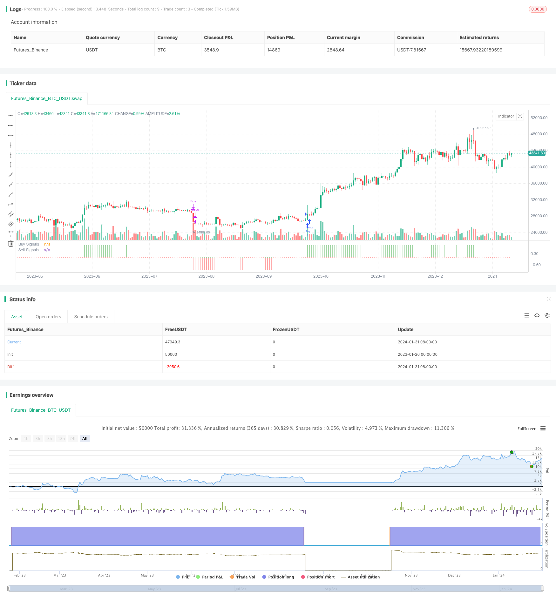

> Name

Dual-Breakthrough-Moving-Average-Trading-Strategy based on two-way breakthrough moving average trading strategy
> Author

ChaoZhang

> Strategy Description


[trans]

## Overview
The two-way breaking moving average trading strategy is a strategy that determines buy and sell signals based on multiple indicators. It integrates moving averages, support pressure indicators, trend indicators, and overbought and oversold indicators to form a comprehensive trading system.
## Strategy Principle
### Judgment logic of buy signal
A buy signal needs to meet the following four conditions at the same time:
1. The closing price is above the Parabolic indicator
2. The closing price is higher than the simple moving average of Length=200
3. The MACD line of the MACD indicator is above 0
4. The RSI indicator with Length=7 is higher than 50
As long as the above four conditions are met at the same time, a buy signal of 1 will be generated.
### Judgment logic of sell signal
The judgment logic of a sell signal is exactly opposite to that of a buy signal, and the following four conditions need to be met at the same time:
1. The closing price is below the Parabolic indicator
2. The closing price is below the simple moving average of Length=200
3. The MACD line of the MACD indicator is below 0
4. The RSI indicator with Length=7 is lower than 50
Once the above four conditions are met at the same time, a -1 sell signal is generated.
### Entry and Exit
In the strategy, the entry conditions are judged based on the buy and sell signals. When going long, the buy signal = 1 is required, and when going short, the sell signal = -1.
There are two exit conditions, one is to exit quickly and exit once the signal changes; the other is to wait for the opposite signal to exit, such as waiting for a sell signal before closing the position after going long.
## Strategic advantage analysis
The biggest advantage of the two-way breaking moving average strategy is the combination of multiple indicators, which can comprehensively judge trends, overbought and oversold conditions, etc. Specifically, it has the following main advantages:
1. The parabolic indicator can determine whether there is an effective breakthrough as support pressure;
2. Use the moving average to determine the general trend direction and avoid counter-trend operations;
3. MACD determines the clear long and short status;
4. RSI avoids the risk of overbought and oversold;
5. Combining multiple indicators can greatly improve stability and success rate.
In general, this system is very suitable for novices to learn on their own, and is also suitable for professionals to use.
## Risk Analysis
Although the two-way breaking moving average strategy has many advantages, there are also some risks that need to be paid attention to, mainly focusing on the following aspects:
1. Parameter settings can easily lead to over-optimization, and the actual results may not be ideal;
2. The probability of indicator divergence is high, and it needs to be confirmed again before and after entering the market;
3. The stop-loss strategy is imperfect and easy to get stuck;
4. The transaction frequency may be too high, increasing transaction costs and slippage losses.
In response to the above risks, the following measures can be taken to optimize and improve:
1. Add indicator filtering to ensure consistent signals;
2. Strictly stop losses and control single losses;
3. Control number of transactions and reasonable frequency;
4. Parameter combination testing to prevent over-optimization.
## Optimization direction
There is still a lot of room for optimization in the two-way breaking moving average strategy, which can mainly start from the following aspects:
1. Add machine learning model to predict signal strength;
2. Combine text analysis and other methods to determine the impact of major news;
3. Add market structure indicators and adjust strategies according to stages;
4. Optimize the stop loss method, trailing stop loss or oscillating stop loss;
5. Parameter adjustment and combination to find the optimal parameter pair.
If improvements can be made in the above aspects, I believe the effect of this strategy can be further improved and it will be more suitable for real-time applications.
## Summarize
The two-way breaking moving average trading strategy is an all-round strategy with a combination of multiple indicators. It also combines trend, support pressure, overbought and oversold and other indicators to determine the timing of buying and selling. It has the advantages of complementary indicator effects and comprehensive judgment. However, there are also certain risks and need to continue to be optimized to adapt to more market conditions. Overall, this strategy provides a very outstanding strategy idea for human quantitative trading and is worthy of in-depth study and application.
||

## Overview

The Dual Breakthrough Moving Average Trading Strategy is a strategy that generates buy and sell signals based on multiple indicators. It integrates moving averages, support/resistance indicators, trend indicators and overbought/oversold indicators to form a comprehensive trading system.

## Strategy Logic  

### Buy Signal Logic

The buy signal requires the following four conditions to be true at the same time:

1. Close price above Parabolic SAR indicator
2. Close price above Simple Moving Average with length = 200  
3. MACD indicator's MACD line above 0
4. RSI indicator with length = 7 above 50

Once all four conditions are met, a buy signal of 1 is generated.

### Sell Signal Logic   

The sell signal logic is exactly the opposite of the buy signal. It requires the following four conditions:

1. Close price below Parabolic SAR indicator
2. Close price below Simple Moving Average with length = 200 
3. MACD indicator's MACD line below 0  
4. RSI indicator with length = 7 below 50

When all four conditions are true at the same time, a sell signal of -1 is generated.

### Entry and Exit  

The entry conditions depend on the buy and sell signals. To go long, the buy signal must equal 1. To go short, the sell signal must equal -1.

There are two exit conditions. One is a fast exit once the signal changes. The other is to wait for the opposite signal before exiting a position. For example, wait for a sell signal after going long.

## Advantage Analysis 

The biggest advantage of the Dual Breakthrough Moving Average Strategy is the combination of multiple indicators, which enables comprehensive judgment of trends, overbought/oversold status, etc. Specifically, the main advantages are:

1. Parabolic SAR judges effective breakthroughs as support/resistance;  
2. Moving averages determine overall trend direction, avoiding counter-trend operations;
3. MACD clearly judges bullish/bearish status;  
4. RSI avoids overbought/oversold risks;
5. Combining multiple indicators greatly improves stability and success rate.

In general, this system is very suitable for self-learning by beginners, as well as for use by professionals.

## Risk Analysis   

Although the strategy has many advantages, there are still some risks to watch out for:  

1. Parameter optimization may lead to overfitting and poor live performance;
2. High probability of indicator divergence, requiring reconfirmation before entries;
3. Stop loss strategy not perfect, prone to being trapped in positions; 
4. Potentially excessive trading frequency, increasing costs and slippage.

To address these risks, the following measures could be adopted:  

1. Add filters to ensure consistent signals;
2. Strict stop loss to control single trade loss;
3. Control number of trades and trade frequency; 
4. Test parameter combinations to prevent overfitting.

## Optimization Directions   

There is still great potential to optimize this strategy further:   

1. Add machine learning models to predict signal strength;
2. Incorporate text analysis to judge impact of significant news events;
3. Add market structure indicators and adjust strategy by period;
4. Optimize stop loss methods, such as trailing stop loss or shock stop loss;
5. Parameters tuning and combination to find optimum pairs.  

With improvements in the above aspects, the strategy's performance can be further enhanced for live trading applications.  

## Conclusion

The Dual Breakthrough Moving Average Trading Strategy is a versatile strategy combining multiple indicators. It incorporates trend, support/resistance, overbought/oversold indicators to determine entries and exits. With complementary effects and comprehensive judgments, the strategy provides an Outstanding idea model for quantitative trading that is worth in-depth research and application.  
[/trans]

> Strategy Arguments


|Argument|Default|Description|
|----|----|----|
|v_input_1|200|MA Length|
|v_input_2|12|Fast EMA Length|
|v_input_3|26|Slow EMA Length|
|v_input_4|7|RSI Length|
|v_input_5|50|RSI Threshold|
|v_input_6|true|Long Trades|
|v_input_7|false|Short Trades|
|v_input_8|false|Quick Exits|


> Source (PineScript)

``` pinescript
/*backtest
start: 2023-01-26 00:00:00
end: 2024-02-01 00:00:00
period: 1d
basePeriod: 1h
exchanges: [{"eid":"Futures_Binance","currency":"BTC_USDT"}]
*/

//@version=4
//Original Indicator by @Shizaru - simply made into a strategy!

strategy("Simple Buy/Sell Strategy", overlay=false)
psar = sar(0.02,0.02,0.2)
c1a = close > psar
c1v = close < psar

malen = input(200, title="MA Length")
mm200 = sma(close, malen)
c2a = close > mm200
c2v = close < mm200

fast = input(12, title="Fast EMA Length")
slow = input(26, title="Slow EMA Length")
[macd,signal,hist] = macd(close, fast,slow, 9)
c3a = macd >= 0
c3v = macd <= 0

rsilen = input(7, title="RSI Length")
th = input(50, title="RSI Threshold")
rsi14 = rsi(close, rsilen)
c4a = rsi14 >= th
c4v = rsi14 <= th

buy = c1a and c2a and c3a and c4a ? 1 : 0
sell = c1v and c2v and c3v and c4v ? -1 : 0

longtrades = input(true, title="Long Trades")
shorttrades = input(false, title="Short Trades")
quickexit = input(false, title="Quick Exits")

strategy.entry("Buy", strategy.long, when=buy==1 and longtrades==true)
strategy.close("Buy", when=quickexit==true ? buy==0 : sell==-1)
strategy.entry("Sell", strategy.short, when=sell==-1 and shorttrades==true)
strategy.close("Sell", when=quickexit==true ? sell==0 : buy==1)

plot(buy, style=plot.style_histogram, color=color.green, linewidth=3, title="Buy Signals")
plot(sell, style=plot.style_histogram, color=color.red, linewidth=3, title="Sell Signals")
```

> Detail

https://www.fmz.com/strategy/440863

> Last Modified

2024-02-02 17:33:14
