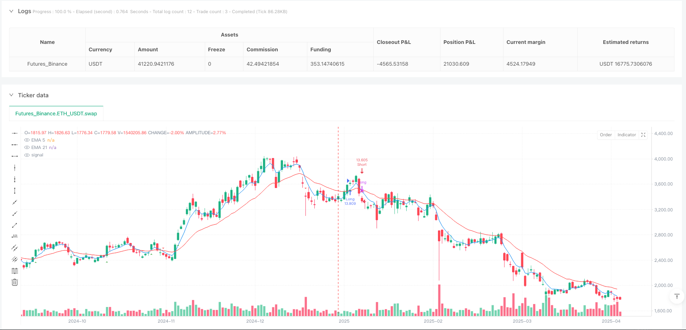
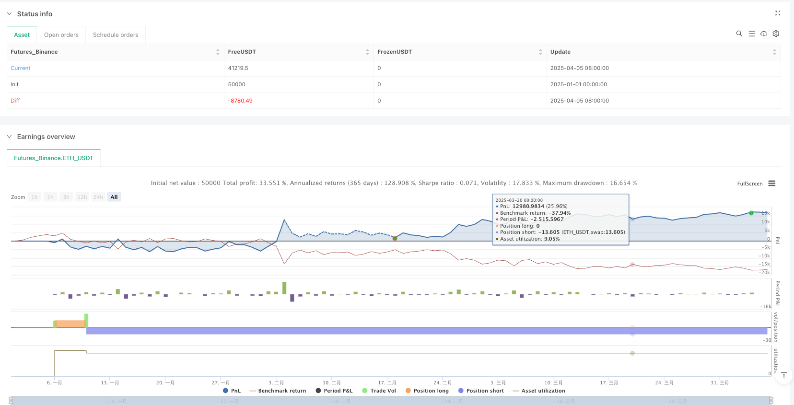

> Name

Dual-EMA-Cross-with-Directional-Exit-Strategy
> Author

ianzeng123

> Strategy Description





[trans]
#### Overview
The double exponential moving average crossover steering exit strategy is a quantitative trading strategy based on the cross signals of two different period EMA lines (5-period and 21-period). This strategy captures the changing points of the market trend by identifying golden crosses and dead crosses between the short-term EMA and the long-term EMA, thereby achieving trend following trading. When the short-term EMA crosses the long-term EMA upwards, a golden cross is formed, triggering a long signal; when the short-term EMA crosses downwards, the long-term EMA, a dead cross is formed, triggering a short signal. The strategy closes reverse positions and establishes new positions when cross signals occur, enabling fully automated trend following trading.
#### Strategy Principle
The core principle of this strategy is based on moving average crossover signals to identify turning points in the market trend. The specific implementation is as follows:
1. Calculate two exponential moving averages: 5-period EMA (short-term) and 21-period EMA (long-term)
2. Identify the golden cross signal: when the 5-period EMA crosses the 21-period EMA from below
3. Identify the dead cross signal: when the 5-period EMA crosses the 21-period EMA from above
4. Trading rules:
   - When the golden cross signal appears and there are currently no long positions, close the possible short positions and open a long position
   - When the dead cross signal appears and there are currently no short positions, close the possible long positions and open a short position
5. Position management: Use 100% of the account net value for transactions, and no additional positions are allowed (pyramiding is set to 0)
6. Time filtering: Only execute trading signals within the time period between January 1, 2024 and March 1, 2025
The strategy adopts the idea of ​​trend following, confirming changes in trend direction through moving average crossovers, and following the trend to establish positions in the corresponding direction after the trend is confirmed. The EMA indicator responds more sensitively to price changes than the simple moving average and can capture trend changes faster.
#### Strategic Advantages
By deeply analyzing the code, this strategy offers the following significant advantages:
1. Clear signals: The signals based on EMA crossover are clear and unambiguous, making them easy to execute and backtest.
2. Sensitive response: Using EMA instead of SMA makes the strategy more responsive to price changes and can capture trend changes faster.
3. High degree of automation: The strategy fully automatically executes trading signals without manual intervention, reducing the impact of subjective emotions on transactions.
4. Complete risk management: Automatically close positions when reverse signals appear, effectively controlling risk exposure time
5. Reasonable fund management: Use the account net value percentage as the position management method, and automatically adjust the position size as the account size changes.
6. Excellent visualization: mark golden cross and dead cross signals on the chart, and display strategy parameters and net profit to facilitate strategy monitoring and evaluation
7. Two-way trading: capture rising and falling trends at the same time to maximize market opportunities
8. Time filtering: Through the time filtering mechanism, the time range for strategy operation can be flexibly set to avoid market interference in a specific period.
#### Strategy Risk
Although this strategy is well designed, there are still potential risks:
1. Risk of volatile market: In a sideways volatile market, EMA cross signals are frequent and false signals are easily generated, leading to continuous stop losses.
   - Workaround: You can add additional filters, such as the ADX indicator to confirm trend strength, or add a volatility filter   
2. Lagging risk: Although EMA responds quickly, it still has a certain delay as a lagging indicator and may not send a signal until the trend has ended.
   - Solution: You can consider shortening the EMA period or using it in combination with leading indicators
3. Fund management risk: The strategy uses 100% of the account net value for trading, and the leverage ratio is high. When continuous losses occur, the account net value may shrink significantly.
   - Solution: Reduce the position ratio, such as changing it to 50% or lower, and introduce a maximum retracement control mechanism
4. Lack of stop-loss mechanism: There is no clear stop-loss setting in the code, and you may face large losses under extreme market conditions.
   - Solution: Add a fixed stop loss or ATR multiple stop loss to limit the maximum loss in a single trade
5. Lack of profit protection: No take-profit or trailing stop is set, which may lead to profit-taking
   - Solution: Implement a trailing stop or take partial profits when a specific profit target is reached
#### Strategy optimization direction
Based on in-depth analysis of the code, this strategy can be optimized in the following directions:
1. Add a trend filter: Introduce the ADX indicator to filter trading signals in weak trend markets, and only execute transactions when ADX is greater than a specific threshold (such as 20) to reduce false signals in volatile markets. Such optimization can effectively improve the winning rate, because the moving average strategy performs better in strong trending markets.
2. Implement dynamic stop loss: Add dynamic stop loss based on ATR, which can automatically adjust the stop loss position according to market volatility, which can control risks without being eliminated early due to too tight stop loss. This is especially valuable for tracking long-term trends.
3. Optimize EMA parameters: You can test different EMA period combinations through parameter optimization, such as 3 and 15, 8 and 34, etc., to find parameters that perform better in specific market environments. Different markets and time frames may require different optimal parameters.
4. Introduce a partial profit mechanism: When the profit reaches a certain level (such as 2 times ATR), some positions can be closed to lock in profits, and the remaining positions can continue to be held to follow the trend. This can improve overall return stability while maintaining the ability to capture big trends.
5. Add trading time filtering: Some markets have excessive volatility or insufficient liquidity during specific periods. You can set trading time windows to only trade during the most active and stable periods of the market. This helps avoid highly volatile or inefficient market environments.
6. Implement a position management strategy: To improve the current fixed percentage position management method, you can use volatility-based position adjustments to reduce positions in high-volatility market environments and, conversely, increase positions to maintain consistency in risk exposure.
7. Add secondary confirmation indicators: Combined with other technical indicators such as RSI, stochastic indicator or MACD as secondary confirmations, transactions will only be executed when multiple indicators point in the same direction to improve signal quality.
#### Summary
The Double Exponential Moving Average Cross Turn Exit Strategy is a simple and efficient trend following trading system that captures market trend turning points by identifying the crossover signals of the 5-period and 21-period EMAs. This strategy has clear operations, automated execution, and objective signal generation. It is especially suitable for market environments with obvious mid- to long-term trends.
Although there is the risk of false signals and a certain lag in volatile markets, the robustness and profitability of the strategy can be significantly improved by increasing trend intensity filtering, optimizing parameter selection, implementing dynamic stop loss, and improving position management. This is an ideal basic framework for traders looking for a fully automated trend following system that can be further customized and optimized based on personal risk appetite and trading style.
It is particularly worth noting that by combining this strategy with methods such as market structure analysis, fundamental screening or seasonal analysis, a more comprehensive trading system can be constructed to remain competitive in various market environments. ||
#### Overview
The Dual EMA Cross with Directional Exit Strategy is a quantitative trading strategy based on crossover signals between two Exponential Moving Averages (EMAs) of different periods (5 and 21). The strategy captures market trend change points by identifying golden crosses and death crosses between short-term and long-term EMAs. A golden cross occurs when the short-term EMA crosses above the long-term EMA, triggering a buy signal; a death cross occurs when the short-term EMA crosses below the long-term EMA, triggering a sell signal. The strategy closes reverse positions and establishes new positions when crossover signals appear, achieving fully automated trend-following trading.

#### Strategy Principle
The core principle of this strategy is based on moving average crossover signals to identify trend reversal points in the market. The specific implementation is as follows:

1. Calculate two exponential moving averages: 5-period EMA (short-term) and 21-period EMA (long-term)
2. Identify golden cross signals: when the 5-period EMA crosses above the 21-period EMA
3. Identify death cross signals: when the 5-period EMA crosses below the 21-period EMA
4. Trading rules:
   - When a golden cross appears and there is no long position, close any existing short position and open a long position
   - When a death cross appears and there is no short position, close any existing long position and open a short position
5. Position management: Uses 100% of account equity for trading, with no pyramiding allowed (pyramiding set to 0)
6. Time filter: Execute trading signals only within the time period between January 1, 2024 and March 1, 2025

The strategy adopts a trend-following approach, using moving average crossovers to confirm changes in trend direction and establishing positions accordingly after trend confirmation. The EMA indicator responds more sensitively to price changes than simple moving averages, enabling faster capture of trend changes.

#### Strategy Advantages
Through in-depth code analysis, this strategy has the following significant advantages:

1. Clear signals: The EMA crossover signals are unambiguous, facilitating execution and backtesting
2. Sensitive response: Using EMA rather than SMA makes the strategy more responsive to price changes, capturing trend changes more quickly
3. High degree of automation: The strategy executes trading signals automatically without manual intervention, reducing the impact of subjective emotions on trading
4. Complete risk management: Automatically closes positions when reverse signals appear, effectively controlling risk exposure time
5. Reasonable capital management: Uses account equity percentage as position sizing method, automatically adjusting position size as account scale changes
6. Excellent visualization: Marks golden cross and death cross signals on the chart and displays strategy parameters and net profit, facilitating strategy monitoring and evaluation
7. Bidirectional trading: Captures both upward and downward trends, maximizing market opportunities
8. Time filtering: Through the time filtering mechanism, the strategy's operating time range can be flexibly set to avoid market interference during specific periods

#### Strategy Risks
Despite the reasonable design of this strategy, there are still the following potential risks:

1. Sideways market risk: In range-bound markets, EMA crossover signals are frequent, easily producing false signals leading to consecutive stop losses
   - Solution: Additional filtering conditions can be added, such as ADX indicator to confirm trend strength, or add volatility filters
   
2. Lag risk: Although EMA responds faster, as a lagging indicator it still has some delay, possibly signaling after a trend has already ended
   - Solution: Consider shortening EMA periods or combining with leading indicators

3. Capital management risk: The strategy uses 100% of account equity for trading, which is a high leverage ratio that could cause significant equity drawdown during consecutive losses
   - Solution: Reduce position ratio to 50% or lower, introduce maximum drawdown control mechanisms

4. Lack of stop-loss mechanism: There is no explicit stop-loss setting in the code, which could face significant losses in extreme market conditions
   - Solution: Add fixed stop-loss or ATR multiple stop-loss to limit maximum loss per trade

5. Lack of profit protection: No take-profit or trailing stop-loss settings, which may result in profit giveback
   - Solution: Implement trailing stop-loss or partial profit-taking when specific profit targets are reached

#### Strategy Optimization Directions
Based on in-depth code analysis, this strategy can be optimized in the following directions:

1. Add trend filter: Introduce ADX indicator to filter trading signals in weak trend markets, only executing trades when ADX is above a specific threshold (such as 20) to reduce false signals in range-bound markets. This optimization can effectively improve win rate because moving average strategies perform better in strong trend markets.

2. Implement dynamic stop-loss: Add ATR-based dynamic stop-loss that automatically adjusts stop-loss positions based on market volatility, controlling risk without premature exit due to tight stops. This is particularly valuable for tracking long-term trends.

3. Optimize EMA parameters: Test different EMA period combinations through parameter optimization, such as 3 and 15, 8 and 34, etc., to find parameters that perform better in specific market environments. Different markets and timeframes may require different optimal parameters.

4. Introduce partial profit-taking mechanism: When profit reaches a specific level (such as 2x ATR), close part of the position to lock in profits while continuing to hold the remaining position to track the trend. This can improve overall return stability while maintaining the ability to capture major trends.

5. Add trading time filters: Some markets have excessive volatility or insufficient liquidity during specific periods; setting trading time windows to only trade during the most active and stable market sessions can help avoid high-volatility or inefficient market environments.

6. Implement position sizing strategy: Improve the current fixed percentage position sizing method by adopting volatility-based position adjustment, reducing positions in high-volatility market environments and increasing positions in the opposite case to maintain consistency in risk exposure.

7. Add secondary confirmation indicators: Combine with other technical indicators such as RSI, Stochastic, or MACD as secondary confirmation, only executing trades when multiple indicators point in the same direction, improving signal quality.

#### Summary
The Dual EMA Cross with Directional Exit Strategy is a concise and efficient trend-following trading system that captures market trend reversal points by identifying crossover signals between 5-period and 21-period EMAs. The strategy features clear operations, automated execution, and objective signal generation, making it particularly suitable for market environments with pronounced medium to long-term trends.

Although there are risks of false signals in range-bound markets and a certain degree of lag, the strategy's robustness and profitability can be significantly enhanced through adding trend strength filters, optimizing parameter selection, implementing dynamic stop-losses, and improving position management. For traders seeking a fully automated trend-following system, this is an ideal foundational framework that can be further customized and optimized according to individual risk preferences and trading styles.

It is particularly noteworthy that by combining this strategy with market structure analysis, fundamental screening, or seasonal analysis, a more comprehensive trading system can be constructed that maintains competitiveness across various market environments.
[/trans]


> Source (PineScript)

``` pinescript
/*backtest
start: 2025-01-01 00:00:00
end: 2025-04-06 00:00:00
period: 1d
basePeriod: 1d
exchanges: [{"eid":"Futures_Binance","currency":"ETH_USDT"}]
*/

//@version=6
strategy("EMA Cross Strategy with EMA Turning Exit", overlay=true, initial_capital=10000, default_qty_type=strategy.percent_of_equity, default_qty_value=100, pyramiding=0)


// 定义EMA参数
ema5 = ta.ema(close, 5)
ema21 = ta.ema(close, 21)

// 绘制EMA线
plot(ema5, color=color.blue, title="EMA 5", linewidth=1)
plot(ema21, color=color.red, title="EMA 21", linewidth=1)

// 定义金叉和死叉条件
goldCross = ta.crossover(ema5, ema21)
deadCross = ta.crossunder(ema5, ema21)

// 在图表上标记交叉信号
plotshape(goldCross, title="Golden Cross", style=shape.triangleup, location=location.belowbar, color=color.green, size=size.normal)
plotshape(deadCross, title="Death Cross", style=shape.triangledown, location=location.abovebar, color=color.red, size=size.normal)


// 执行交易策略

// 开多单条件：金叉信号且无多头仓位
if (goldCross and strategy.position_size <= 0)
    strategy.close("Short")  // 平掉空头仓位（如果有）
    strategy.entry("Long", strategy.long)

// 开空单条件：死叉信号且无空头仓位
if (deadCross and strategy.position_size >= 0)
    strategy.close("Long")  // 平掉多头仓位（如果有）
    strategy.entry("Short", strategy.short)

// 显示策略参数和状态
var table t = table.new(position.top_right, 2, 3, bgcolor=color.white)
table.cell(t, 0, 0, "EMA Fast", text_color=color.blue)
table.cell(t, 1, 0, "5", text_color=color.blue)
table.cell(t, 0, 1, "EMA Slow", text_color=color.red)
table.cell(t, 1, 1, "21", text_color=color.red)
table.cell(t, 0, 2, "Net Profit", text_color=color.black)
table.cell(t, 1, 2, str.tostring(strategy.netprofit), text_color=color.black)
```

> Detail

https://www.fmz.com/strategy/489646

> Last Modified

2025-04-07 12:00:24
