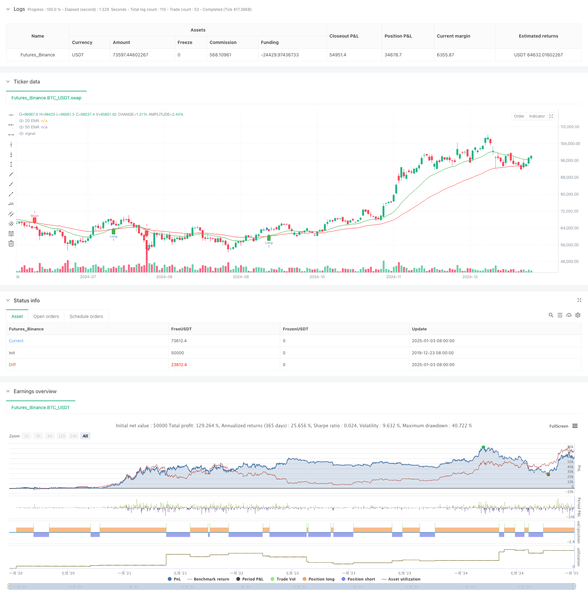

> Name

Dual-EMA-Crossover-Dynamic-Trend-Following-Quantitative-Trading-Strategy
> Author

ChaoZhang

> Strategy Description



[trans]
#### Overview
This strategy is a dynamic trend tracking system based on double moving average crossover signals. It identifies market trend changes through the intersection of the short-term 20-day exponential moving average (EMA) and the long-term 50-day exponential moving average (EMA), and automatically executes buying and selling operations. The strategy adopts mature technical analysis methods, combines the characteristics of trend tracking and dynamic position management, and is suitable for volatile market environments.
#### Strategy Principle
The core logic of the strategy is based on the following key elements:
1. Use the exponential moving average (EMA) of two different periods on the 20th and 50th as a trend judgment indicator.
2. When the short-term 20-day EMA crosses the long-term 50-day EMA upward, the system generates a long signal
3. When the short-term 20-day EMA crosses the long-term 50-day EMA downward, the system generates a short signal
4. Dynamically track position status through position variables to ensure the accuracy of position management
5. When the cross signal appears, the system automatically closes existing positions and establishes new positions.
#### Strategic Advantages
1. Strong signal clarity: The signal judgment mechanism based on moving average crossover is simple and intuitive, and is not prone to false signals.
2. Improve the risk control system: adopt a dynamic position management mechanism to respond to market changes in a timely manner
3. Wide adaptability: The strategy can be applied to different market environments and trading varieties
4. High execution efficiency: Programmed trading ensures fast execution after the signal is generated
5. Backtesting convenience: A complete backtesting framework is built in to facilitate strategy optimization and verification.
#### Strategy Risk
1. Risk of volatile market: False breakthrough signals may frequently occur in a volatile market.
2. Slippage risk: You may face large transaction slippage when the market fluctuates violently.
3. Delay risk: The EMA indicator itself has a certain degree of lag, which may lead to an unsatisfactory entry point.
4. Fund management risk: The strategy does not set a stop loss and fund management mechanism, which needs additional improvement.
5. Systemic risk: You may face systemic risks when the market fluctuates violently.
#### Strategy optimization direction
1. Introduce volatility filter to reduce false signals in volatile markets
2. Add an adaptive stop-loss and stop-profit mechanism to improve fund security
3. Optimize the moving average cycle parameters to better adapt to different market environments
4. Add a trading volume confirmation mechanism to improve signal reliability
5. Introduce a dynamic position management system to optimize capital utilization efficiency
#### Summary
This strategy is a modern implementation of a classic trend following system. It systematizes and standardizes the traditional double moving average crossover strategy through programmed trading. Although there are some inherent risks, through continuous optimization and improvement, the strategy has good application prospects. It is recommended to conduct sufficient parameter optimization and backtest verification before using it in real market. ||
#### Overview
This strategy is a dynamic trend following system based on dual EMA crossover signals, which identifies market trend changes through the crossover of short-term 20-day Exponential Moving Average (EMA) and long-term 50-day EMA, executing buy and sell operations automatically. The strategy employs mature technical analysis methods, combining trend following with dynamic position management, suitable for markets with significant volatility.

#### Strategy Principles
The core logic of the strategy is based on the following key elements:
1. Uses two EMAs with different periods (20-day and 50-day) as trend judgment indicators
2. Generates long signals when the short-term 20-day EMA crosses above the long-term 50-day EMA
3. Generates short signals when the short-term 20-day EMA crosses below the long-term 50-day EMA
4. Dynamically tracks position status through the position variable to ensure accurate position management
5. Automatically closes existing positions and establishes new positions when crossover signals occur

#### Strategy Advantages
1. Clear Signals: The signal judgment mechanism based on EMA crossover is simple and intuitive, reducing false signals
2. Complete Risk Control: Employs dynamic position management mechanism for timely market response
3. Wide Adaptability: Strategy can be applied to different market environments and trading instruments
4. High Execution Efficiency: Programmatic trading ensures rapid execution after signal generation
5. Convenient Backtesting: Built-in complete backtesting framework facilitates strategy optimization and verification

#### Strategy Risks
1. Choppy Market Risk: May generate frequent false breakout signals in sideways markets
2. Slippage Risk: May face significant execution slippage during severe market volatility
3. Delay Risk: EMA indicators have inherent lag, potentially leading to suboptimal entry points
4. Money Management Risk: Strategy lacks stop-loss and money management mechanisms, requiring additional improvement
5. Systematic Risk: May face systematic risks during severe market volatility

#### Strategy Optimization Directions
1. Introduce volatility filters to reduce false signals in choppy markets
2. Add adaptive stop-loss and take-profit mechanisms to enhance capital safety
3. Optimize EMA period parameters for better adaptation to different market environments
4. Add volume confirmation mechanism to improve signal reliability
5. Introduce dynamic position management system to optimize capital utilization efficiency

#### Summary
This strategy is a modern implementation of a classic trend following system, systematizing and standardizing the traditional dual EMA crossover strategy through programmatic trading. While inherent risks exist, the strategy has good application prospects through continuous optimization and improvement. It is recommended to conduct thorough parameter optimization and backtesting before live trading.[/trans]


> Source (PineScript)

``` pinescript
/*backtest
start: 2019-12-23 08:00:00
end: 2025-01-04 08:00:00
period: 1d
basePeriod: 1d
exchanges: [{"eid":"Futures_Binance","currency":"BTC_USDT"}]
*/

//@version=5
strategy("EMA Crossover Buy/Sell Signals", overlay=true)

// Input parameters for EMAs
emaShortLength = input.int(20, title="Short EMA Length")
emaLongLength = input.int(50, title="Long EMA Length")

// Calculating EMAs
emaShort = ta.ema(close, emaShortLength)
emaLong = ta.ema(close, emaLongLength)

// Plotting EMA crossover lines
plot(emaShort, color=color.green, title="20 EMA")
plot(emaLong, color=color.red, title="50 EMA")

// Buy and Sell signal logic
longCondition = ta.crossover(emaShort, emaLong)
exitLongCondition = ta.crossunder(emaShort, emaLong)
shortCondition = ta.crossunder(emaShort, emaLong)
exitShortCondition = ta.crossover(emaShort, emaLong)

// Plot buy and sell signals on the chart
plotshape(series=longCondition, location=location.belowbar, color=color.green, style=shape.labelup, title="Buy Signal")
plotshape(series=exitLongCondition, location=location.abovebar, color=color.red, style=shape.labeldown, title="Sell Exit")

plotshape(series=shortCondition, location=location.abovebar, color=color.red, style=shape.labeldown, title="Sell Signal")
plotshape(series=exitShortCondition, location=location.belowbar, color=color.green, style=shape.labelup, title="Buy Exit")

// Backtesting strategy logic
var float entryPrice = na
var int position = 0  // 1 for long, -1 for short, 0 for no position

if (longCondition and position == 0)
    entryPrice := close
    position := 1

if (shortCondition and position == 0)
    entryPrice := close
    position := -1

if (exitLongCondition and position == 1)
    strategy.exit("Exit Long", from_entry="Long", limit=close)
    position := 0

if (exitShortCondition and position == -1)
    strategy.exit("Exit Short", from_entry="Short", limit=close)
    position := 0

if (longCondition)
    strategy.entry("Long", strategy.long)
if (shortCondition)
    strategy.entry("Short", strategy.short)

```

> Detail

https://www.fmz.com/strategy/477549

> Last Modified

2025-01-06 13:42:11
