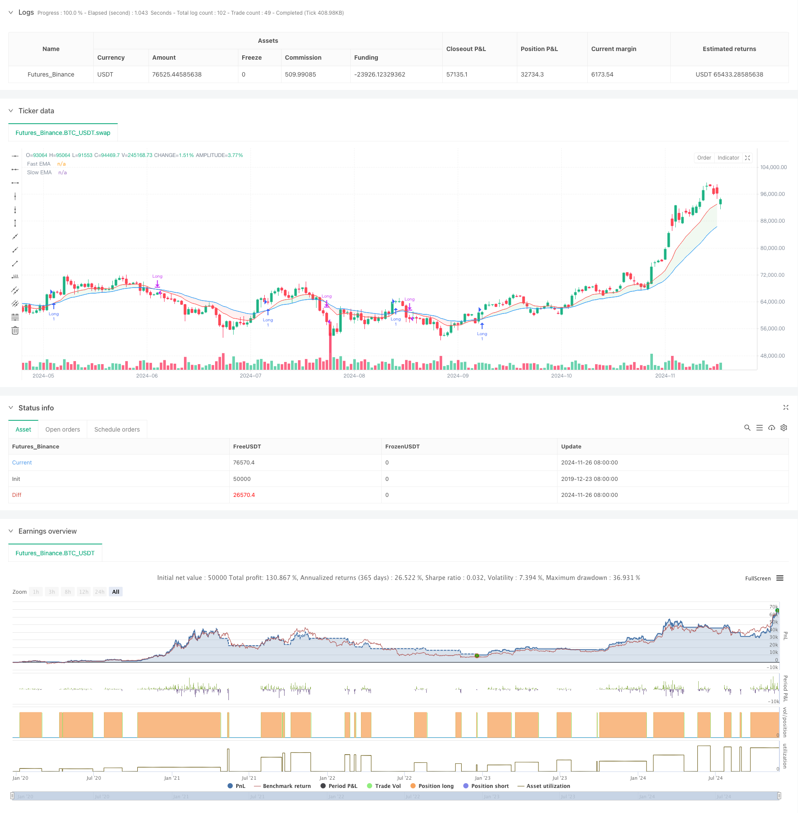

> Name

Dual-EMA-Dynamic-Zone-Trend-Following-Strategy
> Author

ChaoZhang

> Strategy Description



[trans]
#### Overview
This strategy is a dynamic regional trend following system based on dual moving averages (fast EMA and slow EMA). By dividing the positional relationship between the price and the double moving average into different trading areas, combined with the dynamic color indication system, it provides traders with clear buying and selling signals. The strategy adopts the classic moving average crossover theory and improves the operability of the traditional double moving average system through the innovative method of regional division.
#### Strategy Principles
The core of the strategy is to divide the market status into six different areas through the cross relationship between fast EMA (default 12 periods) and slow EMA (default 26 periods), combined with price position. When the fast line is above the slow line, the market is considered to be in a bullish trend; otherwise, it is considered to be in a bearish trend. The position of price relative to these two moving averages further breaks down specific trading areas: green area (buy), blue area (potential buy), red area (sell), and yellow area (potential sell). The buy signal is triggered when the price enters the green zone and the first green candle appears, while the sell signal is triggered when the price enters the red zone and the first red candle appears.
#### Strategic Advantages
1. Visual intuitiveness: Through the dynamic changes of the color area, traders can intuitively judge the market status and potential trading opportunities.
2. Trend confirmation: The dual moving average system provides a reliable trend confirmation mechanism to reduce false signals.
3. Risk management: Clear regional divisions help formulate stop-loss and take-profit strategies.
4. Strong adaptability: The strategy can be applied to different time periods and suitable for various market environments.
5. Adjustable parameters: the moving average period and smoothing parameters can be optimized according to different market characteristics.
#### Strategy Risk
1. Hysteresis: Moving average indicators are lagging in nature, which may lead to delayed entry or exit opportunities.
2. Not applicable to volatile markets: Frequent false signals may occur in sideways volatile markets.
3. Trend reversal risk: When the trend suddenly reverses, the strategy may not respond quickly enough.
4. Parameter dependence: There may be significant differences in optimal parameters under different market environments.
#### Strategy optimization direction
1. Introduce volatility filtering: adjust trading conditions in high volatility environments to avoid false signals.
2. Increase trading volume confirmation: Combine with trading volume indicators to improve signal reliability.
3. Dynamic parameter adjustment: Automatically adjust the moving average period according to market conditions.
4. Add trend strength indicators: Introduce indicators such as ADX to evaluate trend strength.
5. Optimize stop loss strategy: Design a dynamic stop loss plan based on ATR.
#### Summary
This is a trend following strategy that combines the traditional dual moving average system with modern zoning concepts. Through intuitive visual feedback and clear trading rules, it provides traders with a reliable trading framework. Although there is the inherent hysteresis problem of the moving average system, through reasonable parameter optimization and risk management, this strategy can achieve stable performance in trending markets. It is recommended that traders optimize parameters in combination with market characteristics in practical applications and always maintain appropriate risk control. ||
#### Overview
This strategy is a dynamic zone trend following system based on dual EMAs (Fast and Slow). It classifies different trading zones based on the relative positions of price and EMAs, combined with a dynamic color indication system to provide clear buy/sell signals. The strategy adopts classical moving average crossover theory while innovating through zone classification to enhance the operability of traditional dual EMA systems.

#### Strategy Principle
The core of the strategy lies in dividing market conditions into six distinct zones using the crossover relationship between Fast EMA (default 12 periods) and Slow EMA (default 26 periods), combined with price position. When the fast line is above the slow line, the market is considered bullish; conversely, it's considered bearish. The price position relative to these two moving averages further subdivides into specific trading zones: Green Zone (Buy), Blue Zone (Potential Buy), Red Zone (Sell), and Yellow Zone (Potential Sell). Buy signals are triggered when price enters the green zone and the first green candle appears, while sell signals are triggered when price enters the red zone and the first red candle appears.

#### Strategy Advantages
1. Visual Intuitiveness: Dynamic color zone changes allow traders to visually assess market conditions and potential trading opportunities.
2. Trend Confirmation: The dual EMA system provides reliable trend confirmation mechanisms, reducing false signals.
3. Risk Management: Clear zone classification aids in setting stop-loss and take-profit strategies.
4. High Adaptability: The strategy can be applied to different timeframes and is suitable for various market environments.
5. Adjustable Parameters: EMA periods and smoothing parameters can be optimized for different market characteristics.

#### Strategy Risks
1. Lag: Moving averages are inherently lagging indicators, potentially leading to delayed entry or exit timing.
2. Ineffective in Ranging Markets: May generate frequent false signals in sideways markets.
3. Trend Reversal Risk: Strategy may not respond quickly enough to sudden trend reversals.
4. Parameter Dependency: Optimal parameters may vary significantly across different market environments.

#### Strategy Optimization Directions
1. Introduce Volatility Filtering: Adjust trading conditions in high volatility environments to avoid false signals.
2. Add Volume Confirmation: Incorporate volume indicators to enhance signal reliability.
3. Dynamic Parameter Adjustment: Automatically adjust EMA periods based on market conditions.
4. Include Trend Strength Indicators: Introduce ADX or similar indicators to evaluate trend strength.
5. Optimize Stop Loss Strategy: Design dynamic stop-loss solutions based on ATR.

#### Summary
This is a trend following strategy that combines traditional dual EMA systems with modern zone classification concepts. Through intuitive visual feedback and clear trading rules, it provides traders with a reliable trading framework. While inherent lag issues exist with moving average systems, the strategy can achieve stable performance in trending markets through proper parameter optimization and risk management. Traders are advised to optimize parameters based on market characteristics and maintain appropriate risk control in practical applications.[/trans]


> Source (PineScript)

``` pinescript
/*backtest
start: 2019-12-23 08:00:00
end: 2024-11-27 08:00:00
period: 1d
basePeriod: 1d
exchanges: [{"eid":"Futures_Binance","currency":"BTC_USDT"}]
*/

//@version=5
strategy("NUTJP CDC ActionZone 2024", overlay=true, precision=6, commission_value=0.1, slippage=3)

//****************************************************************************//
// CDC Action Zone is based on a simple EMA crossover
// between [default] EMA12 and EMA26
//****************************************************************************//

// Define User Input Variables
xsrc = input.source(title='Source Data', defval=close)
xprd1 = input.int(title='Fast EMA period', defval=12)
xprd2 = input.int(title='Slow EMA period', defval=26)
xsmooth = input.int(title='Smoothing period (1 = no smoothing)', defval=1)
fillSW = input.bool(title='Paint Bar Colors', defval=true)
fastSW = input.bool(title='Show fast moving average line', defval=true)
slowSW = input.bool(title='Show slow moving average line', defval=true)

xfixtf = input.bool(title='** Use Fixed time frame Mode (advanced) **', defval=false)
xtf = input.timeframe(title='** Fix chart to which time frame? **', defval='D')

startDate = input(timestamp("2018-01-01 00:00"), title="Start Date")
endDate = input(timestamp("2069-12-31 23:59"), title="End Date")

//****************************************************************************//
// Calculate Indicators
f_secureSecurity(_symbol, _res, _src) => request.security(_symbol, _res, _src[1], lookahead=barmerge.lookahead_on)

xPrice = ta.ema(xsrc, xsmooth)

FastMA = xfixtf ? ta.ema(f_secureSecurity(syminfo.tickerid, xtf, ta.ema(xsrc, xprd1)), xsmooth) : ta.ema(xPrice, xprd1)

SlowMA = xfixtf ? ta.ema(f_secureSecurity(syminfo.tickerid, xtf, ta.ema(xsrc, xprd2)), xsmooth) : ta.ema(xPrice, xprd2)

Bull = FastMA > SlowMA
Bear = FastMA < SlowMA

// Define Color Zones
Green = Bull and xPrice > FastMA
Red = Bear and xPrice < FastMA

// Buy and Sell Conditions
buycond = Green and not Green[1]
sellcond = Red and not Red[1]

inDateRange = true

if inDateRange
    if buycond
        strategy.entry("Long", strategy.long, qty=1)
    if sellcond
        strategy.close("Long")

//****************************************************************************//
// Display color on chart
bColor = Green ? color.green :
         Red ? color.red :
         color.black
barcolor(color=fillSW ? bColor : na)

// Display MA lines
FastL = plot(fastSW ? FastMA : na, "Fast EMA", color=color.new(color.red, 0), style=xfixtf ? plot.style_stepline : plot.style_line)
SlowL = plot(slowSW ? SlowMA : na, "Slow EMA", color=color.new(color.blue, 0), style=xfixtf ? plot.style_stepline : plot.style_line)
fill(FastL, SlowL, Bull ? color.new(color.green, 90) : (Bear ? color.new(color.red, 90) : na))

```

> Detail

https://www.fmz.com/strategy/473386

> Last Modified

2024-11-29 16:12:58
