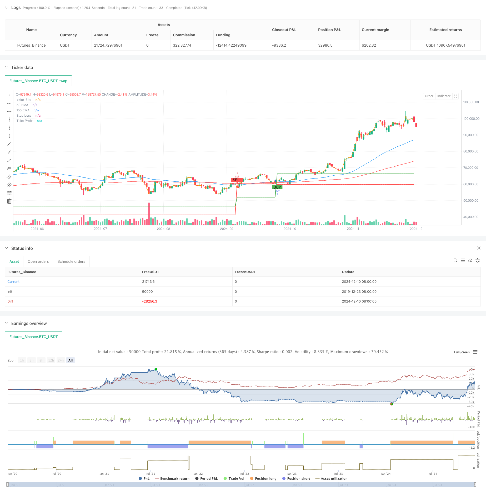

> Name

Dual-EMA-Stochastic-Trend-Following-Trading-Strategy
> Author

ChaoZhang

> Strategy Description



[trans]
#### Overview
This strategy is a trend following trading system based on dual moving averages and stochastic. It combines a moving average system to determine market trends, while using stochastic indicators to capture cross signals in overbought and oversold areas, and sets dynamic stop-loss and take-profit levels to control risks. This method not only ensures the reliability of trading signals, but also effectively manages the risk-return ratio of each transaction.
#### Strategy Principle
The strategy mainly relies on the following core elements for trading:
1. Use the 50-period and 150-period exponential moving averages (EMA) to determine the market trend direction
2. Use stochastic indicator (14,3,3) to identify overbought and oversold areas
3. Look for stochastic crossover signals in the direction of the trend
4. Set dynamic stops based on recent price fluctuations
5. Use a risk-benefit ratio of 1:2 to set a take-profit level
The purchase conditions must be met at the same time:
- Closed above the 50-day and 150-day moving averages
- The 50-day moving average is above the 150-day moving average
- The K value of the stochastic indicator is below 30 and the K line crosses the D line upwards
The selling conditions are opposite:
- Closed below the 50-day and 150-day moving averages
- The 50-day moving average is below the 150-day moving average
- The K value of the stochastic indicator is higher than 70 and the K line crosses the D line downwards
#### Strategic Advantages
1. Multiple confirmation mechanism improves reliability
- Confirm the general trend through the moving average system
- Use stochastic indicator to filter out false signals
- The signal needs to meet multiple conditions before it will be triggered.
2. Complete risk management system
- Dynamic stop loss based on recent support and resistance
- Fixed risk-benefit ratio to optimize expected return
- Trend confirmation reduces the risk of false breakouts
3. Strong adaptability
- Can be applied to multiple timeframes
- Parameters can be adjusted according to market characteristics
- Suitable for volatile markets
#### Strategy Risk
1. Poor performance in volatile markets
- Frequent breaks above the moving average lead to false signals
- Recommended for use when identifying trends
- Trend filter improvements can be added
2. Risk of setting stop loss level
- Too tight may lead to frequent stops
- If you are too loose, you may suffer larger losses.
- Need to adjust according to market fluctuations
3. Lag risk
- The moving average system has hysteresis
- Possibility of missing trend start point
- Be careful when choosing your entry time
#### Strategy optimization direction
1. Add trend strength filtering
- Added ADX indicator to measure trend strength
- Set minimum trend strength threshold
- Avoid trading in weak trends
2. Optimize stochastic indicator parameters
- Adjust parameters according to market characteristics
- Consider using adaptive parameters
- Added confirmation of other technical indicators
3. Improve the stop-loss and stop-profit mechanism
- Consider using a trailing stop
- Dynamically adjust based on volatility
- Optimize risk-benefit ratio settings
#### Summary
This is a complete strategy system that combines trend following and momentum trading. Through the combined use of the moving average system and the stochastic indicator, it can not only ensure that the trading direction is in line with the main trend, but also trade in the appropriate price area. At the same time, the strategy also includes a complete risk management mechanism, using dynamic stop loss and fixed risk-return ratio to control risks. Although there are some inherent limitations, the overall performance of the strategy can be further improved through the suggested optimization directions. In practical applications, it is recommended that traders make appropriate adjustments to parameters based on specific market characteristics and their own risk preferences.
|| 

#### Overview
This strategy is a trend-following trading system based on dual EMAs and the Stochastic indicator. It combines moving averages to determine market trends while using the Stochastic indicator to capture crossover signals in overbought/oversold areas, with dynamic stop-loss and take-profit levels for risk management. This approach ensures both signal reliability and effective risk-reward management for each trade.

#### Strategy Principles
The strategy relies on several core elements:
1. Uses 50 and 150-period EMAs to determine market trend direction
2. Employs Stochastic indicator (14,3,3) to identify overbought/oversold areas
3. Looks for Stochastic crossover signals in trend direction
4. Sets dynamic stop-loss based on recent price action
5. Uses 1:2 risk-reward ratio for take-profit levels

Buy conditions require:
- Close price above both 50 and 150 EMAs
- 50 EMA above 150 EMA
- Stochastic K value below 30 and K line crosses above D line

Sell conditions are opposite:
- Close price below both 50 and 150 EMAs
- 50 EMA below 150 EMA
- Stochastic K value above 70 and K line crosses below D line

#### Strategy Advantages
1. Multiple confirmation mechanism improves reliability
- Trend confirmation through EMA system
- False signal filtering using Stochastic
- Multiple conditions required for signal generation

2. Comprehensive risk management system
- Dynamic stop-loss based on recent support/resistance
- Fixed risk-reward ratio optimizes expected returns
- Trend confirmation reduces false breakout risks

3. High adaptability
- Applicable to multiple timeframes
- Parameters adjustable to market characteristics
- Suitable for high-volatility markets

#### Strategy Risks
1. Poor performance in ranging markets
- Frequent EMA crossovers leading to false signals
- Recommended for clear trend periods only
- Can be improved with trend filters

2. Stop-loss placement risks
- Too tight may result in frequent stops
- Too loose may lead to large losses
- Needs adjustment based on market volatility

3. Lag risks
- EMA system has inherent lag
- May miss trend initiation points
- Entry timing requires careful consideration

#### Strategy Optimization Directions
1. Add trend strength filtering
- Incorporate ADX indicator for trend strength
- Set minimum trend strength threshold
- Avoid trading in weak trends

2. Optimize Stochastic parameters
- Adjust parameters based on market characteristics
- Consider adaptive parameters
- Add additional technical indicators for confirmation

3. Improve stop-loss/take-profit mechanism
- Consider trailing stops
- Dynamic adjustment based on volatility
- Optimize risk-reward ratio settings

#### Summary
This is a complete strategy system combining trend following and momentum trading. Through the combination of EMA system and Stochastic indicator, it ensures trades align with the main trend while entering at appropriate price levels. Additionally, the strategy includes comprehensive risk management mechanisms, using dynamic stop-losses and fixed risk-reward ratios to control risk. While there are some inherent limitations, the strategy's overall performance can be further improved through the suggested optimizations. In practical application, traders are advised to adjust parameters according to specific market characteristics and their own risk preferences.[/trans]


> Source (PineScript)

``` pinescript
/*backtest
start: 2019-12-23 08:00:00
end: 2024-12-11 08:00:00
period: 1d
basePeriod: 1d
exchanges: [{"eid":"Futures_Binance","currency":"BTC_USDT"}]
*/

// This Pine Script™ code is subject to the terms of the Mozilla Public License 2.0 at https://mozilla.org/MPL/2.0/
// © quadawosanya

//@version=5
//indicator("My script")
//@version=5
strategy("EMA-Stochastic Strategy", overlay=true)

// EMA settings
ema50 = ta.ema(close, 50)
ema150 = ta.ema(close, 150)

// Stochastic settings
kLength = 14
dLength = 3
smoothK = 3
stochK = ta.sma(ta.stoch(close, high, low, kLength), smoothK)
stochD = ta.sma(stochK, dLength)

// Parameters for Stop Loss and Take Profit
var float stopLossLevel = na
var float takeProfitLevel = na

// Buy condition
buySignal = (close > ema50 and close > ema150) and (ema50 > ema150) and (stochK < 30 and ta.crossover(stochK, stochD))

// Sell condition
sellSignal = (close < ema50 and close < ema150) and (ema50 < ema150) and (stochK > 70 and ta.crossunder(stochK, stochD))

// Previous low for Stop Loss for Buy
lowBeforeBuy = ta.lowest(low, 5)

// Previous high for Stop Loss for Sell
highBeforeSell = ta.highest(high, 5)

// Entry and exit logic
if (buySignal)
    stopLossLevel := lowBeforeBuy
    risk = close - stopLossLevel
    takeProfitLevel := close + 2 * risk
    strategy.entry("Buy", strategy.long)
    strategy.exit("Take Profit/Stop Loss", "Buy", stop=stopLossLevel, limit=takeProfitLevel)

if (sellSignal)
    stopLossLevel := highBeforeSell
    risk = stopLossLevel - close
    takeProfitLevel := close - 2 * risk
    strategy.entry("Sell", strategy.short)
    strategy.exit("Take Profit/Stop Loss", "Sell", stop=stopLossLevel, limit=takeProfitLevel)

// Plotting EMAs
plot(ema50, color=color.blue, title="50 EMA")
plot(ema150, color=color.red, title="150 EMA")

// Visualize Buy and Sell signals
plotshape(series=buySignal, title="Buy Signal", location=location.belowbar, color=color.green, style=shape.labelup, text="BUY")
plotshape(series=sellSignal, title="Sell Signal", location=location.abovebar, color=color.red, style=shape.labeldown, text="SELL")

// Visualize Stop Loss and Take Profit levels
plot(stopLossLevel, color=color.red, style=plot.style_line, linewidth=2, title="Stop Loss")
plot(takeProfitLevel, color=color.green, style=plot.style_line, linewidth=2, title="Take Profit")


plot(close)

```

> Detail

https://www.fmz.com/strategy/474964

> Last Modified

2024-12-13 10:48:46
