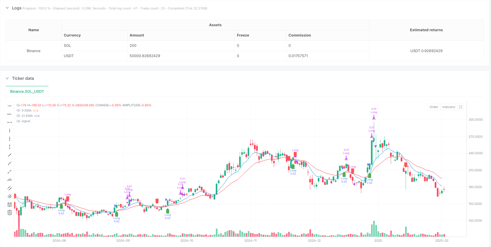
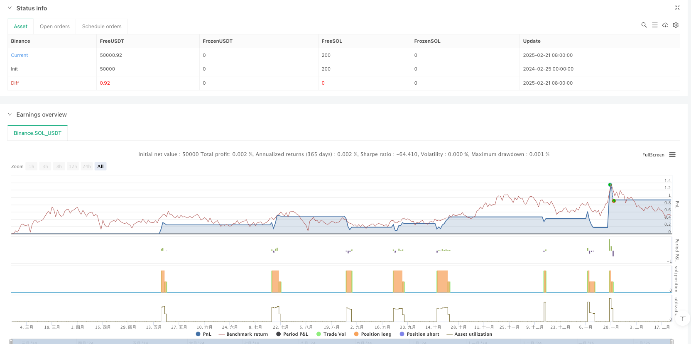

> Name

Dual-EMA-Trend-Following-Strategy-with-Staged-Position-Exit
> Author

ianzeng123

> Strategy Description





[trans]
#### Overview
This strategy is a trend following system based on dual exponential moving average (EMA) crossovers, combined with a step-by-step exit mechanism to optimize trading returns. The strategy uses 9-period and 21-period EMAs as fast and slow lines, and uses their intersection to identify changes in market trends, while adopting a two-stage position exit plan to balance risks and returns.
#### Strategy Principle
The core logic of the strategy is based on the cross signal of the fast EMA (9 periods) and the slow EMA (21 periods). When the fast line crosses the slow line, the system opens a long position with 0.02 lots; when the fast line crosses the slow line, the system opens a short position with 0.02 lots. During the position holding period, the strategy adopts a two-stage exit mechanism: the first stage is to close half of the position (0.01 lots) when the profit reaches 200 points; the second stage is to close the remaining position when a reverse cross signal occurs. This step-by-step exit is designed to lock in some profits while preserving upside.
#### Strategic Advantages
1. Strong trend capturing ability: By using EMA of two different periods, the strategy can effectively identify the turning point of the market trend.
2. Improved risk management: The step-by-step exit mechanism can lock in some profits without completely missing the continuation of the trend.
3. Reasonable parameter setting: The EMA combination of 9 and 21 periods has been widely verified in the market and has good reliability.
4. Clear execution logic: The entry and exit rules of the strategy are clear, which facilitates real-time operation and backtest verification.
#### Strategy Risk
1. Shock market risk: In a sideways shock market, frequent cross signals may lead to continuous false breakthrough losses.
2. Impact of slippage: In a rapidly volatile market, the execution of phased exit may be affected by slippage.
3. Trend reversal risk: If the market trend suddenly reverses, the strategy may close half of the position at a high point, and the remaining position will suffer a large retracement.
#### Strategy optimization direction
1. Introducing trend filters: Long-period moving averages or trend indicators can be added to filter out false signals.
2. Dynamic stop loss setting: Dynamically adjust the stop loss position according to market volatility to improve the flexibility of risk control.
3. Optimize the step-by-step exit ratio: The position ratio and profit target for the first exit can be adjusted according to different market environments.
4. Add time filtering: Add trading time window restrictions to avoid trading during periods of low market liquidity.
#### Summary
This is a complete trading system that combines the classic moving average crossover strategy with modern position management. The strategy improves the profitability of the traditional moving average crossover strategy through a step-by-step exit mechanism, but it still requires traders to make appropriate adjustments based on the specific market environment and their own risk tolerance. Future optimization directions will mainly focus on signal filtering and dynamic risk management. ||
#### Overview
This strategy is a trend following system based on dual Exponential Moving Average (EMA) crossovers, combined with a staged position exit mechanism to optimize trading returns. The strategy utilizes 9-period and 21-period EMAs as fast and slow lines, identifying market trend changes through their crossovers while implementing a two-stage position exit plan to balance risk and reward.

#### Strategy Principles
The core logic is based on crossover signals between the fast EMA (9-period) and slow EMA (21-period). When the fast line crosses above the slow line, the system opens a long position with 0.02 lots; when the fast line crosses below the slow line, it opens a short position with 0.02 lots. During position holding, the strategy employs a two-stage exit mechanism: the first stage closes half the position (0.01 lots) when profit reaches 200 points; the second stage closes the remaining position when a reverse crossover signal appears. This staged exit design aims to lock in partial profits while maintaining exposure to trend continuation.

#### Strategy Advantages
1. Strong trend capture capability: Using two EMAs with different periods effectively identifies market trend turning points.
2. Comprehensive risk management: The staged exit mechanism locks in partial profits while maintaining exposure to trend continuation.
3. Well-validated parameters: The 9 and 21-period EMA combination has been widely tested in markets and proves reliable.
4. Clear execution logic: The entry and exit rules are explicit, facilitating live trading and backtesting.

#### Strategy Risks
1. Choppy market risk: In ranging markets, frequent crossover signals may lead to consecutive false breakout losses.
2. Slippage impact: In rapidly moving markets, staged exit execution may be affected by slippage.
3. Trend reversal risk: If market trends suddenly reverse, the strategy might close half the position at peaks, leaving remaining positions exposed to significant drawdowns.

#### Strategy Optimization Directions
1. Introduce trend filters: Add longer-period moving averages or trend indicators to filter false signals.
2. Dynamic stop-loss settings: Adjust stop-loss positions based on market volatility for more flexible risk control.
3. Optimize staged exit ratios: Adjust first exit position size and profit targets based on different market conditions.
4. Add time filters: Implement trading time windows to avoid low liquidity periods.

#### Summary
This is a complete trading system that combines classic moving average crossover strategy with modern position management. The strategy enhances the profitability of traditional moving average crossover strategies through staged exit mechanisms, but traders still need to make appropriate adjustments based on specific market conditions and their risk tolerance. Future optimization directions mainly focus on signal filtering and dynamic risk management.[/trans]


> Source (PineScript)

``` pinescript
/*backtest
start: 2024-02-25 00:00:00
end: 2025-02-22 08:00:00
period: 1d
basePeriod: 1d
exchanges: [{"eid":"Binance","currency":"SOL_USDT"}]
*/

//@version=5
strategy("EMA Crossover with Partial Exit", overlay=true, default_qty_type=strategy.cash, default_qty_value=50)

// Define lot sizes
lotSize = 0.02   // Initial trade size
partialLot = 0.01 // Half quantity to close at 20 pips profit
profitTarget = 200 // 20 pips = 200 points (for Forex, adjust accordingly)

// Define EMA lengths
fastLength = 9
slowLength = 21

// Compute EMAs
fastEMA = ta.ema(close, fastLength)
slowEMA = ta.ema(close, slowLength)

// Define crossover conditions
longEntry = ta.crossover(fastEMA, slowEMA)   // Buy when 9 EMA crosses above 21 EMA
shortEntry = ta.crossunder(fastEMA, slowEMA) // Sell when 9 EMA crosses below 21 EMA

// Track trade state
var float entryPrice = na
var bool inTrade = false
var bool isLong = false

// Entry Logic (Enter with 0.02 lot size)
if (longEntry and not inTrade)
    strategy.entry("Long", strategy.long, qty=lotSize)
    entryPrice := close
    inTrade := true
    isLong := true

if (shortEntry and not inTrade)
    strategy.entry("Short", strategy.short, qty=lotSize)
    entryPrice := close
    inTrade := true
    isLong := false

// Partial Exit Logic (Close 0.01 lot after 20 pips profit)
if (isLong and inTrade and close >= entryPrice + profitTarget * syminfo.mintick)
    strategy.close("Long", qty=partialLot)

if (not isLong and inTrade and close <= entryPrice - profitTarget * syminfo.mintick)
    strategy.close("Short", qty=partialLot)

// Full Exit (Close remaining 0.01 lot at the next major crossover)
if (isLong and shortEntry)
    strategy.close("Long") // Close remaining position
    inTrade := false

if (not isLong and longEntry)
    strategy.close("Short") // Close remaining position
    inTrade := false

// Plot EMAs
plot(fastEMA, color=color.blue, title="9 EMA")
plot(slowEMA, color=color.red, title="21 EMA")

// Mark Buy/Sell Signals
plotshape(series=longEntry, location=location.belowbar, color=color.green, style=shape.labelup, title="BUY Signal")
plotshape(series=shortEntry, location=location.abovebar, color=color.red, style=shape.labeldown, title="SELL Signal")
```

> Detail

https://www.fmz.com/strategy/483526

> Last Modified

2025-02-24 10:23:24
