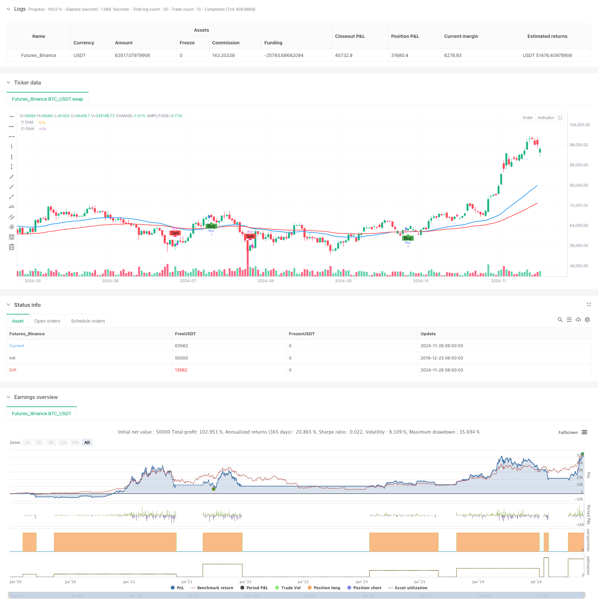

> Name

Dual-EMA-Trend-Momentum-Trading-Strategy
> Author

ChaoZhang

> Strategy Description



[trans]
#### Overview
This is a quantitative trading strategy based on double moving average crossover and trend following. This strategy mainly uses the 47-period and 95-period exponential moving averages (EMA) to capture market trends and trade through moving average crossover signals. The strategy operates on a 15-minute timeframe and combines the core concepts of technical analysis and momentum trading to achieve robust trading returns.
#### Strategy Principle
The core of the strategy is to use the intersection of short-term EMA (47 periods) and long-term EMA (95 periods) to identify trend changes. When the short-term EMA crosses the long-term EMA upwards, the system generates a long signal; when the short-term EMA crosses the long-term EMA downwards, the system closes the position. This design is based on the principles of price momentum and trend continuity, and uses moving average crossovers to confirm trend conversion points, thereby grasping the main market trends.
#### Strategic Advantages
1. Clear signals: Double moving average crossovers provide clear entry and exit signals, reducing the uncertainty caused by subjective judgments.
2. Trend following: The strategy can effectively capture short- and medium-term trends and gain profits during the duration of the trend.
3. High degree of automation: The strategy logic is simple and clear, easy to implement programmatically and verify through backtesting.
4. Strong adaptability: By adjusting the moving average cycle, the strategy can adapt to different market environments and trading varieties.
5. Risk control: Systematic trading rules help control emotional fluctuations and maintain trading discipline.
#### Strategy Risk
1. Not applicable to volatile markets: In sideways volatile markets, frequent false breakthroughs may lead to continuous losses.
2. Hysteresis: The moving average indicator itself has hysteresis and may miss the best entry opportunity or experience a large retracement when the trend turns.
3. Parameter dependence: The choice of moving average period has a greater impact on strategy performance, and different markets may require different parameter settings.
4. Fund management: Without a complete stop-loss mechanism, you may suffer large losses during violent fluctuations.
#### Strategy optimization direction
1. Introduce volatility indicator: ATR indicator can be added to dynamically adjust the stop loss position and improve risk control capabilities.
2. Add trend filtering: Combine with indicators such as RSI or MACD to screen for more reliable trading signals.
3. Optimize parameter selection: Machine learning methods can be used to automatically select the optimal moving average period for different market environments.
4. Improve fund management: add position management and risk control modules, and set the maximum loss ratio for each transaction.
5. Add market environment judgment: introduce market structure analysis, reduce trading frequency or suspend trading in volatile markets.
#### Summary
This is a trend following strategy with clear structure and rigorous logic. Capturing market trends through double moving average crossovers has better operability and scalability. Although there are certain limitations, through continuous optimization and improvement, it is expected to develop into a stable and reliable trading system. The focus is to flexibly adjust parameters according to different market characteristics and establish a complete risk control mechanism.
||
#### Overview
This is a quantitative trading strategy based on dual EMA crossover and trend following. The strategy primarily utilizes 47-period and 95-period Exponential Moving Averages (EMA) to capture market trends, executing trades based on EMA crossover signals. Operating on a 15-minute timeframe, it combines technical analysis and momentum trading principles to achieve consistent trading returns.
#### Strategy Principles
The core mechanism relies on identifying trend changes through crossovers between short-term EMA (47-period) and long-term EMA (95-period). Buy signals are generated when the short-term EMA crosses above the long-term EMA, while positions are closed when the short-term EMA crosses below. This design is based on price momentum and trend continuation principles, using EMA crossovers to confirm trend transition points.

#### Strategy Advantages
1. Clear Signals: Dual EMA crossovers provide explicit entry and exit signals, reducing uncertainty from subjective judgment.
2. Trend Following: The strategy effectively captures medium to short-term trends, generating profits during trend continuation.
3. High Automation: Simple and clear strategy logic enables easy programming implementation and backtesting.
4. Strong Adaptability: Strategy can be adapted to different market environments by adjusting EMA periods.
5. Controlled Risk: Systematic trading rules help control emotional fluctuations and maintain trading discipline.

#### Strategy Risks
1. Poor Performance in Ranging Markets: Frequent false breakouts in sideways markets may lead to consecutive losses.
2. Lag Effect: EMA indicators have inherent lag, potentially missing optimal entry points or experiencing larger drawdowns during trend reversals.
3. Parameter Dependency: Strategy performance heavily relies on EMA period selection, requiring different parameters for different markets.
4. Capital Management: Lack of comprehensive stop-loss mechanisms may result in significant losses during volatile periods.

#### Optimization Directions
1. Incorporate Volatility Indicators: Add ATR indicator for dynamic stop-loss adjustment to enhance risk control.
2. Add Trend Filters: Combine RSI or MACD indicators to screen for more reliable trading signals.
3. Optimize Parameter Selection: Implement machine learning methods for automatic selection of optimal EMA periods in different market environments.
4. Improve Capital Management: Enhance position sizing and risk control modules, set maximum loss percentage per trade.
5. Include Market Environment Analysis: Introduce market structure analysis to reduce trading frequency or pause trading during ranging markets.

#### Conclusion
This is a well-structured and logically rigorous trend-following strategy. It captures market trends through dual EMA crossovers, offering good operability and scalability. While certain limitations exist, continuous optimization and improvement can develop it into a stable and reliable trading system. The key is to flexibly adjust parameters based on different market characteristics and establish comprehensive risk control mechanisms.[/trans]


> Source (PineScript)

``` pinescript
/*backtest
start: 2019-12-23 08:00:00
end: 2024-11-27 08:00:00
period: 1d
basePeriod: 1d
exchanges: [{"eid":"Futures_Binance","currency":"BTC_USDT"}]
*/

//@version=5
strategy("EMA Crossover Strategy", overlay=true)

// Define the EMA periods
shortEmaPeriod = 47
longEmaPeriod = 95

// Calculate EMAs
ema11 = ta.ema(close, shortEmaPeriod)
ema21 = ta.ema(close, longEmaPeriod)

// Plot EMAs on the chart
plot(ema11, title="11 EMA", color=color.blue, linewidth=2)
plot(ema21, title="21 EMA", color=color.red, linewidth=2)

// Generate trading signals
longSignal = ta.crossover(ema11, ema21)
shortSignal = ta.crossunder(ema11, ema21)

// Execute trades based on signals
if (longSignal)
    strategy.entry("Buy", strategy.long)

if (shortSignal)
    strategy.close("Buy")

// Optional: Plot buy and sell signals on the chart
plotshape(series=longSignal, location=location.belowbar, color=color.green, style=shape.labelup, text="Buy")
plotshape(series=shortSignal, location=location.abovebar, color=color.red, style=shape.labeldown, text="Sell")

// Plot buy/sell signals on the main chart
plotshape(series=longSignal, location=location.belowbar, color=color.green, style=shape.labelup, text="Buy")
plotshape(series=shortSignal, location=location.abovebar, color=color.red, style=shape.labeldown, text="Sell")

```

> Detail

https://www.fmz.com/strategy/473383

> Last Modified

2024-11-29 16:08:51
