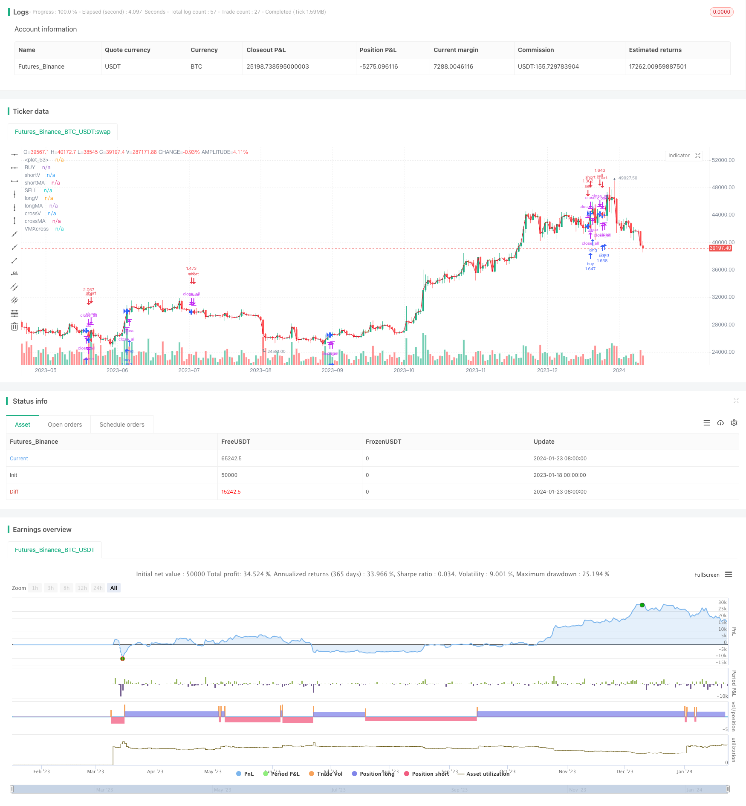

> Name

Dual-Exponential-Moving-Average-Crossover-Algorithmic-Trading-Strategy
> Author

ChaoZhang

> Strategy Description


[trans]
## Overview
The name of this strategy is "Double Index Average Cross Quantitative Trading Strategy". This strategy realizes automated trading by calculating the Exponential Moving Average (EMA) and judging the cross buying and selling points, combined with the principles of quantitative trading opening positions.
## Strategy Principle
The core logic of this strategy is based on the double exponential moving average. Indicator 1 is the short-term 20-day EMA, and indicator 2 is the long-term 50-day EMA. A buy signal is generated when the short-term EMA crosses above the long-term EMA from below; a sell signal is generated when the short-term EMA crosses below the long-term EMA from above. In this way, the intersection of different EMA parameters is used to determine the market buying and selling points.
In addition, the strategy also uses the Vortex quantitative indicator to assist in determining trends and generating trading signals. The Vortex indicator determines the strength of the rise and fall by calculating the difference between the highest price and yesterday's closing price, and the lowest price and yesterday's closing price. The parameter period is 1 day and 3 days. Combined with the Vortex indicator, some EMA signals that are not the main trend can be filtered out.
When a trading signal is generated, risk management is carried out based on the built-in fund management module of the strategy and the principle of profit and loss ratio. The strategy allows you to set stop loss and take profit levels to lock in profits and control risks.
## Advantage Analysis
- 1. The strategy integrates double EMA crossover and Vortex quantitative indicators, making full use of the advantages of indicators to improve signal accuracy
- 2. Automated trading system requires no manual participation and reduces the probability of human errors.
- 3. Built-in automatic stop loss and stop profit function, which can limit the maximum loss of a single transaction
- 4. The fund management module controls the proportion of funds invested in each transaction, thereby controlling the overall transaction risk.
## Risk Analysis
- 1. False signals may appear in EMA cross signals, and the Vortex quantitative indicator cannot completely filter out false signals, so there will be a certain probability of loss.
- 2. A sudden major black swan event may directly expand the loss of a single transaction
- 3. Retracement control relies on the stop loss function. If the stop loss is exceeded, it will cause greater losses.
Optimization direction:
- 1. You can test and adjust EMA parameters to optimize cross signals
- 2. Can combine more indicators to filter signals
- 3. Parameters can be automatically optimized through machine learning algorithms
## Summarize
Generally speaking, this strategy is a typical double EMA crossover strategy. It uses the crossover between different EMA parameters to determine the market buying and selling timing. It is a short- to medium-term trading strategy. The biggest advantage of the strategy is that it uses quantitative indicators for signal filtering and realizes unattended operation through an automated trading system. At the same time, it has built-in stop loss and profit taking to control risks, and its performance is relatively stable. In the later stage, the strategy effect can be further improved through parameter optimization and the introduction of more auxiliary indicators.
||

## Overview

The strategy is named "Dual Exponential Moving Average Crossover Algorithmic Trading Strategy". It calculates dual exponential moving averages (EMA) and generates trading signals when the EMAs cross over. Combined with the algorithmic trading principles for order entry, it automates the entire trading process.

## Strategy Logic  

The core logic of this strategy is based on the dual EMA crossovers. Indicator 1 is the 20-day EMA and Indicator 2 is the 50-day EMA. A buy signal is generated when the shorter-term EMA crosses over the longer-term EMA from below. A sell signal is generated when the shorter-term EMA crosses below the longer-term EMA from above. So the crossover of EMAs with different parameters is used to determine market entry and exit points.

In addition, the Vortex indicator is used to aid in identifying the trend and generating trading signals. The Vortex indicator determines the bullish or bearish momentum by comparing the difference between the highest price and yesterday's close, and the lowest price and yesterday's open, over a 1-day and 3-day period. Using the Vortex can help filter out some less significant signals from the EMA crosses. 

When a trading signal is generated, the built-in money management module helps manage risks by controlling position sizing based on predefined profit loss ratios. Stop loss and take profit levels can also be set to lock in profits and limit downsides.  

## Advantage Analysis 

1. The strategy integrates dual EMA crossovers and the Vortex indicator to take advantage of both, thus improving signal accuracy

2. The automated trading system removes emotional human errors and minimizes risks

3. The auto stop loss/take profit functions limit max loss for each trade

4. The money management module controls capital allocation for each trade, thus manages overall risks

## Risk Analysis

1. EMA crossovers may generate false signals. And the Vortex indicator cannot completely filter out false signals either. There can still be some losing trades.  

2. Black swan events can lead to huge losses on open positions.

3. The strategy relies on stop losses to control drawdowns. If stopped out, losses may exceed expectations.

Improvement Opportunities:

1. EMA parameters can be further optimized to improve signal quality

2. More indicators may be added to better filter signals 

3. Machine learning algorithms may help auto-optimize parameters

## Conclusion  

Overall this is a typical dual EMA crossover strategy for medium-term trading. It identifies trading opportunities from EMA crossovers. The biggest advantage lies in using indicators like the Vortex to filter signals, executing the automated strategy reliably, plus the embedded stop loss/take profit functions to mitigate risks. Going forward, strategy performance may be further enhanced through parameter tuning and integrating more complementary indicators.

[/trans]

> Strategy Arguments


|Argument|Default|Description|
|----|----|----|
|v_input_1|15|short Time|
|v_input_2|25|long time|
|v_input_3|5|Vortex Power|
|v_input_4|20|ShortMa|
|v_input_5|29|LongMA|
|v_input_6|true|Vortex Stabilize|
|v_input_7|true|MACross Stabilize|
|v_input_8|false|Stop Loss Long|
|v_input_9|true|Stop Long|
|v_input_10|false|Take Profit Long|
|v_input_11|true|Take Long|
|v_input_12|false|Stop Loss Short|
|v_input_13|true|Stop Short|
|v_input_14|false|Take Profit Short|
|v_input_15|true|Take Short|


> Source (PineScript)

``` pinescript
/*backtest
start: 2023-01-18 00:00:00
end: 2024-01-24 00:00:00
period: 1d
basePeriod: 1h
exchanges: [{"eid":"Futures_Binance","currency":"BTC_USDT"}]
*/

// This source code is subject to the terms of the Mozilla Public License 2.0 at https://mozilla.org/MPL/2.0/
// © smottybugger 

//@version= 5
strategy("The  Averages Moving_X_Vortex", shorttitle="2.5billion BTC lol" , calc_on_order_fills=true, calc_on_every_tick=true, commission_type=strategy.commission.percent, commission_value=0.02, default_qty_type=strategy.percent_of_equity, default_qty_value=100, initial_capital=100, margin_long=0, margin_short=0,overlay=true)
// Dual Vortex
period_1 = input(15, "short Time")
period_2 = input(25, "long time")
VMP = math.sum(math.abs(high - low[3]), period_1)
VMM = math.sum(math.abs(low - high[1]), period_2)
STR = math.sum(ta.atr(1), period_1)
STR2 = math.sum(ta.atr(1), period_2)
VXpower= (input(5,"Vortex Power")/10000)*close
shorterV =(VMP / STR)*VXpower
longerV = (VMM / STR2)*VXpower

// MACross
shortlen = input(20, "ShortMa")
longlen = input(29, "LongMA")
shorterMA = ta.sma(close, shortlen)
longerMA = ta.sma(close, longlen)

// Vortex "MACross Stabilized"
Varance = input(1, "Vortex Stabilize")
Vpercent = (Varance / 100)
shortV= ((((shorterMA-close)* Vpercent)+shorterV)/2)+close
longV = ((((longerMA -close )*Vpercent)+longerV)/2)+close

//MAcross vortex stabilized
Marance = input(1, "MACross Stabilize")
MApercent = Marance / 100
shortMA = ((((shorterMA-close)*MApercent)+shorterV)/2)+close
longMA = ((((longerMA-close)*MApercent)+longerV)/2)+close

//VMXadveraged Moving cross adveraged
VMXL=(longV+longMA)/2
VMXS=(shortV+shortMA)/2
VXcross= ta.cross(VMXS,VMXL) ? VMXS : na
VMXcross= ta.cross(VMXS,VMXL)

//plot
plot(VMXS,"BUY",color=#42D420)
plot(VMXL,"SELL",color=#e20420)
crossV= ta.cross(shortV, longV) ? shortV : na
plot(shortV ,"shortV", color=#42D420)
plot(longV,"longV", color=#e20420)
plot(crossV,"crossV", color=#2962FF, style=plot.style_cross, linewidth=4)
crossMA = ta.cross(shortMA, longMA) ? shortMA : na
plot(shortMA,"shortMA", color=#42D420)
plot(longMA,"longMA", color=#e20420)
plot(crossMA,"crossMA", color=#2962FF, style=plot.style_cross, linewidth=4)
plot(VXcross,"VMXcross",color=#2962FF, style= plot.style_cross,linewidth=4)
plot(close,color=#999999)

// Vortex Condistyle
is_Vlong =shortV< longV
is_Vshort =shortV>longV


// Vortex commands
Vlong =  ta.crossunder(longV, shortV)
Vshort =ta.crossover(shortV,longV)
VorteX = ta.cross(longV, shortV)

// MACross Conditions
is_MAlong = shortMA < longV
is_MAshort = shortMA > shortV


//VMX Conditions
is_VMXlong=VMXS<VMXL
is_VMXshort=VMXS>VMXL

// MA commands
MAlong = ta.crossunder(shortMA, longV)
MAshort =ta.crossover(shortMA, shortV)
MAcross =  ta.cross(shortMA, longMA)
 
//VMX COMMANss
VMXBUY=ta.crossover( VMXS,VMXL)
VMXSELL=ta.crossunder(VMXS,VMXL)

// Close Crossing PositionLMXs

CS=is_MAshort or is_VMXshort
CL= is_MAlong or is_VMXlong
OS=MAshort or VMXSELL
OL=MAlong or VMXBUY


if VMXcross
    strategy.close_all ("closed")

//if CS and  OL
    strategy.close("Short",comment="Short Closed")


//if CL and  OS
    strategy.close("Long",comment="Long Closed" ) 

//CA1= is_MAcross and is_VorteX
//if CA1
   // strategy.close_all(comment="X2X")

// Defalongyntry qty

if is_VMXlong and VMXSELL
    strategy.entry("sell",strategy.short)


if is_VMXshort and VMXBUY
    strategy.entry("buy",strategy.long)


// Stop Losses & Taking Profit
sllp = input(0, "Stop Loss Long")
sll = (1 - sllp / 100) * strategy.position_avg_price
is_sll = input(true, "Stop Long")

tplp = input(0, "Take Profit Long")
tpl = (1 + tplp / 100) * strategy.position_avg_price
is_tpl = input(true, "Take Long")

slsp = input(0, "Stop Loss Short")
sls = (1 + slsp / 100) * strategy.position_avg_price
is_sls = input(true, "Stop Short")

tpsp = input(0, "Take Profit Short")
tps = (1 - tpsp / 100) * strategy.position_avg_price
is_tps = input(true, "Take Short")

if (is_sll or is_sls) 
    strategy.close("Stop Losses", qty_percent=100)

if (is_tpl or is_tps) 
    strategy.close("Take Profits", qty_percent=100)


 //Strategy Backtest
//plot(strategy.equity, "Equity", color=color.red, linewidth=2, style=plot.style_areabr)

```

> Detail

https://www.fmz.com/strategy/439969

> Last Modified

2024-01-25 14:04:23
