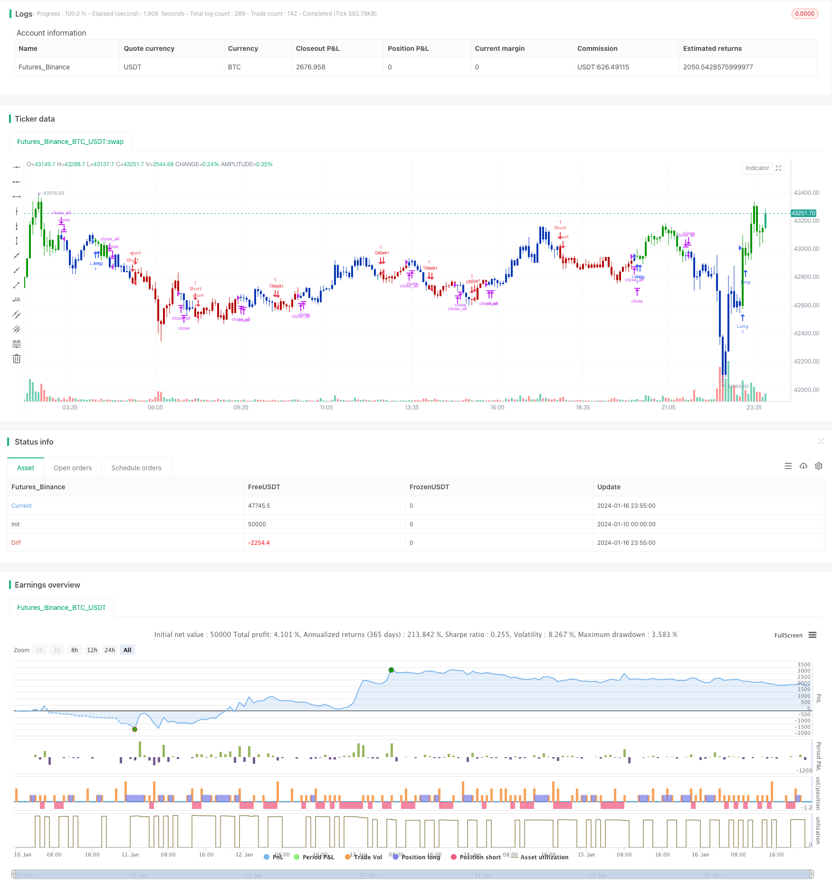

> Name

Dual-Factor-Momentum-Tracking-Reversal-Strategy
> Author

ChaoZhang

> Strategy Description


 [trans]
## Overview
This strategy comprehensively uses the stock volume and price reversal factor and momentum factor to construct a two-factor model in order to capture the opportunities of short-term market reversal and medium- and long-term persistence. The strategy first uses the 123 pattern to determine the recent price reversal signal, and then combines it with the Laguerre RSI indicator to determine the medium and long-term trend, and finally achieves an effective combination of two-factor signals.
## Strategy Principle
The strategy consists of two parts:
1. 123 pattern reversal factor
This part finds short-term price reversal signals by judging the closing price changes of the previous two days. Specifically, if the closing price of the previous day is lower than the previous two days, and today's closing price is higher than the previous day, it can be judged as a signal of price reversal and rise. Stoch indicator is used to assist judgment.
2. RSI factor based on Lager filter
This section constructs a more sensitive RSI indicator. The traditional RSI indicator is less sensitive to price changes, while the Lager filter can use less historical data to construct the indicator, thereby increasing the sensitivity to price changes. The new RSI indicator is used to determine medium and long-term trends.
Ultimately, the strategy will combine the signals of the two to ensure that the general trend will not reverse during the short-term reversal, thereby capturing rebound opportunities.
## Strategic Advantages
The biggest advantage of this strategy is the successful combination of reversal factors and trend factors. The reversal factor can capture price rebound opportunities after short-term adjustments, while the trend factor ensures that the general direction of long/short positions will not change. Compared with a single reversal or momentum model, this two-factor model can improve the accuracy of long and short positions while reducing false signals.
In addition, the addition of the Lager RSI indicator also increases the sensitivity of the model to price changes, which is especially important for high-frequency trading.
## Risk Analysis
The main risk to this strategy is the potential for the two-factor signals to diverge. Especially during the period of market shock and adjustment, while short-term prices frequently reverse, medium- and long-term trends may also change. At this time, the two signals are most likely to be incorrectly combined or delayed. This will cause the strategy to generate wrong signals, thereby missing the best entry opportunity or causing unnecessary losses.
In addition, improper parameter selection can also lead to poor strategy performance. The technical indicator parameters corresponding to the reversal factor and trend factor need to be tuned and tested separately. Improper parameter combinations may also greatly reduce the effect of the strategy.
## Optimization direction
The next optimization direction of this strategy mainly focuses on signal filtering and parameter selection. You can consider adding more filtering conditions to play a role when the two-factor signals diverge, ensuring that positions are only opened in high-certainty scenarios. This can significantly reduce false signal rates.
In terms of parameter selection, you can try machine learning and scientific experiment methods to systematically test each parameter combination to find the optimal parameters. This requires high computing power support, but can significantly improve the stability of the strategy.
## Summarize
This strategy successfully integrates reversal factors and trend factors, and captures short-term rebound and mid- to long-term persistence opportunities through the dual-factor model. The addition of the Laguer RSI filter also increases the sensitivity of the model to price changes. The next step of work will focus on signal filtering and parameter optimization to further enhance the strategy effect.
||

## Overview

This strategy combines the price reversal factor and momentum factor of stocks to construct a dual-factor model for capturing opportunities arising from short-term reversals and long-term persistence in the market. It first uses 123 chart patterns to determine near-term price reversal signals, then incorporates the Laguerre RSI indicator to judge the medium-to-long term trend, and eventually achieves effective integration of dual-factor signals.

## Strategy Principles 

The strategy consists of two parts:

1. 123 Reversal Pattern Factor

    This part detects short-term price reversal signals by examining the change in closing prices over the past two days. Specifically, if yesterday's closing price is lower than the previous two days' and today's closing price is higher than yesterday's, it can be determined as a bullish price reversal signal. The Stoch indicator serves as an auxiliary means to assist judgement.
    
2. Laguerre Filtered RSI Factor

    This part builds a more responsive RSI indicator using Laguerre filters. The sensitivity of traditional RSI indicators to price changes is relatively low. By contrast, Laguerre filters can construct indicators using less historical data, thereby improving sensitivity to price fluctuations. The new RSI indicator is used to determine the medium-to-long term trend.
    
Ultimately, the strategy combines the signals from both factors, ensuring short-term reversals occur in alignment with overall market trends, in order to capitalize on retracement opportunities.

## Advantages of the Strategy

The biggest advantage of this strategy lies in the successful combination of reversal and trend factors. The reversal factor captures short-term pullback opportunities after price consolidations, while the trend factor ensures the overall long/short bias does not change. Compared to standalone reversal or momentum models, this dual-factor model can improve the accuracy of long/short signals while lowering false signals.

Additionally, the introduction of the Laguerre RSI boosts the model's sensitivity to price changes, which is especially crucial for high-frequency trading.

## Risk Analysis

The primary risk this strategy faces is the possibility of conflicting signals from the two factors. Particularly during volatile market corrections, short-term prices may reverse frequently while medium-to-long term trends also begin to shift. In such cases, the two types of signals can easily mismatch or experience delays. This leads to incorrect strategy signals and missed entry opportunities or unnecessary losses.  

In addition, poor parameter configurations may also lead to poor strategy performance. The parameters for the technical indicators belonging to the reversal and trend factors need to be separately optimized and tested. Improper parameter combinations can significantly diminish the strategy's efficacy.

## Optimization Directions

The main focuses of future optimizations for this strategy involve signal filtering and parameter selection. More filtering conditions could be introduced to take effect when the dual-factor signals conflict, ensuring trades are only placed in high-certainty scenarios. This can drastically reduce false signals.

For parameter selection, machine learning and scientific experiment methods could be attempted to systematically test various parameter combinations and arrive at optimal configurations. This requires considerable computing power but can significantly improve the stability of the strategy.  

## Summary

This strategy has successfully merged reversal and trend factors through a dual-factor model to capitalize on short-term pullbacks and medium-to-long term persistence. The introduction of the Laguerre filtered RSI also improves model sensitivity to price changes. The next phase shall focus on signal filtering and parameter optimization to further enhance the strategy.

[/trans]

> Strategy Arguments


|Argument|Default|Description|
|----|----|----|
|v_input_1|14|Length|
|v_input_2|true|KSmoothing|
|v_input_3|3|DLength|
|v_input_4|50|Level|
|v_input_5|0.5|gamma|
|v_input_6|0.8|BuyBand|
|v_input_7|0.2|SellBand|
|v_input_8|false|Trade reverse|


> Source (PineScript)

``` pinescript
/*backtest
start: 2024-01-10 00:00:00
end: 2024-01-17 00:00:00
period: 5m
basePeriod: 1m
exchanges: [{"eid":"Futures_Binance","currency":"BTC_USDT"}]
*/

//@version=4
////////////////////////////////////////////////////////////
//  Copyright by HPotter v1.0 21/01/2021
// This is combo strategies for get a cumulative signal. 
//
// First strategy
// This System was created from the Book "How I Tripled My Money In The 
// Futures Market" by Ulf Jensen, Page 183. This is reverse type of strategies.
// The strategy buys at market, if close price is higher than the previous close 
// during 2 days and the meaning of 9-days Stochastic Slow Oscillator is lower than 50. 
// The strategy sells at market, if close price is lower than the previous close price 
// during 2 days and the meaning of 9-days Stochastic Fast Oscillator is higher than 50.
//
// Second strategy
// This is RSI indicator which is more sesitive to price changes. 
// It is based upon a modern math tool - Laguerre transform filter.
// With help of Laguerre filter one becomes able to create superior 
// indicators using very short data lengths as well. The use of shorter 
// data lengths means you can make the indicators more responsive to 
// changes in the price.
//
// WARNING:
// - For purpose educate only
// - This script to change bars colors.
////////////////////////////////////////////////////////////
Reversal123(Length, KSmoothing, DLength, Level) =>
    vFast = sma(stoch(close, high, low, Length), KSmoothing) 
    vSlow = sma(vFast, DLength)
    pos = 0.0
    pos := iff(close[2] < close[1] and close > close[1] and vFast < vSlow and vFast > Level, 1,
	         iff(close[2] > close[1] and close < close[1] and vFast > vSlow and vFast < Level, -1, nz(pos[1], 0))) 
	pos

LB_RSI(gamma,BuyBand,SellBand) =>
    pos = 0.0
    xL0 = 0.0
    xL1 = 0.0
    xL2 = 0.0
    xL3 = 0.0
    xL0 := (1-gamma) * close + gamma * nz(xL0[1], 1)
    xL1 := - gamma * xL0 + nz(xL0[1], 1) + gamma * nz(xL1[1], 1)
    xL2 := - gamma * xL1 + nz(xL1[1], 1) + gamma * nz(xL2[1], 1)
    xL3 := - gamma * xL2 + nz(xL2[1], 1) + gamma * nz(xL3[1], 1)
    CU = (xL0 >= xL1 ? xL0 - xL1 : 0) + (xL1 >= xL2 ? xL1 - xL2 : 0)  + (xL2 >= xL3 ? xL2 - xL3 : 0)
    CD = (xL0 >= xL1 ? 0 : xL1 - xL0) + (xL1 >= xL2 ? 0 : xL2 - xL1)  + (xL2 >= xL3 ? 0 : xL3 - xL2)
    nRes = iff(CU + CD != 0, CU / (CU + CD), 0)
    pos := iff(nRes > BuyBand, 1,
    	     iff(nRes < SellBand, -1, nz(pos[1], 0))) 
    pos

strategy(title="Combo Backtest 123 Reversal & Laguerre-based RSI", shorttitle="Combo", overlay = true)
Length = input(14, minval=1)
KSmoothing = input(1, minval=1)
DLength = input(3, minval=1)
Level = input(50, minval=1)
//-------------------------
gamma = input(0.5, minval=-0.1, maxval = 0.9)
BuyBand = input(0.8, step = 0.01)
SellBand = input(0.2, step = 0.01)
reverse = input(false, title="Trade reverse")
posReversal123 = Reversal123(Length, KSmoothing, DLength, Level)
posLB_RSI = LB_RSI(gamma,BuyBand,SellBand)
pos = iff(posReversal123 == 1 and posLB_RSI == 1 , 1,
	   iff(posReversal123 == -1 and posLB_RSI == -1, -1, 0)) 
possig = iff(reverse and pos == 1, -1,
          iff(reverse and pos == -1 , 1, pos))	   
if (possig == 1) 
    strategy.entry("Long", strategy.long)
if (possig == -1)
    strategy.entry("Short", strategy.short)	 
if (possig == 0) 
    strategy.close_all()
barcolor(possig == -1 ? #b50404: possig == 1 ? #079605 : #0536b3 )
```

> Detail

https://www.fmz.com/strategy/439188

> Last Modified

2024-01-18 11:33:40
