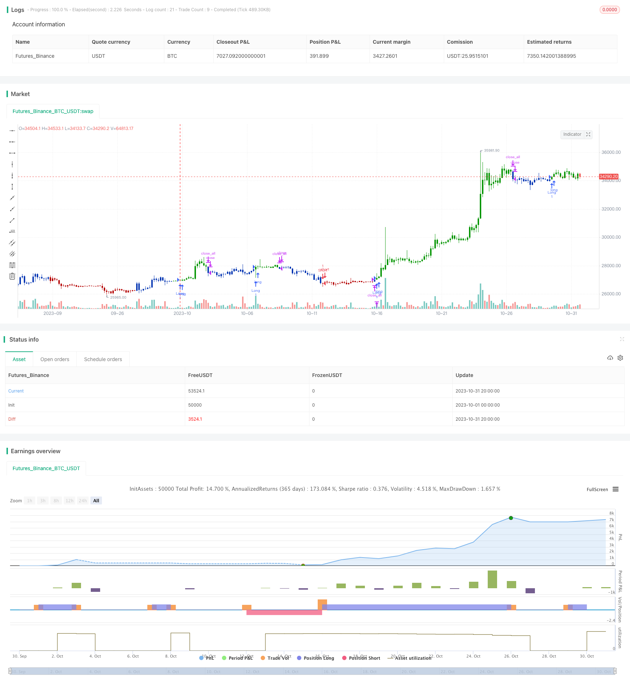

> Name

Dual-Golden-Cross-Reversal-Trading-Strategy
> Author

ChaoZhang

> Strategy Description


[trans]

## Overview
The Double Golden Cross Reversal trading strategy is a trading strategy that comprehensively uses stock technical analysis indicators. It combines the 123 pattern reversal strategy and the prime wave band indicator to achieve the integration of multiple trading signals to obtain more reliable trading signals.
## Strategy Principle
This strategy consists of two sub-strategies:
1. 123 pattern reversal strategy
Its trading signals are derived from the stock's closing price. A signal is generated when the relationship between the closing prices of two consecutive days changes. That is, if the closing price of the previous day is higher than the previous two days, and the closing price of the current day is lower than the previous day, then a short signal is generated; if the closing price of the previous day is lower than the previous two days, and the closing price of the current day is higher than the previous day, a long signal is generated. At the same time, the signal must be activated when the stoch indicator transition occurs on the 9th. That is, if the long signal appears and the fast line is lower than the slow line, then the long signal is activated; if the short signal appears and the fast line is higher than the slow line, then the short signal is activated.
2. Prime number band strategy
This strategy uses the random distribution characteristics of prime numbers to determine the range of price fluctuations. It first calculates the highest and lowest prime numbers within a certain percentage range around the price, and then builds a channel from these two prime numbers. If the price touches the edge of the channel, a trading signal is generated. That is, when the price crosses the upper edge, a long signal is generated; when the price crosses the lower edge, a short signal is generated.
Combining these two sub-strategies, if the signals of the two are consistent, the final trading signal will be generated. That is, when the 123 pattern reversal strategy and the prime wave band strategy generate long signals at the same time, the final long signal is generated. If the signals generated by the two are inconsistent, no transaction will be made.
## Advantage Analysis
This strategy has the following advantages:
1. Integrate multiple signals to increase profit probability
By merging two different types of strategy signals, the reliability of the signals can be checked and trading opportunities with high probability of profit can be screened out.
2. 123 pattern reversal has a higher winning rate
123 pattern reversal is a classic reversal trading strategy. It can capture the reversal opportunities brought by short-term overbought and oversold phenomena, and has a high real trading winning rate.
3. Prime wave band utilization price rules
Prime number waveband uses the unique randomness of prime numbers to determine the price fluctuation range, avoiding the influence of subjective factors and enhancing the objectivity of trading signals.
4. The strategic ideas are novel and not easy to be arbitraged.
This strategy comprehensively uses a variety of indicators for trading, which is innovative to a certain extent and is less likely to be robbed of profits by other copying strategies.
## Risk Analysis
This strategy also has the following risks:
1. Risk of reversal failure
123 pattern reversal is a reversal trading strategy. If a false rebound occurs, the reversal will fail and result in losses.
2. Risk of prime number band failure
The prime number waveband depends on specific parameter settings. If the parameters are set improperly, the prime number waveband will be invalid and unable to play a guiding role.
3. Multiple signals increase trading frequency
This strategy combines two signal sources, and the trading frequency will be higher than the single signal source strategy. If transaction costs are not well controlled, profits may be eroded.
4. Parameter optimization is difficult
Due to the combination of two strategies at the same time, it is difficult to find the optimal parameter combination to achieve the best effect.
## Optimization suggestions
This strategy can be optimized from the following aspects:
1. Add a stop loss strategy to control single losses.
2. Optimize the parameters of the prime waveband to make it fit the latest market conditions as much as possible.
3. Control the transaction frequency to prevent the loss of transaction fees caused by excessive transaction frequency.
4. Add machine learning algorithms to realize automatic optimization of policy parameters.
5. Add more auxiliary judgment indicators, such as volume and price indicators, to further improve the accuracy of signals.
## Summarize
The double golden cross reversal trading strategy comprehensively uses a variety of technical indicators for trading. Through the verification and screening of multiple signals, some noise transactions can be filtered out, thereby obtaining higher probability trading opportunities. However, this strategy also has a certain degree of risk, and appropriate optimization is required to control the risk and enhance the effect of the strategy. If the risk is controlled, this strategy can become a relatively stable and reliable quantitative trading strategy.
||


## Overview

The dual golden cross reversal trading strategy is a trading strategy that combines multiple technical analysis indicators. It incorporates the 123 reversal pattern strategy and the prime number bands indicator to integrate diverse trading signals and obtain more reliable trading signals.

## Strategy Principles 

The strategy consists of two sub-strategies:

1. 123 reversal pattern strategy

    It generates trading signals based on the closing prices of stocks. Signals are triggered when the relationship between closing prices of consecutive days change. Specifically, a short signal is generated when the previous closing price is higher than that of two days ago, and the current closing price is lower than previous day. A long signal is generated when the previous closing price is lower than that of two days ago, and the current closing price is higher than previous day. Additionally, the signals are only activated when stochastic oscillator crosses over. That is, the long signal is activated only when the fast line is below the slow line. The short signal is activated only when the fast line is above the slow line.

2. Prime number bands strategy

    This strategy uses the unique distribution of prime numbers to determine price fluctuation ranges. It first locates the highest and lowest prime numbers within a certain percentage range of the price, and plots the two prime number series as bands. Trading signals are generated when the price touches the bands. Specifically, a long signal is triggered when the price breaks above the upper band. A short signal is triggered when the price breaks below the lower band.

The two sub-strategies are combined to generate the final trading signals. That is, the long signal is generated only when both strategies produce long signals. Similarly for the short signals. No trading is executed if the signals from the two strategies contradict with each other.

## Advantage Analysis 

The strategy has the following advantages:

1. Increased profitability through signal integration

    By combining signals from two different types of strategies, the reliability of the signals can be verified to identify high-probability profitable trading opportunities.

2. High win rate of 123 reversal pattern

    The 123 reversal pattern is a classic contrarian strategy that can capture reversal opportunities arising from short-term overbought and oversold situations, thus possessing relatively high win rate in live trading.

3. Prime number bands capture price patterns

    Prime number bands make use of the unique randomness of prime numbers to determine price fluctuation ranges, avoiding subjective bias and enhancing the objectivity of trading signals.

4. Novel strategy logic avoids exploitation

    The innovative integration of multiple indicators makes the strategy less susceptible to reverse engineering and exploitation by copycat strategies.

## Risk Analysis

The strategy also carries the following risks:

1. Failed reversal risk

    As a reversal strategy, failed reversals of the 123 pattern can lead to losses.

2. Failure of prime number bands 

    The prime number bands depend on proper parameter tuning. Incorrect parameters may render it ineffective.

3. Increased trade frequency from multiple signals

    More trades can be generated as two signal sources are combined. Excessive trading costs may erode profits if not properly controlled.

4. Difficult optimization

    Optimizing parameters from two integrated strategies can be challenging.

## Optimization Suggestions

The strategy can be optimized in the following aspects:

1. Incorporate stop loss to limit per trade loss.

2. Optimize prime number bands parameters to fit the latest market conditions. 

3. Control trade frequency to avoid trading cost from overtrading.

4. Introduce machine learning algorithms to automate strategy parameter optimization.

5. Add more confirmation indicators like volume indicators to further improve signal accuracy.

## Summary 

The dual golden cross reversal trading strategy integrates multiple technical indicators to filter out noise trades and identify high-probability trading opportunities through signal verification. But it also carries inherent risks that need to be mitigated through proper optimization to strengthen the strategy. With risks under control, the strategy can become a relatively stable and reliable quantitative trading strategy.

[/trans]

> Strategy Arguments


|Argument|Default|Description|
|----|----|----|
|v_input_1|true|---- 123 Reversal ----|
|v_input_2|14|Length|
|v_input_3|true|KSmoothing|
|v_input_4|3|DLength|
|v_input_5|50|Level|
|v_input_6|true|---- Prime Number Bands ----|
|v_input_7|5|Tolerance Percentage|
|v_input_8|5|Length_PNB|
|v_input_9_high|0|Source Up Band: high|close|low|open|hl2|hlc3|hlcc4|ohlc4|
|v_input_10_low|0|Source Down Band: low|high|close|open|hl2|hlc3|hlcc4|ohlc4|
|v_input_11|false|Trade reverse|


> Source (PineScript)

``` pinescript
/*backtest
start: 2023-10-01 00:00:00
end: 2023-10-31 23:59:59
period: 4h
basePeriod: 15m
exchanges: [{"eid":"Futures_Binance","currency":"BTC_USDT"}]
*/

//@version=4
////////////////////////////////////////////////////////////
//  Copyright by HPotter v1.0 23/04/2021
// This is combo strategies for get a cumulative signal. 
//
// First strategy
// This System was created from the Book "How I Tripled My Money In The 
// Futures Market" by Ulf Jensen, Page 183. This is reverse type of strategies.
// The strategy buys at market, if close price is higher than the previous close 
// during 2 days and the meaning of 9-days Stochastic Slow Oscillator is lower than 50. 
// The strategy sells at market, if close price is lower than the previous close price 
// during 2 days and the meaning of 9-days Stochastic Fast Oscillator is higher than 50.
//
// Second strategy
// Determining market trends has become a science even though a high number 
// or people still believe it’s a gambling game. Mathematicians, technicians, 
// brokers and investors have worked together in developing quite several 
// indicators to help them better understand and forecast market movements.
// The Prime Number Bands indicator was developed by Modulus Financial Engineering 
// Inc. This indicator is charted by indentifying the highest and lowest prime number 
// in the neighborhood and plotting the two series as a band.
//
// WARNING:
// - For purpose educate only
// - This script to change bars colors.
////////////////////////////////////////////////////////////
Reversal123(Length, KSmoothing, DLength, Level) =>
    vFast = sma(stoch(close, high, low, Length), KSmoothing) 
    vSlow = sma(vFast, DLength)
    pos = 0.0
    pos := iff(close[2] < close[1] and close > close[1] and vFast < vSlow and vFast > Level, 1,
	         iff(close[2] > close[1] and close < close[1] and vFast > vSlow and vFast < Level, -1, nz(pos[1], 0))) 
	pos

PrimeNumberUpBand(price, percent) =>
    res = 0.0
    res1 = 0.0
    for j = price to price + (price * percent / 100)
        res1 := j
	    for i = 2 to sqrt(price)
        	res1 := iff(j % i == 0 , 0, j)
            if res1 == 0 
                break
		if res1 > 0 
		    break
    res := iff(res1 == 0, res[1], res1)
    res

PrimeNumberDnBand(price, percent) =>
    res = 0.0
    res2 = 0.0
    for j = price to price - (price * percent / 100)
        res2 := j
	    for i = 2 to sqrt(price)
        	res2 := iff(j % i == 0 , 0, j)
            if res2 == 0 
                break
		if res2 > 0 
		    break
    res := iff(res2 == 0, res[1], res2)
    res

PNB(percent, Length,srcUp,srcDn) =>
    pos = 0.0
    xPNUB = PrimeNumberUpBand(srcUp, percent)
    xPNDB = PrimeNumberDnBand(srcDn, percent)
    xHighestPNUB = highest(xPNUB, Length)
    xLowestPNUB = lowest(xPNDB, Length)
    pos:= iff(close > xHighestPNUB[1], 1,
             iff(close < xLowestPNUB[1], -1, nz(pos[1], 0))) 
    pos


strategy(title="Combo Backtest 123 Reversal & Prime Number Bands", shorttitle="Combo", overlay = true)
line1 = input(true, "---- 123 Reversal ----")
Length = input(14, minval=1)
KSmoothing = input(1, minval=1)
DLength = input(3, minval=1)
Level = input(50, minval=1)
//-------------------------
line2 = input(true, "---- Prime Number Bands ----")
percent = input(5, minval=0.01, step = 0.01, title="Tolerance Percentage")
Length_PNB = input(5, minval=1)
srcUp = input(title="Source Up Band", type=input.source, defval=high)
srcDn = input(title="Source Down Band", type=input.source, defval=low)
reverse = input(false, title="Trade reverse")
posReversal123 = Reversal123(Length, KSmoothing, DLength, Level)
posPNB = PNB(percent, Length_PNB,srcUp,srcDn)
pos = iff(posReversal123 == 1 and posPNB == 1 , 1,
	   iff(posReversal123 == -1 and posPNB == -1, -1, 0)) 
possig = iff(reverse and pos == 1, -1,
          iff(reverse and pos == -1 , 1, pos))	   
if (possig == 1 ) 
    strategy.entry("Long", strategy.long)
if (possig == -1 )
    strategy.entry("Short", strategy.short)	 
if (possig == 0) 
    strategy.close_all()
barcolor(possig == -1 ? #b50404: possig == 1 ? #079605 : #0536b3 )
```

> Detail

https://www.fmz.com/strategy/430985

> Last Modified

2023-11-03 15:32:38
