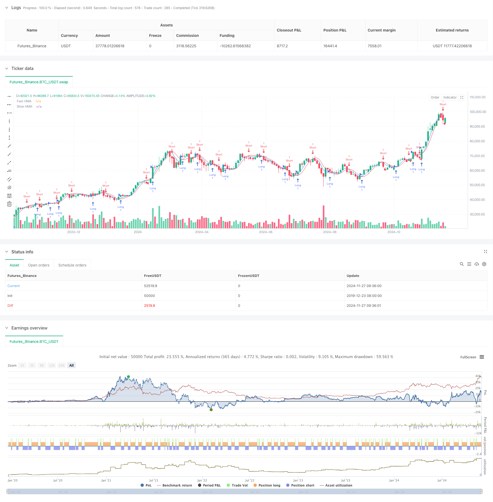

> Name

Dual-Hull-Moving-Average-Crossover-Quantitative-Strategy
> Author

ChaoZhang

> Strategy Description



[trans]
#### Overview
This strategy trades based on the Hull Moving Average (HMA) crossover signal. By calculating two HMA lines, fast and slow, a trading signal is generated when they cross. HMA is an advanced moving average indicator that uses a special combination of weighted moving averages (WMA) to reduce lag and provide faster and smoother market trend signals.
#### Strategy Principle
The core of the strategy is to use HMA crossovers of different periods to capture the conversion points of market trends. The calculation process of HMA includes three steps: first calculate the half-cycle WMA, then calculate the full-cycle WMA, and finally calculate a WMA whose period is the square root of the original period through a special combination of these two WMAs. When the fast HMA (9 periods by default) crosses the slow HMA (16 periods by default) upward, a long signal is generated; when the fast HMA crosses the slow HMA downwards, a short signal is generated.
#### Strategic Advantages
1. Rapid response to signals: HMA significantly reduces the lag of traditional moving averages through a special calculation method and can capture changes in market trends faster.
2. Noise filtering: Through the cross confirmation of two moving averages, market noise can be effectively filtered out and false signals reduced.
3. Flexible parameters: The strategy allows adjusting the cycle parameters of the fast and slow lines to adapt to different market environments.
4. Clear visualization: The strategy clearly displays two moving averages and trading signals on the chart, which facilitates analysis and optimization.
#### Strategy Risk
1. Volatile market risk: In a volatile market, frequent crossovers may lead to over-trading and continuous stop losses.
2. Lagging risk: Although HMA has smaller lag than traditional moving averages, there is still a certain lag and the best entry point may be missed.
3. Parameter sensitivity: Different parameter combinations may lead to completely different trading results, requiring careful parameter optimization.
4. Risk of false breakthrough: The market may have a false breakthrough, resulting in wrong trading signals.
#### Strategy optimization direction
1. Introducing a trend filter: you can add ADX or trend strength indicators to only trade when the trend is clear.
2. Optimize the stop loss mechanism: design dynamic stop loss, such as a stop loss strategy based on ATR or volatility.
3. Add transaction confirmation conditions: Combined with trading volume, momentum indicators, etc. as auxiliary confirmation signals.
4. Parameter adaptation: Develop a dynamic parameter adjustment mechanism based on market volatility.
5. Risk management optimization: Add position management and fund management modules.
#### Summary
This is a quantitative trading strategy based on HMA crossover, which provides more timely trading signals by reducing the lag of traditional moving averages. The strategy design is simple and easy to understand and implement, but in practical application, attention needs to be paid to the adaptability of the market environment and risk management. With continued optimization and improvement, this strategy has the potential to become a robust trading system. ||
#### Overview
This strategy is based on the crossover signals of Hull Moving Average (HMA). It generates trading signals when two HMA lines with different periods cross each other. HMA is an advanced moving average indicator that reduces lag through a special combination of Weighted Moving Averages (WMA), providing faster and smoother market trend signals.

#### Strategy Principle
The core of the strategy lies in capturing market trend reversal points using HMA crossovers of different periods. The HMA calculation involves three steps: first calculating a half-period WMA, then calculating a full-period WMA, and finally computing another WMA with a period equal to the square root of the original period using a special combination of the first two WMAs. Buy signals are generated when the fast HMA (default 9 periods) crosses above the slow HMA (default 16 periods), and sell signals when the fast HMA crosses below the slow HMA.

#### Strategy Advantages
1. Quick Signal Response: HMA significantly reduces the lag of traditional moving averages through its special calculation method, capturing market trend changes faster.
2. Noise Filtering: The crossover confirmation between two moving averages effectively filters out market noise, reducing false signals.
3. Flexible Parameters: The strategy allows adjustment of fast and slow line periods to adapt to different market environments.
4. Clear Visualization: The strategy clearly displays both moving averages and trading signals on the chart for easy analysis and optimization.

#### Strategy Risks
1. Choppy Market Risk: Frequent crossovers in sideways markets may lead to overtrading and consecutive losses.
2. Lag Risk: Although HMA has less lag than traditional moving averages, some lag still exists, potentially missing optimal entry points.
3. Parameter Sensitivity: Different parameter combinations may lead to significantly different trading results, requiring careful optimization.
4. False Breakout Risk: The market may exhibit false breakouts, leading to incorrect trading signals.

#### Strategy Optimization Directions
1. Introduce Trend Filters: Add ADX or trend strength indicators to trade only in clear trends.
2. Optimize Stop Loss Mechanism: Design dynamic stop losses based on ATR or volatility.
3. Add Trade Confirmation Conditions: Incorporate volume and momentum indicators as auxiliary confirmation signals.
4. Parameter Adaptation: Develop dynamic parameter adjustment mechanisms based on market volatility.
5. Risk Management Optimization: Add position sizing and money management modules.

#### Summary
This is a quantitative trading strategy based on HMA crossovers, providing more timely trading signals by reducing the lag of traditional moving averages. The strategy design is concise, easy to understand and implement, but requires attention to market environment adaptability and risk management in practical applications. Through continuous optimization and improvement, this strategy has the potential to become a robust trading system.[/trans]


> Source (PineScript)

``` pinescript
/*backtest
start: 2019-12-23 08:00:00
end: 2024-11-28 00:00:00
period: 2d
basePeriod: 2d
exchanges: [{"eid":"Futures_Binance","currency":"BTC_USDT"}]
*/

//@version=5
strategy("Hull Moving Average Crossover", overlay=true)


fastLength = input.int(9, "Fast HMA Length", minval=1)
slowLength = input.int(16, "Slow HMA Length", minval=1)


hma(src, length) =>
    wma1 = ta.wma(src, length / 2)
    wma2 = ta.wma(src, length)
    ta.wma(2 * wma1 - wma2, math.floor(math.sqrt(length)))


fastHMA = hma(close, fastLength)
slowHMA = hma(close, slowLength)


plot(fastHMA, color=color.blue, title="Fast HMA")
plot(slowHMA, color=color.red, title="Slow HMA")


longCondition = ta.crossover(fastHMA, slowHMA)
shortCondition = ta.crossunder(fastHMA, slowHMA)


if (longCondition)
    strategy.entry("Long", strategy.long)

if (shortCondition)
    strategy.entry("Short", strategy.short)


plotshape(longCondition, style=shape.triangleup, location=location.belowbar, color=color.green, size=size.small)
plotshape(shortCondition, style=shape.triangledown, location=location.abovebar, color=color.red, size=size.small)
```

> Detail

https://www.fmz.com/strategy/473404

> Last Modified

2024-11-29 16:53:05
