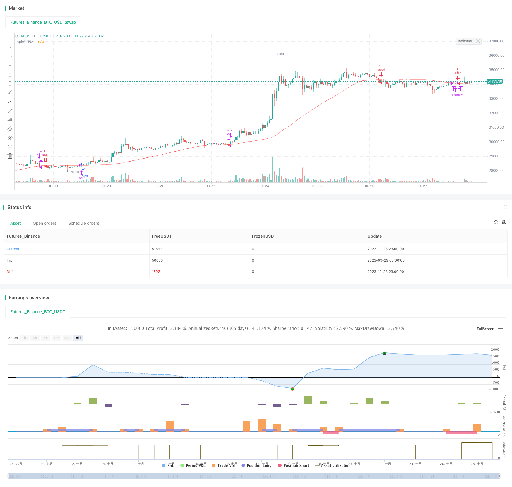

> Name

Dual-Moving-Average-Crossover-Scalping-Strategy
> Author

ChaoZhang

> Strategy Description



[trans]

### Overview
The double moving average crossover short-term strategy is a simple and efficient short-term trading strategy. This strategy uses the cross signal of price and moving average as a buy and sell signal to capture trend fluctuations in price in the short term.
### Strategy Principles
The double moving average crossover strategy uses two moving averages with different periods, a shorter-term MA line and a longer-term MA line. A buy signal is generated when the short-term MA line breaks above the long-term MA line from below; a sell signal is generated when the short-term MA line falls below the long-term MA line from above.
This strategy first defines the variable length to specify the length of the long-period MA as 50, then defines price as the closing price, calculates the MA line value of length, and saves it to the ma variable. Then define bcond to determine whether the price is higher than the ma value. If so, bcount increases by 1, otherwise it returns to zero. If bcond triggers confirmBars a number of times (default is 2), a buy signal is generated. On the contrary, when the price is lower than ma, a sell signal is generated according to the same logic.
In order to filter out some invalid signals, the strategy adds three filter conditions clc, clc0 and clc1. These three conditions determine the relationship between the closing price of the current period and the previous period, and the relationship between the closing price of the current period and the opening price. If they are met at the same time, a signal is allowed to be generated.
Finally, when the price falls below the upper track again or breaks through the lower track again, the corresponding long or short positions are closed respectively.
### Strategic Advantages
- The strategy is simple and easy to understand and implement.
- Utilize the trend tracking characteristics of the moving average system to effectively capture short- and medium-term price trends.
- Add filtering conditions to reduce the interference of invalid signals.
- Using a fixed stop-loss exit mechanism, single losses can be well controlled.
### Strategy Risk
- The double moving average crossover strategy can easily generate false signals in a volatile market, resulting in excessive trading costs and slippage losses.
- Fixed period parameter settings, such as moving average length, may not be able to adapt to the characteristics of each stage of the market, leaving room for optimization.
- Fixed stop loss cannot adjust the stop loss point according to market fluctuations, and may stop loss prematurely in a unilateral market that is greater than the stop loss point.
In order to reduce risks, you can consider dynamically adjusting the moving average parameters according to market volatility; you can also use free stop loss or percentage stop loss so that the stop loss point can be adjusted flexibly.
### Strategy optimization
This strategy can be optimized from the following aspects:
1. Optimize the moving average system parameters, such as dynamically adjusting the moving average length according to market volatility and other indicators.
2. Add additional filtering conditions, such as sudden increase in trading volume, to improve signal quality.
3. Optimize the stop loss strategy and use floating stop loss or percentage stop loss to reduce the probability of premature stop loss.
4. Combine with other indicators, such as MACD, RSI, etc., to conduct multi-factor verification to improve signal effectiveness.
5. Add automatic risk management strategies, such as dynamically adjusting position size and controlling single losses.
6. Add machine learning methods to buy and sell signals to establish a more accurate signal judgment model.
### Summarize
The double moving average crossover short-term strategy is overall a very practical short-term trading strategy, with the advantages of simple operation and easy implementation. However, we need to pay attention to controlling false signals that shock the market and make improvements such as dynamic parameter optimization to maximize the effectiveness of this strategy. Combining stop loss management and risk control methods can further improve the stability of the strategy.
|| 


### Overview

The Dual Moving Average Crossover is a simple and effective scalping strategy that uses crossover signals between price and moving averages as entry and exit signals to capture short-term trend movements.

### Strategy Logic

The strategy employs two moving averages of different periods - a shorter-term MA line and a longer-term MA line. It generates buy signals when the shorter period MA crosses above the longer period MA from below. Sell signals are generated when the shorter MA crosses below the longer MA from above.

The strategy first defines the variable 'length' to specify the period of the longer MA line as 50. It then defines 'price' as the closing price and calculates the MA value of length 50 and stores it in the 'ma' variable. It further defines 'bcond' to check if price is above ma value. If yes, 'bcount' is incremented by 1, otherwise reset to 0. When 'bcond' triggers 'confirmBars' times consecutively (default 2), a buy signal is generated. Sell signals are generated similarly when price falls below ma.

To filter out some invalid signals, additional filters like 'clc', 'clc0' and 'clc1' are added which check the price relationship between the current and previous bars. Trade signals are generated only when these conditions are met. 

Finally, existing positions are closed out when price crosses the MA lines in reverse.

### Advantages

- Simple logic, easy to understand and implement.
- Captures short-term trends effectively using MA system. 
- Added filters reduce interference from invalid signals.
- Fixed stop loss mechanism controls loss on single trade.

### Risks

- Prone to whipsaws in ranging markets, leading to extra costs.
- Fixed parameters like MA periods may not suit all market conditions.
- Fixed stop loss may exit early in strong trending moves beyond stop level.

The risks can be mitigated by using dynamic MA periods based on volatility, trailing stops or percentage stops, etc.

### Enhancements

The strategy can be improved in several ways:

1. Optimize MA parameters dynamically based on volatility. 

2. Add extra filters like volume spike to improve signal quality.

3. Use floating or percentage stops to reduce premature stop outs.

4. Combine with other indicators like MACD, RSI for multicondition validation. 

5. Add automated risk management like dynamic position sizing to control loss per trade.

6. Use machine learning for more accurate signal generation model.

### Conclusion

The dual MA crossover strategy is an effective system for short-term trading. Fine tuning parameters, managing risks and combining with other tools can further enhance its profitability. Overall it is simple to understand and implement for scalping smaller intraday moves.

[/trans]

> Strategy Arguments


|Argument|Default|Description|
|----|----|----|
|v_input_1|50|length|
|v_input_2|2|confirmBars|


> Source (PineScript)

``` pinescript
/*backtest
start: 2023-09-29 00:00:00
end: 2023-10-29 00:00:00
period: 1h
basePeriod: 15m
exchanges: [{"eid":"Futures_Binance","currency":"BTC_USDT"}]
*/

//@version=4
strategy("MovingAvg Cross", overlay=true)
length = input(50)
confirmBars = input(2)
price = close

ma = sma(price, length)

bcond = price > ma

bcount = 0
bcount := bcond ? nz(bcount[1]) + 1 : 0

clc=close[0]>close[1]
clc0=close[0]>open[0]
clc1=close[1]>open[1]

if clc and clc0 and clc1 and (bcount == confirmBars)
    strategy.entry("buy", strategy.long)


scond = price < ma
scount = 0
scount := scond ? nz(scount[1]) + 1 : 0

csc=close[0]<close[1]
csc0=close[0]<open[0]
csc1=close[1]<open[1]

if csc and csc0 and csc1 and (scount == confirmBars)
    strategy.entry("sell", strategy.short)

strategy.close("buy", when=scond)
strategy.close("sell",when=bcond)
    
plot(ma, color=color.red)
//plot(strategy.equity, title="equity", color=color.red, linewidth=2, style=plot.style_areabr)

```

> Detail

https://www.fmz.com/strategy/430549

> Last Modified

2023-10-30 11:19:48
