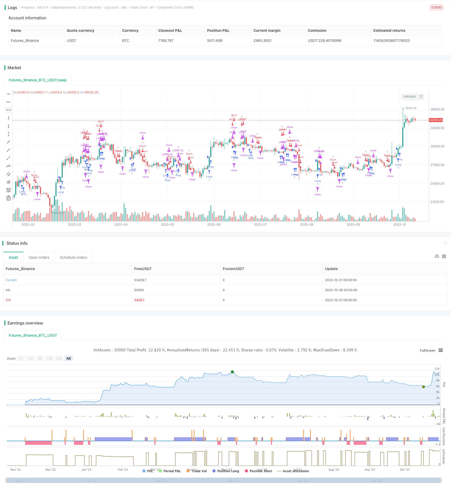

> Name

Dual-Moving-Average-Crossover-Strategy
> Author

ChaoZhang

> Strategy Description


Here is a detailed analysis article on the trend following strategy using double moving averages:
[trans]

### Overview
The Double Moving Average Breakout Strategy is one of the most popular trading strategies. This strategy uses the crossover of the fast and slow moving averages as buy and sell signals. When the fast moving average crosses above the slow moving average, it is a buy signal; when the fast moving average crosses below the slow moving average, it is a sell signal. This strategy is a traditional trend-following strategy.
### Strategy Principles
This strategy uses simple moving averages with lengths of 10 and 13. When the 10-day simple moving average crosses the 13-day simple moving average from below, a buy signal is generated; when the 10-day simple moving average crosses below the 13-day simple moving average from above, a sell signal is generated.
If the buying conditions are met and a short position is currently held, the short position will be closed first and then a long position will be opened; if the selling conditions are met and a long position is currently held, the long position will be closed first and then a short position will be opened.
In addition, the strategy also sets stop loss logic. When going long, the stop loss price will be set based on the entered stop loss percentage; when going short, the same is true, and the stop loss price will be set based on the entered percentage. When the price hits the stop loss price, the current position will be exited.
### Advantage Analysis
- This strategy captures1. This strategy can capture trends and track medium and long-term trends.
- Using double moving average design, it can effectively filter out false breakthroughs.
- Set stop loss to control individual single losses.
- The strategy logic is simple and clear, easy to understand and implement.
- The moving average parameters can be adjusted according to the market to optimize strategy performance.
### Risk Analysis
- As a trend following strategy, it is easy to get caught at the end of the trend.
- The moving average system is prone to lag and may miss the turning point.
- Unreasonable stop loss settings may cause unnecessary losses.
- Double moving average crossovers cannot completely filter out false breakthroughs.
- The strategy is based only on technical indicators and ignores fundamental factors.
### Optimization direction
- You can consider optimizing the moving average length parameters and choosing a more appropriate moving average period.
- A three-moving average design can be used to increase the accuracy of signal judgment.
- Dynamically optimize the stop loss point to make the stop loss closer to the price.
- Combine with other indicators to filter false breakout signals.
- Optimize fund management and strictly control individual losses.
### Summarize
The Double Moving Average Breakout Strategy is a simple and practical trend following strategy. It can effectively capture medium and long-term trends and return stable excess returns. But as a trend following strategy, it may be arbitraged at the end of the trend. We can improve this strategy by optimizing parameters, adding signal filtering and optimizing money management to make it more suitable for the market environment. Generally speaking, the double moving average strategy is an introductory strategy that is very suitable for novice traders to implement.
||


### Overview

The dual moving average crossover strategy is one of the most popular trading strategies. It utilizes the crossover of a fast moving average and a slow moving average as buy and sell signals. When the fast MA crosses above the slow MA, it generates a buy signal. When the fast MA crosses below the slow MA, it generates a sell signal. This strategy belongs to the category of traditional trend following strategies.

### Strategy Logic  

This strategy uses simple moving averages of length 10 and 13. When the 10-period SMA crosses above the 13-period SMA, a buy signal is generated. When the 10-period SMA crosses below the 13-period SMA, a sell signal is generated.

If the long condition is met while currently holding a short position, the short position will be closed first before entering a long position. Similarly, if the short condition is met while currently holding a long position, the long position will be closed first before entering a short position.

In addition, this strategy incorporates stop loss logic. For long trades, the stop loss price is calculated based on the input percentage. The same applies for short trades. When price hits the stop loss level, the current position will be exited.

### Advantage Analysis

- This strategy captures trends and follows medium to long term trend movements.

- The dual MA design helps filter out false breakouts effectively. 

- The stop loss helps control loss on individual trades.

- The strategy logic is simple and easy to understand.

- MA parameters can be adjusted for optimization.

### Risk Analysis

- As a trend following strategy, it risks being caught at trend reversals.

- MA systems can lag and miss turning points.

- Improper stop loss setting may lead to unnecessary losses.

- Dual MA crossovers do not completely eliminate false signals.

- The strategy ignores fundamentals and focuses solely on technicals.

### Improvement Directions

- The MA parameters can be optimized to find the optimal periods.

- A triple MA system could improve signal accuracy. 

- The stop loss can be made adaptive to price.

- Additional filters could be added to screen signals.

- Money management can be enhanced to limit losses.

### Conclusion

The dual moving average crossover is a simple and practical trend following strategy. It can effectively capture medium to long term trends and generate steady excess returns. But it runs the risk of being whipsawed at trend reversals. The strategy can be improved via parameter optimization, better signal filtering and enhanced risk management. Overall, it is an ideal starter strategy for novice traders.

[/trans]

> Strategy Arguments


|Argument|Default|Description|
|----|----|----|
|v_input_1|true|Long Stop Loss (%)|
|v_input_2|true|Short Stop Loss (%)|


> Source (PineScript)

``` pinescript
/*backtest
start: 2022-10-26 00:00:00
end: 2023-11-01 00:00:00
period: 1d
basePeriod: 1h
exchanges: [{"eid":"Futures_Binance","currency":"BTC_USDT"}]
*/

// This source code is subject to the terms of the Mozilla Public License 2.0 at https://mozilla.org/MPL/2.0/
// © chiragchopra91
//@version=4

strategy(title='Chirag Strategy SMA', shorttitle='CHIRAGSMA', overlay=true)

longCondition = crossover(sma(close, 10), sma(close, 13))
shortCondition = crossover(sma(close, 13), sma(close, 10))

// Set stop loss level with input options
longLossPerc = input(title="Long Stop Loss (%)", type=input.float, minval=0.0, step=0.1, defval=1) * 0.01
shortLossPerc = input(title="Short Stop Loss (%)", type=input.float, minval=0.0, step=0.1, defval=1) * 0.01

longStopPrice  = strategy.position_avg_price * (1 - longLossPerc)
shortStopPrice = strategy.position_avg_price * (1 + shortLossPerc)

if longCondition
    if strategy.position_size < 0
        strategy.close('Short', comment="SHORT EXIT")
    strategy.entry('Long', strategy.long, comment="BUY")

if shortCondition
    if strategy.position_size > 0
        strategy.close('Long', comment="BUY EXIT")
    strategy.entry('Short', strategy.short, comment="SHORT")

if strategy.position_size > 0
    strategy.exit('LONG SL', stop=longStopPrice, comment="LONG SL EXIT")

if strategy.position_size < 0
    strategy.exit('SHORT SL', stop=shortStopPrice, comment="SHORT SL EXIT")
    
```

> Detail

https://www.fmz.com/strategy/430897

> Last Modified

2023-11-02 17:04:55
