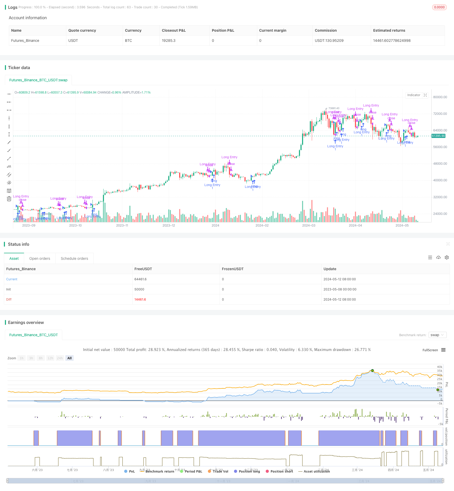

> Name

Based on Dual-Moving-Average-Crossover-Strategy
> Author

ChaoZhang

> Strategy Description


[trans]
#### Overview
The double moving average crossover strategy is a common quantitative trading strategy. This strategy uses two moving averages of different periods as buying and selling signals. Buy when the short-term moving average crosses the long-term moving average, and sell when the short-term moving average crosses below the long-term moving average. The strategy code supports a variety of common moving average types, such as simple moving average (SMA), exponential moving average (EMA), double exponential moving average (DEMA), triple exponential moving average (TEMA), weighted moving average (WMA) and volume weighted moving average (VWMA), and can flexibly set the periods of short-term moving averages and long-term moving averages. At the same time, this strategy also supports selecting different price types to calculate moving averages, such as closing price, highest price, opening price, lowest price, typical price and middle price.
#### Strategy Principles
The core principle of this strategy is to use the trend characteristics and lag of two moving averages with different periods to capture price trends. Generally speaking, short-term moving averages are more sensitive to price changes, while long-term moving averages lag relatively behind. When the price is in an upward trend, the short-term moving average will move upward before the long-term moving average and eventually cross the long-term moving average, forming a "golden cross" buy signal; conversely, when the price is in a downward trend, the short-term moving average will move downward before the long-term moving average and eventually cross the long-term moving average, forming a "death cross" sell signal. By capturing golden cross and dead cross signals, this strategy can trade in the direction of the main trend of the price.
#### Strategic Advantages
1. Simple and easy to use: The double moving average crossover strategy is a quantitative trading strategy that is simple to understand and easy to implement, and is suitable for novice traders to learn and use.
2. Wide applicability: This strategy can be applied to various financial markets and trading targets, such as stocks, futures, foreign exchange, cryptocurrency, etc., and has strong versatility.
3. Flexible parameters: The strategy code supports a variety of common moving average types and price types. Users can flexibly set parameters according to their own needs to adapt to different market environments and trading styles.
4. Trend following: Through the cross signals of two moving averages of different periods, this strategy can better capture the main trend of prices, helping to follow the trend and avoid contrarian transactions.
#### Strategy Risk
1. Hysteresis: The moving average is essentially a trend tracking indicator, which has a certain degree of lag and may miss the best entry and exit opportunities.
2. Failure in a volatile market: In a volatile market or sideways market, price fluctuations are large and moving average crossover signals are frequent, which may lead to frequent trading of the strategy, resulting in high transaction costs and capital losses.
3. Difficulty in parameter optimization: The choice of the moving average period has a great impact on the strategy effect, but the optimal parameters often vary due to different market conditions, and it is difficult to find an optimal parameter combination that is universally applicable.
#### Strategy optimization direction
1. Introduce trend filtering: On the basis of moving average crossover signals, you can combine other trend indicators such as MACD, ADX, etc. to perform trend filtering. Only trade when the trend is clear to avoid frequent trading in volatile markets.
2. Optimize take-profit and stop-loss: Add reasonable take-profit and stop-loss logic to the strategy, such as trailing stop-loss, volatility stop-loss, etc., to control the risk of a single transaction and improve the risk-return ratio of the strategy.
3. Dynamic parameter optimization: For different market environments, parameters such as the moving average cycle can be dynamically optimized regularly, so that the strategy can adapt to market changes and improve robustness.
4. Multi-factor combination: Combine the double moving average crossover signal with other effective quantitative factors (such as momentum, value, trading volume, etc.) to form a more robust and effective multi-factor strategy.
#### Summary
The double moving average crossover strategy is a simple and classic trend following strategy that captures price trends through the crossover signals of two moving averages of different periods and is suitable for trending markets. However, this strategy also has problems such as hysteresis and difficulty in parameter optimization. It needs to be optimized and improved in combination with other methods, such as trend filtering, dynamic parameter optimization, multi-factor combination, etc., to improve the applicability and robustness of the strategy. In general, the double moving average crossover strategy can be used as one of the basic strategies of quantitative trading and is worthy of study and research by the majority of quantitative enthusiasts.
|| 

#### Overview
The Dual Moving Average Crossover Strategy is a common quantitative trading strategy. This strategy uses two moving averages with different periods as buy and sell signals. It buys when the short-term moving average crosses above the long-term moving average and sells when the short-term moving average crosses below the long-term moving average. The strategy code supports various common types of moving averages, such as Simple Moving Average (SMA), Exponential Moving Average (EMA), Double Exponential Moving Average (DEMA), Triple Exponential Moving Average (TEMA), Weighted Moving Average (WMA), and Volume Weighted Moving Average (VWMA). It also allows flexible settings for the periods of the short-term and long-term moving averages. Moreover, the strategy supports selecting different price types for calculating the moving averages, including close, high, open, low, typical price, and median price.

#### Strategy Principle
The core principle of this strategy is to capture price trends by leveraging the trend characteristics and lag of two moving averages with different periods. Generally speaking, the short-term moving average is more sensitive to price changes, while the long-term moving average is relatively lagging. When the price is in an uptrend, the short-term moving average will move upward before the long-term moving average and eventually cross above it, forming a "golden cross" buy signal. Conversely, when the price is in a downtrend, the short-term moving average will move downward before the long-term moving average and eventually cross below it, forming a "death cross" sell signal. By capturing the golden cross and death cross signals, this strategy can trade in line with the main trend direction of the price.

#### Strategy Advantages
1. Simple and easy to use: The Dual Moving Average Crossover Strategy is a simple, easy-to-understand, and easy-to-implement quantitative trading strategy, suitable for novice traders to learn and use.

2. Wide applicability: This strategy can be applied to various financial markets and trading instruments, such as stocks, futures, forex, cryptocurrencies, etc., with strong versatility.

3. Flexible parameters: The strategy code supports multiple common types of moving averages and price types, allowing users to flexibly set parameters according to their needs to adapt to different market conditions and trading styles.

4. Trend tracking: By using the crossover signals of two moving averages with different periods, this strategy can effectively capture the main trend of the price, which helps to follow the trend and avoid counter-trend trading.

#### Strategy Risks
1. Lag: Moving averages are essentially trend-following indicators and have a certain lag, which may miss the best entry and exit timings.

2. Ineffectiveness in range-bound markets: In range-bound or sideways markets, price fluctuations are large, and moving average crossover signals occur frequently, which may lead to frequent trading and result in high trading costs and capital losses.

3. Difficulty in parameter optimization: The selection of moving average periods has a significant impact on the strategy performance, but the optimal parameters often vary depending on market conditions, making it challenging to find universally applicable optimal parameter combinations.

#### Strategy Optimization Directions
1. Introduce trend filters: In addition to the moving average crossover signals, other trend indicators such as MACD and ADX can be incorporated for trend filtering, trading only when the trend is clear to avoid frequent trading in range-bound markets.

2. Optimize take-profit and stop-loss: Incorporate reasonable take-profit and stop-loss logic into the strategy, such as trailing stop-loss and volatility-based stop-loss, to control single-trade risk and improve the strategy's risk-reward ratio.

3. Dynamic parameter optimization: For different market environments, periodically perform dynamic optimization on parameters such as moving average periods to enable the strategy to adapt to market changes and improve robustness.

4. Multi-factor combination: Combine the dual moving average crossover signals with other effective quantitative factors (such as momentum, value, volume, etc.) to form a more robust and effective multi-factor strategy.

#### Summary
The Dual Moving Average Crossover Strategy is a simple and classic trend-following strategy that captures price trends through the crossover signals of two moving averages with different periods, suitable for trending markets. However, this strategy also has issues such as lag and difficulty in parameter optimization, requiring combinations with other methods for optimization and improvement, such as trend filtering, dynamic parameter optimization, multi-factor combination, etc., to enhance the strategy's applicability and robustness. Overall, the Dual Moving Average Crossover Strategy can serve as one of the foundational strategies in quantitative trading, worthy of learning and research by quantitative enthusiasts.
[/trans]


> Source (PineScript)

``` pinescript
/*backtest
start: 2023-05-08 00:00:00
end: 2024-05-13 00:00:00
period: 1d
basePeriod: 1h
exchanges: [{"eid":"Futures_Binance","currency":"BTC_USDT"}]
*/

// This Pine Script™ code is subject to the terms of the Mozilla Public License 2.0 at https://mozilla.org/MPL/2.0/
// © SustainableInvestment

//@version=5
strategy("Moving average strategy (이동평균선 전략)", overlay=true)

// === INPUTS ===

basisType   = input.string(defval = "EMA", title = "MA Type: SMA, EMA, DEMA, TEMA, WMA, VWMA ",options=["SMA", "EMA", "DEMA", "TEMA", "WMA", "VWMA"])
shortLen    = input.int(defval = 1, title = "Short MA Period", minval = 1)
longLen    = input.int(defval = 20, title = "Long MA Period", minval = 1)
price       = input.string(defval = "Typical", title = "Price Type : Close, High, Open, Low, Typical, Center ",options=["Close", "High", "Open", "Low", "Typical", "Center"])

// === BASE FUNCTIONS ===
// 가격 종류 설정
priceType(price) =>
    Typical = (high+low+close)/3
    Center  = (high+low) / 2
    price=="High"?high : price=="Low"?low : price=="Open"?open : price=="Typical"?Typical : price=="Center"?Center : close

// 이동평균선 종류 설정
variant(type, src, len) =>
    v1 = ta.sma(src, len)                                                  // Simple
    v2 = ta.ema(src, len)                                                  // Exponential
    v3 = 2 * v2 - ta.ema(v2, len)                                          // Double Exponential
    v4 = 3 * (v2 - ta.ema(v2, len)) + ta.ema(ta.ema(v2, len), len)         // Triple Exponential
    v5 = ta.wma(src, len)                                                  // Weighted
    v6 = ta.vwma(src, len)                                                 // Volume Weighted
    
    type=="EMA"?v2 : type=="DEMA"?v3 : type=="TEMA"?v4 : type=="WMA"?v5 : type=="VWMA"?v6 : v1

longCondition = ta.crossover(variant(basisType, priceType(price), shortLen), variant(basisType, priceType(price), longLen))
if (longCondition)
    strategy.entry("Long Entry", strategy.long)

exitCondition = ta.crossunder(variant(basisType, priceType(price), shortLen), variant(basisType, priceType(price), longLen))
if (exitCondition)
    strategy.close("Long Entry","Long Exit")

```

> Detail

https://www.fmz.com/strategy/451389

> Last Modified

2024-05-14 15:37:54
