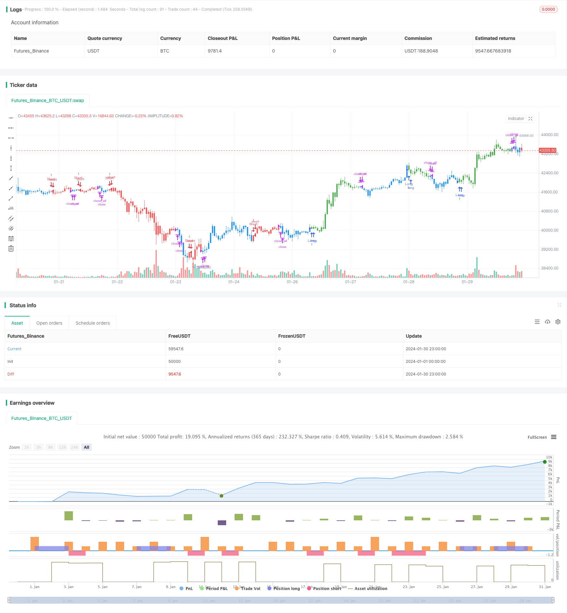

> Name

Dual-Moving-Average-Crossover-and-Williams-Indicator-Combo-Strategy
> Author

ChaoZhang

> Strategy Description


[trans]

## Overview
This strategy is a combination of two different strategies, the first strategy is based on the double moving average crossing of the stock price forming a signal; the second strategy is based on the magic oscillator in the Williams indicator. The final signal is the intersection of the two strategy signals to form the final trading signal.
## Strategy Principle
The principle of the first strategy is that when yesterday's closing price is higher than the previous day's closing price, and the fast K-line 9-day stochastic indicator is lower than the slow D-line 3-day stochastic indicator, a buy signal is generated; when yesterday's closing price is lower than the previous day's closing price, and the fast K-line 9-day stochastic indicator is higher than the slow D-line 3-day stochastic indicator, a sell signal is generated.
The principle of the second strategy is to calculate the difference between the price fluctuations on the 5th and the 34th, and calculate the moving average of the difference. When the current value is higher than the previous period, it is a buy signal, and when the current value is lower than the previous period, it is a sell signal.
Combining two strategies, the final signal is the intersection of the two strategy signals. When both strategies send out buy signals at the same time, go long; when both strategies send out sell signals at the same time, go short.
## Advantage Analysis
This strategy combines the advantages of the double moving average strategy and the Williams indicator strategy. The double moving average strategy can capture medium and long-term trends; the Williams indicator strategy can capture short-term trading opportunities. Combining the two strategies can simultaneously take into account profits and prevent false breakthroughs.
In addition, this strategy uses multiple parameter input settings, which can optimize parameters according to different stocks and market conditions, and adapt to a wider market environment.
## Risk Analysis
The biggest risk with this strategy is that the two strategy signals may be inconsistent. When one strategy sends a buy signal and another sends a sell signal, the strategy cannot generate valid signals and may miss trading opportunities.
In addition, the strategy contains multiple parameters, which makes parameter optimization difficult. An inappropriate combination of parameters can lead to poor strategy performance.
To reduce risks, you can consider using only one of the strategy signals; or study and determine the parameter range suitable for different market environments.
## Optimization direction
This strategy can be optimized from the following aspects:
1. Evaluate the consistency of the two strategy signals, study the matching degree of their signals under different parameters, and determine the best parameter combination.
2. Test the performance of this strategy under different varieties and different cycles to find the best applicable scope.
3. You can consider changing the double moving average strategy to other indicators, such as KDJ indicators, etc., to enrich the strategy combination.
4. Add a stop loss mechanism to control risks, such as setting a maximum retracement stop loss.
## Summarize
This strategy combines the double moving average strategy and the Williams indicator strategy, taking into account trend tracking and short-term signal capture. Parameter optimization can adapt to a wider range of market environments. However, there are also risks caused by inconsistent signal matching and difficulties in optimizing complex parameters. Overall, this strategy provides an effective idea for quantitative trading and is worthy of further research and optimization to reduce risks and improve stability.
|| 

## Overview

This strategy combines two different strategies. The first strategy generates signals based on the dual moving average crossover of stock prices. The second strategy is based on the Awesome Oscillator from the Williams Indicators. The final signal takes the intersection of the two strategy signals to form the final trading signal.   

## Strategy Logic

The first strategy generates a buy signal when yesterday's close is higher than the previous day's close and the fast 9-day Stochastic Oscillator is lower than the slow 3-day Stochastic Oscillator D-line. It generates a sell signal when yesterday's close is lower than the previous day's close and the fast Stochastic Oscillator is higher than the slow Stochastic Oscillator D-line.

The second strategy calculates the difference between the 5-day and 34-day price fluctuations and computes moving averages of that difference. When the current value is above the previous period, it is a buy signal. When the current value is below the previous period, it is a sell signal.

The two strategy signals are combined by taking their intersection. A long position is taken when both strategies give a buy signal. A short position is taken when both strategies give a sell signal.

## Advantage Analysis  

This strategy combines the advantages of the dual moving average crossover strategy and the Williams Indicator strategy. The dual moving average crossover strategy can catch mid- to long-term trends. The Williams Indicator strategy can capture short-term trading opportunities. Combining the two strategies enables both profit-taking and prevention of false breakouts.

In addition, the use of multiple input parameters allows optimization for different stocks and market conditions, making the strategy adaptable to a wider range of market environments.

## Risk Analysis

The biggest risk is that the signals from the two strategies may not be consistent. When one strategy generates a buy signal while the other generates a sell signal, the combined strategy cannot produce a meaningful signal, potentially missing trading opportunities.

In addition, the multiple parameters pose some difficulty for optimization. Unsuitable parameter combinations may lead to poor strategy performance. 

To reduce risks, either strategy signal may be used exclusively. Also, suitable parameter ranges can be researched for different market conditions.  

## Enhancement Opportunities 

The strategy can be enhanced in several aspects:

1. Evaluate signal consistency between the two strategies under different parameter combinations to find the optimal parameters for signal matching.  

2. Test performance across different products, timeframes to find the best application scope.

3. Consider replacing the dual moving average crossover with other technical indicators like KDJ to diversify the strategy combination.  

4. Incorporate stop loss mechanisms to control risks, e.g. set maximum drawdown stops.

## Conclusion  

This strategy combines the dual moving average crossover strategy and the Williams Indicator strategy to capture both trend tracking and short-term signals. Through parameter optimization, it can adapt to a wide range of market conditions. However, inconsistent signal matching and complex parameter optimization remain its challenges. Overall, it provides an effective approach to quantitative trading and is worth further research and optimization to reduce risks and improve robustness.

[/trans]

> Strategy Arguments


|Argument|Default|Description|
|----|----|----|
|v_input_1|14|Length|
|v_input_2|true|KSmoothing|
|v_input_3|3|DLength|
|v_input_4|50|Level|
|v_input_5|34|Length Slow|
|v_input_6|5|Length Fast|
|v_input_7|15|MA|
|v_input_8|15|EMA|
|v_input_9|15|WMA|
|v_input_10|true|Show and trading WMA|
|v_input_11|false|Show and trading MA|
|v_input_12|false|Show and trading EMA|
|v_input_13|false|Trade reverse|


> Source (PineScript)

``` pinescript
/*backtest
start: 2024-01-01 00:00:00
end: 2024-01-31 00:00:00
period: 1h
basePeriod: 15m
exchanges: [{"eid":"Futures_Binance","currency":"BTC_USDT"}]
*/

//@version=3
////////////////////////////////////////////////////////////
//  Copyright by HPotter v1.0 20/06/2019
// This is combo strategies for get a cumulative signal. 
//
// First strategy
// This System was created from the Book "How I Tripled My Money In The 
// Futures Market" by Ulf Jensen, Page 183. This is reverse type of strategies.
// The strategy buys at market, if close price is higher than the previous close 
// during 2 days and the meaning of 9-days Stochastic Slow Oscillator is lower than 50. 
// The strategy sells at market, if close price is lower than the previous close price 
// during 2 days and the meaning of 9-days Stochastic Fast Oscillator is higher than 50.
//
// Second strategy
//    This indicator plots the oscillator as a histogram where blue denotes 
//    periods suited for buying and red . for selling. If the current value 
//    of AO (Awesome Oscillator) is above previous, the period is considered 
//    suited for buying and the period is marked blue. If the AO value is not 
//    above previous, the period is considered suited for selling and the 
//    indicator marks it as red.
//  You can make changes in the property for set calculating strategy MA, EMA, WMA
//
// WARNING:
// - For purpose educate only
// - This script to change bars colors.
////////////////////////////////////////////////////////////
Reversal123(Length, KSmoothing, DLength, Level) =>
    vFast = sma(stoch(close, high, low, Length), KSmoothing) 
    vSlow = sma(vFast, DLength)
    pos = 0.0
    pos := iff(close[2] < close[1] and close > close[1] and vFast < vSlow and vFast > Level, 1,
	         iff(close[2] > close[1] and close < close[1] and vFast > vSlow and vFast < Level, -1, nz(pos[1], 0))) 
	pos

BillWilliamsAC(nLengthSlow, nLengthFast,nLengthMA, nLengthEMA, nLengthWMA, bShowWMA, bShowMA, bShowEMA) =>
    pos = 0
    xSMA1_hl2 = sma(hl2, nLengthFast)
    xSMA2_hl2 = sma(hl2, nLengthSlow)
    xSMA1_SMA2 = xSMA1_hl2 - xSMA2_hl2
    xSMA_hl2 = sma(xSMA1_SMA2, nLengthFast)
    nRes =  xSMA1_SMA2 - xSMA_hl2
    xResWMA = wma(nRes, nLengthWMA)
    xResMA = sma(nRes, nLengthMA)
    xResEMA = ema(nRes, nLengthEMA)
    xSignalSeries = iff(bShowWMA, xResWMA,
                     iff(bShowMA, xResMA, 
                      iff(bShowEMA, xResEMA, na)))
    cClr = nRes > nRes[1] ? blue : red
    pos := iff(xSignalSeries[2] < 0 and xSignalSeries[1] > 0, 1,
	         iff(xSignalSeries[2] > 0 and xSignalSeries[1] < 0, -1, nz(pos[1], 0))) 
    pos

strategy(title="Combo Backtest 123 Reversal & Bill Williams. Awesome Oscillator (AC) with Signal Line", shorttitle="Combo", overlay = true)
Length = input(14, minval=1)
KSmoothing = input(1, minval=1)
DLength = input(3, minval=1)
Level = input(50, minval=1)
//-------------------------
nLengthSlow = input(34, minval=1, title="Length Slow")
nLengthFast = input(5, minval=1, title="Length Fast")
nLengthMA = input(15, minval=1, title="MA")
nLengthEMA = input(15, minval=1, title="EMA")
nLengthWMA = input(15, minval=1, title="WMA")
bShowWMA = input(type=bool, defval=true, title="Show and trading WMA")
bShowMA = input(type=bool, defval=false, title="Show and trading MA")
bShowEMA = input(type=bool, defval=false, title="Show and trading EMA")
reverse = input(false, title="Trade reverse")
posReversal123 = Reversal123(Length, KSmoothing, DLength, Level)
posBillWilliamsAC = BillWilliamsAC(nLengthSlow, nLengthFast,nLengthMA, nLengthEMA, nLengthWMA, bShowWMA, bShowMA, bShowEMA)
pos = iff(posReversal123 == 1 and posBillWilliamsAC == 1 , 1,
	   iff(posReversal123 == -1 and posBillWilliamsAC == -1, -1, 0)) 
possig = iff(reverse and pos == 1, -1,
          iff(reverse and pos == -1, 1, pos))	   
if (possig == 1) 
    strategy.entry("Long", strategy.long)
if (possig == -1)
    strategy.entry("Short", strategy.short)	 
if (possig == 0) 
    strategy.close_all()
barcolor(possig == -1 ? red: possig == 1 ? green : blue )
```

> Detail

https://www.fmz.com/strategy/440728

> Last Modified

2024-02-01 15:04:51
