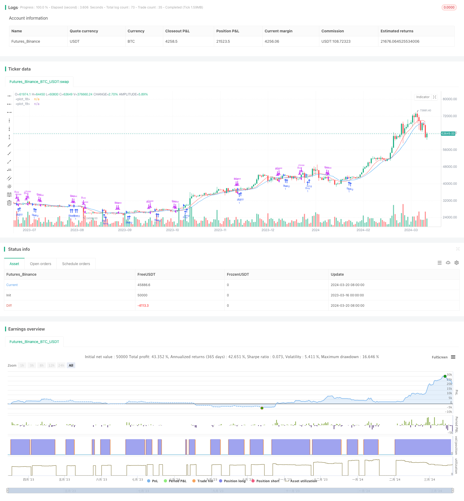

> Name

Dual-Moving-Average-Crossover-with-Optimized-Stop-Loss-Strategy
> Author

ChaoZhang

> Strategy Description


[trans]

## Strategy Overview
The double moving average crossover optimized stop loss strategy (TQQQ) is a quantitative trading strategy based on the crossover signals of two moving averages (SMA) with different periods. This strategy only goes long, opening a position when the fast moving average crosses the slow moving average, and closing the position when the fast moving average crosses below the slow moving average or the price falls below the stop-loss price. This strategy optimizes the fast and slow moving average cycles and stop loss ratio through parameters, in order to obtain higher returns in the bull market and reduce losses when the market falls.
## Strategy Principle
The core of this strategy is to use the crossover signals of moving averages of different periods to capture market trends. When the short-term moving average crosses the long-term moving average, it indicates that the market may enter an upward trend, and a long position is opened at this time. When the short-term moving average crosses below the long-term moving average, it indicates that the upward trend may be over and positions should be closed at this time.
In addition to moving average crossover signals, this strategy also introduces a stop loss mechanism. When the market price falls below a fixed percentage of the stop loss price, the strategy will stop the loss even if the moving average does not generate a closing signal. The purpose of this mechanism is to control retracements and prevent huge losses when the trend reverses.
Specifically, this strategy includes the following steps:
1. Calculate fast moving average and slow moving average.
2. Determine whether there is a signal to open a position. When the fast moving average crosses the slow moving average and there are currently no positions, open a long position.
3. Record the opening price and calculate the stop loss price.
4. Determine whether there is a closing signal. When the fast moving average crosses the slow moving average, or the price falls below the stop loss price, close all long orders.
5. Determine whether there is an opportunity to open or close a position on the next trading day based on the closing price, and repeat steps 2-4.
Through this series of steps, this strategy can quickly adapt to changes in market trends, follow the trend in the bull market, and obtain huge profits. At the same time, when the market turns bearish, it can stop losses in time and control the retracement.
## Strategic Advantages
1. Trend following: Through moving average crossover signals, this strategy can capture market trends, hold positions in the upward trend, and obtain trend profits.
2. Stop loss mechanism: Fixed percentage stop loss can effectively control retracements and avoid excessive losses in a single transaction.
3. Flexible parameters: The cycle parameters and stop loss ratio of fast and slow moving averages can be adjusted according to market characteristics and personal risk preferences, increasing the adaptability of the strategy.
4. Wide applicability: This strategy can be applied to different markets and targets, such as stocks, futures, foreign exchange, etc. Just adjust the parameters according to the characteristics of the target.
5. Simple and efficient: The strategy logic is clear, easy to understand and implement, and the backtesting efficiency is high, making it easy to optimize a large number of parameters and simulate transactions.
## Strategy Risk
1. Parameter sensitivity: The choice of moving average period and stop loss ratio has a great impact on the performance of the strategy. Inappropriate parameters may lead to frequent trading or missing the trend market.
2. Lag in trend recognition: There is a certain lag in the moving average crossover signal. Especially when the market changes rapidly, the best opportunity to open and close a position may be missed.
3. Concentrated positions: This strategy always maintains 100% positions, lacks position management and fund allocation mechanisms, and faces greater financial risks.
4. Poor market conditions in volatile markets: In volatile markets, frequent cross signals may lead to strategic losses.
5. Black swan events: Under extreme market conditions, trading signals may fail, and fixed stop loss ratios may not cover actual risks.
In view of the above risks, optimization and improvement can be made from the following aspects:
1. Introduce dynamic stop loss: dynamically adjust the stop loss ratio according to market volatility or price levels to respond to different market conditions.
2. Optimize position opening and closing signals: Combine with other technical indicators such as MACD, RSI, etc. to improve the accuracy and timeliness of trend identification.
3. Introduce position management: dynamically adjust positions according to market trend intensity, volatility and other indicators to control retracement risks.
4. Combined with fundamental analysis: comprehensively consider macroeconomic, industry prosperity and other factors to avoid trading when fundamentals are unfavorable.
5. Set a total stop loss line: For extreme market conditions, set a total stop loss line at the account level to control capital risks.
## Strategy optimization
1. Dynamic stop loss: Introduce indicators such as ATR and Bollinger Bands, dynamically adjust the stop loss ratio according to market volatility, relax the stop loss when the trend is strong, and strengthen the stop loss in volatile markets.
2. Signal optimization: Try different moving average combinations, such as EMA, WMA, etc., to find more sensitive and effective signals for opening and closing positions. At the same time, indicators such as MACD and RSI can be combined as auxiliary judgments.
3. Position management: measure the strength of the market trend based on indicators such as ATR and ADX, increase the position when the trend is obvious, and decrease the position when the trend is unclear. At the same time, you can set the maximum position limit and open and close positions in batches.
4. Long and short hedging: Consider holding long and short positions at the same time in a volatile market to hedge market risks. It can be combined with market sentiment indicators such as the panic index VIX to dynamically adjust the long-short ratio.
5. Parameter adaptation: For different markets and targets, use machine learning algorithms to automatically find the optimal parameter combination to improve the adaptability and robustness of the strategy.
Through the above optimization methods, the profitability and risk resistance of the strategy can be further improved, and the strategy can better adapt to the changing market environment.
## Summarize
The double moving average crossover optimized stop loss strategy (TQQQ) is a simple and effective quantitative trading strategy. It uses the cross signals of moving averages of different periods to capture market trends, while controlling retracement risks through fixed stop loss ratios. The strategy has clear logic, is easy to implement and optimize, and is suitable for a variety of markets and targets.
By rationally selecting the moving average period and stop loss ratio, this strategy can obtain considerable returns in a bull market. But at the same time, this strategy also faces risks such as parameter sensitivity, lag in trend identification, and concentrated positions. To address these risks, improvements and optimizations can be made from aspects such as dynamic stop loss, signal optimization, position management, long and short hedging, and parameter adaptation.
In general, the double moving average crossover optimization stop loss strategy (TQQQ) is a quantitative trading strategy worth trying and in-depth study. Through continuous optimization and improvement, it is expected to become a powerful tool for investors, helping investors obtain stable returns in volatile markets. But at the same time, any strategy has its limitations. Investors need to use it flexibly and make constant adjustments based on their own risk preferences and market views in order to go further on the road to quantitative trading.
|| 

## Strategy Overview

The Dual Moving Average Crossover with Optimized Stop Loss Strategy (TQQQ) is a quantitative trading strategy based on the crossover signals of two moving averages (SMA) with different periods. The strategy only takes long positions, opening a position when the fast moving average crosses above the slow moving average and closing the position when the fast moving average crosses below the slow moving average or when the price falls below the stop loss level. The strategy optimizes the periods of the fast and slow moving averages and the stop loss percentage, aiming to achieve higher returns in bull markets while reducing losses during market downturns.

## Strategy Principle

The core of this strategy is to use the crossover signals of moving averages with different periods to capture market trends. When the short-term moving average crosses above the long-term moving average, it indicates a potential uptrend, and the strategy opens a long position. When the short-term moving average crosses below the long-term moving average, it suggests that the uptrend may have ended, and the strategy closes the position.

In addition to the moving average crossover signals, the strategy also incorporates a stop loss mechanism. When the market price falls below a fixed percentage stop loss level, the strategy exits the position, even if the moving averages have not generated a closing signal. The purpose of this mechanism is to control drawdown and prevent significant losses during trend reversals.

Specifically, the strategy includes the following steps:

1. Calculate the fast moving average and the slow moving average.
2. Determine whether there is an opening signal. When the fast moving average crosses above the slow moving average and there is no current position, open a long position.
3. Record the opening price and calculate the stop loss level.
4. Determine whether there is a closing signal. When the fast moving average crosses below the slow moving average or the price falls below the stop loss level, close all long positions.
5. Based on the closing price, determine whether there is an opportunity to open or close a position on the next trading day, and repeat steps 2-4.

Through this series of steps, the strategy can quickly adapt to changes in market trends, following the trend in bull markets to obtain substantial profits while timely cutting losses during market downturns to control drawdown.

## Strategy Advantages

1. Trend Following: By using moving average crossover signals, the strategy can capture market trends, holding positions during uptrends to obtain trend-following returns.

2. Stop Loss Mechanism: The fixed percentage stop loss can effectively control drawdown and avoid excessive losses from a single trade.

3. Parameter Flexibility: The period parameters of the fast and slow moving averages and the stop loss percentage can be adjusted according to market characteristics and personal risk preferences, increasing the adaptability of the strategy.

4. Wide Applicability: The strategy can be applied to various markets and instruments, such as stocks, futures, and foreign exchange, only requiring parameter adjustments based on the characteristics of the instrument.

5. Simplicity and Efficiency: The strategy logic is clear and easy to understand and implement. It has high backtesting efficiency, facilitating extensive parameter optimization and simulated trading.

## Strategy Risks

1. Parameter Sensitivity: The selection of moving average periods and stop loss percentage has a significant impact on strategy performance. Inappropriate parameters may lead to frequent trading or missing trend opportunities.

2. Trend Recognition Lag: The moving average crossover signals have a certain lag, especially when the market changes rapidly, potentially missing the best timing for opening and closing positions.

3. Concentrated Positions: The strategy always maintains a 100% position, lacking position management and capital allocation mechanisms, facing higher capital risk.

4. Poor Performance in Sideways Markets: In sideways markets, frequent crossover signals may lead to strategy losses.

5. Black Swan Events: In extreme market conditions, trading signals may fail, and the fixed stop loss percentage may not cover actual risks.

To address these risks, the strategy can be optimized and improved in the following aspects:

1. Introduce Dynamic Stop Loss: Dynamically adjust the stop loss percentage based on market volatility or price levels to adapt to different market conditions.

2. Optimize Opening and Closing Signals: Combine other technical indicators such as MACD and RSI to improve the accuracy and timeliness of trend recognition.

3. Introduce Position Management: Dynamically adjust positions based on indicators such as market trend strength and volatility to control drawdown risk.

4. Incorporate Fundamental Analysis: Comprehensively consider macroeconomic and industry factors to avoid trading when fundamentals are unfavorable.

5. Set an Overall Stop Loss Line: Set an account-level overall stop loss line for extreme market conditions to control capital risk.

## Strategy Optimization

1. Dynamic Stop Loss: Introduce indicators such as ATR and Bollinger Bands to dynamically adjust the stop loss percentage based on market volatility, loosening stop loss when trends are strong and tightening stop loss in sideways markets.

2. Signal Optimization: Experiment with different moving average combinations, such as EMA and WMA, to find more sensitive and effective opening and closing signals. At the same time, consider using MACD, RSI, and other indicators as supplementary judgment.

3. Position Management: Measure market trend strength using indicators such as ATR and ADX, increasing positions when trends are evident and reducing positions when trends are unclear. At the same time, set a maximum position limit and build and close positions in batches.

4. Long-Short Hedging: Consider holding both long and short positions in sideways markets to hedge market risk. Market sentiment indicators such as the VIX fear index can be used to dynamically adjust the long-short ratio.

5. Parameter Self-Adaptation: Use machine learning algorithms to automatically find the optimal parameter combinations for different markets and instruments, improving the adaptability and robustness of the strategy.

Through the above optimization methods, the strategy's profitability and risk resistance can be further improved to better adapt to the ever-changing market environment.

## Summary

The Dual Moving Average Crossover with Optimized Stop Loss Strategy (TQQQ) is a simple yet effective quantitative trading strategy. It captures market trends using the crossover signals of moving averages with different periods while controlling drawdown risk through a fixed stop loss percentage. The strategy logic is clear, easy to implement and optimize, and applicable to various markets and instruments.

By reasonably selecting moving average periods and stop loss percentage, the strategy can achieve substantial returns in bull markets. However, the strategy also faces risks such as parameter sensitivity, trend recognition lag, and concentrated positions. To address these risks, improvements and optimizations can be made in aspects such as dynamic stop loss, signal optimization, position management, long-short hedging, and parameter self-adaptation.

Overall, the Dual Moving Average Crossover with Optimized Stop Loss Strategy (TQQQ) is a quantitative trading strategy worth trying and further researching. Through continuous optimization and improvement, it has the potential to become a powerful tool for investors, helping them obtain stable returns in volatile markets. However, any strategy has its limitations, and investors need to flexibly apply and constantly adjust based on their own risk preferences and market views to go further on the path of quantitative trading.

[/trans]

> Strategy Arguments


|Argument|Default|Description|
|----|----|----|
|v_input_1|9|Fast SMA Length|
|v_input_2|14|Slow SMA Length|
|v_input_3|0.1|Stop Loss Multiplier|


> Source (PineScript)

``` pinescript
/*backtest
start: 2023-03-16 00:00:00
end: 2024-03-21 00:00:00
period: 1d
basePeriod: 1h
exchanges: [{"eid":"Futures_Binance","currency":"BTC_USDT"}]
*/

//@version=4
strategy("SMA Crossover Strategy with Customized Stop Loss (Long Only)", overlay=true)

// Define input variables for SMA lengths and stop loss multiplier
fast_length = input(9, "Fast SMA Length")
slow_length = input(14, "Slow SMA Length")
stop_loss_multiplier = input(0.1, "Stop Loss Multiplier")

// Calculate SMA values
fast_sma = sma(close, fast_length)
slow_sma = sma(close, slow_length)

// Define entry and exit conditions
enter_long = crossover(fast_sma, slow_sma)
exit_long = crossunder(fast_sma, slow_sma)

// Plot SMAs on chart
plot(fast_sma, color=color.red)
plot(slow_sma, color=color.blue)

// Set start date for backtest
start_date = timestamp(2022, 01, 01, 00, 00)

// Filter trades based on start date
if time >= start_date
    if (enter_long)
        strategy.entry("Buy", strategy.long, when = strategy.position_size == 0)

    // Calculate stop loss level
    buy_price = strategy.position_avg_price
    stop_loss_level = buy_price * (1 - stop_loss_multiplier)

    // Exit trades
    if (exit_long or low <= stop_loss_level)
        strategy.close("Buy")
```

> Detail

https://www.fmz.com/strategy/445821

> Last Modified

2024-03-22 14:53:59
