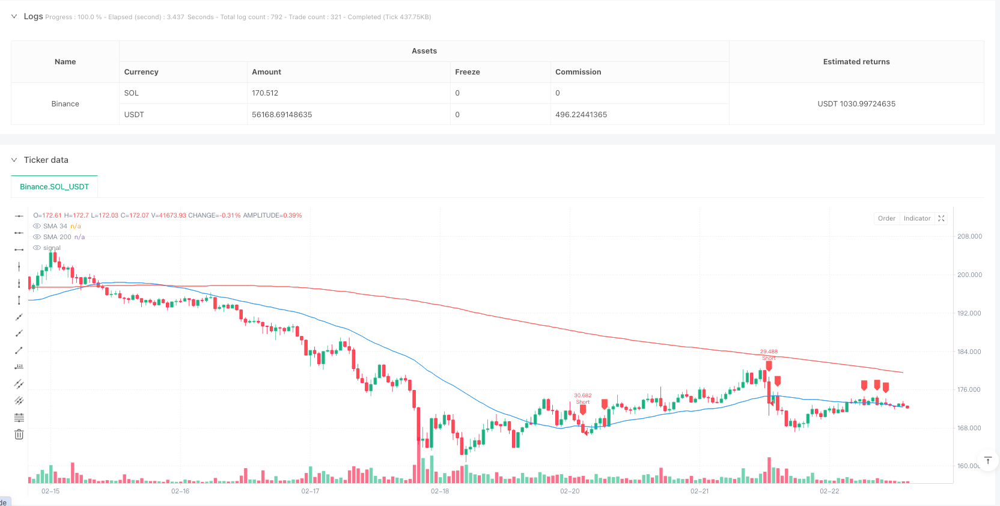
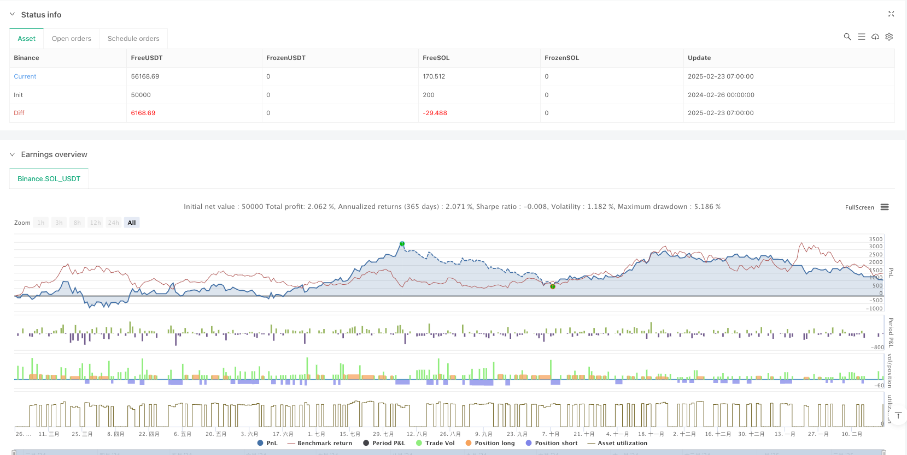

> Name

Dual-Moving-Average-Crossover-with-Stochastic-Filter-and-Adaptive-Trailing-Stop-Strategy
> Author

ianzeng123

> Strategy Description




[trans]## Strategy Overview
This strategy is a comprehensive trading system that combines moving average crossovers, stochastic filtering, and adaptive trailing stops. It is mainly based on the crossover signal of the fast moving average (SMA 34) and the slow moving average (SMA 200), while using the Stochastic (9-3-3) stochastic indicator as an additional filter to enhance the reliability of the signal. In addition, the strategy is also designed with a complete risk management module, including fixed stop loss, profit target and trailing stop function that automatically adjusts based on price trends. It is particularly worth noting that when the profit reaches the preset threshold, the strategy will automatically adjust the stop loss point to the entry price to protect the profits earned and achieve the risk control goal of "guaranteed exit".
## Strategy Principle
The core logic of the strategy is built on the following key components:
1. **Dual Moving Average System**: Uses 34-period and 200-period simple moving averages (SMA) to represent the mid-term and long-term trends respectively. When the short-term moving average crosses the long-term moving average, it indicates the formation of an upward trend; conversely, when the short-term moving average crosses below the long-term moving average, it indicates the formation of a downtrend.
2. **Stochastic indicator filter**: The Stochastic stochastic indicator with a parameter of 9-3-3 is used as an auxiliary tool to judge whether the market is overbought or oversold. When considering a long signal, the stochastic indicator value is required to be higher than 20 to avoid entering the market when the rebound in the oversold area has not been sufficient; when considering the short signal, the stochastic indicator value is required to be lower than 80 to avoid entering the overbought area before the rebound is confirmed.
3. **Admission conditions**:
   - Long conditions: price crosses SMA 34, SMA 34 is above SMA 200, and Stochastic %K line is greater than 20.
   - Short selling conditions: price crosses SMA 34, SMA 34 is below SMA 200, and Stochastic %K line is less than 80.
4. **Risk Management Mechanism**:
   - Fixed stop loss: set to 2% of the entry price.
   - Profit target: set to 4% of the entry price.
   - Capital-guaranteed stop-loss function: When the profit reaches 2%, the stop-loss point is automatically raised to the entry price (long) or lowered to the entry price (short) to ensure that the transaction is at least no loss.
5. **Execution logic**: The strategy realizes automated transaction execution through the strategy module of TradingView, and each transaction uses 10% of the account equity for operation.
## Strategic Advantages
1. **Combination of trend tracking and oscillation**: By combining the moving average system (trend tracking) and the Stochastic stochastic indicator (oscillator), this strategy can capture trends and market conditions at the same time, improving the accuracy of entry timing.
2. **Multi-level confirmation**: The entry signal needs to meet the three conditions of the intersection of the price and the moving average, the relative position of the moving average, and the status of the stochastic indicator, effectively reducing false breakthroughs and false signals.
3. **Reasonable risk-return ratio**: The stop loss set by the strategy is 2%, the profit target is 4%, and the risk-return ratio is 1:2, which is in line with healthy trading principles.
4. **Dynamic capital preservation mechanism**: Through the breakevenTrigger parameter (2%), the automated capital preservation function is realized, ensuring that the transaction will not turn from profit to loss after the market develops in a favorable direction to a certain extent.
5. **Visualized trading signals**: The strategy visually displays buying and selling signals on the price chart, making it convenient for traders to monitor and analyze strategy performance.
6. **Parameter Adjustability**: All key parameters can be adjusted through the input interface, including the moving average period, Stochastic parameters, stop loss ratio, profit target and capital preservation trigger point, making the strategy highly adaptable.
## Strategy Risk
1. **Trend Reversal Risk**: Although SMA 200 is used as a long-term trend filter, the market may reverse quickly in the short term, causing stop loss to be triggered. Solution: Consider combining volatility indicators to reduce positions or suspend trading during periods of unusually high volatility.
2. **Slippage and transaction costs**: The strategy may face slippage and transaction costs in the actual environment, affecting the actual rate of return. Solution: Optimize trading frequency to avoid too frequent trading, or adjust entry conditions to require stronger signal confirmation.
3. **Parameter sensitivity**: The effect of the strategy is highly dependent on parameter settings. Different markets and time periods may require different parameter combinations. Solution: Carry out backtest optimization and preset different parameter configuration files for different market environments.
4. **Moving average lag**: The moving average is essentially a lagging indicator, which may lead to delayed entry or exit timing. Solution: Consider using the exponential moving average (EMA) instead of the simple moving average (SMA), or in combination with other leading indicators for confirmation.
5. **Fixed Percent Risk**: Using a fixed stop loss percentage may not accommodate changes in market volatility. Solution: Design a dynamic stop loss mechanism based on ATR (Average True Range) to make the stop loss point more in line with the current market fluctuation characteristics.
## Strategy optimization direction
1. **Dynamicly adjusted moving average period**: The current strategy uses fixed 34- and 200-period moving averages. You can consider automatically adjusting the moving average period according to market volatility, using longer periods in high-volatility environments and shorter periods in low-volatility environments to improve adaptability.
2. **Add trading volume confirmation**: The current entry signal is based only on price and indicators, and trading volume conditions can be added, requiring a significant increase in trading volume when the signal occurs to confirm the validity of the breakthrough.
3. **Multi-time frame analysis**: Implement a multi-time frame confirmation mechanism, for example, requiring the trend direction of a larger time frame to be consistent with the trading direction to enhance the reliability of trading signals.
4. **Optimize trailing stop loss logic**: The current capital preservation mechanism is relatively simple, and more complex trailing stop loss logic can be designed, such as dynamically setting the tracking distance based on ATR, or gradually tightening the trailing stop loss as profits increase.
5. **Add market status filter**: Introduce a market status recognition mechanism, such as identifying trend strength through the ADX indicator, adopting more aggressive parameter settings in strong trending markets, and adopting more conservative settings in volatile markets.
6. **Optimize Stochastic parameters**: Consider using adaptive Stochastic parameters instead of the fixed 9-3-3 to better adapt to different market conditions.
## Summarize
"Adaptive trailing stop-loss strategy combining double moving average crossover and stochastic indicator" is a well-structured and logically clear trading system that effectively integrates trend tracking, oscillator filtering and risk management mechanisms. Through the cross of SMA 34 and SMA 200 combined with the confirmation of the Stochastic Stochastic indicator, this strategy is able to capture effective trend changes in the market while avoiding entry into unfavorable market conditions. In particular, its adaptive capital preservation mechanism provides an important risk control method for transactions.
However, there is still room for improvement in this strategy, especially in terms of its adaptability to different market environments. By introducing optimization measures such as dynamic parameter adjustment, transaction volume confirmation, and multi-time frame analysis, the performance of the strategy can be further improved. For traders, understanding the logic behind the strategy and making appropriate adjustments based on their own risk tolerance and trading goals is the key to successfully applying the strategy.
Whether it is a long-term investor pursuing steady returns or an active trader seeking short-term trading opportunities, this strategy provides a structured framework to help traders make more systematic and disciplined trading decisions in complex and volatile markets. || ## Strategy Overview
This strategy is a comprehensive trading system that combines moving average crossovers, Stochastic indicator filtering, and adaptive trailing stop loss. It primarily relies on crossover signals between a fast moving average (SMA 34) and a slow moving average (SMA 200), while using the Stochastic (9-3-3) indicator as an additional filter to enhance signal reliability. Additionally, the strategy incorporates a sophisticated risk management module, including fixed stop loss, take profit targets, and an automatically adjusting trailing stop function based on price movement. Notably, when profit reaches a preset threshold, the strategy automatically adjusts the stop loss to the entry price, protecting accumulated profits and achieving a "breakeven exit" risk control objective.

## Strategy Principles

The core logic of the strategy is built on several key components:

1. **Dual Moving Average System**: Uses 34-period and 200-period Simple Moving Averages (SMA), representing medium and long-term trends respectively. When the shorter-term moving average crosses above the longer-term moving average, it indicates an uptrend formation; conversely, when the shorter-term moving average crosses below the longer-term moving average, it signals a downtrend formation.

2. **Stochastic Indicator Filter**: Employs a Stochastic indicator with 9-3-3 parameters as a supplementary tool for market overbought/oversold conditions. For long signals, the Stochastic value must be above 20, avoiding entry during insufficient rebounds from oversold areas; for short signals, the Stochastic value must be below 80, avoiding entry during unconfirmed pullbacks from overbought areas.

3. **Entry Conditions**:
   - Long Entry: Price crosses above SMA 34, while SMA 34 is above SMA 200, and Stochastic %K line is greater than 20.
   - Short Entry: Price crosses below SMA 34, while SMA 34 is below SMA 200, and Stochastic %K line is less than 80.

4. **Risk Management Mechanism**:
   - Fixed Stop Loss: Set at 2% from entry price.
   - Take Profit: Set at 4% from entry price.
   - Breakeven Function: When profit reaches 2%, stop loss automatically moves to entry price (for long positions) or down to entry price (for short positions), ensuring the trade at least doesn't lose money.

5. **Execution Logic**: The strategy implements automated trade execution through TradingView's strategy module, allocating 10% of account equity per trade.

## Strategy Advantages

1. **Combination of Trend Following and Oscillation**: By integrating a moving average system (trend following) with the Stochastic indicator (oscillator), this strategy can simultaneously capture trends and market conditions, improving entry timing accuracy.

2. **Multi-level Confirmation**: Entry signals must satisfy three conditions - price and moving average crossover, relative moving average positions, and Stochastic indicator status - effectively reducing false breakouts and incorrect signals.

3. **Reasonable Risk-Reward Ratio**: The strategy sets a stop loss at 2% and a profit target at 4%, creating a risk-reward ratio of 1:2, which aligns with healthy trading principles.

4. **Dynamic Breakeven Mechanism**: Through the breakevenTrigger parameter (2%), the strategy implements an automated breakeven function, ensuring trades don't turn from profitable to losing once the market has moved favorably to a certain extent.

5. **Visualization of Trading Signals**: The strategy displays buy and sell signals intuitively on the price chart, facilitating monitoring and analysis of strategy performance.

6. **Parameter Adjustability**: All key parameters can be adjusted through the input interface, including moving average periods, Stochastic parameters, stop loss percentage, profit target, and breakeven trigger point, giving the strategy good adaptability.

## Strategy Risks

1. **Trend Reversal Risk**: Although SMA 200 is used as a long-term trend filter, markets can experience rapid reversals in the short term, triggering stop losses. Solution: Consider incorporating volatility indicators and reduce position size or pause trading during periods of abnormally high volatility.

2. **Slippage and Trading Costs**: In real environments, the strategy may face slippage and trading cost issues that impact actual returns. Solution: Optimize trading frequency, avoid excessively frequent trading, or adjust entry conditions to require stronger signal confirmation.

3. **Parameter Sensitivity**: Strategy effectiveness highly depends on parameter settings, with different markets and timeframes potentially requiring different parameter combinations. Solution: Conduct backtesting optimization and preset different parameter configuration files for various market environments.

4. **Moving Average Lag**: Moving averages are inherently lagging indicators, potentially causing delayed entry or exit timing. Solution: Consider using Exponential Moving Averages (EMA) instead of Simple Moving Averages (SMA), or combine with other leading indicators for confirmation.

5. **Fixed Percentage Risk**: Using fixed stop loss percentages may not adapt to changes in market volatility. Solution: Design a dynamic stop loss mechanism based on ATR (Average True Range) to better align stop loss points with current market volatility characteristics.

## Strategy Optimization Directions

1. **Dynamically Adjusted Moving Average Periods**: Currently, the strategy uses fixed 34 and 200 period moving averages. Consider automatically adjusting moving average periods based on market volatility, using longer periods in high-volatility environments and shorter periods in low-volatility environments to improve adaptability.

2. **Add Volume Confirmation**: Current entry signals are based solely on price and indicators. Add volume conditions requiring significant volume increases when signals occur to confirm breakout validity.

3. **Multiple Timeframe Analysis**: Implement a multiple timeframe confirmation mechanism, for example, requiring that the trend direction in larger timeframes aligns with the trading direction, enhancing trade signal reliability.

4. **Optimize Trailing Stop Logic**: The current breakeven mechanism is relatively simple. Design more sophisticated trailing stop logic, such as dynamically setting trailing distances based on ATR, or gradually tightening trailing stops as profits increase.

5. **Add Market State Filters**: Introduce market state recognition mechanisms, such as using the ADX indicator to identify trend strength, adopting more aggressive parameter settings in strong trend markets and more conservative settings in oscillating markets.

6. **Optimize Stochastic Parameters**: Consider using adaptive Stochastic parameters instead of fixed 9-3-3 settings to better adapt to different market conditions.

## Summary

The "Dual Moving Average Crossover with Stochastic Filter and Adaptive Trailing Stop Strategy" is a well-structured trading system with clear logic that effectively integrates trend following, oscillator filtering, and risk management mechanisms. Through SMA 34 and SMA 200 crossovers combined with Stochastic indicator confirmation, this strategy can capture effective trend changes in the market while avoiding entries under unfavorable market conditions. Its adaptive breakeven mechanism, in particular, provides an important risk control measure for trading.

However, the strategy still has room for improvement, especially in terms of adaptability to different market environments. By introducing dynamic parameter adjustments, volume confirmation, multiple timeframe analysis, and other optimization measures, strategy performance can be further enhanced. For traders, understanding the logical principles behind the strategy and making appropriate adjustments based on personal risk tolerance and trading objectives is key to successfully applying this strategy.

Whether for long-term investors seeking stable returns or active traders looking for short-term trading opportunities, this strategy provides a structured framework that helps traders make more systematic and disciplined trading decisions in complex and changing markets.[/trans]


> Source (PineScript)

``` pinescript
/*backtest
start: 2024-02-26 00:00:00
end: 2025-02-23 08:00:00
period: 1h
basePeriod: 1h
exchanges: [{"eid":"Binance","currency":"SOL_USDT"}]
*/

//@version=6
strategy('[DRAGON]SMA 34 & SMA 200 with Stochastic 9-3-3 & Trailing Stop (Price Chart)', overlay=true, default_qty_type=strategy.percent_of_equity, default_qty_value=10)

// Inputs for Moving Averages
SMA_fast_length = input.int(34, title='Fast SMA (34)', minval=1)
SMA_slow_length = input.int(200, title='Slow SMA (200)', minval=1)

// Inputs for Stochastic 9-3-3 (ใช้สำหรับเงื่อนไขเทรด แต่ไม่แสดงบนกราฟ)
stoK_length = input.int(9, title='Stochastic %K Length', minval=1)
stoD_length = input.int(3, title='Stochastic %D Smoothing', minval=1)
sto_smoothK = input.int(3, title='Stochastic Smoothing', minval=1)

// Define Stop Loss, Take Profit & Trailing Stop
stopLossPercent = input.float(2, title='Stop Loss %') / 100
takeProfitPercent = input.float(4, title='Take Profit %') / 100
breakevenTrigger = input.float(2, title='Move SL to BE when Profit Reaches (%)') / 100

// Calculate SMAs
sma34 = ta.sma(close, SMA_fast_length)
sma200 = ta.sma(close, SMA_slow_length)

// Calculate Stochastic (สำหรับใช้ในเงื่อนไขเทรด)
stoK = ta.sma(ta.stoch(close, high, low, stoK_length), sto_smoothK)
stoD = ta.sma(stoK, stoD_length)

// Plot Moving Averages บนกราฟราคา
plot(sma34, color=color.blue, title='SMA 34')
plot(sma200, color=color.red, title='SMA 200')

// Define Entry Conditions โดยมีเงื่อนไขจาก Stochastic
buySignal = ta.crossover(close, sma34) and sma34 > sma200 and stoK > 20
sellSignal = ta.crossunder(close, sma34) and sma34 < sma200 and stoK < 80

// Calculate Stop Loss & Take Profit Levels
longSL = strategy.position_avg_price * (1 - stopLossPercent)
longTP = strategy.position_avg_price * (1 + takeProfitPercent)
shortSL = strategy.position_avg_price * (1 + stopLossPercent)
shortTP = strategy.position_avg_price * (1 - takeProfitPercent)

// กำหนด Breakeven เมื่อได้กำไรตามที่ตั้งไว้
longBreakeven = strategy.position_avg_price * (1 + breakevenTrigger)
shortBreakeven = strategy.position_avg_price * (1 - breakevenTrigger)

longStop = close >= longBreakeven ? strategy.position_avg_price : longSL
shortStop = close <= shortBreakeven ? strategy.position_avg_price : shortSL

// Execute Trades
if buySignal
    strategy.entry('Long', strategy.long)
    strategy.exit('Long Exit', from_entry='Long', stop=longStop, limit=longTP)

if sellSignal
    strategy.entry('Short', strategy.short)
    strategy.exit('Short Exit', from_entry='Short', stop=shortStop, limit=shortTP)

// Plot Buy/Sell Signals บนกราฟราคา
plotshape(buySignal, location=location.belowbar, color=color.lime, style=shape.labelup, title='Buy Signal')
plotshape(sellSignal, location=location.abovebar, color=color.red, style=shape.labeldown, title='Sell Signal')

```

> Detail

https://www.fmz.com/strategy/483679

> Last Modified

2025-02-25 11:05:17
