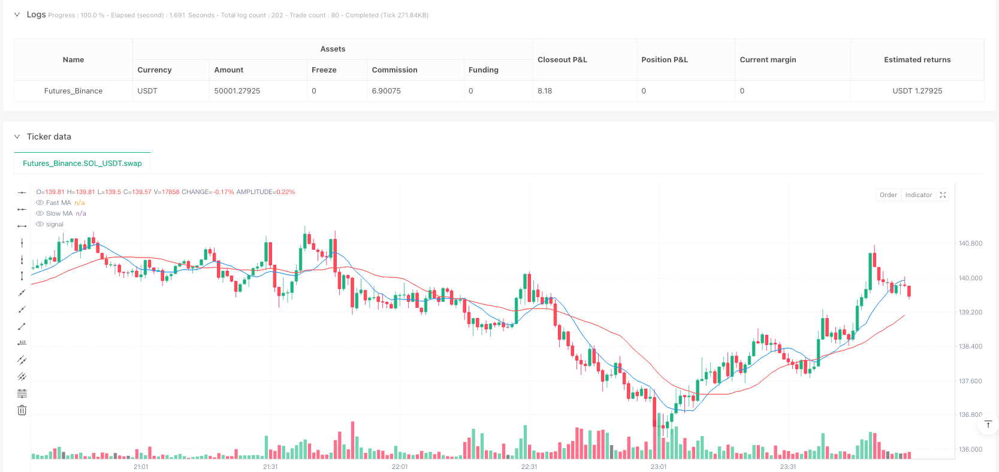
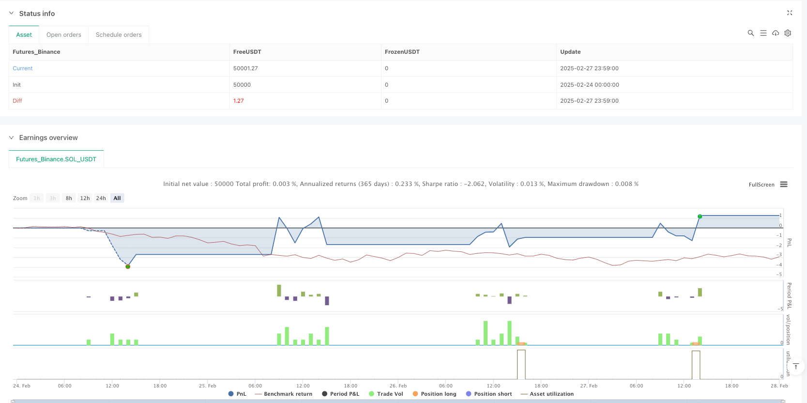

> Name

Dual-Moving-Average-Crossover-with-Trading-Window-and-Risk-Management-Strategy
> Author

ianzeng123

> Strategy Description




[trans]
#### Overview
This strategy is a trading system based on a double moving average crossover, which combines a specific trading time window and a risk management mechanism. The core logic is to use the cross relationship between the fast moving average and the slow moving average to determine changes in market trends, thereby generating buy and sell signals. This strategy also implements transaction execution within a fixed time period, and sets stop loss and take profit mechanisms to control risks. It is a complete trading system that combines technical analysis and risk management and is suitable for day traders and short-term trend following investors.
#### Strategy Principle
The core principle of this strategy is based on the moving average crossover system, which is implemented as follows:
1. **Double Moving Average Calculation**:
   - Fast Moving Average (Fast MA) uses a 10-period Simple Moving Average (SMA)
   - Slow MA uses a 25-period Simple Moving Average (SMA)
2. **Trading signal generation**:
   - Buy signal (Long): Triggered when the fast moving average crosses the slow moving average upwards
   - Sell signal (Short): Triggered when the fast moving average crosses the slow moving average downwards
3. **Trading Time Window**:
   - The strategy only executes transactions during market opening hours (08:30-15:00)
   - Forced closing of all open positions at 15:00
4. **Risk Management Mechanism**:
   - Stop Loss: Set to the entry price minus the specified number of points
   - Take Profit: Set to the entry price plus a specified number of points
   - Default transaction quantity is set to 2 units
5. **System logic flow**:
   - Check if it is within the trading time window
   - Determine whether the moving average crossover conditions are met
   - Execute trade entries
   - Set stop loss and take profit prices
   - Forced closing of positions at closing time
Through this systematic approach, the strategy achieves an organic combination of trend identification and risk control.
#### Strategic Advantages
Analyzing the code implementation of this strategy, we can summarize the following significant advantages:
1. **Effectiveness of trend tracking**: Double moving average crossover is a classic trend identification method that can effectively capture short- and medium-term market trend changes. The fast moving average (10 periods) is responsive to price changes, while the slow moving average (25 periods) filters out short-term market noise.
2. **Standardized trading time management**: By setting a specific trading window (08:30-15:00), the strategy avoids the risk of low liquidity during non-main trading periods and focuses on trading during the periods with the highest market activity.
3. **Complete risk control mechanism**: The strategy has built-in stop-loss and take-profit functions, and each transaction has preset risk and return targets, ensuring the standardization of fund management.
4. **Forced closing mechanism**: By forcing positions to be closed at 15:00 every day, the risk of overnight positions is avoided, which is especially suitable for day traders who are unwilling to bear overnight risks.
5. **Flexible and adjustable parameters**: The key parameters in the strategy (moving average period, stop loss and stop profit points, transaction quantity) are all designed as input parameters, and users can adjust them according to different market environments and personal risk preferences.
6. **Clear trading logic**: The strategy implements clear entry and exit conditions, without complex judgment logic, is easy to understand and execute, and reduces the possibility of operational errors.
#### Strategy Risk
Although this strategy is well designed, there are still the following potential risks:
1. **Moving average lag risk**: The moving average is essentially a lagging indicator. In a rapidly changing market, it may produce lagging signals, resulting in untimely entry or exit, especially frequent false signals when the market fluctuates sideways.
   - Solution: Consider adding additional filtering conditions, such as volatility indicators or trend strength indicators, to reduce false signals.
2. **Fixed stop loss risk**: The strategy uses a fixed number of points as the stop loss setting and does not take into account changes in market volatility. The stop loss may be too small in a high volatility environment, and the stop loss may be too large in a low volatility environment.
   - Solution: A dynamic stop loss mechanism based on ATR (Average True Range) can be introduced to adapt the stop loss level to the current market volatility.
3. **Time window limitations**: Fixed trading time windows may miss important trading opportunities outside the window, especially when major events occur in the market during non-trading hours.
   - Solution: Consider dynamically adjusting trading time windows based on different market characteristics and seasonal factors.
4. **Insufficient Fund Management**: The strategy uses a fixed number of trades and does not dynamically adjust position sizes based on account size and risk level.
   - Solution: Implement position size calculation based on account equity ratio, such as Kelly criterion or fixed risk ratio method.
5. **Lack of market environment adaptability**: The double moving average crossover strategy performs well in trending markets, but may lead to frequent trading and losses in volatile markets.
   - Solution: Add a market type identification mechanism to apply different trading parameters or suspend trading in different market environments.
#### Strategy optimization direction
Based on code analysis and strategy characteristics, the following are several possible optimization directions:
1. **Dynamic stop loss and stop profit mechanism**:
   - Change the fixed point stop loss and take profit to a dynamic value based on ATR. For example, you can set the stop loss to 1.5 times the current ATR and the take profit to 2.5 times the current ATR.
   - This can make risk management more adaptable to changes in market volatility, making the stop loss position looser when fluctuations are large and the stop loss position tighter when fluctuations are small.
2. **Add trend filter**:
   - Introduce long-period moving averages (such as 50-period or 200-period) as trend filter conditions, and only trade in the main trend direction
   - You can consider adding the ADX indicator to judge the strength of the trend, and only execute transactions when the trend is clear.
   - This can reduce false signals in volatile markets and improve signal quality
3. **Optimized moving average type**:
   - Replace the simple moving average (SMA) with an exponential moving average (EMA) or a weighted moving average (WMA), which are more responsive to recent price changes
   - Consider using an adaptive moving average such as the Kaufman Adaptive Moving Average (KAMA) to better adapt to different market conditions
   - This can reduce signal lag and improve the timeliness of trend capture
4. **Add trailing stop loss mechanism**:
   - Implement the trailing stop loss function and automatically adjust the stop loss position as the price moves in a favorable direction
   - You can set the stop loss to move to the cost position or profit position after the profit reaches a certain level.
   - This protects profits already made while allowing the trend to continue developing
5. **Refined trading time window**:
   - Analyzing the performance of different time periods, you may need to avoid certain time periods such as the high volatility period 30 minutes before the market opens
   - Consider adjusting trading hours based on market seasonal characteristics, such as summer and winter may have different optimal trading periods
   - This can further optimize the timing of transaction execution and avoid inefficient trading periods
6. **Achieve dynamic position management**:
   - Calculate the transaction size based on the account equity ratio, for example, the risk of each transaction does not exceed 1-2% of the account
   - Consider adjusting position size based on signal strength and market conditions, increasing trade size on more confident signals
   - This allows for more professional money management, balancing risk and reward
#### Summarize
"Double moving average cross with timed trading window and stop-profit and stop-loss strategy" is a complete trading system with both trend tracking and risk management functions. Changes in market trends are identified through the intersection of fast moving averages and slow moving averages, and combined with specific trading time windows and stop-loss and stop-profit mechanisms, a systematic trading decision-making process is achieved.
The main advantages of this strategy are clear logic, complete risk control and standardized operations. However, as a moving average-based system, it also faces inherent risks such as signal lags and false signals. By introducing optimization measures such as dynamic stop loss, trend filters, optimizing moving average types, implementing trailing stop loss and dynamic position management, the robustness and adaptability of the strategy can be significantly improved.
For day traders and short-term trend followers, this strategy combines technical analysis and risk management to provide a good trading framework. Through continuous optimization of parameters and adaptive adjustments to the market environment, this strategy has the potential to maintain relatively stable performance under different market conditions.
 ||
#### Overview
This strategy is a trading system based on dual moving average crossovers, combined with a specific trading time window and risk management mechanisms. The core logic utilizes the crossover relationship between a fast moving average and a slow moving average to determine changes in market trends, thereby generating buy and sell signals. The strategy also implements trade execution within fixed time periods and sets stop-loss and take-profit mechanisms to control risk. This is a complete trading system that combines technical analysis and risk management, suitable for intraday traders and short-term trend-following investors.

#### Strategy Principles

The core principle of this strategy is based on a moving average crossover system, implemented as follows:

1. **Dual Moving Average Calculation**: 
   - Fast Moving Average (Fast MA) uses a 10-period Simple Moving Average (SMA)
   - Slow Moving Average (Slow MA) uses a 25-period Simple Moving Average (SMA)

2. **Trade Signal Generation**:
   - Buy Signal (Long): Triggered when the fast moving average crosses above the slow moving average
   - Sell Signal (Short): Triggered when the fast moving average crosses below the slow moving average

3. **Trading Time Window**:
   - The strategy only executes trades during market open hours (08:30-15:00)
   - Forces closing of all positions at 15:00

4. **Risk Management Mechanism**:
   - Stop Loss: Set at entry price minus a specified number of ticks
   - Take Profit: Set at entry price plus a specified number of ticks
   - Default trading quantity set to 2 units

5. **System Logic Flow**:
   - Check if within trading time window
   - Determine if moving average crossover conditions are met
   - Execute trade entry
   - Set stop-loss and take-profit prices
   - Force position closure at market closing time

Through this systematic approach, the strategy achieves an organic combination of trend identification and risk control.

#### Strategy Advantages

Analyzing the code implementation of this strategy, the following significant advantages can be summarized:

1. **Effectiveness of Trend Following**: The dual moving average crossover is a classic trend identification method that can effectively capture medium and short-term market trend changes. The fast moving average (10-period) responds sensitively to price changes, while the slow moving average (25-period) filters out short-term market noise.

2. **Standardized Trading Time Management**: By setting a specific trading window (08:30-15:00), the strategy avoids low liquidity risks during non-primary trading sessions and focuses on trading during the most active market hours.

3. **Comprehensive Risk Control Mechanism**: The strategy incorporates built-in stop-loss and take-profit functions, with each trade having preset risk and reward targets, ensuring standardized fund management.

4. **Forced Closing Mechanism**: By forcing position closure at 15:00 daily, overnight position risks are avoided, making it particularly suitable for intraday traders who do not wish to bear overnight risks.

5. **Flexible Adjustable Parameters**: Key parameters in the strategy (moving average periods, stop-loss and take-profit ticks, trading quantity) are designed as input parameters, allowing users to adjust according to different market environments and personal risk preferences.

6. **Clear Trading Logic**: The strategy implements clear entry and exit conditions without complex decision logic, making it easy to understand and execute, reducing the possibility of operational errors.

#### Strategy Risks

Despite the relatively comprehensive design of this strategy, the following potential risks still exist:

1. **Moving Average Lag Risk**: Moving averages are inherently lagging indicators and may generate delayed signals in rapidly changing markets, leading to untimely entries or exits, especially producing frequent false signals during sideways, oscillating markets.
   - Solution: Consider adding additional filtering conditions, such as volatility indicators or trend strength indicators, to reduce false signals.

2. **Fixed Stop-Loss Risk**: The strategy uses a fixed number of ticks as stop-loss settings without considering changes in market volatility. The stop-loss might be too small in high-volatility environments and too large in low-volatility environments.
   - Solution: Introduce dynamic stop-loss mechanisms based on ATR (Average True Range) to adapt stop-loss levels to current market volatility.

3. **Time Window Limitations**: Fixed trading time windows may miss important trading opportunities outside the window, especially when significant market events occur during non-trading sessions.
   - Solution: Consider dynamically adjusting trading time windows based on different market characteristics and seasonal factors.

4. **Insufficient Fund Management**: The strategy uses a fixed trading quantity without dynamically adjusting position size based on account size and risk level.
   - Solution: Implement position size calculations based on account equity proportions, such as the Kelly criterion or fixed risk percentage methods.

5. **Lack of Market Environment Adaptability**: Dual moving average crossover strategies perform well in trending markets but may lead to frequent trading and losses in oscillating markets.
   - Solution: Add market type identification mechanisms to apply different trading parameters or pause trading in different market environments.

#### Strategy Optimization Directions

Based on code analysis and strategy characteristics, the following are several possible optimization directions:

1. **Dynamic Stop-Loss and Take-Profit Mechanism**:
   - Change fixed tick stop-loss and take-profit to dynamic values based on ATR, such as setting stop-loss at 1.5 times the current ATR and take-profit at 2.5 times the current ATR
   - This allows risk management to better adapt to changes in market volatility, with wider stop-loss positions during high volatility and tighter positions during low volatility

2. **Add Trend Filters**:
   - Introduce long-period moving averages (such as 50-period or 200-period) as trend filtering conditions, trading only in the direction of the main trend
   - Consider adding the ADX indicator to judge trend strength, executing trades only when trends are clear
   - This can reduce false signals in oscillating markets and improve signal quality

3. **Optimize Moving Average Types**:
   - Replace Simple Moving Averages (SMA) with Exponential Moving Averages (EMA) or Weighted Moving Averages (WMA), which are more sensitive to recent price changes
   - Consider using adaptive moving averages such as Kaufman's Adaptive Moving Average (KAMA) to better adapt to different market conditions
   - This can reduce signal lag and improve the timeliness of trend capture

4. **Add Trailing Stop-Loss Mechanism**:
   - Implement trailing stop functionality to automatically adjust stop-loss positions as prices move in favorable directions
   - Set to move stop-loss to breakeven or profit position after achieving a certain level of profit
   - This protects already gained profits while allowing trends to continue developing

5. **Refine Trading Time Window**:
   - Analyze performance during different time periods, potentially avoiding certain periods such as the high volatility 30 minutes before market opening
   - Consider adjusting trading times according to market seasonal characteristics, as summer and winter may have different optimal trading sessions
   - This further optimizes trade execution timing and avoids inefficient trading periods

6. **Implement Dynamic Position Management**:
   - Calculate trading size based on account equity proportions, for example, risking no more than 1-2% of the account per trade
   - Consider adjusting position size based on signal strength and market conditions, increasing trade size on more confident signals
   - This implements more professional fund management, balancing risk and reward

#### Summary

The "Dual Moving Average Crossover with Trading Window and Risk Management Strategy" is a complete trading system that combines trend following and risk management functionality. It identifies market trend changes through the crossover relationship between fast and slow moving averages, while combining specific trading time windows and stop-loss/take-profit mechanisms to achieve a systematic trading decision process.

The main advantages of this strategy lie in its clear logic, comprehensive risk control, and standardized operations. However, as a system based on moving averages, it also faces inherent risks such as signal lag and false signals. By introducing dynamic stop-loss, trend filters, optimizing moving average types, implementing trailing stops, and dynamic position management, the strategy's robustness and adaptability can be significantly enhanced.

For intraday traders and short-term trend followers, this strategy combining technical analysis and risk management provides a solid trading framework. Through continuous optimization of parameters and adaptive adjustments to market environments, this strategy has the potential to maintain relatively stable performance under different market conditions.
[/trans]


> Source (PineScript)

``` pinescript
/*backtest
start: 2025-02-24 00:00:00
end: 2025-02-28 00:00:00
period: 1m
basePeriod: 1m
exchanges: [{"eid":"Futures_Binance","currency":"SOL_USDT"}]
*/

// This Pine Script™ code is subject to the terms of the Mozilla Public License 2.0 at https://mozilla.org/MPL/2.0/
// © szapatamejia193

//@version=5
strategy("Custom MACrossOver", overlay=true)

// Parámetros configurables
fastLength = input(10, title="Fast Period")
slowLength = input(25, title="Slow Period")
stopLossTicks = input(50, title="Stop (Ticks)")
profitTargetTicks = input(50, title="Target (Ticks)")
defaultQuantity = input(2, title="Default Quantity")

// Cálculo de medias móviles
fastMA = ta.sma(close, fastLength)
slowMA = ta.sma(close, slowLength)

// Condiciones de cruce
longCondition = ta.crossover(fastMA, slowMA)
shortCondition = ta.crossunder(fastMA, slowMA)

// Guardar precio de entrada
var float tradeEntryPrice = na

// Definir rango de mercado abierto (08:30 - 15:00)
market_open = (hour >= 8 and minute >= 30) and (hour < 15)

// Apertura de operaciones
if (market_open)
    if (longCondition)
        strategy.entry("Long", strategy.long, defaultQuantity)
        tradeEntryPrice := close
    else if (shortCondition)
        strategy.entry("Short", strategy.short, defaultQuantity)
        tradeEntryPrice := close

// Definir Stop Loss y Take Profit
if (not na(tradeEntryPrice))
    stopLossPrice = tradeEntryPrice - stopLossTicks * syminfo.mintick
    takeProfitPrice = tradeEntryPrice + profitTargetTicks * syminfo.mintick

    if (strategy.position_size > 0) // Si estamos en largo
        strategy.exit("SL/TP", from_entry="Long", stop=stopLossPrice, limit=takeProfitPrice)
    else if (strategy.position_size < 0) // Si estamos en corto
        strategy.exit("SL/TP", from_entry="Short", stop=stopLossPrice, limit=takeProfitPrice)

// Salir de todas las operaciones a las 15:00
if (hour == 15 and minute == 0)
    strategy.close_all()

// Dibujar medias móviles
plot(fastMA, title="Fast MA", color=color.blue)
plot(slowMA, title="Slow MA", color=color.red)

```

> Detail

https://www.fmz.com/strategy/484771

> Last Modified

2025-03-04 10:59:50
