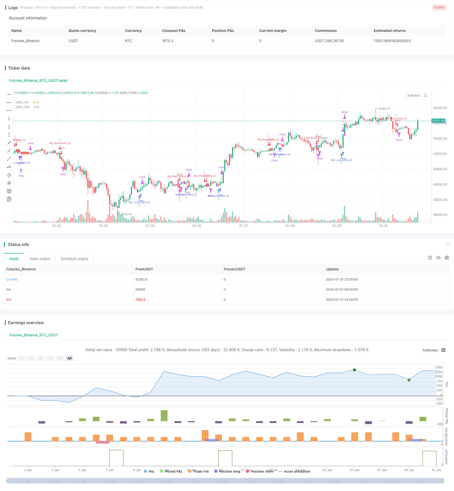

> Name

Based on Dual-Moving-Average-Following-Strategy
> Author

ChaoZhang

> Strategy Description


[trans]
### Overview
The dual moving average following strategy is a trend following strategy based on moving averages. It calculates moving averages of different periods to determine the market trend direction to send trading signals. When the short-term moving average crosses the long-term moving average, go long; when the short-term moving average crosses below the long-term moving average, go short. This strategy follows the trend to make profits.
### Strategy Principles
The dual moving average following strategy determines the trend direction by calculating the 14-period and 28-period simple moving averages (SMA). Specifically, it calculates the 14-period SMA and 28-period SMA of the close price at the end of each period. When the 14-period SMA crosses above the 28-period SMA, it sends a long signal and opens a long position; when the 14-period SMA crosses below the 28-period SMA, it sends a short signal and opens a short position.
After entering a position, it controls risk by setting take profit and stop loss. The points for take profit and stop loss are converted into prices through the entered parameters. In addition, it also draws take-profit lines, stop-loss lines and reference lines for the average entry price on the chart to facilitate intuitive judgment of position profits and risks.
### Advantage Analysis
The double moving average following strategy has the following advantages:
1. Simple operation and easy to implement.
2. If you follow the trend, the probability of retracement is small.
3. The trading frequency can be controlled by adjusting the cycle parameters.
4. You can flexibly set take-profit and stop-loss points to control risks.
### Risk Analysis
There are also some risks in the double moving average following strategy:
1. When unexpected events interrupt the market trend, large losses may occur.
2. If the stop loss point is set too small, the loss may be stopped prematurely.
3. If the stop loss point is set too large, the loss range may be expanded.
4. The transaction frequency may be too high or too low, affecting capital efficiency.
In order to control the above risks, optimization can be carried out from the following aspects:
1. Combine the volatility indicator to determine the stop loss point.
2. Optimize the period parameters of the moving average.
3. Add a trend filter to avoid false signals at the end of the trend.

### Optimization direction
The double moving average following strategy can be optimized from the following aspects:
1. Add volatility indicators and dynamically adjust stop loss points. For example, combined with the ATR indicator, when market volatility increases, the stop loss point is expanded to avoid premature stop loss.
2. Optimize the moving average cycle parameters. You can test more combinations and choose a more appropriate period to generate trading signals.
3. Add a trend filter. For example, adding indicators such as MACD and DMI can avoid false signals at the end of the trend and reduce unnecessary transactions.
4. Add machine learning model. Using deep learning models such as LSTM and GRU to predict price trends instead of the traditional moving average rule may achieve better results.
5. Multi-variety trading. Apply the strategy to more varieties and use non-correlation to reduce the overall drawdown.
### Summarize
The double moving average following strategy is overall a simple and practical trend strategy. It follows the trend, has less risk of retracement and is easy to implement. We can optimize this strategy by adjusting cycle parameters, setting stop losses and take profits, and adding trend judgment indicators, so that it can adapt to more market environments and obtain more stable investment returns.
||

### Overview 

The dual moving average following strategy is a trend following strategy based on moving averages. It determines the trend direction by calculating moving averages of different periods and generates trading signals accordingly. It goes long when the short-term moving average crosses over the long-term one, and goes short when the short-term moving average crosses below the long-term one. The strategy follows the trend to profit.  

### Strategy Logic

The dual moving average following strategy judges the trend direction by calculating the 14-period and 28-period simple moving averages (SMA) of the closing price. Specifically, it calculates the 14-period SMA and 28-period SMA of close price at the end of each period. When the 14-period SMA crosses over the 28-period SMA, it sends out a long signal and opens a long position. When the 14-period SMA crosses below the 28-period SMA, it sends out a short signal and opens a short position.   

After entering positions, it manages risks by setting take profit and stop loss levels. The take profit and stop loss points are converted to prices based on the input parameters. It also plots the take profit line, stop loss line and entry average price line on the chart for visual judgment of profit and risk.

### Advantage Analysis   

The dual moving average following strategy has the following advantages:  

1. Simple to implement and operate.  
2. Follows the trend with lower drawdown risks.
3. Trading frequency can be controlled by adjusting the cycle parameters.  
4. Flexible take profit and stop loss settings to control risks.

### Risk Analysis

The dual moving average following strategy also has some risks:

1. Significant loss may occur if sudden events interrupt the market trend.  
2. Premature stop loss may happen if the stop loss point is set too small. 
3. Loss range could be enlarged if the stop loss point is set too big.
4. Trading frequency may be too high or too low, impacting capital efficiency.

The risks can be managed from the following aspects:

1. Set stop loss point dynamically based on volatility. 
2. Optimize the moving average cycle parameters.  
3. Add trend filter to avoid false signals near trend turning points.

### Optimization Directions   

The dual moving average following strategy can be optimized in the following ways:

1. Add volatility indicators for dynamic stop loss point. For example, combine with ATR to expand stop loss when volatility rises to avoid premature exit.  

2. Optimize moving average cycle parameters by testing more combinations and selecting proper periods with suitable frequency of trading signals.   

3. Add trend filter indicator, such as MACD, DMI to avoid false signals near trend turning points, reducing unnecessary trades.  

4. Increase machine learning models to predict price trend and replace traditional rules. LSTM, GRU deep learning models may generate better results.  

5. Diversify trading varieties utilizing low correlation to reduce overall drawdown.

### Conclusion  

In conclusion, the dual moving average following strategy is a simple and practical trend following system. It moves along the trend thus having lower drawdown risks, and is easy to implement. We can optimize it by adjusting cycle parameters, setting stop loss and take profit, adding trend judging indicators, to adapt to more market environments and earn more steady returns.

[/trans]

> Strategy Arguments


|Argument|Default|Description|
|----|----|----|
|v_input_1|200|Take Profit $$|
|v_input_2|100|Stop Loss $$|


> Source (PineScript)

``` pinescript
/*backtest
start: 2024-01-01 00:00:00
end: 2024-01-31 23:59:59
period: 1h
basePeriod: 15m
exchanges: [{"eid":"Futures_Binance","currency":"BTC_USDT"}]
*/

// This Pine Script™ code is subject to the terms of the Mozilla Public License 2.0 at https://mozilla.org/MPL/2.0/
// © coinilandBot
// This source code is subject to the terms of the Mozilla Public License 2.0 at https://mozilla.org/MPL/2.0/
// © adolgov

// @description
// 

//@version=4
strategy("coiniland  copy trading platform", overlay=true)

// random entry condition

longCondition = crossover(sma(close, 14), sma(close, 28))
if (longCondition)
    strategy.entry("My Long Entry Id", strategy.long)

shortCondition = crossunder(sma(close, 14), sma(close, 28))
if (shortCondition)
    strategy.entry("My Short Entry Id", strategy.short)

moneyToSLPoints(money) =>
    strategy.position_size !=0 ? (money / syminfo.pointvalue / abs(strategy.position_size)) / syminfo.mintick : na

p = moneyToSLPoints(input(200, title = "Take Profit $$"))
l = moneyToSLPoints(input(100, title = "Stop Loss $$"))
strategy.exit("x", profit = p, loss = l)

// debug plots for visualize SL & TP levels
pointsToPrice(pp) =>
    na(pp) ? na : strategy.position_avg_price + pp * sign(strategy.position_size) * syminfo.mintick
    
pp = plot(pointsToPrice(p), style = plot.style_linebr )
lp = plot(pointsToPrice(-l), style = plot.style_linebr )
avg = plot( strategy.position_avg_price, style = plot.style_linebr )
fill(pp, avg, color = color.green)
fill(avg, lp, color = color.red)

```

> Detail

https://www.fmz.com/strategy/442933

> Last Modified

2024-02-27 14:49:58
