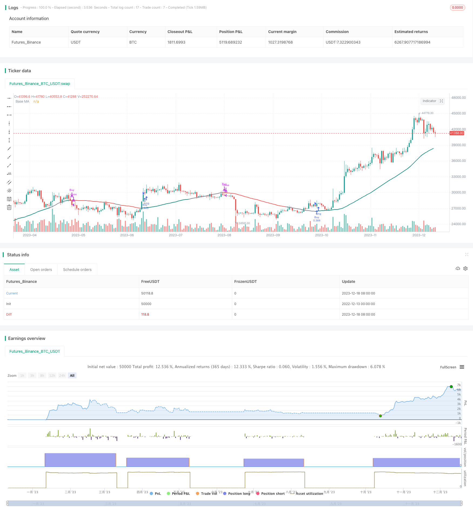

> Name

Dual-Moving-Average-Intelligent-Tracking-Strategy
> Author

ChaoZhang

> Strategy Description


 [trans]

### Overview
The dual moving average intelligent tracking strategy uses dual moving average indicators to track short-term, medium and long-term price trends, and forms visual aids through color and line width changes during tracking, helping traders to intuitively judge market trends and build short positions accordingly. This strategy uses custom parameters to achieve a high degree of flexibility and is suitable for private equity funds and hedge funds with a certain technical foundation for programmed trading.
### Strategy Principles
The core of the dual moving average smart tracking strategy is to use fast moving averages and slow moving averages to generate trading signals. Specifically, the fast moving average tracks short-term price changes, and the slow moving average reflects mid- to long-term trends. At the same time, the strategy uses three color schemes (cross, directional and comprehensive) to make the benchmark moving average appear in different colors to assist in judging market trends. When the fast moving average crosses the slow moving average, take a bullish operation; when the fast moving average crosses below the slow moving average, close the position and go short. Additionally, the baseline moving averages are customizable in length, and color options can be switched between crossover, directional, and integrated for a high degree of customization.
### Advantage Analysis
The biggest advantage of the dual moving average intelligent tracking strategy is that it combines the dual moving average indicators and color vision to assist in judging market trends, making the operation simple and clear. Secondly, the strategy parameters are customizable, and users can adjust them according to their own trading preferences and market environment to achieve efficient backtesting and real-time trading. Thirdly, different color schemes can meet the visual and operating habits of different users. Finally, the double moving average has high sensitivity in tracking price changes and can seize opportunities for short-term price fluctuations.
### Risk Analysis
Although the double moving average intelligent tracking strategy has obvious advantages, there are also some potential risks. Double moving averages are highly sensitive to price changes and can easily generate false signals leading to over-trading. In addition, although custom parameters are flexible, they also increase the difficulty of parameter adjustment. Improper parameter combinations will affect the profitability of the strategy. Hedge funds and private equity funds need to be wary of the phenomenon of chasing the rise and killing the fall, and reasonably control the size of their positions. Finally, users need to have a sufficient understanding of the dual moving average indicators and moving averages, otherwise it will be difficult to use this strategy reasonably.
### Optimization direction
The dual moving average intelligent tracking strategy also has several optimization directions. First, additional indicators can be introduced to filter out misleading signals, such as the KDJ indicator to determine overbought and oversold, and MACD to determine profit retracements. Second, establish a parameter optimization model to assist users in selecting the optimal parameter combination. Third, use machine learning models to predict price changes and assist double moving averages in determining the trend direction. Fourth, develop a stop-loss mechanism to automatically close positions when losses reach preset conditions. These optimizations can improve strategy stability and profit margins.
### Summary
Overall, the dual moving average intelligent tracking strategy is a high-frequency programmatic trading strategy with obvious advantages and is simple and flexible. It cleverly integrates double moving average indicators and color visual aids to judge the market, and can seize short-term price fluctuations to make profits. At the same time, this strategy is highly customizable and is suitable for investors and funds with certain quantitative trading foundations to optimize the strategy and adjust parameters for real-time application. Of course, we also need to be wary of some of the risks, such as the difficulty of adjusting custom parameters and the tendency of double moving average indicators to produce misleading signals. By introducing auxiliary judgment indicators, establishing parameter selection models, predicting price trends and other methods, this strategy also has great optimization potential and is worthy of in-depth exploration.
||

### Overview
The Dual Moving Average Intelligent Tracking strategy utilizes the dual moving average indicator to track short-term and medium-to-long term price trends. Visual aids in the form of color changes and line width transformations help traders intuitively judge market trends and make trading decisions accordingly. The strategy offers high flexibility through customizable parameters, making it suitable for algorithmic trading by hedge funds and private equity funds with some technical sophistication.  

### Strategy Logic  
The core of the Dual Moving Average Intelligent Tracking strategy lies in using fast and slow moving averages to generate trading signals. Specifically, the fast moving average tracks short-term price fluctuations, while the slow one reflects medium-to-long term trends. Additionally, the strategy presents the baseline moving average in different colors based on three schemes (Crossover, Direction, and Composite) to assist in determining market trends. Long positions are initiated when the fast MA crosses over the slow MA, and exits when the fast MA crosses below. The length of the baseline MA is customizable, and the color scheme can be switched among the three options to allow a high degree of customization.  

### Advantage Analysis
The biggest advantage of this strategy is the combination of the dual moving average indicator and visual aids using colors to judge market trends, making it simple and straightforward to operate. Next, the customizable parameters empower users to tailor the strategy based on their trading preferences and market conditions, enabling efficient backtesting and live trading. The choice of color schemes can also cater to different users' visual and operational habits. Lastly, the dual MAs are responsive in tracking price changes, allowing the strategy to capitalize on short-term price swings.  

### Risk Analysis  
Despite its conspicuous advantages, the strategy also carries some potential risks. The dual MAs are highly sensitive to price fluctuations, which may generate false signals and lead to overtrading. While flexibility rises with customizable parameters, difficulty in parameter tuning also increases, and inappropriate parameter combinations will undermine profitability. Hedge funds and private equity funds need to be wary of chasing trends and over leveraging. Finally, users require sufficient comprehension of dual MAs and moving averages to apply the strategy appropriately.  

### Optimization Directions
Several optimization pathways exist for the strategy. Firstly, additional indicators can be introduced to filter misleading signals, like KDJ for overbought-oversold levels and MACD for profitable pullbacks. Secondly, a parameter optimization model can be constructed to aid parameter selection. Thirdly, machine learning models can be leveraged to forecast price changes and assist trend judgement. Fourthly, a stop loss mechanism can be instituted to automatically exit positions when losses reach preset thresholds. These optimizations can enhance the strategy's stability and profitability.  

### Conclusion
On the whole, the Dual Moving Average Intelligent Tracking Strategy is a simple yet flexible, advantage-rich high frequency algorithmic trading approach. It cleverly fuses dual moving averages and visual aids to determine market trends and capitalize on short-term swings. Meanwhile, its high customizability makes it suitable for optimization and parameter tuning by knowledgeable investors and funds before real-world application. Nonetheless, risks like tuning difficulty and misleading signals should be heeded. Further optimizations around additional indicators, parameter selection models, price change forecasts, etc. can unlock greater potential. Hence, this strategy warrants in-depth exploration.
[/trans]

> Strategy Arguments


|Argument|Default|Description|
|----|----|----|
|v_input_int_1|50|Base MA Length|
|v_input_string_1|0|MA Type: SMA|WMA|EMA|
|v_input_string_2|0|Color Option: Composite|Direction|Crossover|
|v_input_int_2|10|(?For Crossover Color Option)Fast MA Length|
|v_input_int_3|30|Slow MA Length|
|v_input_int_4|1975|(?Date Range)Start Year|
|v_input_int_5|true|Start Month|
|v_input_int_6|true|Start Day|
|v_input_int_7|2099|End Year|
|v_input_int_8|12|End Month|
|v_input_int_9|31|End Day|


> Source (PineScript)

``` pinescript
/*backtest
start: 2022-12-13 00:00:00
end: 2023-12-19 00:00:00
period: 1d
basePeriod: 1h
exchanges: [{"eid":"Futures_Binance","currency":"BTC_USDT"}]
*/

// © Julien_Eche

//@version=5
strategy("Smart MA Strategy", shorttitle="Smart MA Strategy", overlay=true, default_qty_type=strategy.percent_of_equity, default_qty_value=20)

// Input parameters
base_ma_length = input.int(50, title="Base MA Length")
ma_type = input.string("SMA", title="MA Type", options=["SMA", "WMA", "EMA"])
color_choice = input.string("Composite", title="Color Option", options=["Crossover", "Direction", "Composite"])
fast_length = input.int(10, title="Fast MA Length", group="For Crossover Color Option")
slow_length = input.int(30, title="Slow MA Length", group="For Crossover Color Option")

// Start and end date inputs
start_year = input.int(1975, title="Start Year", group="Date Range")
start_month = input.int(1, title="Start Month", group="Date Range")
start_day = input.int(1, title="Start Day", group="Date Range")
end_year = input.int(2099, title="End Year", group="Date Range")
end_month = input.int(12, title="End Month", group="Date Range")
end_day = input.int(31, title="End Day", group="Date Range")

// Calculate the selected MAs
fast_ma = ta.sma(close, fast_length)
slow_ma = ta.sma(close, slow_length)

// Calculate the base MA with the specified length
base_ma = ta.sma(close, base_ma_length)

// Determine if the base MA is increasing or decreasing
base_ma_increasing = base_ma > base_ma[1]

// Define the color for the base MA based on the selected option
base_ma_color =    color_choice == "Direction" ? (base_ma_increasing ? color.teal : color.red) :    color_choice == "Crossover" ? (fast_ma > slow_ma ? color.teal : color.red) :    color_choice == "Composite" ? (base_ma_increasing and fast_ma > slow_ma ? color.teal : not base_ma_increasing and fast_ma < slow_ma ? color.red : color.gray) :    color.gray

// Plot the base MA with the specified color and linewidth
plot(base_ma, title="Base MA", color=base_ma_color, style=plot.style_line, linewidth=2)

// Define the start and end timestamps
start_date = timestamp(start_year, start_month, start_day, 0, 0)
end_date = timestamp(end_year, end_month, end_day, 23, 59)

// Filter strategy signals based on date
in_date_range = time >= start_date and time <= end_date

// Strategy conditions for each option
if (color_choice == "Composite" and in_date_range)
    if (base_ma_increasing and fast_ma > slow_ma)
        strategy.entry("Buy", strategy.long)
    if (not base_ma_increasing and fast_ma < slow_ma)
        strategy.close("Buy")

if (color_choice == "Crossover" and in_date_range)
    if (fast_ma > slow_ma)
        strategy.entry("Buy", strategy.long)
    if (fast_ma < slow_ma)
        strategy.close("Buy")

if (color_choice == "Direction" and in_date_range)
    if (base_ma_increasing)
        strategy.entry("Buy", strategy.long)
    if (not base_ma_increasing)
        strategy.close("Buy")

```

> Detail

https://www.fmz.com/strategy/435953

> Last Modified

2023-12-20 13:50:47
