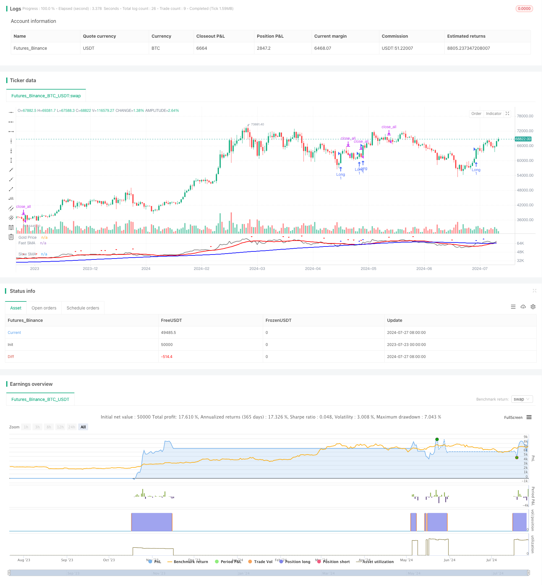

> Name

Dual-Moving-Average-Mean-Reversion-Strategy-with-Risk-Control
> Author

ChaoZhang

> Strategy Description



[trans]
#### Overview
This strategy is a trading system based on the principle of double moving average crossover and mean reversion, combined with a dynamic risk control mechanism. This strategy uses the intersection of fast and slow simple moving averages (SMA) to generate trading signals, while using the average true range (ATR) indicator to set dynamic stops to achieve precise control of risk on each trade. This method aims to capture market trends while exiting promptly when the market reverses to balance returns and risks.
#### Strategy Principle
1. Signal generation:
   - Use two simple moving averages (SMA) with different periods: fast SMA (14 periods) and slow SMA (100 periods).
   - When the price crosses above the slow SMA, a buy signal is triggered.
   - A sell signal is triggered when the price crosses below the fast SMA.
2. Risk control:
   - Use 10-period ATR to calculate dynamic stop loss levels.
   - Stop loss is set to the entry price minus the ATR times the risk percentage (default is 2%).
3. Transaction execution:
   - When the buy signal appears, open a long position at the market price and set a dynamic stop loss.
   - Close all positions when a sell signal appears.
4. Visualization:
   - Plot price, fast SMA and slow SMA on the chart.
   - Use triangles to mark buy and sell signals.
#### Strategic Advantages
1. Combination of trend following and mean reversion: By using the dual moving average system, the strategy can capture the long-term trend while reacting to short-term price fluctuations, achieving a balance between trend following and mean reversion.
2. Dynamic risk control: Using dynamic stop loss based on ATR, the stop loss level can be automatically adjusted according to market volatility, providing more accurate risk management.
3. Simple and effective: The strategy has clear logic, is easy to understand and implement, and at the same time contains enough complexity to cope with different market environments.
4. Visual support: Help traders better understand and evaluate strategy performance by visually displaying trading signals and moving averages on charts.
5. Adjustable parameters: Allow users to adjust key parameters, such as moving average period and risk percentage, according to personal risk preferences and market characteristics.
#### Strategy Risk
1. False breakthrough risk: In a sideways market, the price may frequently cross the moving average, resulting in too many false signals and unnecessary transactions.
2. Hysteresis: Due to the use of moving averages, the strategy's reaction at trend turning points may be lagging behind, resulting in insufficient timely entry or exit timing.
3. Excessive trading: In high-volatility markets, too many trading signals may be generated, increasing transaction costs.
4. Limitations of fixed risk percentages: Although ATR is used to dynamically adjust stops, fixed risk percentages may not apply to all market conditions.
5. Lack of profit target: The strategy only relies on moving average crossovers to close positions, which may lead to premature exit in a strong trend and miss more potential profits.
#### Strategy optimization direction
1. Introduce trend filters: You can add long-term trend indicators (such as the 200-day moving average) to filter trading signals and only trade in the main trend direction to reduce false breakthroughs.
2. Optimize entry timing: Consider combining other technical indicators (such as RSI or MACD) to confirm entry signals and improve trading accuracy.
3. Dynamically adjust risk parameters: The risk percentage can be dynamically adjusted based on market volatility or other market status indicators, making risk management more flexible.
4. Add a profit target: Set a dynamic profit target based on ATR or a fixed ratio, allowing for greater profit margins when the trend is strong.
5. Implement a partial liquidation mechanism: Perform partial liquidation when a certain profit level is reached, which can not only lock in part of the profit, but also allow the remaining positions to continue to make profits.
6. Optimize the moving average period: You can backtest different moving average period combinations to find parameter settings that are more suitable for specific markets.
7. Add volume filtering: Consider incorporating volume indicators into the signal generation process to improve signal reliability.
#### Summarize
The double moving average mean reversion strategy combined with risk control is a trading system that takes into account trend tracking and risk management. By utilizing the intersection of fast and slow moving averages to capture market trends, combined with the ATR based dynamic stop loss mechanism, the strategy achieves precise control of the risk of each transaction. This method not only captures the market trend, but also can exit in time when the market reverses, providing traders with a tool to balance returns and risks.
However, this strategy also has some limitations, such as false breakout risk, signal lag, and possible overtrading. By introducing trend filters, optimizing entry timing, and dynamically adjusting risk parameters, the strategy still has a lot of room for optimization. Future improvements can focus on improving signal quality, optimizing risk management, and adding profit management mechanisms.
Overall, this strategy provides a solid basic framework for quantitative trading with good scalability and adaptability. Through continuous optimization and adjustment, it has the potential to become a powerful and reliable trading system suitable for different market environments and trading varieties.
|| 

#### Overview

This strategy is a trading system based on dual moving average crossovers and mean reversion principles, combined with a dynamic risk control mechanism. The strategy utilizes the crossover of fast and slow Simple Moving Averages (SMA) to generate trading signals, while using the Average True Range (ATR) indicator to set dynamic stop-losses, enabling precise control of risk for each trade. This approach aims to capture market trends while exiting timely during market reversals, balancing profitability and risk.

#### Strategy Principles

1. Signal Generation:
   - Uses two Simple Moving Averages (SMA) of different periods: a fast SMA (14 periods) and a slow SMA (100 periods).
   - A buy signal is triggered when the price crosses above the slow SMA.
   - A sell signal is triggered when the price crosses below the fast SMA.

2. Risk Control:
   - Uses a 10-period ATR to calculate dynamic stop-loss levels.
   - Stop-loss is set at the entry price minus the ATR multiplied by the risk percentage (default 2%).

3. Trade Execution:
   - Opens a long position at market price when a buy signal occurs, setting a dynamic stop-loss.
   - Closes all positions when a sell signal occurs.

4. Visualization:
   - Plots the price, fast SMA, and slow SMA on the chart.
   - Uses triangle markers to indicate buy and sell signals.

#### Strategy Advantages

1. Combination of Trend Following and Mean Reversion: By using a dual moving average system, the strategy can capture long-term trends while responding to short-term price fluctuations, balancing trend following and mean reversion.

2. Dynamic Risk Control: The use of ATR-based dynamic stop-losses allows the stop level to automatically adjust according to market volatility, providing more precise risk management.

3. Simple yet Effective: The strategy logic is clear, easy to understand and implement, while containing sufficient complexity to handle different market environments.

4. Visual Support: By intuitively displaying trading signals and moving averages on the chart, it helps traders better understand and evaluate strategy performance.

5. Adjustable Parameters: Allows users to adjust key parameters such as moving average periods and risk percentage based on personal risk preferences and market characteristics.

#### Strategy Risks

1. False Breakout Risk: In sideways markets, price may frequently cross the moving averages, leading to excessive false signals and unnecessary trades.

2. Lag: Due to the use of moving averages, the strategy may react slowly at trend turning points, resulting in untimely entries or exits.

3. Overtrading: In highly volatile markets, too many trading signals may be generated, increasing transaction costs.

4. Limitations of Fixed Risk Percentage: Although ATR is used to dynamically adjust stop-losses, a fixed risk percentage may not be suitable for all market conditions.

5. Lack of Profit Targets: The strategy relies solely on moving average crossovers for closing positions, which may lead to premature exits in strong trends, missing out on more potential profits.

#### Strategy Optimization Directions

1. Introduce Trend Filters: Add long-term trend indicators (such as 200-day moving average) to filter trading signals, trading only in the direction of the main trend to reduce false breakouts.

2. Optimize Entry Timing: Consider combining other technical indicators (such as RSI or MACD) to confirm entry signals, improving trading accuracy.

3. Dynamically Adjust Risk Parameters: Adjust the risk percentage dynamically based on market volatility or other market state indicators, making risk management more flexible.

4. Add Profit Targets: Set dynamic profit targets based on ATR or fixed ratios, allowing for larger profit margins when trends are strong.

5. Implement Partial Position Closing: Execute partial position closures when certain profit levels are reached, both locking in partial profits and allowing remaining positions to continue profiting.

6. Optimize Moving Average Periods: Backtest different combinations of moving average periods to find parameter settings more suitable for specific markets.

7. Add Volume Filters: Consider incorporating volume indicators into the signal generation process to improve signal reliability.

#### Conclusion

The Dual Moving Average Mean Reversion Strategy with Risk Control is a trading system that balances trend following and risk management. By utilizing the crossover of fast and slow moving averages to capture market directions, combined with an ATR-based dynamic stop-loss mechanism, the strategy achieves precise risk control for each trade. This method captures market trends while exiting timely during market reversals, providing traders with a tool that balances profitability and risk.

However, the strategy also has some limitations, such as false breakout risks, signal lag, and potential overtrading. There is significant room for optimization through introducing trend filters, optimizing entry timing, dynamically adjusting risk parameters, and other methods. Future improvements can focus on enhancing signal quality, optimizing risk management, and adding profit management mechanisms.

Overall, this strategy provides a solid foundation framework for quantitative trading, with good scalability and adaptability. Through continuous optimization and adjustment, it has the potential to become a powerful and reliable trading system suitable for different market environments and trading instruments.

[/trans]


> Source (PineScript)

``` pinescript
/*backtest
start: 2023-07-23 00:00:00
end: 2024-07-28 00:00:00
period: 1d
basePeriod: 1h
exchanges: [{"eid":"Futures_Binance","currency":"BTC_USDT"}]
*/

//@version=5
strategy('TAMMY V2')

// Define the parameters
fast_len = input.int(14, minval=1, title='Fast SMA Length')
slow_len = input.int(100, minval=1, title='Slow SMA Length')
risk_per_trade = input.float(2.0, minval=0.1, maxval=10.0, step=0.1, title='Risk Per Trade (%)')

// Calculate the moving averages
fast_sma = ta.sma(close, fast_len)
slow_sma = ta.sma(close, slow_len)

// Generate the trading signals
buy_signal = ta.crossover(close, slow_sma)
sell_signal = ta.crossunder(close, fast_sma)

// Calculate the stop loss level
atr = ta.sma(ta.tr, 10)
sl = close - atr * (risk_per_trade / 100)

// Execute the trades
if buy_signal
    strategy.entry('Long', strategy.long, stop=sl)
if sell_signal
    strategy.close_all()

// Plot the signals and price
plot(close, color=color.new(#808080, 0), linewidth=2, title='Gold Price')
plot(fast_sma, color=color.new(#FF0000, 0), linewidth=2, title='Fast SMA')
plot(slow_sma, color=color.new(#0000FF, 0), linewidth=2, title='Slow SMA')
plotshape(buy_signal, style=shape.triangleup, color=color.new(#0000FF, 0), size=size.small, title='Buy Signal')
plotshape(sell_signal, style=shape.triangledown, color=color.new(#FF0000, 0), size=size.small, title='Sell Signal')


```

> Detail

https://www.fmz.com/strategy/458065

> Last Modified

2024-07-29 16:47:54
