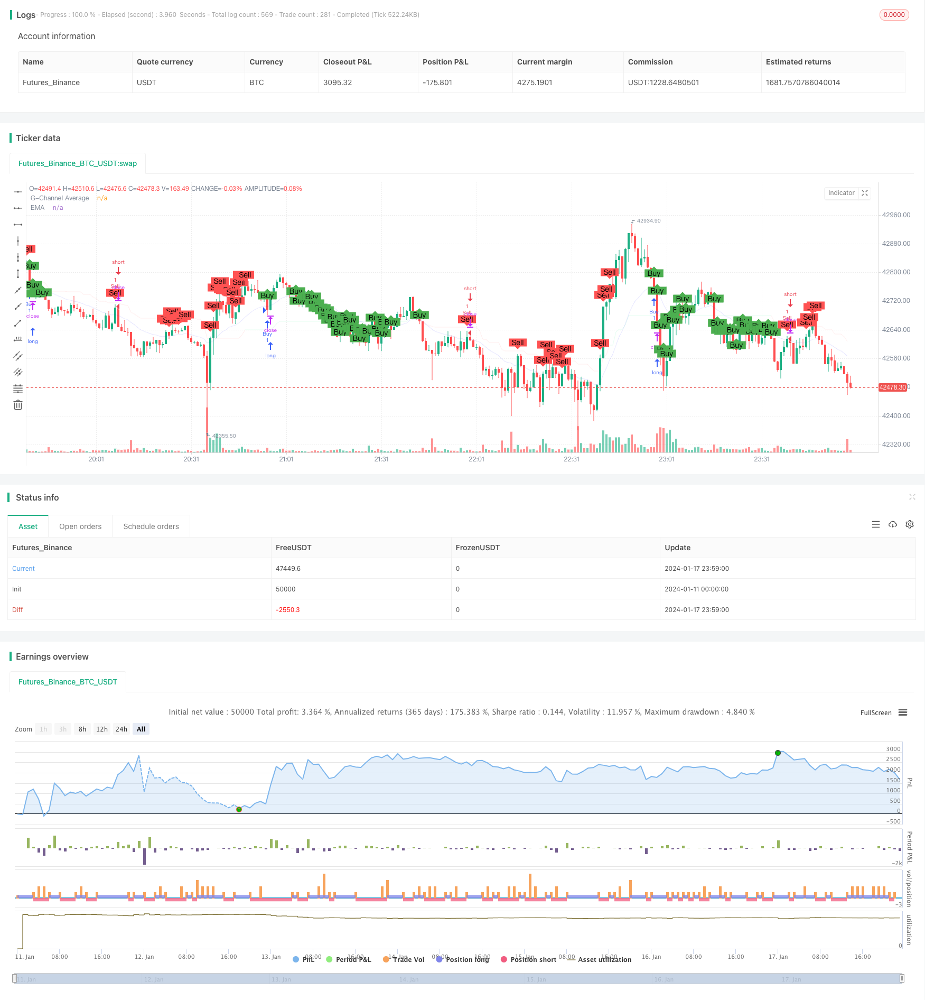

> Name

Dual-Moving-Average-Price-Channel-Trading-Strategy
> Author

ChaoZhang

> Strategy Description


 [trans]

### Overview
Dual Moving Average Price Channel Trading Strategy is a quantitative trading strategy that integrates price channel indicators and moving average indicators. This strategy determines the direction of the price channel by constructing a price channel; at the same time, it uses the moving average to determine the price trend and generate trading signals.
### Strategy Principles
The core principles of the Double Moving Average Price Channel Trading Strategy are:
1. Construct an upper price track and a lower price track to form a price channel. When the price breaks above the upper band, it is a bullish signal, and when the price breaks below the lower band, it is a bearish signal.
2. Calculate the moving average. When the price is above the moving average, it is a bullish trend, and when the price is below the moving average, it is a bearish trend.
3. Combining price channel indicators and moving average indicators can produce more reliable trading signals. The specific rules are:
   - Bull signal: When the price breaks the lower rail and is below the moving average, go long
   - Short signal: When the price breaks below the upper rail and is above the moving average, go short.
This strategy takes into account both the price channel and moving average indicators, which can more accurately judge market trends, filter out false signals, and has a certain degree of stability.
### Advantage Analysis
The dual moving average price channel trading strategy has the following advantages:
1. Combine the two indicators of price channel and moving average to make trading signals more reliable and avoid generating a large number of false signals.
2. Use the price channel to judge the price status, and use the moving average to judge the price trend. The two indicators verify each other and are more accurate.
3. Strategy parameterization design, the average length and price channel length can be adjusted through parameters to adapt to different varieties and cycles.
4. The strategy signal is relatively stable and there will be no signal fluctuations, which reduces transaction risks.
5. The strategy logic is simple and clear, easy to understand, and easy to operate.
6. The strategy is completely based on indicators, requires no training, has zero data dependence, and is suitable for various varieties and cycles.
### Risk Analysis
The dual moving average price channel trading strategy also has certain risks, mainly including:
1. The strategy may miss the opportunity for the price to quickly break through the upper and lower rails and fail to capture the short-term trend.
2. When the price fluctuates near the upper and lower rails, trading signals will be triggered frequently, increasing the trading frequency.
3. If the price of futures products fluctuates violently, improper setting of price channel parameters will also increase transaction risks.
4. The strategy does not consider stop loss logic and cannot effectively control risks when losses expand.
The solutions corresponding to the risks are:
1. Appropriately shorten the moving average period to make the strategy more sensitive and capture short-term trends.
2. Increase the price channel length parameter to reduce false signals. At the same time, appropriately relax entry conditions and control transaction frequency.
3. Parameter optimization test, select the most suitable price channel parameters.
4. Add trailing stop loss logic to reduce single loss.
### Optimization direction
There is room for further optimization of the dual moving average price channel trading strategy:
1. In terms of entry conditions, other indicators such as MACD, KDJ, etc. can be combined to achieve multi-indicator filtering to make the signal more stable.
2. You can test the impact of different parameters on the strategy effect and find the optimal parameter combination. Such as testing different moving average cycle parameters.
3. You can add a dynamic stop loss module. When the loss reaches a certain level, stop loss and exit, effectively controlling risks.
4. Machine learning models can also be introduced to use historical data to train and optimize policy parameters to achieve dynamic adjustment of parameters.
5. A more complex improvement is to use deep learning algorithms to extract features and judge signals, and use neural networks to replace traditional indicators to achieve intelligent strategies.
### Summarize
The dual moving average price channel trading strategy uses dual indicator judgments to form relatively stable and reliable trading signals. At the same time, the strategy is parameterized and can be flexibly adjusted to suit different varieties. This strategy combines the advantages of price channels and moving averages, is relatively simple and practical, and is suitable for quantitative trading. Of course, there is also some room for improvement in the strategy, which can be optimized and improved in terms of entry conditions, stop loss, parameter optimization, intelligence, etc.
||

### Overview

The Dual Moving Average Price Channel Trading Strategy is a quantitative trading strategy that integrates the Price Channel indicator and Moving Average indicator. The strategy judges the direction of the price channel by constructing a price channel and uses the moving average to determine the price trend to generate trading signals.

### Strategy Logic

The core principle of the Dual Moving Average Price Channel Trading Strategy is:

1. Construct the price ceiling and price floor to form a price channel. A breakout above the ceiling is a bullish signal and a breakout below the floor is a bearish signal.

2. Calculate the moving average. When the price is above the moving average, it is a bullish trend. When the price is below the moving average, it is a bearish trend.

3. By combining the Price Channel indicator and the Moving Average indicator, more reliable trading signals can be generated. The specific rules are:
   - Buy signal: Price breaks out the floor and is below the moving average, go long.
   - Sell signal: Price breaks out the ceiling and is above the moving average, go short.
   
The strategy takes into account both the Price Channel and the Moving Average indicators to better judge the market trend and filter out false signals, making it relatively stable.

### Advantage Analysis

The Dual Moving Average Price Channel Trading Strategy has the following advantages:

1. Combining two indicators reduces false signals and makes trading signals more reliable.

2. Using the price channel to judge the price action and the moving average to determine the price trend, the two indicators verify each other and are more accurate.

3. The parameterization design allows the adjustment of the moving average length and price channel length through parameters to adapt to different products and frequencies.

4. The strategy signal is relatively stable without signal oscillations, thus lowering trading risk.

5. The strategy logic is simple and clear, easy to understand, and easy to implement for live trading.

6. The strategy is completely indicator-based, requires no training, has zero data dependence, and is suitable for various products and frequencies.

### Risk Analysis

The Dual Moving Average Price Channel Trading Strategy also has some risks:

1. The strategy may miss opportunities when prices break out the channel rapidly, unable to capture short-term trends.

2. When prices oscillate around the channel, trading signals may be triggered frequently, increasing trading frequency. 

3. Improper parameter settings of the price channel can increase risks when price fluctuations of futures are violent.

4. The lack of a stop loss mechanism leads to inability to effectively control risks when losses expand.

The corresponding solutions are:

1. Shorten the moving average period to make the strategy more sensitive to capture short-term trends.

2. Increase the price channel length parameter to reduce false signals. Also, relax the entry criteria appropriately to control trading frequency.

3. Optimize parameters through backtesting to find the best price channel settings.  

4. Add a moving stop loss logic to reduce losses per trade.

### Optimization

There is room for further optimization of the Dual Moving Average Price Channel Trading Strategy:

1. Other indicators like MACD and KDJ can be combined with the entry criteria for multi-indicator filtering and more stable signals.

2. Different parameters can be tested for their impact on strategy performance to find the optimal parameter combination, e.g. testing different moving average periods.

3. A dynamic stop loss module can be added. When the losses reach a certain level, the position can be closed by stop loss to effectively control risks.

4. Machine learning models can also be introduced, using historical data to train and optimize the strategy parameters for dynamic adjustment.

5. A more complex improvement is to use deep learning algorithms to extract features and judge signals, replacing traditional indicators with neural networks to make the strategy intelligent.

### Summary

The Dual Moving Average Price Channel Trading Strategy forms relatively stable and reliable trading signals through dual-indicator judgments. Also, the parameterized design allows flexible adjustments to suit different products. Integrating the advantages of price channels and moving averages, the strategy is relatively simple and practical for live trading. Certainly, there are still rooms for improvement such as entry criteria, stop loss, parameter optimization, and strategy intelligence.

[/trans]

> Strategy Arguments


|Argument|Default|Description|
|----|----|----|
|v_input_1|100|length|
|v_input_2|20|EMA Length|


> Source (PineScript)

``` pinescript
/*backtest
start: 2024-01-11 00:00:00
end: 2024-01-18 00:00:00
period: 1m
basePeriod: 1m
exchanges: [{"eid":"Futures_Binance","currency":"BTC_USDT"}]
*/

// This Pine Script™ code is subject to the terms of the Mozilla Public License 2.0 at https://mozilla.org/MPL/2.0/
// © paparegier

//@version=4
strategy("G-Channel and EMA Strategy", shorttitle="GEMA", overlay=true)

// G-Channel Indicator
length = input(100)
a = 0.0
b = 0.0
a := na(a[1]) ? close : max(close, a[1]) - (a[1] - b[1]) / length
b := na(b[1]) ? close : min(close, b[1]) + (a[1] - b[1]) / length
avg = avg(a, b)

crossup = b[1] < close[1] and b > close
crossdn = a[1] < close[1] and a > close
bullish = barssince(crossdn) <= barssince(crossup)

// EMA Indicator
emaLength = input(20, title="EMA Length")
emaValue = ema(close, emaLength)

// Strategy Conditions
buyCondition = bullish and close < emaValue
sellCondition = not bullish and close > emaValue

// Execute Strategy
strategy.entry("Buy", strategy.long, when=buyCondition)
strategy.entry("Sell", strategy.short, when=sellCondition)

// Plotting
plot(avg, color=color.new(bullish ? color.lime : color.red, 90), linewidth=1, title="G-Channel Average")
plot(emaValue, color=color.rgb(0, 0, 255, 90), linewidth=1, title="EMA")

// Mark Buy and Sell Signals
plotshape(series=buyCondition, title="Buy Signal", color=color.green, style=shape.labelup, text="Buy", size=size.small)
plotshape(series=sellCondition, title="Sell Signal", color=color.red, style=shape.labeldown, text="Sell", size=size.small)


```

> Detail

https://www.fmz.com/strategy/439372

> Last Modified

2024-01-19 16:44:31
