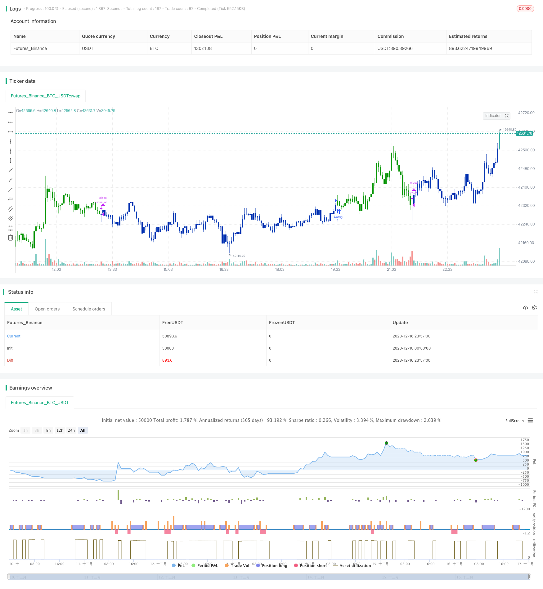

> Name

Dual-Moving-Average-Reversal-Breakout-Strategy
> Author

ChaoZhang

> Strategy Description


 [trans]

## Overview
The double moving average reversal breakthrough strategy is a combination strategy that combines the 123 reversal strategy and the price and moving average gap strategy. The main idea of ​​this strategy is to generate a trading signal when the 123 reversal forms a signal and the gap between the price and the moving average of the specified period also forms a one-to-one corresponding signal.
## Strategy Principle
The double moving average reversal breakout strategy consists of two parts:
1. 123 reversal strategy
The trading signal of the 123 reversal strategy is: the closing price reverses for two consecutive days (that is, the closing price of the previous day is higher and the closing price of the next day is lower; or the closing price of the previous day is lower and the closing price of the next day is higher), and at the same time, the 9-day stochastic indicator K-line is below a certain level (default is 50), thus forming a buy signal; the closing price reverses for two consecutive days, and at the same time, the 9-day stochastic indicator K-line is above a certain level (default is 50), thus forming a sell signal.
2. Price and moving average gap strategy
The price and moving average gap strategy is to calculate the percentage gap between the price and the specified period moving average (default 14 days). A buy signal is generated when the gap is less than a certain level (default 3%), and a sell signal is generated when the gap is greater than a certain level (default 0.54%).
Double moving average reversal breakthrough strategy, this strategy will generate actual trading signals only when the trading signals of the above two strategies are in the same direction, that is, when both are buy or both are sell.
## Advantage Analysis
The double moving average reversal breakthrough strategy combines the advantages of reversal strategy and trend strategy, and can be said to learn from each other's strengths to offset weaknesses.
123 Reversal Strategy As a reversal strategy, it can capture reversal opportunities when the price reverses. As a trend following strategy, the price and moving average gap strategy can grasp the longer-term trend. The combination of the two can not only capture short-term price reversals in time, but also grasp long-term trends to avoid being trapped.
In addition, by requiring the signals of the two strategies to be in the same direction, the number of invalid transactions can be effectively reduced and the signal-to-noise ratio can be improved.
## Risk Analysis
Although the double moving average reversal breakthrough strategy comprehensively utilizes the advantages of the two strategies, it also inherits the respective risks of the two strategies.
For the 123 reversal part, two consecutive days of reversal cannot completely ensure a price reversal. It may be a false reversal caused by a short-term correction. In addition, improper setting of stochastic indicator parameters may also lead to a decrease in signal quality.
For the gap between price and moving average, improper setting of moving average parameters may cause signal lag. In addition, the trend direction cannot be determined from the gap between the price and the moving average, and the signal can only be generated mechanically.
To sum up, the main risks of this strategy lie in improper parameter settings and errors in judgment. Risks can be avoided by optimizing parameters, setting stop loss and profit, or manually intervening in transactions.
## Optimization direction
The double moving average reversal breakthrough strategy can be optimized from the following aspects:
1. Optimize moving average and stochastic indicator parameters to improve signal quality
2. Add other indicator filters to ensure more reliable trading signals
3. Add stop loss and take profit settings
4. Add a trend judgment module to avoid inappropriate transactions
5. Manual intervention and parameter adaptation
Through the combination of various means, it is expected to further improve the stability and profitability of the strategy.
## Summarize
The double moving average reversal breakthrough strategy comprehensively uses the advantages of reversal strategy and trend strategy to generate actual trading signals when the signals of the two strategies are in the same direction. It can not only capture short-term price reversal opportunities, but also track long-term trends to avoid being trapped. At the same time, signal reliability can be improved by combining dual signals. This strategy can be optimized and upgraded through a variety of means. It is a powerful and widely used quantitative trading strategy.
||


## Overview

The Dual Moving Average Reversal Breakout Strategy is a combination strategy that incorporates both the 123 Reversal Strategy and the Price & Moving Average Divergence Strategy. The key idea of this strategy is to generate trading signals only when the 123 Reversal signals align with the price & MA divergence signals.  

## Strategy Logic

The Dual Moving Average Reversal Breakout Strategy consists of two components:

1. 123 Reversal Strategy

    The 123 Reversal Strategy generates trading signals based on two consecutive days of close price reversal (i.e. higher close followed by lower close; or lower close followed by higher close), combined with the 9-day Stochastic Oscillator K-line being below/above a certain level (default 50). Buy signals are generated when K-line is below 50 and sell signals are generated when K-line is above 50.

2. Price & Moving Average Divergence Strategy

    The Price & MA Divergence Strategy calculates the percentage difference between price and a moving average of certain period (default 14). It generates buy signals when the divergence is below a threshold (default 3%) and sell signals when the divergence is above a threshold (default 0.54%).  

The Dual Moving Average Reversal Breakout Strategy only generates actual trading signals when the signals from both strategies above align in the same direction, i.e. both are buy or both are sell signals.

## Advantage Analysis

The Dual Moving Average Reversal Breakout Strategy combines the strengths of reversal and trend-following strategies for synergy. 

The 123 Reversal picks reversals signals to capitalize on turnarounds. The Price & MA Divergence tracks the longer term trend. Together they capture short-term reversals while riding the bigger trend to avoid being trapped.

Moreover, by requiring aligned signals from both strategies, the number of invalid trades can be reduced significantly, improving signal-to-noise ratio.

## Risk Analysis

While harnessing the strengths of both strategies, the Dual Moving Average Reversal Breakout Strategy also inherits the risks associated with each one.

For the 123 Reversal component, two consecutive daily reversals do not guarantee a real trend reversal. They could well be false signals caused by short-term pullbacks. Also, poor parameter tuning of the Stochastic Oscillator may degrade signal quality.

For the Price & MA Divergence part, inappropriate moving average parameters can lead to lagging signals. Also, the divergence itself does not indicate trend direction, only generating mechanical signals.

In summary, the major risks of this strategy come from poor parameter tuning and faulty signal generation. Risks can be mitigated via parameter optimization, stop loss/take profit, manual intervention etc.

## Enhancement Opportunities

The Dual Moving Average Reversal Breakout Strategy can be enhanced in the following aspects:

1. Optimize MA and oscillator parameters for better signals
2. Add other indicators for signal filtering 
3. Incorporate stop loss and take profit
4. Add trend determination to avoid untimely trades
5. Manual intervention and adaptive parameter tuning

With a combination of different enhancement methods, strategy stability and profitability can be further improved.  

## Conclusion

The Dual Moving Average Reversal Breakout Strategy combines the strengths of reversal and trend-following strategies, generating trades only when both signal types align. It captures short-term reversal opportunities while riding bigger trends to avoid traps. The dual-signal mechanism also improves reliability. With abundant enhancement opportunities, it is a versatile and powerful quantified trading strategy.

[/trans]

> Strategy Arguments


|Argument|Default|Description|
|----|----|----|
|v_input_1|true|---- 123 Reversal ----|
|v_input_2|14|Length|
|v_input_3|true|KSmoothing|
|v_input_4|3|DLength|
|v_input_5|50|Level|
|v_input_6|true|---- Difference between price and MA ----|
|v_input_7|14|LengthDBP|
|v_input_8|0.54|SellZone|
|v_input_9|0.03|BuyZone|
|v_input_10|false|Trade reverse|


> Source (PineScript)

``` pinescript
/*backtest
start: 2023-12-10 00:00:00
end: 2023-12-17 00:00:00
period: 3m
basePeriod: 1m
exchanges: [{"eid":"Futures_Binance","currency":"BTC_USDT"}]
*/

//@version=4
////////////////////////////////////////////////////////////
//  Copyright by HPotter v1.0 13/04/2021
// This is combo strategies for get a cumulative signal. 
//
// First strategy
// This System was created from the Book "How I Tripled My Money In The 
// Futures Market" by Ulf Jensen, Page 183. This is reverse type of strategies.
// The strategy buys at market, if close price is higher than the previous close 
// during 2 days and the meaning of 9-days Stochastic Slow Oscillator is lower than 50. 
// The strategy sells at market, if close price is lower than the previous close price 
// during 2 days and the meaning of 9-days Stochastic Fast Oscillator is higher than 50.
//
// Second strategy
// Percent difference between price and MA
//
// WARNING:
// - For purpose educate only
// - This script to change bars colors.
////////////////////////////////////////////////////////////
Reversal123(Length, KSmoothing, DLength, Level) =>
    vFast = sma(stoch(close, high, low, Length), KSmoothing) 
    vSlow = sma(vFast, DLength)
    pos = 0.0
    pos := iff(close[2] < close[1] and close > close[1] and vFast < vSlow and vFast > Level, 1,
	         iff(close[2] > close[1] and close < close[1] and vFast > vSlow and vFast < Level, -1, nz(pos[1], 0))) 
	pos


DBP_MA(Length,SellZone,BuyZone) =>
    pos = 0.0
    xSMA = sma(close, Length)
    nRes = abs(close - xSMA) * 100 / close
    pos:= iff(nRes < BuyZone, 1,
           iff(nRes > SellZone, -1, nz(pos[1], 0))) 
    pos

strategy(title="Combo Backtest 123 Difference between price and MA", shorttitle="Combo", overlay = true)
line1 = input(true, "---- 123 Reversal ----")
Length = input(14, minval=1)
KSmoothing = input(1, minval=1)
DLength = input(3, minval=1)
Level = input(50, minval=1)
//-------------------------
line2 = input(true, "---- Difference between price and MA ----")
LengthDBP = input(14, minval=1)
SellZone = input(0.54, minval=0.01, step = 0.01)
BuyZone = input(0.03, minval=0.01, step = 0.01)
reverse = input(false, title="Trade reverse")
posReversal123 = Reversal123(Length, KSmoothing, DLength, Level)
posDBP_MA = DBP_MA(LengthDBP,SellZone,BuyZone)
pos = iff(posReversal123 == 1 and posDBP_MA == 1 , 1,
	   iff(posReversal123 == -1 and posDBP_MA == -1, -1, 0)) 
possig = iff(reverse and pos == 1, -1,
          iff(reverse and pos == -1 , 1, pos))	   
if (possig == 1 ) 
    strategy.entry("Long", strategy.long)
if (possig == -1 )
    strategy.entry("Short", strategy.short)	 
if (possig == 0) 
    strategy.close_all()
barcolor(possig == -1 ? #b50404: possig == 1 ? #079605 : #0536b3 )
```

> Detail

https://www.fmz.com/strategy/435701

> Last Modified

2023-12-18 10:24:08
