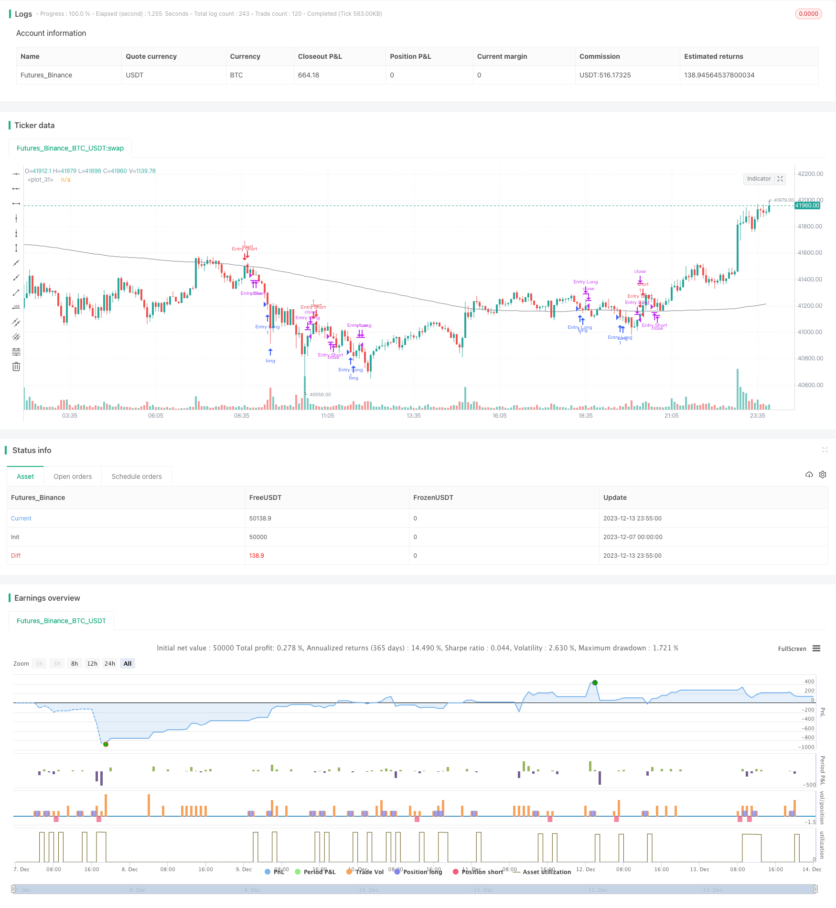

> Name

Using the Dual-Moving-Average-Reversal-Strategy
> Author

ChaoZhang

> Strategy Description



[trans]

### Overview
This strategy is a short-term trading strategy that uses double moving averages to determine market reversal. It determines whether it is in an upward trend or a downward trend by judging the closing relationship of the first three K lines. When a trend turning point is detected, appropriate long and short operations are taken. At the same time, the strategy also uses simple moving averages to filter short signals and reduce trading risks.
### Strategy Principles
The main judgment indicator of this strategy is the closing price relationship of the first three K lines. If the first three K lines are all negative lines, it is judged that the current trend is in a downward trend; if the first three K lines are all positive lines, it is judged that the current trend is in an upward trend. When a big positive line appears after a downward trend, go long; when a big negative line appears after an upward trend, go short.
The specific judgment logic of going long is: if the first three K lines are all negative lines, and the last K line is a big negative line, then go long. The judgment logic of closing a position is to close the position when the price rises above the highest point of the previous K line.
The specific judgment logic of short selling is: if the first three K lines are all positive lines, and the last K line is a big positive line, and the price is lower than the simple moving average, go short. The judgment logic of closing a position is to close the position when the price falls below the lowest point of the previous K line.
The length of the moving average and the amplitude of the big positive and negative lines are set and input by the user.
### Strategic Advantages
1. Use the K-line pattern to determine the market reversal point, avoid chasing each other in the trend, and reduce losses.
2. Use moving averages to filter signals to avoid shorting prematurely on an uptrend.
3. The strategy logic is simple and clear, easy to understand and modify.
4. Customizable parameters to adapt to different varieties and time periods.
5. Under certain conditions, it is helpful to capture short-term adjustment opportunities in a timely manner.
### Strategy Risk
1. The market may have three consecutive false reversals of big negative lines or big positive lines, and at this time, the entry will be locked up. Stricter reversal conditions can be set to reduce this risk.
2. After the reversal fails, it is easy to be chased by the rise and fall. Stop loss points can be set to control risk.
3. Improper parameter settings may result in too frequent entries or missed opportunities. Optimization parameters need to be tested repeatedly.
4. When the market fluctuates, it is easy to get trapped. The criteria for determining positive and negative lines can be increased to avoid misjudgments.
### Strategy optimization
1. Using more complex indicators combined with K-line patterns to judge reversals, such as BOLL, MACD, etc., can improve the accuracy of judgment.
2. Increase the combination of indicators such as trading volume or volatility and K-line patterns to avoid short positions on Volume.
3. Add stop loss logic. Set a fixed pip stop or a trailing stop.
4. Optimize the parameters and find the best parameter combination.
5. Test more varieties and cycles of data to find the best applicable environment.
### Summarize
Generally speaking, this strategy is a more general short-term strategy that uses simple indicators to capture short-term market reversals. Its advantages are that it is easy to understand, has clear logic, and can achieve good results through certain optimization. However, there are also some typical reversal strategy risks, which need to be controlled by setting stop losses and strictly judging reversal conditions. This strategy can be learned and practiced as an introductory strategy for quantitative trading.
|| 

### Overview  

This is a short-term trading strategy that utilizes dual moving averages to determine market reversals. It judges the current uptrend or downtrend by examining the closing relationship of the previous three candlestick bars. When a trend reversal is detected, appropriate long or short positions are taken. Meanwhile, the strategy also uses a simple moving average to filter short signals and reduce trading risk.

### Strategy Principle

The main judging indicator of this strategy is the closing price relationship of the previous three candlestick bars. If the previous three bars are all black candles, it is judged that the current is in a downward trend; if the previous three bars are all white candles, it is judged that the current is in an upward trend. When a large white candle appears after a downward trend, go long; when a large black candle appears after an upward trend, go short.

The specific judgment logic for going long is: if the previous three candlestick bars are all black candles, and the last candlestick bar is a large black candle, then go long. The closing logic is to close the position when the price breaks through the highest point of the previous candlestick bar.

The specific judgment logic for going short is: if the previous three candlestick bars are all white candles, and the last candlestick bar is a large white candle, and the price is below the simple moving average, then go short. The closing logic is to close the position when the price breaks through the lowest point of the previous candlestick bar.

The length of the moving average and the magnitude to judge large white and black candles are set by user input.

### Advantages of the Strategy

1. Use candlestick patterns to determine market reversal points, avoid chasing each other in the trend, and reduce losses.

2. Combine the moving average to filter signals and avoid going short prematurely during the target rally.

3. The strategy logic is simple and clear, easy to understand and modify.

4. Customizable parameters suit different varieties and time cycles.

5. In certain conditions, it is beneficial to capture short-term adjustment opportunities in a timely manner.

### Risks of the Strategy  

1. The market may have consecutive three large black or white candles forming a false reversal, causing losses if taking positions. Set stricter reversal criteria to reduce this risk.

2. Failure to reverse will likely result in being chased by the trend. Set stop loss points to control risk.

3. Improper parameter settings may lead to over-trading or missing opportunities. Parameters need repeated testing and optimization.

4. It is easy to be trapped when the broader market fluctuates greatly. Raise white/black candle determination standards to avoid misjudgment.

### Optimization of the Strategy

1. Use more complex indicators combined with candlestick patterns to determine reversal, such as BOLL, MACD, etc. to improve judgment accuracy.  

2. Add trading volume or volatility indicators combined with candlestick patterns to avoid volume shortages.

3. Add stop loss logic. Set fixed point or tracking stop loss.  

4. Optimize parameters to find the best parameter combination.

5. Test more varieties and cycle data to find the optimal application environment.

### Summary

In general, this strategy is a relatively universal short-term strategy that captures short-term market reversals using simple indicators. Its advantages are easy to understand, clear logic, and good results through some optimization. But there are also some typical reversal strategy risks that need means like stop loss, strict reverse criteria, etc. to control. It can serve as a introductory strategy for quantitative trading to learn and practice.

[/trans]

> Strategy Arguments


|Argument|Default|Description|
|----|----|----|
|v_input_1|70|moveLimit|
|v_input_2|200|maLength|


> Source (PineScript)

``` pinescript
/*backtest
start: 2023-12-07 00:00:00
end: 2023-12-14 00:00:00
period: 5m
basePeriod: 1m
exchanges: [{"eid":"Futures_Binance","currency":"BTC_USDT"}]
*/

// This source code is subject to the terms of the Mozilla Public License 2.0 at https://mozilla.org/MPL/2.0/
// © stormis
// Based on strategy by hackertrader (original idea by QuantpT)

//@version=5
strategy(title="Mean reversion", shorttitle="MeanRev", precision=16 , overlay=true)

moveLimit = input(70)
maLength = input(200)

ma = ta.sma(close, maLength)

downBar = open > close
isThreeDown = downBar and downBar[1] and downBar[2]
isThreeUp = not downBar and not downBar[1] and not downBar[2]
isBigMoveDown = ((open - close) / (0.001 + high - low)) > moveLimit / 100.0
isBigMoveUp = ((close - open) / (0.001 + high - low)) > moveLimit / 100.0

isLongBuy = isThreeDown and isBigMoveDown
isLongExit = close > high[1]

isShortBuy = isThreeUp and isBigMoveUp
isShortExit = close < low[1]

strategy.entry("Entry Long", strategy.long, when=isLongBuy)
strategy.close("Entry Long", when=isLongExit)

strategy.entry("Entry Short", strategy.short, when=close < ma and isShortBuy)
strategy.close("Entry Short", when=isShortExit)

plot(ma, color=color.gray)
```

> Detail

https://www.fmz.com/strategy/435519

> Last Modified

2023-12-15 16:38:33
