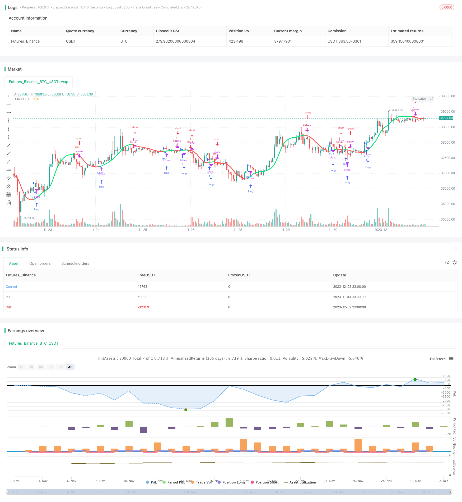

> Name

Dual-Moving-Average-Reversal-Trading-Strategy
> Author

ChaoZhang

> Strategy Description



[trans]

## Overview
This is a reversal trading strategy based on the Double Moving Average indicator. This strategy calculates two sets of moving averages with different parameter settings, determines the price trend based on its direction changes, and sets the sensitivity parameters for direction changes to generate trading signals.
## Strategy Principle
The core indicator of this strategy is the Double Moving Average. The strategy allows choosing the type of moving average (SMA, EMA, etc.), length and price source (Close Price, Typical Price, etc.). After calculating the two sets of moving averages, determine their direction by defining the parameter reaction. When the fast line crosses the slow line, a buy signal is generated, and when it crosses below, a sell signal is generated. The reaction parameter is used to adjust the sensitivity of identifying turning points.
In addition, the strategy also sets the direction of change and the conditions for continued rise/fall to avoid generating false signals. And use different colors to visually represent the rise and fall of prices. The movavg line appears green when the price continues to rise and red when it falls.
## Advantage Analysis
This dual movavg strategy combined with fast and slow lines with different parameter settings can effectively filter the noise in the trading market and identify stronger trends. Compared with the single movavg strategy, it reduces false signals and can enter the market when the trend is clearer, thereby achieving a higher winning rate.
The sensitivity parameter reaction allows the strategy to flexibly adapt to different cycles and varieties. The strategy process is intuitive and simple, easy to understand and optimize.
## Risk Analysis
The biggest risk of this strategy is missing the turning point and losing money or opening a position in the opposite direction. This is related to the parameter reaction setting. If the reaction is too small, it is easy to generate false signals; if the reaction is too large, you may miss a better entry point.
Another risk is the inability to effectively control losses. When prices fluctuate violently, losses cannot be stopped quickly, causing losses to expand. This needs to be controlled with a stop loss strategy.
## Optimization direction
The optimization direction of this strategy mainly focuses on the selection of parameter reaction, moving average type and length. reaction can be appropriately increased to reduce error signals. Moving average parameters can be tested according to different periods and varieties to select the best combination to generate signals.
In addition, it is also an optimization idea to combine other auxiliary indicators such as RSI, KD, etc. to confirm trading signals. Or use machine learning methods to automatically optimize parameters.
## Summary
This strategy is relatively simple and practical overall. It can effectively identify trend reversal by filtering double moving averages and generating trading signals. It is a typical trend following strategy. After optimizing the parameter combination, its ability to capture the market and hold positions against the market will be improved. Works better with stop loss and position management mechanisms.
||


## Overview
This is a reversal trading strategy based on dual moving average indicators. By calculating two groups of moving averages with different parameter settings and judging the price trend according to their directional changes, trading signals can be generated by setting the sensitivity parameter for directional changes.

## Principles  
The core indicator of this strategy is the dual moving average. The strategy allows selecting the type (SMA, EMA, etc.), length and price source (close price, typical price, etc.) of the moving average. After calculating two groups of moving averages, their directions are determined by defining the reaction parameter. A buy signal is generated when the fast line crosses above the slow line, and a sell signal is generated when it crosses below. The reaction parameter is used to adjust the sensitivity to identify turning points.

In addition, the strategy also sets the conditions to determine the change of direction and continued rise/fall to avoid generating wrong signals. And it visualizes the rise and fall of prices in different colors. When prices continue to rise, the movavg line is displayed in green, and in red when prices fall.


## Advantage Analysis
The dual movavg strategy combines fast and slow lines with different parameter settings, which can effectively filter the noise in the trading market and identify stronger trends. Compared with a single movavg strategy, it reduces wrong signals and allows entering the market when the trend is more distinct, thereby obtaining a higher win rate.


The reaction parameter allows the strategy to be flexible and adaptable to different cycles and varieties. The strategic process is intuitive and simple, easy to understand and optimize.

## Risk Analysis
The biggest risk of this strategy is missing the turning point and losing money or taking a reverse position. This relates to the reaction parameter setting. If the reaction is too small, wrong signals are prone to occur. If the reaction is too large, it may miss better entry points.


Another risk is the inability to effectively control losses. When prices fluctuate violently, it cannot quickly stop losses, leading to enlarged losses. This requires the use of stop-loss strategies to control risks.

## Optimization Directions
The main optimization directions of this strategy focus on selecting reaction parameters, types and lengths of moving averages. Increasing reaction appropriately can reduce wrong signals. Moving average parameters can be tested according to different cycles and varieties to select the best combination for generating signals.


In addition, confirming trading signals with other auxiliary indicators such as RSI and KD is also an optimization idea. Or use machine learning methods to automatically optimize parameters.

## Summary  
Overall, this strategy is relatively simple and practical. By filtering with dual moving averages and generating trading signals, it can effectively identify trend reversals and is a typical trend-following strategy. After optimizing the parameter portfolio, its ability to capture trends and hold positions against the market will be improved. Using it with stop loss and position management mechanisms works better.

[/trans]

> Strategy Arguments


|Argument|Default|Description|
|----|----|----|
|v_input_1|0|MA Type: : HullMA|EMA|WMA|VWMA|SMMA|DEMA|TEMA|SMA|ZEMA|TMA|SSMA|
|v_input_2|32|MA Lenght|
|v_input_3_close|0|MA Source: close|high|low|open|hl2|hlc3|hlcc4|ohlc4|
|v_input_4|2|MA Reaction|


> Source (PineScript)

``` pinescript
/*backtest
start: 2023-11-03 00:00:00
end: 2023-12-03 00:00:00
period: 1h
basePeriod: 15m
exchanges: [{"eid":"Futures_Binance","currency":"BTC_USDT"}]
*/

//@version=3
strategy(shorttitle="MA_color strategy", title="Moving Average Color", overlay=true)

// === INPUTS

ma_type   = input(defval="HullMA", title="MA Type: ", options=["SMA", "EMA", "WMA", "VWMA", "SMMA", "DEMA", "TEMA", "HullMA", "ZEMA", "TMA", "SSMA"])
ma_len    = input(defval=32, title="MA Lenght", minval=1)
ma_src    = input(close, title="MA Source")
reaction  = input(defval=2, title="MA Reaction", minval=1)

// SuperSmoother filter
// © 2013  John F. Ehlers
variant_supersmoother(src,len) =>
    a1 = exp(-1.414*3.14159 / len)
    b1 = 2*a1*cos(1.414*3.14159 / len)
    c2 = b1
    c3 = (-a1)*a1
    c1 = 1 - c2 - c3
    v9 = 0.0
    v9 := c1*(src + nz(src[1])) / 2 + c2*nz(v9[1]) + c3*nz(v9[2])
    v9
    
variant_smoothed(src,len) =>
    v5 = 0.0
    v5 := na(v5[1]) ? sma(src, len) : (v5[1] * (len - 1) + src) / len
    v5

variant_zerolagema(src,len) =>
    ema1 = ema(src, len)
    ema2 = ema(ema1, len)
    v10 = ema1+(ema1-ema2)
    v10
    
variant_doubleema(src,len) =>
    v2 = ema(src, len)
    v6 = 2 * v2 - ema(v2, len)
    v6

variant_tripleema(src,len) =>
    v2 = ema(src, len)
    v7 = 3 * (v2 - ema(v2, len)) + ema(ema(v2, len), len)              
    v7
    
variant(type, src, len) =>
    type=="EMA"     ? ema(src,len) : 
      type=="WMA"   ? wma(src,len): 
      type=="VWMA"  ? vwma(src,len) : 
      type=="SMMA"  ? variant_smoothed(src,len) : 
      type=="DEMA"  ? variant_doubleema(src,len): 
      type=="TEMA"  ? variant_tripleema(src,len): 
      type=="HullMA"? wma(2 * wma(src, len / 2) - wma(src, len), round(sqrt(len))) :
      type=="SSMA"  ? variant_supersmoother(src,len) : 
      type=="ZEMA"  ? variant_zerolagema(src,len) : 
      type=="TMA"   ? sma(sma(src,len),len) : sma(src,len)


// === Moving Average
ma_series = variant(ma_type,ma_src,ma_len)

direction = 0
direction := rising(ma_series,reaction) ? 1 : falling(ma_series,reaction) ? -1 : nz(direction[1])
change_direction= change(direction,1)
change_direction1= change(direction,1)

pcol = direction>0 ? lime : direction<0 ? red : na
plot(ma_series, color=pcol,style=line,join=true,linewidth=3,transp=10,title="MA PLOT")

/////// Alerts ///////

alertcondition(change_direction,title="Change Direction MA",message="Change Direction MA")


longCondition = direction>0
shortCondition = direction<0
if (longCondition)
    strategy.entry("BUY", strategy.long)
if (shortCondition)
    strategy.entry("SELL", strategy.short)


```

> Detail

https://www.fmz.com/strategy/434196

> Last Modified

2023-12-04 16:39:13
